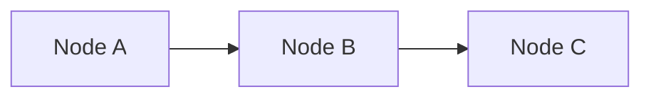
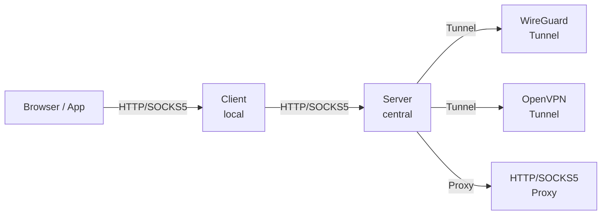

# CLAUDE.md - Development Guidelines

## Project Overview

A Go-based proxy system with client-server architecture:
- **Server**: Central proxy with WireGuard tunnels and forward proxy backends
- **Client**: Local proxy with traffic debugging and server/direct routing

**License**: MIT License - This is an open source project published on GitHub.

**This is production-ready software.** All code must follow production standards for logging, security, and dependency management.

## Production Requirements

### Code Quality
- All code must be production-ready with proper error handling
- No placeholder/TODO code in main branches
- All public functions must have proper documentation
- Code must pass `golangci-lint` with strict settings

### Logging
- Use structured logging with `log/slog` (Go 1.21+)
- All operations must be logged at appropriate levels
- Include context (request ID, user, backend) in log entries
- Sensitive data (passwords, tokens, keys) must NEVER be logged
- Log format: JSON in production, text in development

```go
// Example logging pattern
slog.Info("connection established",
    "request_id", reqID,
    "backend", backend.Name(),
    "remote_addr", conn.RemoteAddr(),
    "duration_ms", duration.Milliseconds(),
)
```

### Security
- All user input must be validated and sanitized
- Use prepared statements/parameterized queries
- Implement rate limiting on all API endpoints
- Use secure defaults (TLS, strong ciphers, secure cookies)
- Passwords stored with bcrypt (cost >= 12)
- Secrets loaded from environment variables, not config files
- Implement proper CORS policies
- All HTTP endpoints must have appropriate security headers

### Dependencies
- Only use well-maintained, actively developed libraries
- Prefer stdlib over third-party when reasonable
- All dependencies must be pinned to specific versions
- Run `go mod tidy` and commit go.sum
- Regular dependency updates via Dependabot or similar

## Build & Run

```bash
# Build both binaries
go build -o simple-proxy-server ./cmd/server
go build -o simple-proxy-client ./cmd/client

# Or build all
make build

# Run server
./simple-proxy-server start --config server-config.yaml

# Run client
./simple-proxy-client start --config client-config.yaml

# Run tests
go test ./...

# Run tests with coverage
go test -cover ./...

# Run integration tests
go test -tags=integration ./...
```

## Project Structure

```
simple-proxy-server/
├── cmd/
│   ├── server/
│   │   └── main.go              # Server entry point
│   └── client/
│       └── main.go              # Client entry point
├── internal/
│   ├── config/
│   │   ├── server.go            # Server config
│   │   └── client.go            # Client config
│   ├── proxy/
│   │   ├── http.go              # HTTP/HTTPS proxy handler
│   │   └── socks5.go            # SOCKS5 proxy handler
│   ├── router/
│   │   ├── router.go            # Domain matching interface
│   │   ├── server_router.go     # Server routing (domain → backend)
│   │   └── client_router.go     # Client routing (domain → server/direct)
│   ├── backend/
│   │   ├── backend.go           # Backend interface
│   │   ├── direct.go            # Direct connection
│   │   ├── wireguard.go         # WireGuard tunnel backend
│   │   ├── openvpn.go           # OpenVPN tunnel backend
│   │   ├── httpproxy.go         # HTTP forward proxy backend
│   │   └── socks5proxy.go       # SOCKS5 forward proxy backend
│   ├── wireguard/
│   │   ├── manager.go           # WireGuard interface management
│   │   └── config.go            # WireGuard config parsing
│   ├── openvpn/
│   │   ├── manager.go           # OpenVPN process management
│   │   └── config.go            # OpenVPN config parsing
│   ├── debug/
│   │   ├── debugger.go          # Traffic debugger
│   │   ├── logger.go            # Debug log writer
│   │   └── storage.go           # In-memory traffic storage
│   ├── tray/
│   │   ├── tray.go              # Cross-platform tray interface
│   │   ├── tray_windows.go      # Windows tray implementation
│   │   ├── tray_darwin.go       # macOS tray implementation
│   │   └── tray_linux.go        # Linux tray implementation
│   ├── auth/
│   │   ├── auth.go              # Auth interface
│   │   ├── none.go              # No authentication
│   │   ├── native.go            # Native user/password auth
│   │   ├── system.go            # PAM/Windows auth
│   │   ├── ldap.go              # LDAP/AD auth
│   │   └── oauth.go             # OAuth/OIDC auth
│   ├── ratelimit/
│   │   ├── limiter.go           # Rate limiter interface
│   │   ├── token_bucket.go      # Token bucket implementation
│   │   └── bandwidth.go         # Bandwidth throttling
│   ├── health/
│   │   ├── checker.go           # Health check interface
│   │   ├── tcp.go               # TCP health check
│   │   ├── http.go              # HTTP health check
│   │   └── ping.go              # ICMP ping check
│   ├── loadbalancer/
│   │   ├── balancer.go          # Load balancer interface
│   │   ├── roundrobin.go        # Round-robin algorithm
│   │   ├── leastconn.go         # Least connections
│   │   └── iphash.go            # IP hash (sticky)
│   ├── metrics/
│   │   ├── prometheus.go        # Prometheus exporter
│   │   └── collector.go         # Metrics collector
│   ├── accesslog/
│   │   ├── logger.go            # Access log interface
│   │   ├── json.go              # JSON format
│   │   └── apache.go            # Apache combined format
│   ├── api/
│   │   ├── server/
│   │   │   ├── server.go        # Server REST API
│   │   │   └── handlers.go      # Server API handlers
│   │   └── client/
│   │       ├── server.go        # Client REST API
│   │       └── handlers.go      # Client API handlers
│   └── cli/
│       ├── server/
│       │   └── commands.go      # Server CLI commands
│       └── client/
│           └── commands.go      # Client CLI commands
├── web/
│   ├── server/                  # Server Web UI
│   └── client/                  # Client Web UI (with debug viewer)
├── configs/
│   ├── server-config.yaml       # Example server config
│   └── client-config.yaml       # Example client config
├── docker/
│   ├── Dockerfile               # Server Dockerfile
│   └── docker-compose.yaml      # Docker Compose config
├── assets/
│   └── icons/                   # Tray icons (multiple states/sizes)
├── .github/
│   ├── workflows/
│   │   ├── ci.yml               # CI pipeline
│   │   ├── release.yml          # Release automation
│   │   └── security.yml         # Security scanning
│   ├── ISSUE_TEMPLATE/
│   └── PULL_REQUEST_TEMPLATE.md
├── go.mod
├── go.sum
├── Makefile
├── .golangci.yml                # Linter config
├── SPECIFICATION.md
├── CLAUDE.md
├── LICENSE                      # MIT License
├── CONTRIBUTING.md
└── README.md
```

## Key Interfaces

### Backend Interface (Server)

```go
type Backend interface {
    Name() string
    Type() string
    Dial(ctx context.Context, network, address string) (net.Conn, error)
    Start() error
    Stop() error
    Status() BackendStatus
}
```

### Router Interface

```go
type Router interface {
    Match(host string) (Route, bool)
    AddRule(rule Rule) error
    RemoveRule(name string) error
    Rules() []Rule
}
```

### Debugger Interface (Client)

```go
type Debugger interface {
    LogRequest(req *http.Request) string  // Returns request ID
    LogResponse(id string, resp *http.Response, duration time.Duration)
    GetTraffic(filter Filter) []TrafficEntry
    Clear()
    Stats() DebugStats
}
```

### Authenticator Interface (Server)

```go
type Authenticator interface {
    // Name returns the auth provider name
    Name() string

    // Authenticate validates credentials and returns user info
    Authenticate(ctx context.Context, creds Credentials) (*User, error)

    // ValidateToken validates a bearer token (for OAuth)
    ValidateToken(ctx context.Context, token string) (*User, error)

    // Close cleans up resources (LDAP connections, etc.)
    Close() error
}

type User struct {
    Username string
    Groups   []string
    Metadata map[string]string
}
```

### Rate Limiter Interface

```go
type RateLimiter interface {
    // Allow checks if a request should be allowed
    Allow(key string) bool

    // AllowN checks if n requests should be allowed
    AllowN(key string, n int) bool

    // Reset resets the rate limit for a key
    Reset(key string)
}
```

### Health Checker Interface

```go
type HealthChecker interface {
    // Check performs a health check on the backend
    Check(ctx context.Context, backend Backend) HealthResult

    // Start begins periodic health checking
    Start(ctx context.Context)

    // Stop stops health checking
    Stop()

    // Status returns current health status
    Status(backendName string) HealthStatus
}

type HealthStatus struct {
    Healthy             bool
    LastCheck           time.Time
    LastError           error
    ConsecutiveFailures int
    Latency             time.Duration
}
```

### Load Balancer Interface

```go
type LoadBalancer interface {
    // Next returns the next backend to use
    Next(backends []Backend, clientIP string) Backend

    // MarkDown marks a backend as unhealthy
    MarkDown(backend Backend)

    // MarkUp marks a backend as healthy
    MarkUp(backend Backend)
}
```

### Metrics Collector Interface

```go
type MetricsCollector interface {
    // RecordRequest records a request metric
    RecordRequest(method, backend string, duration time.Duration, status int)

    // RecordConnection records a connection metric
    RecordConnection(backend string, active bool)

    // RecordBytes records bytes transferred
    RecordBytes(direction string, bytes int64)

    // Handler returns HTTP handler for /metrics
    Handler() http.Handler
}
```

## Important Patterns

### Error Handling
Always wrap errors with context:
```go
if err != nil {
    return fmt.Errorf("failed to connect to backend %s: %w", name, err)
}
```

### Context Propagation
Pass context through all layers for cancellation:
```go
func (b *Backend) Dial(ctx context.Context, network, address string) (net.Conn, error) {
    // Use context for timeouts/cancellation
}
```

### Configuration Hot-Reload
Both server and client support hot-reload via SIGHUP or API call.

### Logging
Use structured logging with levels:
```go
log.Debug("connection established", "backend", name, "addr", addr)
log.Info("server started", "port", port)
log.Error("dial failed", "error", err)
```

## Common Tasks

### Adding a new backend type (Server)

1. Create file in `internal/backend/`
2. Implement `Backend` interface
3. Register in `internal/backend/factory.go`
4. Add config parsing in `internal/config/server.go`
5. Add tests

### Adding debug output format (Client)

1. Add format in `internal/debug/`
2. Register in debugger
3. Add CLI flag for export

### Adding API endpoint

1. Add handler in appropriate `handlers.go`
2. Register route in `server.go`
3. Update OpenAPI spec if maintained
4. Update Web UI

## Documentation

### MkDocs Setup

Documentation is built using [MkDocs](https://www.mkdocs.org/) with the [Material theme](https://squidfunk.github.io/mkdocs-material/).

**Configuration**: `mkdocs.yml`

**Source files**: `docs/` directory (Markdown files)

**Build output**: `site/` directory (generated HTML)

**GitHub Pages**: Automatically deployed via `.github/workflows/docs.yml`

### Local Development

```bash
# Start local development server (auto-reload on changes)
make docs-serve

# Build static site
make docs-build
```

### Mermaid Diagrams

All diagrams in the documentation use **Mermaid** for rendering. Mermaid is supported natively by MkDocs Material.

**Usage in Markdown:**

````markdown

````

**Supported diagram types:**
- `graph` / `flowchart` - Flowcharts and graphs
- `sequenceDiagram` - Sequence diagrams
- `classDiagram` - Class diagrams
- `stateDiagram` - State diagrams
- `erDiagram` - Entity-relationship diagrams
- `gantt` - Gantt charts
- `pie` - Pie charts
- `gitGraph` - Git graphs

**Example - Architecture Diagram:**



**Configuration:**

Mermaid support is configured in `mkdocs.yml` via `pymdownx.superfences`:

```yaml
markdown_extensions:
  - pymdownx.superfences:
      custom_fences:
        - name: mermaid
          class: mermaid
          format: !!python/name:pymdownx.superfences.fence_code_format
```

**Best Practices:**
- Use descriptive node labels
- Add styling with `style` directives for better visualization
- Keep diagrams simple and focused
- Use appropriate diagram types for the content
- Test diagrams locally with `make docs-serve` before committing

### Documentation Workflow

The documentation workflow (`.github/workflows/docs.yml`) automatically:
1. Builds the documentation when changes are pushed to `main` branch
2. Triggers on changes to `docs/`, `mkdocs.yml`, `README.md`, `CHANGELOG.md`, or `CONTRIBUTING.md`
3. Deploys to GitHub Pages at `https://rennerdo30.github.io/bifrost-proxy/`

**Manual trigger:**
```bash
gh workflow run "Documentation"
```

## Testing Strategy

- **Unit tests**: Mock backends, routers, debugger
- **Integration tests**: Real WireGuard (requires permissions), real proxy chains
- **E2E tests**: Full client-server setup with test traffic

## Cross-Platform Build

```bash
# Build for all platforms
make build-all

# Or individually:
GOOS=linux GOARCH=amd64 go build -o dist/simple-proxy-server-linux ./cmd/server
GOOS=darwin GOARCH=amd64 go build -o dist/simple-proxy-server-darwin ./cmd/server
GOOS=windows GOARCH=amd64 go build -o dist/simple-proxy-server.exe ./cmd/server

GOOS=linux GOARCH=amd64 go build -o dist/simple-proxy-client-linux ./cmd/client
GOOS=darwin GOARCH=amd64 go build -o dist/simple-proxy-client-darwin ./cmd/client
GOOS=windows GOARCH=amd64 go build -o dist/simple-proxy-client.exe ./cmd/client
```

## Docker (Server)

```bash
# Build Docker image
docker build -t simple-proxy-server -f docker/Dockerfile .

# Run with docker-compose
cd docker && docker-compose up -d
```

**Docker Data Persistence**: The Docker containers use named volumes (`bifrost-data`, `bifrost-client-data`) for persistent storage. Config files are stored in `/app/data/` which is writable by the non-root `bifrost` user.

## VPN Backend Configuration

### OpenVPN Inline Config

OpenVPN backends support inline configuration without requiring external files:

```yaml
backends:
  - name: vpn-inline
    type: openvpn
    config:
      # Option 1: Reference external file
      config_file: /path/to/client.ovpn

      # Option 2: Inline config content (no external file needed)
      config_content: |
        client
        dev tun
        proto udp
        remote vpn.example.com 1194
        ...

      # Inline credentials (alternative to auth_file)
      username: myuser
      password: mypassword
```

### WireGuard Inline Config

WireGuard backends also support inline configuration:

```yaml
backends:
  - name: wg-inline
    type: wireguard
    config:
      # Option 1: Reference external file
      config_file: /path/to/wg0.conf

      # Option 2: Inline config content
      config_content: |
        [Interface]
        PrivateKey = ...
        Address = 10.0.0.2/32

        [Peer]
        PublicKey = ...
        Endpoint = vpn.example.com:51820
        AllowedIPs = 0.0.0.0/0
```

## Connection Tracking API

The server exposes real-time connection tracking via the API:

```bash
# Get all active connections
curl http://localhost:8080/api/v1/connections/

# Get unique clients summary
curl http://localhost:8080/api/v1/connections/clients
```

Response includes: client IP, port, destination host, backend used, protocol (HTTP/SOCKS5), duration, and bytes transferred.

## Tray Icon Interface

```go
type TrayIcon interface {
    // Initialize the tray icon
    Init() error

    // Set icon state (connected, disconnected, error, disabled)
    SetState(state TrayState)

    // Show desktop notification
    Notify(title, message string)

    // Set menu items
    SetMenu(items []MenuItem)

    // Run the tray event loop (blocking)
    Run()

    // Quit the tray
    Quit()
}
```

## Security Notes

1. Never log sensitive headers (Authorization, Cookie) in debug output by default
2. Sanitize WireGuard private keys in any debug/status output
3. Validate all user input in API handlers
4. Use secure defaults (localhost binding, auth disabled but warned)
5. Store native auth passwords using bcrypt hashing
6. Validate OAuth tokens and LDAP bindings securely

## Recommended Dependencies (Latest Stable)

```go
// go.mod - use latest stable versions
module github.com/yourorg/simple-proxy-server

go 1.22

require (
    // Core
    golang.zx2c4.com/wireguard v0.0.0-2024xxxx  // WireGuard userspace
    gopkg.in/yaml.v3 v3.0.1                      // YAML config

    // Networking
    github.com/txthinking/socks5 v0.0.0-2024xxxx // SOCKS5 (actively maintained)

    // HTTP/API
    github.com/go-chi/chi/v5 v5.x.x              // HTTP router (lighter than gorilla)
    github.com/go-chi/cors v1.x.x                // CORS middleware
    github.com/gorilla/websocket v1.5.x          // WebSocket

    // CLI
    github.com/spf13/cobra v1.8.x                // CLI framework
    github.com/spf13/viper v1.18.x               // Config management

    // Auth
    golang.org/x/crypto v0.x.x                   // bcrypt, etc.
    github.com/go-ldap/ldap/v3 v3.4.x            // LDAP client
    github.com/coreos/go-oidc/v3 v3.x.x          // OIDC/OAuth
    golang.org/x/oauth2 v0.x.x                   // OAuth2

    // System Tray (Client)
    fyne.io/systray v1.x.x                       // Cross-platform tray

    // Utilities
    github.com/google/uuid v1.6.x                // UUIDs
    github.com/hashicorp/go-multierror v1.1.x    // Error handling
    golang.org/x/sync v0.x.x                     // errgroup, etc.

    // Testing
    github.com/stretchr/testify v1.9.x           // Test assertions
)
```

**Important**: Always check for the latest versions before starting implementation. Use `go get -u` to update and verify compatibility.

## Linting Configuration

Create `.golangci.yml`:
```yaml
run:
  timeout: 5m

linters:
  enable:
    - errcheck
    - gosimple
    - govet
    - ineffassign
    - staticcheck
    - unused
    - gosec          # Security checks
    - bodyclose      # HTTP body close
    - noctx          # Context in HTTP
    - sqlclosecheck  # SQL close
    - rowserrcheck   # SQL row errors
    - exportloopref  # Loop variable capture
    - gofmt
    - goimports

linters-settings:
  gosec:
    severity: medium
    confidence: medium
```

## CI/CD Requirements

All PRs must pass:
1. `go build ./...` - Build succeeds
2. `go test ./...` - All tests pass
3. `golangci-lint run` - No linting errors
4. `go mod tidy && git diff --exit-code` - Dependencies clean
5. Security scan (e.g., `govulncheck`)
6. `make docker-build` - Docker images build successfully

**IMPORTANT: Always verify Docker builds work before committing!** Changes to web UI, Makefile, or build processes can break Docker builds even if local builds succeed. Run `make docker-build` or `make docker-rebuild` to verify.

## Git Commit Guidelines

**When to commit:**
- After completing a feature that compiles and works
- After fixing a bug with tests passing
- After significant refactoring that doesn't break functionality
- NEVER commit broken/incomplete code to main branch

**Commit requirements before committing:**
1. `go build ./...` must succeed
2. `go test ./...` must pass
3. Feature must be functionally complete

**Commit message format:**
```
<type>(<scope>): <description>

[optional body]

[optional footer]
```

Types: `feat`, `fix`, `docs`, `style`, `refactor`, `test`, `chore`

Examples:
- `feat(backend): add WireGuard tunnel support`
- `fix(auth): handle LDAP connection timeout`
- `docs(readme): add installation instructions`
- `refactor(router): extract domain matching to separate package`

## GitHub Actions Workflows

### CI Pipeline (`.github/workflows/ci.yml`)
```yaml
name: CI

on:
  push:
    branches: [main]
  pull_request:
    branches: [main]

jobs:
  test:
    runs-on: ${{ matrix.os }}
    strategy:
      matrix:
        os: [ubuntu-latest, macos-latest, windows-latest]
        go: ['1.22']

    steps:
      - uses: actions/checkout@v4

      - name: Set up Go
        uses: actions/setup-go@v5
        with:
          go-version: ${{ matrix.go }}

      - name: Install dependencies
        run: go mod download

      - name: Build
        run: go build -v ./...

      - name: Test
        run: go test -v -race -coverprofile=coverage.out ./...

      - name: Upload coverage
        if: matrix.os == 'ubuntu-latest'
        uses: codecov/codecov-action@v4
        with:
          file: ./coverage.out

  lint:
    runs-on: ubuntu-latest
    steps:
      - uses: actions/checkout@v4

      - name: Set up Go
        uses: actions/setup-go@v5
        with:
          go-version: '1.22'

      - name: golangci-lint
        uses: golangci/golangci-lint-action@v4
        with:
          version: latest

  security:
    runs-on: ubuntu-latest
    steps:
      - uses: actions/checkout@v4

      - name: Set up Go
        uses: actions/setup-go@v5
        with:
          go-version: '1.22'

      - name: Run govulncheck
        run: |
          go install golang.org/x/vuln/cmd/govulncheck@latest
          govulncheck ./...
```

### Release Pipeline (`.github/workflows/release.yml`)
```yaml
name: Release

on:
  push:
    tags:
      - 'v*'

permissions:
  contents: write

jobs:
  release:
    runs-on: ubuntu-latest
    steps:
      - uses: actions/checkout@v4
        with:
          fetch-depth: 0

      - name: Set up Go
        uses: actions/setup-go@v5
        with:
          go-version: '1.22'

      - name: Run GoReleaser
        uses: goreleaser/goreleaser-action@v5
        with:
          version: latest
          args: release --clean
        env:
          GITHUB_TOKEN: ${{ secrets.GITHUB_TOKEN }}

  docker:
    runs-on: ubuntu-latest
    needs: release
    steps:
      - uses: actions/checkout@v4

      - name: Set up Docker Buildx
        uses: docker/setup-buildx-action@v3

      - name: Login to GitHub Container Registry
        uses: docker/login-action@v3
        with:
          registry: ghcr.io
          username: ${{ github.actor }}
          password: ${{ secrets.GITHUB_TOKEN }}

      - name: Build and push
        uses: docker/build-push-action@v5
        with:
          context: .
          file: ./docker/Dockerfile
          push: true
          tags: |
            ghcr.io/${{ github.repository }}/server:${{ github.ref_name }}
            ghcr.io/${{ github.repository }}/server:latest
```

### Security Scanning (`.github/workflows/security.yml`)
```yaml
name: Security

on:
  push:
    branches: [main]
  pull_request:
    branches: [main]
  schedule:
    - cron: '0 0 * * 0'  # Weekly

jobs:
  codeql:
    runs-on: ubuntu-latest
    permissions:
      security-events: write
    steps:
      - uses: actions/checkout@v4

      - name: Initialize CodeQL
        uses: github/codeql-action/init@v3
        with:
          languages: go

      - name: Build
        run: go build ./...

      - name: Perform CodeQL Analysis
        uses: github/codeql-action/analyze@v3

  dependency-review:
    runs-on: ubuntu-latest
    if: github.event_name == 'pull_request'
    steps:
      - uses: actions/checkout@v4
      - name: Dependency Review
        uses: actions/dependency-review-action@v4
```
