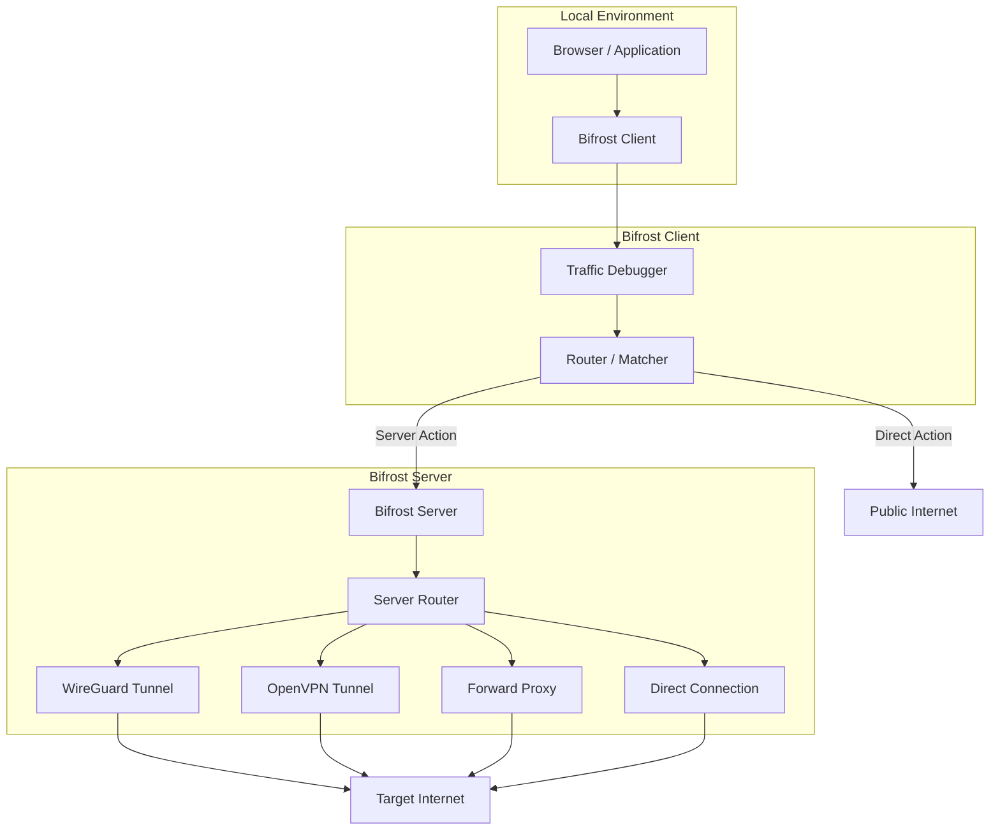

<p align="center">
  
</p>

# Bifrost Proxy

[](https://opensource.org/licenses/MIT)
[](https://golang.org/)
[](https://github.com/rennerdo30/bifrost-proxy/actions)

Bifrost is a **production-grade proxy system** designed for high-performance traffic routing, deep inspection, and seamless tunnel integration. It bridges your local environment with remote networks through WireGuard, OpenVPN, and intelligent domain-based routing.

---

## ✨ Key Features

### 🛡️ Secure Tunnels & Protocols
- **Multi-Protocol Support**: HTTP, HTTPS (CONNECT), and SOCKS5.
- **VPN Integration**: Native WireGuard (userspace) and OpenVPN support.
- **TUN Mode**: Full-system traffic capture with advanced split-tunneling (App, Domain, and CIDR rules).

### 🚀 Management & Automation
- **Auto-Updates**: Built-in GitHub-based update mechanism with channel support (stable/prerelease).
- **Service Management**: Native system service installation for Windows (SCM), macOS (launchd), and Linux (systemd).
- **System Proxy**: OS-level proxy configuration (Windows supported).

### 🔍 Reliability & Observability
- **Intelligent Routing**: Route traffic through different backends based on sophisticated domain patterns.
- **Health Checks**: TCP, HTTP, and Ping-based health monitoring with automatic failover.
- **Rich Analytics**: Prometheus metrics, structured JSON logging, and interactive Web UI.

---

## 🏗️ Architecture

The Bifrost ecosystem consists of a **Server** for central routing and a **Client** for local traffic handling.



---

## 💻 Dashboard & Interface

Bifrost comes with a premium Web UI for monitoring and configuration.


> [!NOTE]
> *Note: UI appearance may vary based on platform and version.*

---

## 🏁 Quick Start

### 1. Server Setup
```bash
# Build the server
make build-server

# Start with default configuration
./bin/bifrost-server -c server-config.yaml
```

### 2. Client Setup
```bash
# Build the client
make build-client

# Initialize configuration
./bin/bifrost-client config init --server your-server:7080

# Run the client
./bin/bifrost-client -c client-config.yaml
```

---

## 🛠️ Installation & Services

Install Bifrost as a system service to ensure it runs in the background.

```bash
# Install as service
sudo bifrost-client service install --config /path/to/config.yaml

# Check status
bifrost-client service status
```

---

## 📖 Documentation

Explore our comprehensive guides for advanced setups:

- 🚀 [Getting Started](docs/getting-started.md)
- ⚙️ [Configuration Guide](docs/configuration.md)
- 🔒 [Authentication Modes](docs/authentication.md)
- 🌐 [VPN & Split Tunneling](docs/vpn-mode.md)
- 📊 [API Reference](docs/api.md)

---

## 📜 License

This project is licensed under the **MIT License**. See the [LICENSE](LICENSE) file for details.
