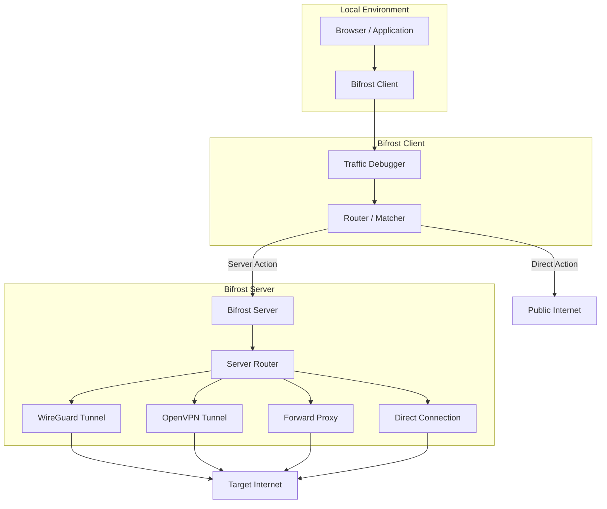
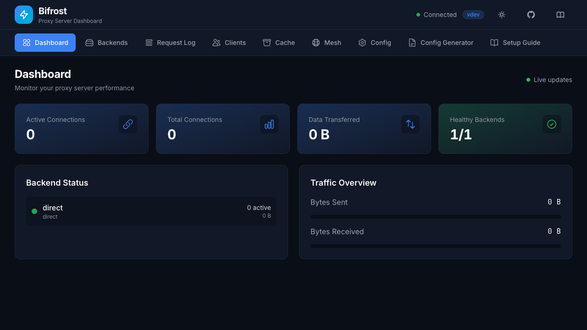
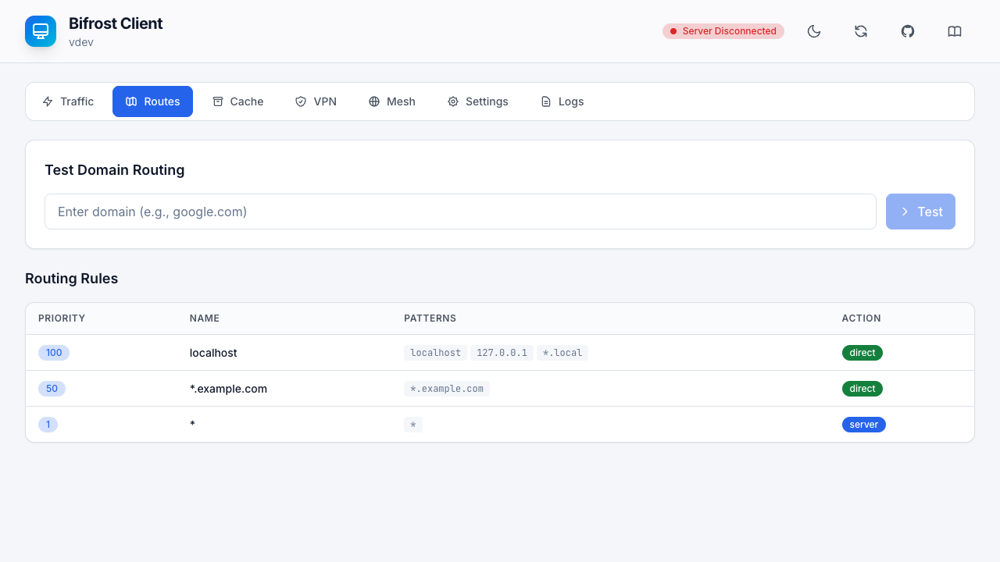

<p align="center">
  
</p>

# Bifrost Proxy

[](https://opensource.org/licenses/MIT)
[](https://golang.org/)
[](https://github.com/rennerdo30/bifrost-proxy/actions)

Bifrost is a **production-grade proxy system** designed for high-performance traffic routing, deep inspection, and seamless tunnel integration. It bridges your local environment with remote networks through WireGuard, OpenVPN, and intelligent domain-based routing.

📚 **Full documentation:** <https://bifrost.docs.renner.dev/>

---

## ✨ Key Features

### 🛡️ Secure Tunnels & Protocols
- **Multi-Protocol Support**: HTTP, HTTPS (CONNECT), and SOCKS5.
- **VPN Integration**: Native WireGuard (userspace) and OpenVPN support.
- **TUN Mode**: Full-system traffic capture with advanced split-tunneling (App, Domain, and CIDR rules).

### 🚀 Management & Automation
- **Auto-Updates**: Built-in GitHub-based update mechanism with channel support (stable/prerelease).
- **Service Management**: Native system service installation for Windows (SCM), macOS (launchd), and Linux (systemd).
- **System Proxy**: OS-level proxy configuration on Windows (registry/WinINET), macOS (`networksetup`), and Linux/GNOME (`gsettings`). On unsupported desktops it returns `ErrNotSupported` rather than silently succeeding.

### 🔍 Reliability & Observability
- **Intelligent Routing**: Route traffic through different backends based on sophisticated domain patterns.
- **Health Checks**: TCP, HTTP, and Ping-based health monitoring with automatic failover.
- **Rich Analytics**: Prometheus metrics, structured JSON logging, and interactive Web UI.

---

## 🏗️ Architecture

The Bifrost ecosystem consists of a **Server** for central routing and a **Client** for local traffic handling.


```mermaid
graph TD
    subgraph "Local Environment"
        App[Browser / Application] --> Client[Bifrost Client]
    end

    subgraph "Bifrost Client"
        Client --> Debug[Traffic Debugger]
        Debug --> Router[Router / Matcher]
    end

    Router -- "Direct Action" --> Internet[Public Internet]
    Router -- "Server Action" --> Server[Bifrost Server]

    subgraph "Bifrost Server"
        Server --> SRouter[Server Router]
        SRouter --> WG[WireGuard Tunnel]
        SRouter --> OVP[OpenVPN Tunnel]
        SRouter --> Fwd[Forward Proxy]
        SRouter --> SDirect[Direct Connection]
    end

    WG --> TInternet[Target Internet]
    OVP --> TInternet
    Fwd --> TInternet
    SDirect --> TInternet
```

---

## 💻 Dashboard & Interface

Bifrost ships **two** dashboards, both embedded into their binary at build time by the
`make build` targets — there is no separate web server to run:

| Dashboard | Source | Served by | Sections |
| --- | --- | --- | --- |
| Server | `web/server` | `bifrost-server` (API listener) | Dashboard, Backends, Request Log, Clients, Cache, Mesh, Config, Config Generator, Setup Guide |
| Client | `web/client` | `bifrost-client` (API listener) | Traffic, Routes, Cache, VPN, Mesh, Settings, Logs |

Both are React + TypeScript single-page apps built with Vite and styled with Tailwind CSS.
They support a **dark and a light theme**: the theme follows your operating system
preference by default and can be switched from the header, with the choice stored in
`localStorage` and applied before the first paint.





Beyond the browser dashboards there are dedicated frontends in this repository:

- `desktop/` — Wails-based desktop app (Windows, macOS, Linux) with tray integration.
- `mobile/` — React Native / Expo app (iOS, Android).
- `openwrt/` — packaging for running the client on OpenWrt routers.

> [!NOTE]
> *UI appearance may vary based on platform and version.*

---

## 🏁 Quick Start

Requirements for building from source: **Go** (see `go.mod` for the minimum version),
**Node.js** with npm and `make` — the dashboards are compiled by Vite and then embedded
into the binaries via `go:embed`, so the Make targets below run `npm install && npm run build`
for you before `go build`. Prebuilt nightly archives are also published on the
[Releases](https://github.com/rennerdo30/bifrost-proxy/releases) page.

### 1. Server Setup
```bash
# Build the server (also builds + embeds the server dashboard)
make build-server

# Start from a copy of the example configuration
cp configs/server-config.example.yaml server-config.yaml
./bin/bifrost-server -c server-config.yaml
```

### 2. Client Setup
```bash
# Build the client (also builds + embeds the client dashboard)
make build-client

# Generate a client configuration
./bin/bifrost-client config init --server your-server:7080

# Validate it, then run
./bin/bifrost-client validate -c client-config.yaml
./bin/bifrost-client -c client-config.yaml
```

[`configs/`](configs/) contains ready-made examples for the server, the client, Docker and
OpenWrt. Both dashboards are disabled or bound to localhost by default — see the `web_ui`
and `api` sections of those examples for the listen addresses.

---

## 🧑‍💻 Working on the Dashboards

```bash
make web-install       # install npm dependencies for both dashboards
make web-dev           # Vite dev server for the server dashboard
make web-dev-client    # Vite dev server for the client dashboard
make web-build         # production build of both dashboards
```

The dev servers proxy `/api` to a locally running Bifrost, so start the matching binary
first. `go build ./...` only succeeds once the dashboards have been built at least
once — `make build` (or `make web-build`) takes care of that.

---

## 🛠️ Installation & Services

Install Bifrost as a system service to ensure it runs in the background.

```bash
# Install as service
sudo bifrost-client service install --config /path/to/config.yaml

# Check status
bifrost-client service status
```

---

## 📖 Documentation

The full documentation site is at **<https://bifrost.docs.renner.dev/>**. The sources live in
[`docs/`](docs/):

- 🚀 [Getting Started](docs/src/content/docs/getting-started.mdx)
- ⚙️ [Configuration Guide](docs/src/content/docs/configuration.mdx)
- 🔒 [Authentication Modes](docs/src/content/docs/authentication.mdx)
- 🌐 [VPN & Split Tunneling](docs/src/content/docs/vpn-mode.mdx)
- 📊 [API Reference](docs/src/content/docs/api/index.mdx)
- 🤝 [Contributing](CONTRIBUTING.md) · 📝 [Changelog](CHANGELOG.md)

The rendered version of these docs is at <https://bifrost.docs.renner.dev/>.

---

## 🧰 Tech Stack

| Layer | Technology |
|-------|------------|
| Server & client | Go 1.25 (Cobra CLI, userspace WireGuard, OpenVPN, TUN) |
| Web UIs | React 19, TypeScript, Vite, Tailwind CSS (embedded into the binaries) |
| Desktop app | Wails (Go + web frontend) |
| Mobile app | React Native / Expo |
| Observability | Prometheus metrics, structured JSON logs |
| Build & release | Make, GoReleaser, Docker, GitHub Actions |
| Docs site | Astro Starlight (`docs/`) |

## 📜 License

This project is licensed under the **MIT License**. See the [LICENSE](LICENSE) file for details.
