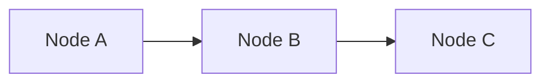
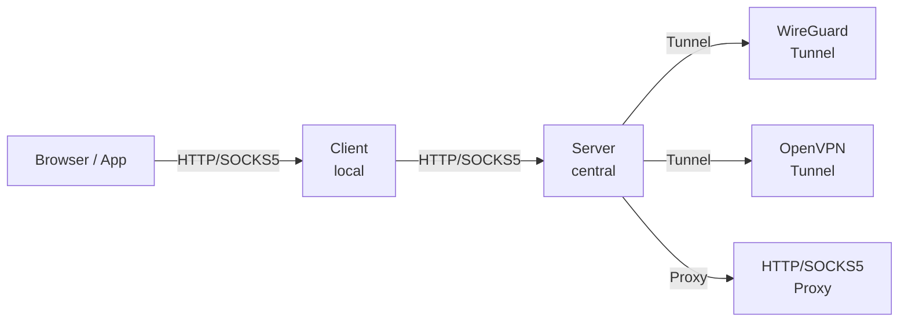

# Simple Proxy Server - Technical Specification

**License**: MIT License
**Repository**: https://github.com/[org]/simple-proxy-server
**Status**: Production-ready open source software

## 1. Overview

A Go-based proxy system with client-server architecture providing HTTP, HTTPS, and SOCKS5 proxy capabilities with intelligent routing and traffic debugging.

### Key Features
- HTTP, HTTPS (CONNECT), and SOCKS5 proxy protocols
- VPN tunnel integration (WireGuard and OpenVPN)
- Traditional forward proxy support
- Domain-based intelligent routing
- Multiple authentication modes (none, native, system, LDAP, OAuth)
- Traffic debugging and inspection
- Cross-platform support (Windows, macOS, Linux)
- System tray integration (client)
- Docker deployment support (server)
- Production-ready with proper logging and security
- Rate limiting and bandwidth throttling
- Backend health checks with automatic failover
- Load balancing across multiple backends
- Prometheus metrics and Grafana dashboards
- IPv6 / dual-stack networking support
- Graceful shutdown with connection draining
- Hot reload without dropping connections
- IP whitelist/blacklist access control
- Structured access logging (JSON, Apache formats)

## 2. Components

### 2.1 Server (`simple-proxy-server`)

Central proxy server that handles the actual routing through different backends.

```
┌─────────────────────────────────────────────────────────────────┐
│                       PROXY SERVER                              │
├─────────────────────────────────────────────────────────────────┤
│  ┌─────────────┐  ┌─────────────┐  ┌─────────────┐              │
│  │ HTTP Proxy  │  │HTTPS Tunnel │  │ SOCKS5 Proxy│              │
│  └──────┬──────┘  └──────┬──────┘  └──────┬──────┘              │
│         └────────────────┼────────────────┘                     │
│                          ▼                                      │
│              ┌───────────────────────┐                          │
│              │    Router/Matcher     │                          │
│              │  (Domain → Backend)   │                          │
│              └───────────┬───────────┘                          │
│                          ▼                                      │
│         ┌────────────────┼────────────────┐                     │
│         ▼                ▼                ▼                     │
│  ┌─────────────┐  ┌─────────────┐  ┌─────────────┐              │
│  │   Direct    │  │  WireGuard  │  │  Forward    │              │
│  │  Connection │  │   Tunnel    │  │   Proxy     │              │
│  └─────────────┘  └─────────────┘  └─────────────┘              │
├─────────────────────────────────────────────────────────────────┤
│  ┌─────────────┐  ┌─────────────┐  ┌─────────────┐              │
│  │  Config     │  │   Web UI    │  │    CLI      │              │
│  │  Manager    │  │  (REST API) │  │             │              │
│  └─────────────┘  └─────────────┘  └─────────────┘              │
└─────────────────────────────────────────────────────────────────┘
```

### 2.2 Client (`simple-proxy-client`)

Local proxy that decides what traffic goes to the server vs direct. Includes system tray integration for easy access on all platforms.

```
┌─────────────────────────────────────────────────────────────────┐
│                       PROXY CLIENT                              │
├─────────────────────────────────────────────────────────────────┤
│  ┌─────────────┐  ┌─────────────┐  ┌─────────────┐              │
│  │ HTTP Proxy  │  │HTTPS Tunnel │  │ SOCKS5 Proxy│              │
│  └──────┬──────┘  └──────┬──────┘  └──────┬──────┘              │
│         └────────────────┼────────────────┘                     │
│                          ▼                                      │
│              ┌───────────────────────┐                          │
│              │   Traffic Debugger    │                          │
│              │ (Logging & Inspection)│                          │
│              └───────────┬───────────┘                          │
│                          ▼                                      │
│              ┌───────────────────────┐                          │
│              │    Router/Matcher     │                          │
│              │(Domain → Server/Direct)│                         │
│              └───────────┬───────────┘                          │
│                          ▼                                      │
│              ┌───────────┴───────────┐                          │
│              ▼                       ▼                          │
│       ┌─────────────┐        ┌─────────────┐                    │
│       │   Direct    │        │   Server    │                    │
│       │  Connection │        │  Connection │                    │
│       └─────────────┘        └─────────────┘                    │
├─────────────────────────────────────────────────────────────────┤
│  ┌──────────┐ ┌──────────┐ ┌──────────┐ ┌──────────┐            │
│  │  Config  │ │  Web UI  │ │   CLI    │ │ Tray Icon│            │
│  │  Manager │ │(Debug UI)│ │          │ │          │            │
│  └──────────┘ └──────────┘ └──────────┘ └──────────┘            │
└─────────────────────────────────────────────────────────────────┘
```

## 3. Configuration

### 3.1 Server Configuration (`server-config.yaml`)

```yaml
# Server configuration
server:
  http_port: 8080           # HTTP/HTTPS proxy port
  socks5_port: 1080         # SOCKS5 proxy port
  bind_address: "0.0.0.0"   # Bind to all interfaces (for clients)
  web_ui_port: 8081         # Web UI port
  log_level: "info"         # debug, info, warn, error

  # Authentication for clients (see Section 12 for details)
  auth:
    mode: "none"            # none, native, system, ldap, oauth

# Network settings
network:
  # IPv6 support
  ipv6:
    enabled: true           # Enable IPv6 support
    prefer_ipv6: false      # Prefer IPv6 over IPv4 when both available

  # Connection timeouts
  timeouts:
    connect: "10s"          # Timeout for establishing connection to backend
    read: "30s"             # Timeout for reading response from backend
    write: "30s"            # Timeout for writing request to backend
    idle: "60s"             # Idle timeout before closing connection

  # Keep-alive settings
  keepalive:
    enabled: true
    interval: "30s"         # TCP keepalive probe interval
    max_idle_conns: 100     # Max idle connections per backend
    max_idle_time: "90s"    # Max time a connection can be idle

  # Connection limits
  limits:
    max_connections: 10000           # Max total connections
    max_connections_per_ip: 100      # Max connections per client IP
    max_connections_per_backend: 50  # Max connections per backend

# Rate limiting
rate_limiting:
  enabled: true
  # Global rate limits
  global:
    requests_per_second: 1000
    burst: 100
  # Per-IP rate limits
  per_ip:
    requests_per_second: 100
    burst: 20
  # Per-user rate limits (when auth enabled)
  per_user:
    requests_per_second: 200
    burst: 50
  # Bandwidth throttling
  bandwidth:
    enabled: false
    max_mbps_per_connection: 100    # Max Mbps per connection (0 = unlimited)
    max_mbps_per_ip: 500            # Max Mbps per client IP
    max_mbps_total: 10000           # Max total bandwidth

# IP Access Control
access_control:
  # IP whitelist (if set, only these IPs can connect)
  whitelist: []
    # - "192.168.1.0/24"
    # - "10.0.0.0/8"
  # IP blacklist (these IPs are always blocked)
  blacklist: []
    # - "1.2.3.4"
    # - "5.6.7.0/24"

# Access logging
access_log:
  enabled: true
  format: "json"            # json, apache_combined, apache_common
  output: "file"            # file, stdout, both
  file: "/var/log/proxy/access.log"
  # Fields to include
  fields:
    - timestamp
    - client_ip
    - username
    - method
    - host
    - path
    - status
    - bytes_sent
    - duration
    - backend
    - user_agent
  # Sensitive header masking
  mask_headers:
    - "Authorization"
    - "Cookie"
    - "X-Api-Key"

# Backend definitions
backends:
  # Direct connection (no proxy)
  - name: "direct"
    type: "direct"

  # WireGuard tunnel
  - name: "germany"
    type: "wireguard"
    wireguard:
      config_file: "/path/to/germany.conf"
    # Health check configuration (optional, per backend)
    health_check:
      enabled: true
      interval: "30s"           # How often to check
      timeout: "5s"             # Health check timeout
      type: "tcp"               # tcp, http, or ping
      # For HTTP health checks:
      # type: "http"
      # http:
      #   url: "http://example.com/health"
      #   expected_status: 200

  - name: "japan"
    type: "wireguard"
    wireguard:
      config_file: "/path/to/japan.conf"
    health_check:
      enabled: true
      interval: "30s"
      timeout: "5s"
      type: "tcp"

  # OpenVPN tunnel
  - name: "uk-vpn"
    type: "openvpn"
    openvpn:
      config_file: "/path/to/uk.ovpn"
      auth_file: "/path/to/uk-auth.txt"  # Optional: username/password file

  # Traditional forward proxy
  - name: "us-proxy"
    type: "http"
    proxy:
      address: "proxy.example.com:8080"
      username: ""
      password: ""

  # SOCKS5 forward proxy
  - name: "socks-proxy"
    type: "socks5"
    proxy:
      address: "socks.example.com:1080"
      username: ""
      password: ""

# Routing rules (evaluated in order, first match wins)
rules:
  - name: "Crunchyroll via Germany"
    match:
      domains:
        - "*.crunchyroll.com"
        - "crunchyroll.com"
    backend: "germany"

  - name: "Anime via Japan"
    match:
      domains:
        - "*.funimation.com"
        - "*.animelab.com"
    backend: "japan"

  - name: "US streaming"
    match:
      domains:
        - "*.netflix.com"
        - "*.hulu.com"
    backend: "us-proxy"

  # Default rule (always last)
  - name: "Default"
    match:
      domains:
        - "*"
    backend: "direct"
```

### 3.2 Client Configuration (`client-config.yaml`)

```yaml
# Client configuration
client:
  http_port: 3128           # Local HTTP/HTTPS proxy port
  socks5_port: 1081         # Local SOCKS5 proxy port
  bind_address: "127.0.0.1" # Only local connections
  web_ui_port: 3129         # Web UI port
  log_level: "info"

# System tray configuration
tray:
  enabled: true             # Enable system tray icon
  start_minimized: false    # Start minimized to tray
  show_notifications: true  # Show desktop notifications for events
  autostart: false          # Start on system login (registers with OS)

# Server connection
server:
  address: "proxy-server.example.com:8080"
  protocol: "http"          # http, https, socks5
  auth:
    enabled: false
    username: ""
    password: ""

# Traffic debugging
debug:
  enabled: true
  log_requests: true        # Log all requests
  log_responses: true       # Log response status/timing
  log_headers: false        # Log request/response headers (verbose)
  log_body: false           # Log body content (very verbose, use with caution)
  max_body_log_size: 1024   # Max bytes to log from body
  output: "file"            # file, stdout, both
  log_file: "./traffic.log"

  # Filter what to debug
  filter:
    domains: []             # Empty = all, or specify domains to debug
    methods: []             # Empty = all, or ["GET", "POST", etc.]
    status_codes: []        # Empty = all, or [400, 500] for errors only

# Routing rules - what goes to server vs direct
rules:
  # Traffic that needs special routing goes to server
  - name: "Streaming sites via server"
    match:
      domains:
        - "*.crunchyroll.com"
        - "*.netflix.com"
        - "*.funimation.com"
    action: "server"        # Route through proxy server

  - name: "Work sites via server"
    match:
      domains:
        - "*.company.com"
    action: "server"

  # Everything else goes direct
  - name: "Default direct"
    match:
      domains:
        - "*"
    action: "direct"        # Direct connection (bypass server)
```

### 3.3 WireGuard Configuration Reference

Standard WireGuard `.conf` files:

```ini
[Interface]
PrivateKey = <base64-encoded-private-key>
Address = 10.0.0.2/32
DNS = 1.1.1.1

[Peer]
PublicKey = <base64-encoded-public-key>
Endpoint = vpn.example.com:51820
AllowedIPs = 0.0.0.0/0
PersistentKeepalive = 25
```

### 3.4 OpenVPN Configuration Reference

Standard OpenVPN `.ovpn` files are supported:

```
client
dev tun
proto udp
remote vpn.example.com 1194
resolv-retry infinite
nobind
persist-key
persist-tun
ca ca.crt
cert client.crt
key client.key
# or use auth-user-pass for username/password
auth-user-pass
cipher AES-256-GCM
auth SHA256
verb 3
```

**Authentication options:**
```yaml
# Option 1: Credentials in auth file
openvpn:
  config_file: "/path/to/config.ovpn"
  auth_file: "/path/to/auth.txt"  # Contains username on line 1, password on line 2

# Option 2: Inline credentials (not recommended, use env vars)
openvpn:
  config_file: "/path/to/config.ovpn"
  username: "${OPENVPN_USERNAME}"
  password: "${OPENVPN_PASSWORD}"

# Option 3: Certificate-based (no auth file needed)
openvpn:
  config_file: "/path/to/config.ovpn"  # Contains cert/key paths
```

**Note**: The server uses an embedded OpenVPN client library or spawns the `openvpn` binary (must be installed on the system). For Docker deployments, the OpenVPN client is included in the image.

## 4. Traffic Debugging

### 4.1 Debug Log Format

```
[2024-01-15 10:30:45.123] [REQ] id=abc123 method=GET host=api.example.com path=/v1/users client=127.0.0.1:54321 route=server
[2024-01-15 10:30:45.456] [RES] id=abc123 status=200 size=1234 duration=333ms
```

With headers enabled:
```
[2024-01-15 10:30:45.123] [REQ] id=abc123 method=GET host=api.example.com path=/v1/users
  Headers: User-Agent: Mozilla/5.0, Accept: application/json, Authorization: Bearer ***
[2024-01-15 10:30:45.456] [RES] id=abc123 status=200 size=1234 duration=333ms
  Headers: Content-Type: application/json, Cache-Control: no-cache
```

### 4.2 Debug Web UI

Real-time traffic viewer showing:
- Request list with filtering/search
- Request/response details
- Timing waterfall
- Traffic statistics

### 4.3 Debug API

```
GET  /api/debug/traffic          - Recent traffic log
GET  /api/debug/traffic/stream   - WebSocket for live traffic
GET  /api/debug/traffic/:id      - Specific request details
POST /api/debug/clear            - Clear traffic log
GET  /api/debug/stats            - Traffic statistics
```

## 5. Interfaces

### 5.1 Server CLI Commands

```bash
# Start the server
simple-proxy-server start
simple-proxy-server start --config /path/to/server-config.yaml

# Stop the server (graceful)
simple-proxy-server stop

# Status
simple-proxy-server status

# Backend management
simple-proxy-server backend list
simple-proxy-server backend add --name "japan" --type wireguard --config /path/to/japan.conf
simple-proxy-server backend remove --name "japan"
simple-proxy-server backend test --name "germany"

# Rule management
simple-proxy-server rule list
simple-proxy-server rule add --name "Anime" --domain "*.crunchyroll.com" --backend "germany"
simple-proxy-server rule remove --name "Anime"

# Configuration
simple-proxy-server config show
simple-proxy-server config reload
simple-proxy-server config validate
```

### 5.2 Client CLI Commands

```bash
# Start the client
simple-proxy-client start
simple-proxy-client start --config /path/to/client-config.yaml

# Stop the client
simple-proxy-client stop

# Status (includes server connection status)
simple-proxy-client status

# Rule management (client-side routing)
simple-proxy-client rule list
simple-proxy-client rule add --name "Work" --domain "*.company.com" --action server
simple-proxy-client rule add --name "Direct" --domain "*.local" --action direct
simple-proxy-client rule remove --name "Work"

# Debug commands
simple-proxy-client debug on                    # Enable debugging
simple-proxy-client debug off                   # Disable debugging
simple-proxy-client debug tail                  # Tail traffic log
simple-proxy-client debug tail --filter "crunchyroll"
simple-proxy-client debug clear                 # Clear traffic log
simple-proxy-client debug export --output traffic.har  # Export as HAR file

# Configuration
simple-proxy-client config show
simple-proxy-client config reload
```

### 5.3 Server REST API

```
GET    /api/status              - Server status
GET    /api/backends            - List backends
POST   /api/backends            - Add backend
DELETE /api/backends/:name      - Remove backend
POST   /api/backends/:name/test - Test backend connectivity

GET    /api/rules               - List rules
POST   /api/rules               - Add rule
PUT    /api/rules/:name         - Update rule
DELETE /api/rules/:name         - Remove rule
POST   /api/rules/reorder       - Reorder rules

GET    /api/config              - Get config
POST   /api/config/reload       - Reload config

GET    /api/stats               - Traffic statistics
GET    /api/clients             - Connected clients (if auth enabled)
```

### 5.4 Client REST API

```
GET    /api/status              - Client status + server connection
GET    /api/rules               - List routing rules
POST   /api/rules               - Add rule
DELETE /api/rules/:name         - Remove rule

GET    /api/debug/status        - Debug status
POST   /api/debug/enable        - Enable debugging
POST   /api/debug/disable       - Disable debugging
GET    /api/debug/traffic       - Recent traffic
GET    /api/debug/traffic/stream - WebSocket for live traffic
POST   /api/debug/clear         - Clear traffic log
GET    /api/debug/stats         - Traffic statistics

GET    /api/config              - Get config
POST   /api/config/reload       - Reload config
```

## 6. Technical Details

### 6.1 Dependencies

Server:
- `golang.zx2c4.com/wireguard` - WireGuard implementation in Go
- `github.com/armon/go-socks5` - SOCKS5 server implementation
- `gopkg.in/yaml.v3` - YAML parsing
- `github.com/gorilla/mux` - HTTP routing for API
- `github.com/gorilla/websocket` - WebSocket for live updates
- `github.com/spf13/cobra` - CLI framework

Client:
- Same as server minus wireguard
- Plus traffic inspection utilities

### 6.2 HTTPS Interception (MITM) for Debugging

For full HTTPS debugging (seeing decrypted content), the client needs to:
1. Generate a CA certificate
2. User installs CA in their trust store
3. Client generates per-domain certificates on-the-fly

This is optional and requires explicit user setup. By default, HTTPS is tunneled (CONNECT method) and only metadata is logged.

### 6.3 Domain Matching

Domain patterns support:
- Exact match: `example.com`
- Wildcard subdomain: `*.example.com` (matches any.example.com, also example.com itself)
- Full wildcard: `*`

Matching is case-insensitive.

### 6.4 Connection Flow

**Client to Direct:**
```
Browser → Client → Target
```

**Client to Server to Backend:**
```
Browser → Client → Server → Backend (WG/Proxy) → Target
```

## 7. Security Considerations

- Server Web UI should be protected (firewall, auth, or localhost-only behind reverse proxy)
- Client binds to localhost by default
- WireGuard .conf files contain private keys - protect file permissions
- MITM mode requires careful handling of generated certificates
- Auth credentials in config files should be protected

## 8. Platform Support

Both client and server are fully supported on all major platforms:

| Platform | Server | Client | Notes |
|----------|--------|--------|-------|
| **Linux** | Full support | Full support | Best WireGuard performance (kernel module) |
| **macOS** | Full support | Full support | wireguard-go userspace, native tray support |
| **Windows** | Full support | Full support | wireguard-go with wintun, native tray support |

### 8.1 Server Requirements
- Elevated permissions required for WireGuard tunnel creation
- Can run as systemd service (Linux), launchd (macOS), or Windows Service
- Docker container available for easy deployment

### 8.2 Client Requirements
- No special permissions required
- System tray requires GUI environment
- Can run headless (CLI-only mode) if needed

## 9. System Tray (Client)

The client includes a system tray icon for easy access on all platforms.

### 9.1 Tray Menu Options
- **Status**: Shows connection status (connected/disconnected)
- **Open Web UI**: Opens the debug/management interface in browser
- **Enable/Disable Proxy**: Quick toggle for proxy
- **Quick Rules**: Submenu to enable/disable specific routing rules
- **View Traffic**: Opens traffic debugger
- **Settings**: Opens settings panel
- **Quit**: Gracefully stops the client

### 9.2 Tray Icon States
- Green: Connected and routing through server
- Yellow: Connected but server unreachable
- Gray: Proxy disabled
- Red: Error state

### 9.3 Notifications
- Server connection established/lost
- Configuration reloaded
- Errors (connection failures, config issues)

### 9.4 Platform-Specific Implementation
- **Windows**: Uses native Win32 system tray API
- **macOS**: Uses NSStatusItem (menu bar)
- **Linux**: Uses libappindicator/StatusNotifierItem (works with GNOME, KDE, etc.)

## 10. Docker Support (Server)

The server can be deployed as a Docker container.

### 10.1 Dockerfile

```dockerfile
FROM golang:1.22-alpine AS builder
WORKDIR /app
COPY . .
RUN go build -o simple-proxy-server ./cmd/server

FROM alpine:latest
RUN apk add --no-cache iptables openvpn
COPY --from=builder /app/simple-proxy-server /usr/local/bin/
COPY --from=builder /app/configs/server-config.yaml /etc/simple-proxy/config.yaml
EXPOSE 8080 1080 8081
ENTRYPOINT ["simple-proxy-server", "start", "--config", "/etc/simple-proxy/config.yaml"]
```

### 10.2 Docker Compose

```yaml
version: '3.8'
services:
  simple-proxy-server:
    build: .
    container_name: simple-proxy-server
    restart: unless-stopped
    cap_add:
      - NET_ADMIN  # Required for WireGuard
    sysctls:
      - net.ipv4.ip_forward=1
    ports:
      - "8080:8080"   # HTTP/HTTPS proxy
      - "1080:1080"   # SOCKS5 proxy
      - "8081:8081"   # Web UI
    volumes:
      - ./config:/etc/simple-proxy
      - ./wireguard:/etc/wireguard:ro  # WireGuard configs
      - ./openvpn:/etc/openvpn:ro      # OpenVPN configs
    devices:
      - /dev/net/tun:/dev/net/tun      # TUN device for VPN
    environment:
      - LOG_LEVEL=info
```

### 10.3 Running with Docker

```bash
# Build and run
docker-compose up -d

# View logs
docker-compose logs -f

# Reload configuration
docker exec simple-proxy-server simple-proxy-server config reload
```

## 11. Health Checks & Load Balancing

### 11.1 Health Check Types

| Type | Description | Use Case |
|------|-------------|----------|
| `tcp` | TCP connection test | Basic connectivity check |
| `http` | HTTP GET request | Web service backends |
| `ping` | ICMP ping | Network-level check |

### 11.2 Health Check Configuration

```yaml
# Global health check defaults
health_checks:
  defaults:
    interval: "30s"
    timeout: "5s"
    healthy_threshold: 2      # Checks before marking healthy
    unhealthy_threshold: 3    # Checks before marking unhealthy

# Per-backend override (in backend definition)
backends:
  - name: "germany"
    type: "wireguard"
    wireguard:
      config_file: "/path/to/germany.conf"
    health_check:
      enabled: true
      interval: "15s"
      timeout: "3s"
      type: "http"
      http:
        url: "https://api.ipify.org"
        expected_status: 200
```

### 11.3 Passive Health Checks

In addition to active probing, the server monitors actual traffic:
- Tracks connection failures and timeouts
- Automatically marks backend unhealthy after consecutive failures
- Faster response to real-world issues

### 11.4 Load Balancing (Multiple Backends per Rule)

When a rule specifies multiple backends, load balancing distributes traffic:

```yaml
rules:
  - name: "Streaming with failover"
    match:
      domains: ["*.crunchyroll.com"]
    backends:                    # Multiple backends for load balancing
      - name: "germany-1"
        weight: 50
      - name: "germany-2"
        weight: 50
    load_balancing:
      algorithm: "round_robin"   # round_robin, least_conn, random, ip_hash
      sticky_sessions: false     # Keep same client on same backend
```

### 11.5 Backend Status API

```
GET /api/backends/:name/health  - Get backend health status
{
  "name": "germany",
  "status": "healthy",          // healthy, unhealthy, unknown
  "last_check": "2024-01-15T10:30:00Z",
  "latency_ms": 45,
  "consecutive_failures": 0,
  "uptime_percent": 99.8
}
```

## 12. Observability & Metrics

### 12.1 Prometheus Metrics

The server exposes Prometheus-compatible metrics at `/metrics`:

```yaml
# Enable in config
metrics:
  enabled: true
  endpoint: "/metrics"
  port: 9090                    # Separate port for metrics (optional)
```

### 12.2 Available Metrics

```
# Connection metrics
proxy_connections_total{backend="germany",status="success"} 12345
proxy_connections_active{backend="germany"} 42
proxy_connections_errors_total{backend="germany",error="timeout"} 5

# Request metrics
proxy_requests_total{method="CONNECT",backend="germany"} 5000
proxy_request_duration_seconds{backend="germany",quantile="0.99"} 0.250
proxy_request_bytes_total{direction="in"} 1234567890
proxy_request_bytes_total{direction="out"} 9876543210

# Backend health
proxy_backend_healthy{backend="germany"} 1
proxy_backend_latency_seconds{backend="germany"} 0.045

# Rate limiting
proxy_rate_limit_exceeded_total{by="ip"} 100
proxy_rate_limit_exceeded_total{by="user"} 25

# System
proxy_uptime_seconds 86400
proxy_config_reload_total 3
proxy_config_reload_errors_total 0
```

### 12.3 Grafana Dashboard

Pre-built Grafana dashboard available at `assets/grafana-dashboard.json` with:
- Request rate and error rate graphs
- Backend health status
- Latency histograms
- Connection pool utilization
- Rate limiting statistics

### 12.4 Health Endpoint

```
GET /health          - Simple health check (200 OK or 503)
GET /health/ready    - Readiness check (config loaded, backends available)
GET /health/live     - Liveness check (process running)
```

## 13. Graceful Shutdown & Hot Reload

### 13.1 Graceful Shutdown

When receiving SIGTERM or SIGINT:

1. **Stop accepting new connections** - Close listening sockets
2. **Drain existing connections** - Allow in-flight requests to complete
3. **Timeout** - Force close after drain timeout
4. **Cleanup** - Close VPN tunnels, flush logs

```yaml
# Configuration
shutdown:
  drain_timeout: "30s"          # Max time to wait for connections to drain
  force_timeout: "60s"          # Force shutdown after this time
```

### 13.2 Hot Reload

Reload configuration without dropping connections:

```bash
# Via CLI
simple-proxy-server config reload

# Via signal
kill -HUP <pid>

# Via API
POST /api/config/reload
```

**What can be hot-reloaded:**
- Routing rules
- Backend definitions
- Rate limiting settings
- Access control lists
- Logging configuration

**What requires restart:**
- Port bindings
- TLS certificates
- Authentication mode changes

### 13.3 Connection Draining

During reload or shutdown:
- New connections go to new config/backends
- Existing connections complete with old config
- Configurable drain timeout

```yaml
reload:
  drain_timeout: "10s"          # Drain time during hot reload
```

## 14. Authentication (Server)

The server supports multiple authentication modes for client connections.

### 14.1 Authentication Modes

| Mode | Description | Use Case |
|------|-------------|----------|
| `none` | No authentication required | Development, trusted networks |
| `native` | Server-managed users/passwords | Simple deployments |
| `system` | OS user authentication (PAM/Windows) | Single-server with OS users |
| `ldap` | LDAP/Active Directory | Enterprise environments |
| `oauth` | OAuth 2.0 / OpenID Connect | SSO integration |

### 14.2 Configuration Examples

#### No Authentication
```yaml
auth:
  mode: "none"
```

#### Native Authentication
```yaml
auth:
  mode: "native"
  native:
    users:
      - username: "user1"
        password_hash: "$2a$10$..."  # bcrypt hash
        groups: ["streaming", "work"]
      - username: "user2"
        password_hash: "$2a$10$..."
        groups: ["streaming"]
    # Optional: allow rule-based access control
    acl:
      - group: "streaming"
        backends: ["germany", "japan"]
      - group: "work"
        backends: ["*"]
```

#### System Authentication (PAM/Windows)
```yaml
auth:
  mode: "system"
  system:
    # Linux: uses PAM
    # Windows: uses Windows authentication
    # macOS: uses Directory Services
    allowed_groups: ["proxy-users", "admins"]  # OS groups allowed to use proxy
```

#### LDAP/Active Directory
```yaml
auth:
  mode: "ldap"
  ldap:
    server: "ldap://ldap.example.com:389"
    # or for LDAPS:
    # server: "ldaps://ldap.example.com:636"
    bind_dn: "cn=service,dc=example,dc=com"
    bind_password: "${LDAP_BIND_PASSWORD}"  # Environment variable
    base_dn: "dc=example,dc=com"
    user_filter: "(sAMAccountName=%s)"      # %s = username
    group_filter: "(member=%s)"             # %s = user DN
    allowed_groups:
      - "CN=ProxyUsers,OU=Groups,DC=example,DC=com"
    # TLS settings
    tls:
      skip_verify: false
      ca_cert: "/path/to/ca.crt"
```

#### OAuth 2.0 / OpenID Connect
```yaml
auth:
  mode: "oauth"
  oauth:
    provider: "generic"     # generic, google, azure, okta
    client_id: "${OAUTH_CLIENT_ID}"
    client_secret: "${OAUTH_CLIENT_SECRET}"
    # For generic provider:
    auth_url: "https://auth.example.com/authorize"
    token_url: "https://auth.example.com/token"
    userinfo_url: "https://auth.example.com/userinfo"
    # Scopes to request
    scopes: ["openid", "profile", "groups"]
    # Claim to use as username
    username_claim: "preferred_username"
    # Claim to use for group membership
    groups_claim: "groups"
    allowed_groups: ["proxy-users"]
    # Token validation
    jwt:
      issuer: "https://auth.example.com"
      audience: "simple-proxy"
```

### 14.3 Proxy-Authorization Header

Clients authenticate using the `Proxy-Authorization` header:

```
Proxy-Authorization: Basic base64(username:password)
```

For OAuth, clients can use bearer tokens:
```
Proxy-Authorization: Bearer <access_token>
```

### 14.4 Web UI Authentication

The Web UI uses the same authentication backend. Session-based authentication is used after initial login.

### 14.5 CLI for User Management (Native Mode)

```bash
# Add user
simple-proxy-server user add --username john --groups streaming,work

# Remove user
simple-proxy-server user remove --username john

# List users
simple-proxy-server user list

# Reset password
simple-proxy-server user passwd --username john

# Manage groups
simple-proxy-server user groups --username john --add admin
simple-proxy-server user groups --username john --remove streaming
```

## 15. Use Cases

### Claude Code Proxy
```yaml
# client-config.yaml
client:
  http_port: 3128
rules:
  - name: "Claude via server"
    match:
      domains: ["*.anthropic.com", "*.claude.ai"]
    action: "server"
  - name: "Default direct"
    match:
      domains: ["*"]
    action: "direct"
```

Then set `HTTP_PROXY=http://127.0.0.1:3128` for Claude Code.

### Streaming Geo-Unlock
```yaml
# server-config.yaml
backends:
  - name: "germany"
    type: "wireguard"
    wireguard:
      config_file: "/etc/wireguard/germany.conf"

rules:
  - name: "Crunchyroll Germany"
    match:
      domains: ["*.crunchyroll.com"]
    backend: "germany"
```

## 16. Documentation

### 16.1 Documentation System

The project uses [MkDocs](https://www.mkdocs.org/) with the [Material theme](https://squidfunk.github.io/mkdocs-material/) for documentation, deployed to GitHub Pages.

**Location**: `docs/` directory (Markdown source files)

**Configuration**: `mkdocs.yml`

**Build**: `make docs-build` or `make docs-serve` (local development)

**Deployment**: Automatically deployed via GitHub Actions workflow (`.github/workflows/docs.yml`)

**Live Site**: https://rennerdo30.github.io/bifrost-proxy/

### 16.2 Diagrams

All diagrams in the documentation use **Mermaid** for rendering. Mermaid provides interactive, scalable diagrams that work well in web browsers.

**Why Mermaid?**
- Native support in MkDocs Material theme
- Interactive and scalable
- Text-based (version control friendly)
- Wide variety of diagram types
- Better accessibility than ASCII art

**Usage:**

````markdown

````

**Supported Diagram Types:**
- **Flowcharts/Graphs**: `graph` or `flowchart` - For architecture, process flows
- **Sequence Diagrams**: `sequenceDiagram` - For request/response flows
- **Class Diagrams**: `classDiagram` - For code structure
- **State Diagrams**: `stateDiagram` - For state machines
- **Entity-Relationship**: `erDiagram` - For data models
- **Gantt Charts**: `gantt` - For timelines
- **Pie Charts**: `pie` - For statistics
- **Git Graphs**: `gitGraph` - For version control flows

**Example - Architecture Diagram:**

The architecture diagrams shown in sections 2.1 and 2.2 are rendered as Mermaid diagrams in the live documentation:



**Best Practices:**
- Use descriptive node labels
- Add styling with `style` directives for visual clarity
- Keep diagrams focused and simple
- Choose appropriate diagram types for the content
- Test locally with `make docs-serve` before committing

**Note**: The ASCII diagrams in this specification document (sections 2.1, 2.2) are converted to Mermaid diagrams in the live documentation for better rendering and interactivity.

### 16.3 Documentation Workflow

**Automatic Deployment:**
- Triggers on push to `main` branch when files in `docs/`, `mkdocs.yml`, `README.md`, `CHANGELOG.md`, or `CONTRIBUTING.md` change
- Builds documentation using Python/MkDocs
- Deploys to GitHub Pages automatically

**Manual Trigger:**
```bash
gh workflow run "Documentation"
```

**Local Development:**
```bash
# Start local server (auto-reload)
make docs-serve

# Build static site
make docs-build
```

### 16.4 Documentation Structure

The documentation is organized into the following sections:

- **Home** (`index.md`) - Overview and quick start
- **Getting Started** - Installation and setup guides
- **Configuration** - Server and client configuration
  - Overview
  - Backends (WireGuard, OpenVPN, HTTP/SOCKS5 proxies)
  - Authentication (None, Native, System, LDAP, OAuth)
- **Deployment** - Docker, systemd, launchd
- **Operations**
  - CLI Reference
  - Monitoring (Prometheus, Grafana)
  - Security
  - Troubleshooting
- **API Reference** - REST API documentation
- **Development**
  - Contributing
  - Changelog
