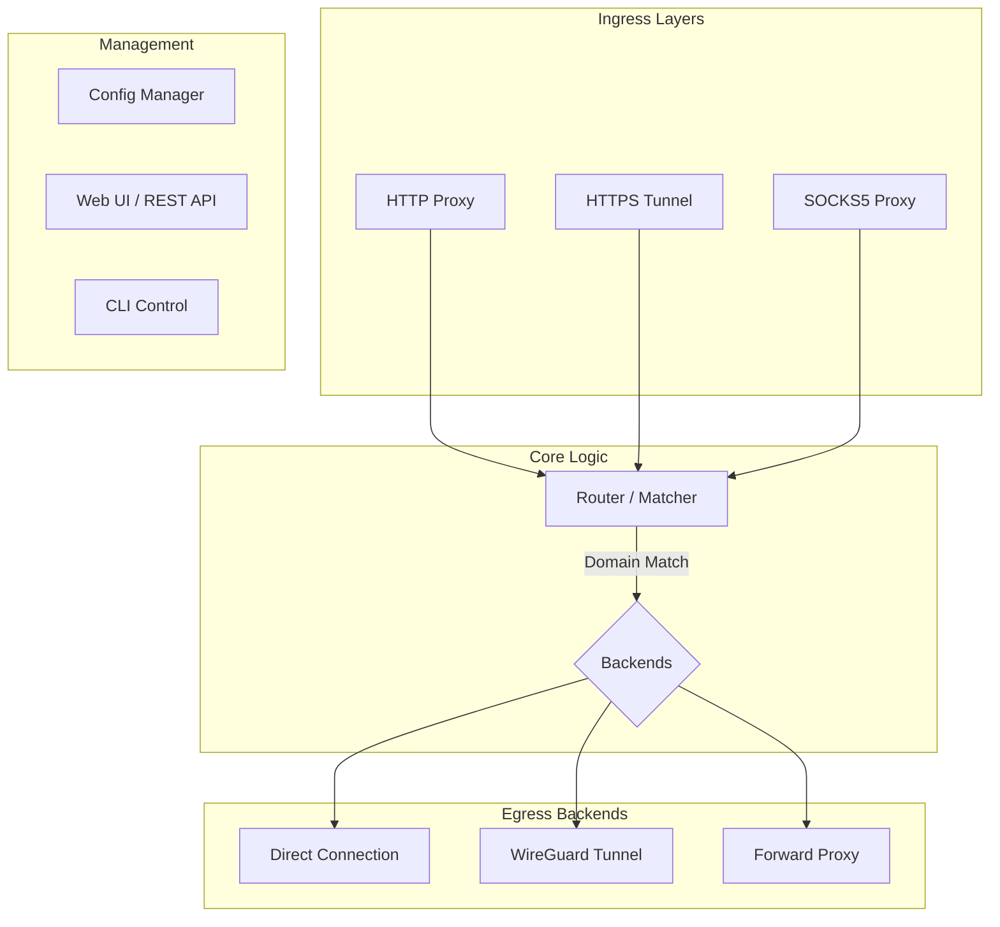
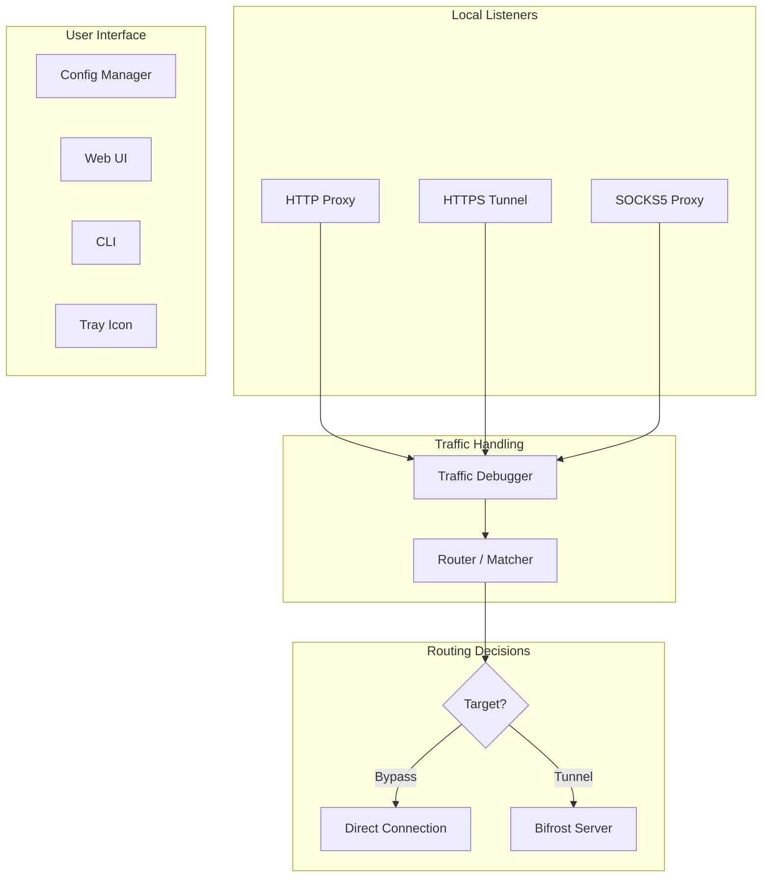
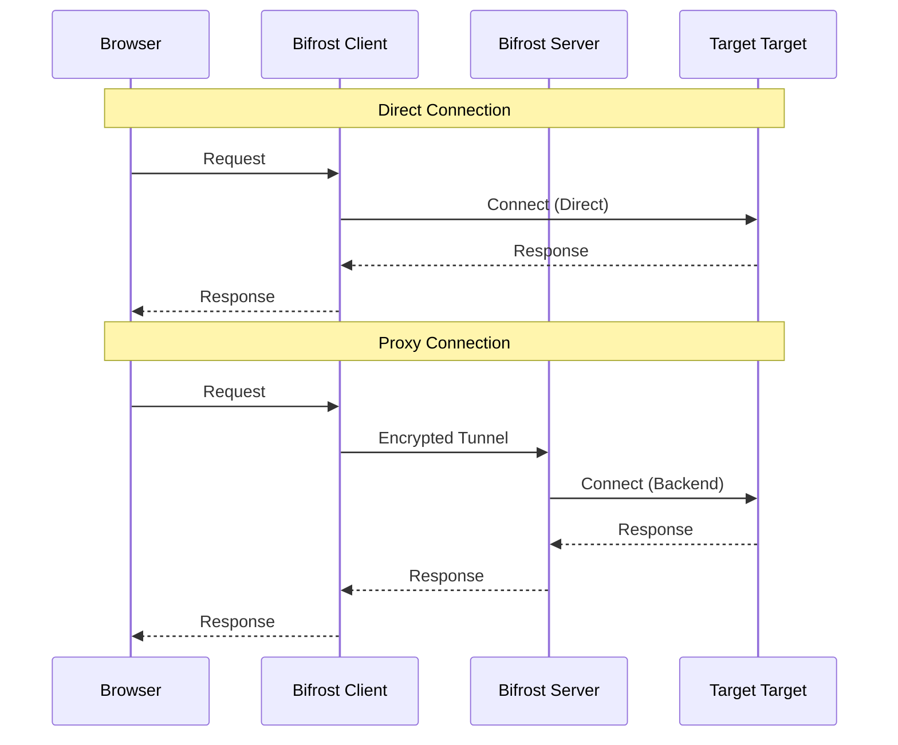
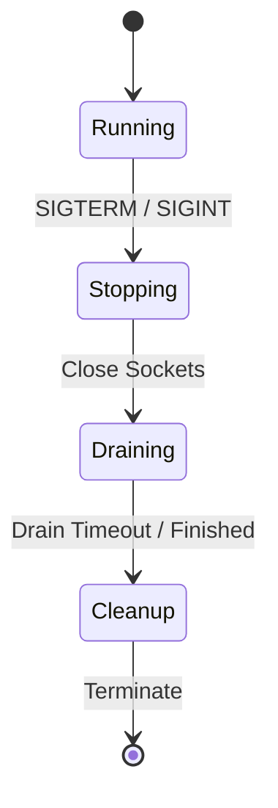
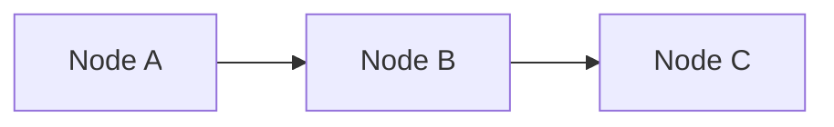
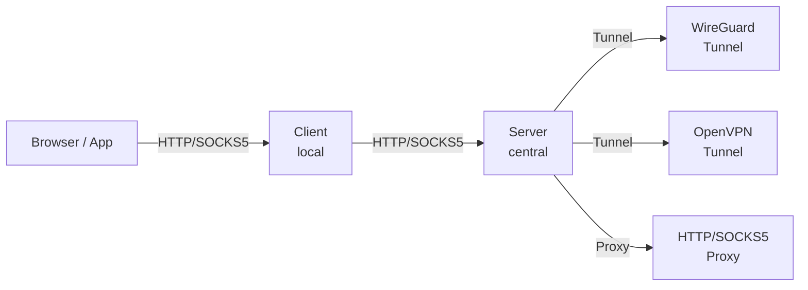
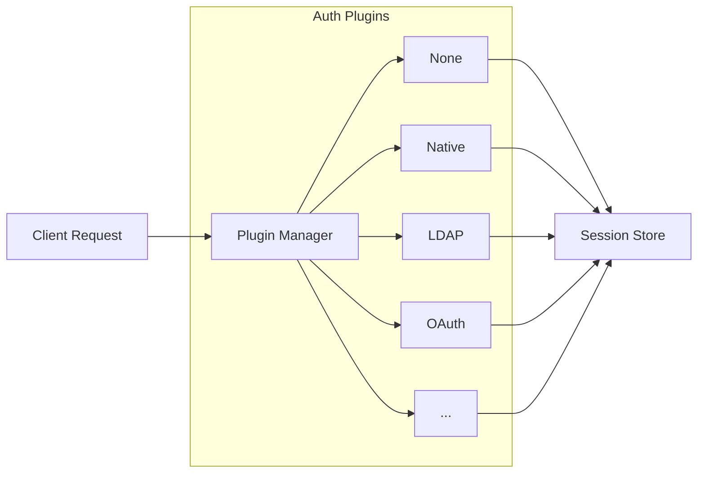
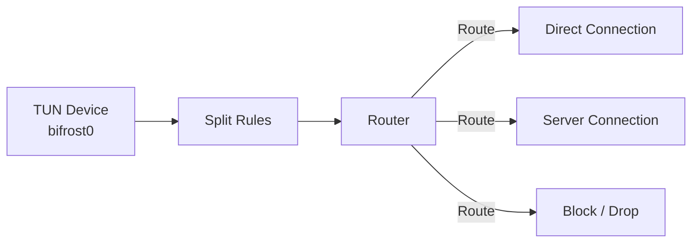
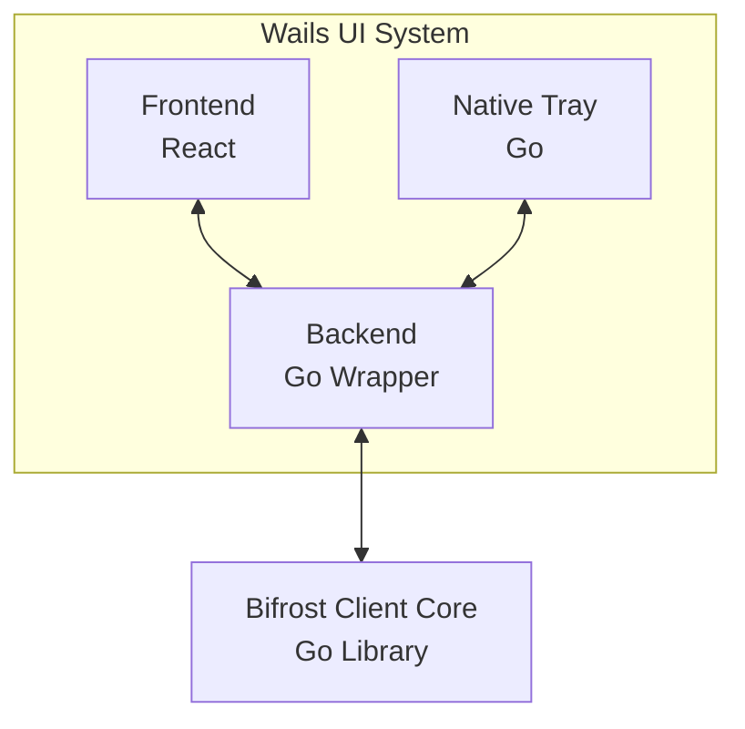
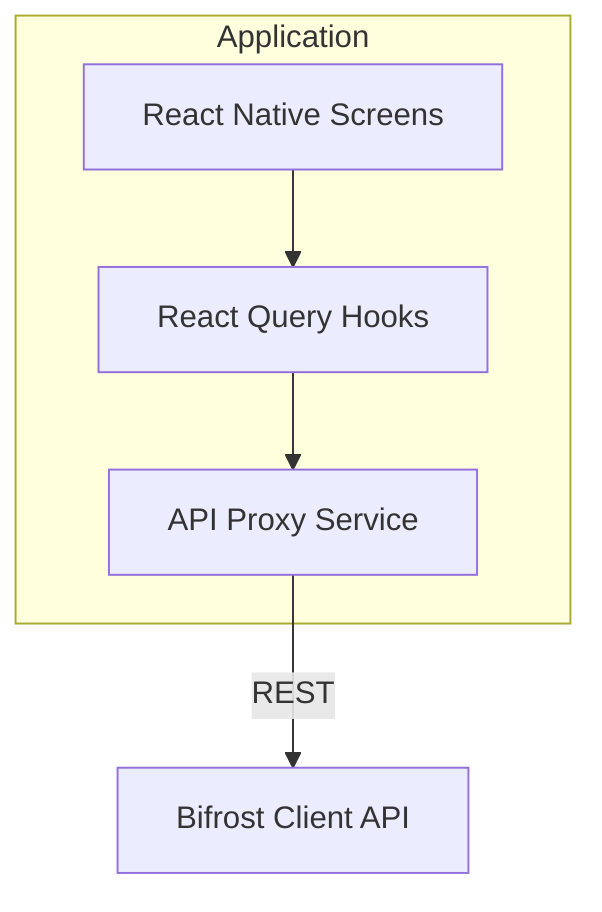

# Bifrost Proxy - Technical Specification

> [!WARNING]
> **This document may lag the implementation.** It is a high-level architectural
> reference and parts of it (notably some config snippets, CLI examples, and API
> paths) can drift from the code. The authoritative, maintained documentation is
> the Starlight site under [`docs/`](docs/) (also published to GitHub Pages).
> When in doubt, treat the Go source — `internal/config/`, `cmd/`, and
> `internal/api/` — as the source of truth. Key conventions to keep in mind:
> the server listens via `server.http.listen` / `server.socks5.listen` (host:port
> strings, not numeric `*_port` fields); routing uses top-level `routes:`;
> authentication uses `auth.providers:` (the legacy `auth.mode` is rejected at
> load time); CLI management subcommands live under the `ctl` command; and the
> REST API is served under the `/api/v1` prefix.

**License**: MIT License
**Repository**: https://github.com/rennerdo30/bifrost-proxy
**Status**: Production-ready open source software

## 1. Overview

A Go-based proxy system with client-server architecture providing HTTP, HTTPS, and SOCKS5 proxy capabilities with intelligent routing and traffic debugging.

> [!IMPORTANT]
> This project is designed for production use. All components follow strict security practices, including structured logging, encrypted tunnels, and modular authentication.

### Key Features
- HTTP, HTTPS (CONNECT), and SOCKS5 proxy protocols
- VPN tunnel integration (WireGuard and OpenVPN)
- Traditional forward proxy support
- Domain-based intelligent routing
- Multiple authentication modes (none, native, system, LDAP, OAuth)
- Traffic debugging and inspection
- Cross-platform support (Windows, macOS, Linux)
- System tray integration (client)
- Docker deployment support (server)
- Production-ready with proper logging and security
- Rate limiting and bandwidth throttling
- Backend health checks with automatic failover
- Load balancing across multiple backends
- Prometheus metrics and Grafana dashboards
- IPv6 / dual-stack networking support
- Graceful shutdown with connection draining
- Hot reload without dropping connections
- IP whitelist/blacklist access control
- Structured access logging (JSON, Apache formats)

## 2. Components

### 2.1 Server (`bifrost-server`)

Central proxy server that handles the actual routing through different backends.


```mermaid
graph TD
    subgraph "Ingress Layers"
        H[HTTP Proxy]
        HT[HTTPS Tunnel]
        S[SOCKS5 Proxy]
    end

    subgraph "Core Logic"
        H & HT & S --> Router[Router / Matcher]
        Router -->|Domain Match| Backends
    end

    subgraph "Egress Backends"
        Backends{Backends}
        Backends --> D[Direct Connection]
        Backends --> WG[WireGuard Tunnel]
        Backends --> F[Forward Proxy]
    end

    subgraph "Management"
        CM[Config Manager]
        WUI[Web UI / REST API]
        CLI[CLI Control]
    end
```

### 2.2 Client (`bifrost-client`)

Local proxy that decides what traffic goes to the server vs direct. Includes system tray integration for easy access on all platforms.


```mermaid
graph TD
    subgraph "Local Listeners"
        H[HTTP Proxy]
        HT[HTTPS Tunnel]
        S[SOCKS5 Proxy]
    end

    subgraph "Traffic Handling"
        H & HT & S --> Debug[Traffic Debugger]
        Debug --> Router[Router / Matcher]
    end

    subgraph "Routing Decisions"
        Router --> Decisions{Target?}
        Decisions -->|Bypass| Direct[Direct Connection]
        Decisions -->|Tunnel| Server[Bifrost Server]
    end

    subgraph "User Interface"
        CM[Config Manager]
        WUI[Web UI]
        CLI[CLI]
        Tray[Tray Icon]
    end
```

## 3. Configuration

### 3.1 Server Configuration (`server-config.yaml`)

> [!NOTE]
> The schema below mirrors the Go structs in `internal/config/server.go`.
> Listeners are configured with `listen` (a `host:port` string), routing uses
> the top-level `routes:` list, and authentication uses `auth.providers:`.
> See `configs/server-config.example.yaml` for a complete, working example.

```yaml
# Listeners and lifecycle
server:
  http:
    listen: ":7080"           # HTTP/HTTPS (CONNECT) proxy listen address
    read_timeout: "60s"
    write_timeout: "60s"
    idle_timeout: "120s"
    max_connections: 0        # 0 = unlimited
    # tls:                    # Optional TLS for the HTTP listener
    #   enabled: true
    #   cert_file: "/path/to/cert.pem"
    #   key_file: "/path/to/key.pem"
  socks5:
    listen: ":7180"           # SOCKS5 proxy listen address
    max_connections: 0
  graceful_period: "30s"      # Drain time on shutdown

> [!TIP]
> Use environment variables (e.g., `${OAUTH_CLIENT_SECRET}`) for sensitive credentials to avoid committing them to version control.

# Backend definitions. Type-specific settings live under `config:` (a free-form
# map), not under a type-named key.
backends:
  # Direct connection (no proxy)
  - name: "direct"
    type: "direct"
    enabled: true
    priority: 10

  # WireGuard tunnel
  - name: "germany"
    type: "wireguard"
    enabled: true
    priority: 5
    config:
      config_file: "/path/to/germany.conf"
    # Optional per-backend health check
    health_check:
      type: "tcp"             # tcp, http, or ping
      interval: "30s"
      timeout: "5s"

  # OpenVPN tunnel
  - name: "uk-vpn"
    type: "openvpn"
    enabled: true
    config:
      config_file: "/path/to/uk.ovpn"
      auth_file: "/path/to/uk-auth.txt"  # Optional: username/password file

  # Traditional forward HTTP proxy
  - name: "us-proxy"
    type: "http_proxy"
    enabled: true
    config:
      address: "proxy.example.com:7080"
      username: ""
      password: ""

  # SOCKS5 forward proxy
  - name: "socks-proxy"
    type: "socks5_proxy"
    enabled: true
    config:
      address: "socks.example.com:7180"

# Routing rules (top-level `routes:`, evaluated by priority; higher first)
routes:
  - name: "Crunchyroll via Germany"
    domains:
      - "*.crunchyroll.com"
      - "crunchyroll.com"
    backend: "germany"
    priority: 100

  # Load balancing across multiple backends for one route
  - name: "US streaming"
    domains:
      - "*.netflix.com"
      - "*.hulu.com"
    backends: ["us-proxy", "us-proxy-2"]
    load_balance: "round_robin"   # round_robin, least_conn, ip_hash, weighted
    priority: 50

  # Default route (lowest priority)
  - name: "Default"
    domains: ["*"]
    backend: "direct"
    priority: 1

# Authentication: an ordered list of provider plugins (see Section 14/17).
auth:
  providers:
    - name: "default"
      type: "none"            # none, native, system, ldap, oauth, apikey, jwt, ...
      enabled: true
      priority: 1
      config: {}              # plugin-specific settings

# Rate limiting (flat keys; bandwidth throttling is nested under `bandwidth`)
rate_limit:
  enabled: true
  requests_per_second: 1000
  burst_size: 100
  per_ip: true
  per_user: false
  bandwidth:
    enabled: false
    upload: "10Mbps"          # Per-connection upload cap
    download: "100Mbps"       # Per-connection download cap

# IP access control
access_control:
  whitelist: []               # If non-empty, only these IPs/CIDRs may connect
  blacklist: []               # These IPs/CIDRs are always blocked

# Access logging
access_log:
  enabled: true
  format: "json"              # json, apache
  output: "stdout"            # stdout or a file path

# Logging (no built-in rotation; rotate externally with logrotate)
logging:
  level: "info"               # debug, info, warn, error
  format: "json"              # json, text
  output: "stdout"            # stdout, stderr, or a file path

# Metrics, Web UI, and REST API
metrics:
  enabled: true
web_ui:
  enabled: true
api:
  enabled: true
  listen: ":7082"
```

### 3.2 Client Configuration (`client-config.yaml`)

> [!NOTE]
> The schema below mirrors the Go structs in `internal/config/client.go`. Local
> listeners live under `proxy.http` / `proxy.socks5` with `listen` (host:port)
> strings, and client-side routing uses a top-level `routes:` list where each
> route has an `action` of `direct` or `server`. See
> `configs/client-config.example.yaml` for a complete example.

```yaml
# Local proxy listeners
proxy:
  http:
    listen: "127.0.0.1:7380"    # Local HTTP/HTTPS proxy
    read_timeout: "30s"
    write_timeout: "30s"
    idle_timeout: "60s"
  socks5:
    listen: "127.0.0.1:7381"    # Local SOCKS5 proxy

# Bifrost server connection
server:
  address: "proxy-server.example.com:7080"
  protocol: "http"              # http or socks5
  # username: "user"            # Optional auth
  # password: "pass"
  timeout: "30s"
  retry_count: 3
  retry_delay: "1s"

# Client-side routing: action is "direct" (bypass server) or "server" (tunnel)
routes:
  - domains: ["*.crunchyroll.com", "*.netflix.com"]
    action: "server"
    priority: 100

  - domains: ["localhost", "127.0.0.1", "*.local"]
    action: "direct"
    priority: 50

  # Everything else through the server
  - domains: ["*"]
    action: "server"
    priority: 1

# Traffic debugging
debug:
  enabled: true
  max_entries: 1000             # Entries kept in memory
  capture_body: false           # Capture request/response bodies (high memory)
  max_body_size: 65536          # Max body bytes captured when capture_body is true
  # filter_domains: ["*.example.com"]

# System tray (when running with a GUI environment)
tray:
  enabled: true
```

### 3.3 WireGuard Configuration Reference

Standard WireGuard `.conf` files:

```ini
[Interface]
PrivateKey = <base64-encoded-private-key>
Address = 10.0.0.2/32
DNS = 1.1.1.1

[Peer]
PublicKey = <base64-encoded-public-key>
Endpoint = vpn.example.com:51820
AllowedIPs = 0.0.0.0/0
PersistentKeepalive = 25
```

### 3.4 OpenVPN Configuration Reference

Standard OpenVPN `.ovpn` files are supported:

```
client
dev tun
proto udp
remote vpn.example.com 1194
resolv-retry infinite
nobind
persist-key
persist-tun
ca ca.crt
cert client.crt
key client.key
# or use auth-user-pass for username/password
auth-user-pass
cipher AES-256-GCM
auth SHA256
verb 3
```

**Authentication options:**
```yaml
# Option 1: Credentials in auth file
openvpn:
  config_file: "/path/to/config.ovpn"
  auth_file: "/path/to/auth.txt"  # Contains username on line 1, password on line 2

# Option 2: Inline credentials (not recommended, use env vars)
openvpn:
  config_file: "/path/to/config.ovpn"
  username: "${OPENVPN_USERNAME}"
  password: "${OPENVPN_PASSWORD}"

# Option 3: Certificate-based (no auth file needed)
openvpn:
  config_file: "/path/to/config.ovpn"  # Contains cert/key paths
```

**Note**: The server uses an embedded OpenVPN client library or spawns the `openvpn` binary (must be installed on the system). For Docker deployments, the OpenVPN client is included in the image.

## 4. Traffic Debugging

### 4.1 Debug Log Format

```
[2024-01-15 10:30:45.123] [REQ] id=abc123 method=GET host=api.example.com path=/v1/users client=127.0.0.1:54321 route=server
[2024-01-15 10:30:45.456] [RES] id=abc123 status=200 size=1234 duration=333ms
```

With headers enabled:
```
[2024-01-15 10:30:45.123] [REQ] id=abc123 method=GET host=api.example.com path=/v1/users
  Headers: User-Agent: Mozilla/5.0, Accept: application/json, Authorization: Bearer ***
[2024-01-15 10:30:45.456] [RES] id=abc123 status=200 size=1234 duration=333ms
  Headers: Content-Type: application/json, Cache-Control: no-cache
```

### 4.2 Debug Web UI

Real-time traffic viewer showing:
- Request list with filtering/search
- Request/response details
- Timing waterfall
- Traffic statistics

### 4.3 Debug API

```
GET  /api/debug/traffic          - Recent traffic log
GET  /api/debug/traffic/stream   - WebSocket for live traffic
GET  /api/debug/traffic/:id      - Specific request details
POST /api/debug/clear            - Clear traffic log
GET  /api/debug/stats            - Traffic statistics
```

## 5. Interfaces

### 5.1 Server CLI Commands

Runtime management commands talk to a running server via its REST API and live
under the `ctl` subcommand.

```bash
# Start the server
bifrost-server start
bifrost-server start --config /path/to/server-config.yaml

# Validate a config file without starting
bifrost-server validate --config /path/to/server-config.yaml

# Runtime control (via REST API; `ctl` subcommands)
bifrost-server ctl status
bifrost-server ctl backend list
bifrost-server ctl backend show germany
bifrost-server ctl backend add japan --type wireguard
bifrost-server ctl backend remove japan
bifrost-server ctl backend test germany
bifrost-server ctl rule list
bifrost-server ctl rule add anime --domain "*.crunchyroll.com" --backend germany
bifrost-server ctl rule remove anime
bifrost-server ctl config reload
bifrost-server ctl stats
bifrost-server ctl health

# Service management (install as system service)
bifrost-server service install --config /path/to/config.yaml
bifrost-server service uninstall
bifrost-server service status

# Update management
bifrost-server update check
bifrost-server update install --channel stable
```

### 5.2 Client CLI Commands

As with the server, runtime control commands live under `ctl` and talk to the
running client's REST API.

```bash
# Start the client
bifrost-client start
bifrost-client start --config /path/to/client-config.yaml

# Initialize a default config
bifrost-client config init

# Runtime control (via REST API; `ctl` subcommands)
bifrost-client ctl status
bifrost-client ctl routes list
bifrost-client ctl routes test example.com
bifrost-client ctl routes add work --domain "*.company.com"
bifrost-client ctl routes remove work
bifrost-client ctl health

# Debug / traffic inspection
bifrost-client ctl debug tail
bifrost-client ctl debug clear
bifrost-client ctl debug errors
bifrost-client ctl debug export --output traffic.har

# VPN (TUN) mode and split tunneling
bifrost-client ctl vpn status
bifrost-client ctl vpn enable
bifrost-client ctl vpn disable
bifrost-client ctl vpn split list
bifrost-client ctl vpn split add-domain "*.internal.company.com"

# Service management (install as system service)
bifrost-client service install --config /path/to/config.yaml
bifrost-client service uninstall
bifrost-client service status

# Update management
bifrost-client update check
bifrost-client update install --channel stable
```

### 5.3 Server REST API

All endpoints are served under the `/api/v1` prefix.

```
GET    /api/v1/health               - Health check
GET    /api/v1/version              - Build/version info
GET    /api/v1/status               - Server status
GET    /api/v1/stats                - Traffic statistics

GET    /api/v1/backends             - List backends
POST   /api/v1/backends             - Add backend
GET    /api/v1/backends/{name}      - Get backend
DELETE /api/v1/backends/{name}      - Remove backend
GET    /api/v1/backends/{name}/stats - Backend statistics
POST   /api/v1/backends/{name}/test  - Test backend connectivity

GET    /api/v1/routes               - List routes
POST   /api/v1/routes               - Add route
... (route management)

GET    /api/v1/config               - Get config
GET    /api/v1/config/full          - Get full resolved config
GET    /api/v1/config/meta          - Config field metadata (reload vs restart)
PUT    /api/v1/config               - Save config
POST   /api/v1/config/validate      - Validate config
POST   /api/v1/config/reload        - Reload config

GET    /api/v1/requests             - Recent proxied requests
GET    /api/v1/connections          - Active connections
```

### 5.4 Client REST API

All endpoints are served under the `/api/v1` prefix.

```
GET    /api/v1/health           - Health check
GET    /api/v1/status           - Client status + server connection
POST   /api/v1/connect          - Connect to server
POST   /api/v1/disconnect       - Disconnect

GET    /api/v1/servers          - List configured servers
POST   /api/v1/server/select    - Select active server

GET    /api/v1/settings         - Get settings
POST   /api/v1/settings         - Update settings

GET    /api/v1/routes           - List routing rules (and management)
GET    /api/v1/debug/...        - Traffic debugging (recent traffic, live WebSocket, clear)
GET    /api/v1/vpn/...          - VPN/TUN mode control and split tunneling
GET    /api/v1/cache/...        - Client-side cache control
GET    /api/v1/mesh/...         - Mesh networking
GET    /api/v1/logs             - Log streaming

GET    /api/v1/config           - Get config
POST   /api/v1/config/reload    - Reload config
```

## 6. Technical Details

### 6.1 Dependencies

Server:
- `golang.zx2c4.com/wireguard` - WireGuard implementation in Go
- `github.com/armon/go-socks5` - SOCKS5 server implementation
- `gopkg.in/yaml.v3` - YAML parsing
- `github.com/gorilla/mux` - HTTP routing for API
- `github.com/gorilla/websocket` - WebSocket for live updates
- `github.com/spf13/cobra` - CLI framework

Client:
- Same as server minus wireguard
- Plus traffic inspection utilities

### 6.2 HTTPS Interception (MITM) for Debugging

For full HTTPS debugging (seeing decrypted content), the client needs to:
1. Generate a CA certificate
2. User installs CA in their trust store
3. Client generates per-domain certificates on-the-fly

This is optional and requires explicit user setup. By default, HTTPS is tunneled (CONNECT method) and only metadata is logged.

### 6.3 Domain Matching

Domain patterns support:
- Exact match: `example.com`
- Wildcard subdomain: `*.example.com` (matches any.example.com, also example.com itself)
- Suffix match: `.example.com` (matches example.com and all subdomains)
- Full wildcard: `*`
- Glob patterns within labels: `sf-*.example.com` (matches sf-abc.example.com, sf-xyz.example.com)

**Glob Pattern Examples:**
| Pattern | Matches | Does Not Match |
|---------|---------|----------------|
| `sf-*.example.com` | `sf-abc.example.com`, `sf-123.example.com` | `other.example.com` |
| `*-api.example.com` | `backend-api.example.com`, `v2-api.example.com` | `api.example.com` |
| `pre-*-suf.example.com` | `pre-middle-suf.example.com` | `pre-other.example.com` |
| `*.sf-*.example.com` | `sub.sf-abc.example.com` | `sf-abc.example.com` |

Matching is case-insensitive.

### 6.4 Connection Flow


```mermaid
sequenceDiagram
    participant B as Browser
    participant C as Bifrost Client
    participant S as Bifrost Server
    participant T as Target Target

    Note over B, T: Direct Connection
    B->>C: Request
    C->>T: Connect (Direct)
    T-->>C: Response
    C-->>B: Response

    Note over B, T: Proxy Connection
    B->>C: Request
    C->>S: Encrypted Tunnel
    S->>T: Connect (Backend)
    T-->>S: Response
    S-->>C: Response
    C-->>B: Response
```

## 7. Security Considerations

- Server Web UI should be protected (firewall, auth, or localhost-only behind reverse proxy)
- Client binds to localhost by default
- WireGuard .conf files contain private keys - protect file permissions
- MITM mode requires careful handling of generated certificates

> [!CAUTION]
> WireGuard and OpenVPN configuration files contain sensitive private keys. Ensure file permissions are restricted (e.g., `chmod 600`) and they are excluded from backups where appropriate.

## 8. Platform Support

Both client and server are fully supported on all major platforms:

| Platform | Server | Client | Notes |
|----------|--------|--------|-------|
| **Linux** | Full support | Full support | Best WireGuard performance (kernel module) |
| **macOS** | Full support | Full support | wireguard-go userspace, native tray support |
| **Windows** | Full support | Full support | wireguard-go with wintun, native tray support |

### 8.1 Server Requirements
- Elevated permissions required for WireGuard tunnel creation
- Can run as systemd service (Linux), launchd (macOS), or Windows Service
- Docker container available for easy deployment

### 8.2 Client Requirements
- No special permissions required
- System tray requires GUI environment
- Can run headless (CLI-only mode) if needed

## 9. System Tray (Client)

The client includes a system tray icon for easy access on all platforms.

### 9.1 Tray Menu Options
- **Status**: Shows connection status (connected/disconnected)
- **Open Web UI**: Opens the debug/management interface in browser
- **Enable/Disable Proxy**: Quick toggle for proxy
- **Quick Rules**: Submenu to enable/disable specific routing rules
- **View Traffic**: Opens traffic debugger
- **Settings**: Opens settings panel
- **Quit**: Gracefully stops the client

### 9.2 Tray Icon States
- Green: Connected and routing through server
- Yellow: Connected but server unreachable
- Gray: Proxy disabled
- Red: Error state

### 9.3 Notifications
- Server connection established/lost
- Configuration reloaded
- Errors (connection failures, config issues)

### 9.4 Platform-Specific Implementation
- **Windows**: Uses native Win32 system tray API
- **macOS**: Uses NSStatusItem (menu bar)
- **Linux**: Uses libappindicator/StatusNotifierItem (works with GNOME, KDE, etc.)

## 10. Docker Support (Server)

The server can be deployed as a Docker container.

### 10.1 Dockerfile

```dockerfile
FROM golang:1.22-alpine AS builder
WORKDIR /app
COPY . .
RUN go build -o bifrost-server ./cmd/server

FROM alpine:latest
RUN apk add --no-cache iptables openvpn
COPY --from=builder /app/bifrost-server /usr/local/bin/
COPY --from=builder /app/configs/server-config.yaml /etc/bifrost/config.yaml
EXPOSE 7080 7180 7081
ENTRYPOINT ["bifrost-server", "start", "--config", "/etc/bifrost/config.yaml"]
```

### 10.2 Docker Compose

```yaml
version: '3.8'
services:
  bifrost-server:
    build: .
    container_name: bifrost-server
    restart: unless-stopped
    cap_add:
      - NET_ADMIN  # Required for WireGuard
    sysctls:
      - net.ipv4.ip_forward=1
    ports:
      - "7080:7080"   # HTTP/HTTPS proxy
      - "7180:7180"   # SOCKS5 proxy
      - "7081:7081"   # Web UI
    volumes:
      - ./server-config.yaml:/app/data/config.yaml:ro
      - bifrost-data:/app/data
      - bifrost-logs:/var/log/bifrost
    devices:
      - /dev/net/tun:/dev/net/tun      # TUN device for VPN
    environment:
      - LOG_LEVEL=info
```

### 10.3 Running with Docker

```bash
# Build and run
docker-compose up -d

# View logs
docker-compose logs -f

# Reload configuration
docker exec bifrost-server bifrost-server config reload
```

## 11. Health Checks & Load Balancing

### 11.1 Health Check Types

| Type | Description | Use Case |
|------|-------------|----------|
| `tcp` | TCP connection test | Basic connectivity check |
| `http` | HTTP GET request | Web service backends |
| `ping` | ICMP ping | Network-level check |

### 11.2 Health Check Configuration

```yaml
# Global health check defaults
health_checks:
  defaults:
    interval: "30s"
    timeout: "5s"
    healthy_threshold: 2      # Checks before marking healthy
    unhealthy_threshold: 3    # Checks before marking unhealthy

# Per-backend override (in backend definition)
backends:
  - name: "germany"
    type: "wireguard"
    wireguard:
      config_file: "/path/to/germany.conf"
    health_check:
      enabled: true
      interval: "15s"
      timeout: "3s"
      type: "http"
      http:
        url: "https://api.ipify.org"
        expected_status: 200
```

- Faster response to real-world issues

> [!NOTE]
> Passive health checks supplement active probing. If a backend fails multiple consecutive real requests, it is temporarily marked unhealthy even if the next active probe hasn't triggered yet.

### 11.4 Load Balancing (Multiple Backends per Rule)

When a rule specifies multiple backends, load balancing distributes traffic:

```yaml
rules:
  - name: "Streaming with failover"
    match:
      domains: ["*.crunchyroll.com"]
    backends:                    # Multiple backends for load balancing
      - name: "germany-1"
        weight: 50
      - name: "germany-2"
        weight: 50
    load_balancing:
      algorithm: "round_robin"   # round_robin, least_conn, random, ip_hash
      sticky_sessions: false     # Keep same client on same backend
```

### 11.5 Backend Status API

```
GET /api/backends/:name/health  - Get backend health status
{
  "name": "germany",
  "status": "healthy",          // healthy, unhealthy, unknown
  "last_check": "2024-01-15T10:30:00Z",
  "latency_ms": 45,
  "consecutive_failures": 0,
  "uptime_percent": 99.8
}
```

## 12. Observability & Metrics

### 12.1 Prometheus Metrics

The server exposes Prometheus-compatible metrics at `/metrics`:

```yaml
# Enable in config
metrics:
  enabled: true
  endpoint: "/metrics"
  port: 7090                    # Separate port for metrics (optional)
```

### 12.2 Available Metrics

```
# Connection metrics
proxy_connections_total{backend="germany",status="success"} 12345
proxy_connections_active{backend="germany"} 42
proxy_connections_errors_total{backend="germany",error="timeout"} 5

# Request metrics
proxy_requests_total{method="CONNECT",backend="germany"} 5000
proxy_request_duration_seconds{backend="germany",quantile="0.99"} 0.250
proxy_request_bytes_total{direction="in"} 1234567890
proxy_request_bytes_total{direction="out"} 9876543210

# Backend health
proxy_backend_healthy{backend="germany"} 1
proxy_backend_latency_seconds{backend="germany"} 0.045

# Rate limiting
proxy_rate_limit_exceeded_total{by="ip"} 100
proxy_rate_limit_exceeded_total{by="user"} 25

# System
proxy_uptime_seconds 86400
proxy_config_reload_total 3
proxy_config_reload_errors_total 0
```

### 12.3 Grafana Dashboard

Pre-built Grafana dashboard available at `docker/grafana/dashboards/bifrost-overview.json` with:
- Request rate and error rate graphs
- Backend health status
- Latency histograms
- Connection pool utilization
- Rate limiting statistics

### 12.4 Health Endpoint

```
GET /health          - Simple health check (200 OK or 503)
GET /health/ready    - Readiness check (config loaded, backends available)
GET /health/live     - Liveness check (process running)
```

## 13. Graceful Shutdown & Hot Reload

### 13.1 Graceful Shutdown


```mermaid
stateDiagram-v2
    [*] --> Running
    Running --> Stopping : SIGTERM / SIGINT
    Stopping --> Draining : Close Sockets
    Draining --> Cleanup : Drain Timeout / Finished
    Cleanup --> [*] : Terminate
```

1. **Stop accepting new connections** - Close listening sockets
2. **Drain existing connections** - Allow in-flight requests to complete
3. **Timeout** - Force close after drain timeout
4. **Cleanup** - Close VPN tunnels, flush logs

```yaml
# Configuration
shutdown:
  drain_timeout: "30s"          # Max time to wait for connections to drain
  force_timeout: "60s"          # Force shutdown after this time
```

### 13.2 Hot Reload

Reload configuration without dropping connections:

```bash
# Via CLI
bifrost-server config reload

# Via signal
kill -HUP <pid>

# Via API
POST /api/config/reload
```

**What can be hot-reloaded:**
- Routing rules
- Backend definitions
- Rate limiting settings
- Access control lists
- Logging configuration

**What requires restart:**
- Port bindings
- TLS certificates
- Authentication mode changes

### 13.3 Connection Draining

During reload or shutdown:
- New connections go to new config/backends
- Existing connections complete with old config
- Configurable drain timeout

```yaml
reload:
  drain_timeout: "10s"          # Drain time during hot reload
```

## 14. Authentication (Server)

The server supports modular authentication via a list of provider plugins under
`auth.providers`.

> [!IMPORTANT]
> The legacy `auth.mode` field (and the legacy type-specific top-level blocks
> such as `auth.native:` / `auth.ldap:`) are **deprecated and rejected at config
> load time**. Use `auth.providers` instead. Each provider has a `type`, an
> `enabled` flag, a `priority` (lower is tried first), and a plugin-specific
> `config` map. See Section 17 for the full plugin catalog.

### 14.1 Provider Types

| Type | Description | Use Case |
|------|-------------|----------|
| `none` | No authentication required | Development, trusted networks |
| `native` | Server-managed users/passwords | Simple deployments |
| `system` | OS user authentication (PAM/Windows) | Single-server with OS users |
| `ldap` | LDAP/Active Directory | Enterprise environments |
| `oauth` | OAuth 2.0 / OpenID Connect | SSO integration |
| `apikey`, `jwt`, `mtls`, `totp`, `hotp`, `kerberos`, `ntlm` | See Section 17 | Various |

### 14.2 Configuration Examples

#### No Authentication
```yaml
auth:
  providers:
    - name: "open"
      type: "none"
      enabled: true
      priority: 1
```

#### Native Authentication
```yaml
auth:
  providers:
    - name: "users"
      type: "native"
      enabled: true
      priority: 1
      config:
        users:
          - username: "user1"
            password_hash: "$2a$10$..."  # bcrypt hash
          - username: "user2"
            password_hash: "$2a$10$..."
```

#### LDAP / Active Directory
```yaml
auth:
  providers:
    - name: "corp-ldap"
      type: "ldap"
      enabled: true
      priority: 1
      config:
        url: "ldaps://ldap.example.com:636"
        bind_dn: "cn=service,dc=example,dc=com"
        bind_password: "${LDAP_BIND_PASSWORD}"
        base_dn: "dc=example,dc=com"
        user_filter: "(sAMAccountName=%s)"
```

#### OAuth 2.0 / OpenID Connect
```yaml
auth:
  providers:
    - name: "sso"
      type: "oauth"
      enabled: true
      priority: 1
      config:
        client_id: "${OAUTH_CLIENT_ID}"
        client_secret: "${OAUTH_CLIENT_SECRET}"
        auth_url: "https://auth.example.com/authorize"
        token_url: "https://auth.example.com/token"
        userinfo_url: "https://auth.example.com/userinfo"
        scopes: ["openid", "profile", "groups"]
```

Multiple providers may be enabled simultaneously; they are tried in `priority`
order until one authenticates the request.

### 14.3 Proxy-Authorization Header

Clients authenticate using the `Proxy-Authorization` header:

```
Proxy-Authorization: Basic base64(username:password)
```

For OAuth, clients can use bearer tokens:
```
Proxy-Authorization: Bearer <access_token>
```

### 14.4 Web UI Authentication

The Web UI uses the same authentication backend. Session-based authentication is used after initial login.

### 14.5 CLI for User Management (Native Mode)

```bash
# Add user
bifrost-server user add --username john --groups streaming,work

# Remove user
bifrost-server user remove --username john

# List users
bifrost-server user list

# Reset password
bifrost-server user passwd --username john

# Manage groups
bifrost-server user groups --username john --add admin
bifrost-server user groups --username john --remove streaming
```

## 15. Use Cases

### Claude Code Proxy
```yaml
# client-config.yaml
client:
  http_port: 7380
rules:
  - name: "Claude via server"
    match:
      domains: ["*.anthropic.com", "*.claude.ai"]
    action: "server"
  - name: "Default direct"
    match:
      domains: ["*"]
    action: "direct"
```

Then set `HTTP_PROXY=http://127.0.0.1:7380` for Claude Code.

### Streaming Geo-Unlock
```yaml
# server-config.yaml
backends:
  - name: "germany"
    type: "wireguard"
    wireguard:
      config_file: "/etc/wireguard/germany.conf"

rules:
  - name: "Crunchyroll Germany"
    match:
      domains: ["*.crunchyroll.com"]
    backend: "germany"
```

## 16. Documentation

### 16.1 Documentation System

The project uses [Astro](https://astro.build/) with the
[Starlight](https://starlight.astro.build/) documentation theme, deployed to
GitHub Pages.

**Location**: `docs/` directory (Astro/Starlight project; content under `docs/src/content/docs/`)

**Configuration**: `docs/astro.config.mjs`

**Build**: `make docs-build` (runs `npm run build` in `docs/`) or `make docs-serve` for local development

**Deployment**: Automatically deployed via GitHub Actions workflow (`.github/workflows/docs.yml`)

**Live Site**: https://rennerdo30.github.io/bifrost-proxy/

### 16.2 Diagrams

All diagrams in the documentation use **Mermaid** for rendering. Mermaid provides interactive, scalable diagrams that work well in web browsers.

**Why Mermaid?**
- Supported in the Astro/Starlight docs site (via the Mermaid integration) and in GitHub Markdown
- Interactive and scalable
- Text-based (version control friendly)
- Wide variety of diagram types
- Better accessibility than ASCII art

**Usage:**

````markdown

```mermaid
graph LR
    A[Node A] --> B[Node B]
    B --> C[Node C]
```
````

**Supported Diagram Types:**
- **Flowcharts/Graphs**: `graph` or `flowchart` - For architecture, process flows
- **Sequence Diagrams**: `sequenceDiagram` - For request/response flows
- **Class Diagrams**: `classDiagram` - For code structure
- **State Diagrams**: `stateDiagram` - For state machines
- **Entity-Relationship**: `erDiagram` - For data models
- **Gantt Charts**: `gantt` - For timelines
- **Pie Charts**: `pie` - For statistics
- **Git Graphs**: `gitGraph` - For version control flows

**Example - Architecture Diagram:**

The architecture diagrams shown in sections 2.1 and 2.2 are rendered as Mermaid diagrams in the live documentation:


```mermaid
graph LR
    Browser[Browser / App] -->|HTTP/SOCKS5| Client[Client<br/>local]
    Client -->|HTTP/SOCKS5| Server[Server<br/>central]
    Server -->|Tunnel| WireGuard[WireGuard<br/>Tunnel]
    Server -->|Tunnel| OpenVPN[OpenVPN<br/>Tunnel]
    Server -->|Proxy| HTTPProxy[HTTP/SOCKS5<br/>Proxy]
```

**Best Practices:**
- Use descriptive node labels
- Add styling with `style` directives for visual clarity
- Keep diagrams focused and simple
- Choose appropriate diagram types for the content
- Test locally with `make docs-serve` before committing

**Note**: The ASCII diagrams in previous versions of this specification have been converted to Mermaid diagrams for better rendering and interactivity across all platforms.

### 16.3 Documentation Workflow

**Automatic Deployment:**
- Triggers on push to `main` branch when files in `docs/`, `README.md`, `CHANGELOG.md`, or `CONTRIBUTING.md` change
- Builds documentation using Node.js (Astro/Starlight, `npm run build` in `docs/`)
- Deploys to GitHub Pages automatically

**Manual Trigger:**
```bash
gh workflow run "Documentation"
```

**Local Development:**
```bash
# Start local server (auto-reload)
make docs-serve

# Build static site
make docs-build
```

### 16.4 Documentation Structure

The documentation is organized into the following sections:

- **Home** (`index.md`) - Overview and quick start
- **Getting Started** - Installation and setup guides
- **Configuration** - Server and client configuration
  - Overview
  - Backends (WireGuard, OpenVPN, HTTP/SOCKS5 proxies)
  - Authentication (None, Native, System, LDAP, OAuth)
  - [OpenWRT LuCI Setup Guide](docs/src/content/docs/openwrt.mdx)
- **Deployment** - Docker, systemd, launchd
- **Operations**
  - CLI Reference
  - Monitoring (Prometheus, Grafana)
  - Security
  - Troubleshooting
- **API Reference** - REST API documentation
- **Development**
  - Contributing
  - Changelog

The authentication system has been refactored to use a plugin architecture, allowing for modular authentication providers that can be combined and extended.


```mermaid
graph LR
    C[Client Request] --> PM[Plugin Manager]
    subgraph "Auth Plugins"
        PM --> P1[None]
        PM --> P2[Native]
        PM --> P3[LDAP]
        PM --> P4[OAuth]
        PM --> P5[...]
    end
    P1 & P2 & P3 & P4 & P5 --> Session[Session Store]
```

### 17.1 Plugin Interface

```go
type Plugin interface {
    // Name returns the unique identifier for this plugin
    Name() string

    // Init initializes the plugin with configuration
    Init(config map[string]interface{}) error

    // Authenticate validates credentials and returns user info
    Authenticate(ctx context.Context, creds Credentials) (*User, error)

    // Close cleans up resources
    Close() error
}
```

### 17.2 Built-in Plugins

| Plugin | Description | Use Case |
|--------|-------------|----------|
| `none` | No authentication | Development, trusted networks |
| `native` | Server-managed users/passwords | Simple deployments |
| `system` | OS user authentication (PAM/Directory Services) | Single-server with OS users |
| `ldap` | LDAP/Active Directory | Enterprise environments |
| `oauth` | OAuth 2.0 / OpenID Connect | SSO integration |
| `apikey` | API key in header | Service-to-service auth |
| `jwt` | JWT token validation with JWKS | Token-based auth |
| `totp` | Time-based OTP | Google Authenticator |
| `hotp` | Counter-based OTP | YubiKey |
| `mtls` | Client certificate auth | Smart cards, certificates |
| `kerberos` | Kerberos/SPNEGO | Enterprise SSO |
| `ntlm` | NTLM authentication | Windows domain fallback |

### 17.3 MFA Wrapper

The MFA wrapper allows combining a primary authentication method with an OTP
provider.

> [!NOTE]
> Like all auth configuration, the MFA wrapper is declared as a provider under
> `auth.providers` with a `config` map (the legacy top-level `auth.mode` /
> `auth.mfa_wrapper` form is rejected). The exact `config` keys are
> plugin-specific — consult `internal/auth/` and the Starlight docs for the
> authoritative shape. Conceptually it nests a primary provider and a secondary
> OTP provider (e.g. `native` + `totp`).

### 17.4 Session Management

Sessions can be stored in memory or Redis:

```yaml
session:
  store: redis  # or "memory"
  redis:
    address: "localhost:6379"
    password: ""
    db: 0
  ttl: "24h"
  cookie_name: "bifrost_session"
```

## 18. VPN Mode

The client supports a TUN-based VPN mode that captures all system traffic and routes it through the proxy.

### 18.1 Overview


```mermaid
graph LR
    TUN[TUN Device<br/>bifrost0] --> Rules[Split Rules]
    Rules --> Router[Router]
    Router -->|Route| Direct[Direct Connection]
    Router -->|Route| Server[Server Connection]
    Router -->|Route| Block[Block / Drop]
```

### 18.2 Configuration

```yaml
vpn:
  enabled: true
  mode: tun
  interface_name: bifrost0
  mtu: 1420

  # DNS interception
  dns:
    enabled: true
    servers:
      - "1.1.1.1"
      - "8.8.8.8"
    cache_ttl: "5m"

  # Split tunneling rules
  split:
    mode: exclude  # "include" or "exclude"

    # App-based rules (by process name or path)
    apps:
      - name: "Slack"
        path: "/Applications/Slack.app"
      - name: "Teams"

    # Domain-based rules
    domains:
      - "*.internal.company.com"
      - "localhost"
      - "*.local"

    # IP/CIDR-based rules
    ips:
      - "192.168.0.0/16"
      - "10.0.0.0/8"
      - "172.16.0.0/12"
```

### 18.3 Split Tunneling Modes

- **Include Mode**: Only traffic matching rules goes through VPN
- **Exclude Mode**: All traffic except matching rules goes through VPN

### 18.4 Platform-Specific Notes

| Platform | TUN Support | App Rules | Notes |
|----------|-------------|-----------|-------|
| Linux | ✅ | Process matching | Requires CAP_NET_ADMIN |
| macOS | ✅ | Bundle ID matching | Uses utun interface |
| Windows | ✅ | Process path matching | Requires wintun driver |

## 19. Desktop Client

A native desktop client built with [Wails](https://wails.io/) providing a GUI for managing the proxy.

### 19.1 Features

- **Quick GUI**: Floating window for quick access to common controls
- **System Tray**: Background operation with status indicators
- **Connection Dashboard**: Real-time connection statistics
- **Server Management**: Configure and switch between servers
- **Split Tunneling**: Visual rule editor for app/domain exclusions
- **Logs Viewer**: Real-time log streaming

### 19.2 Architecture


```mermaid
graph TD
    subgraph "Wails UI System"
        FE[Frontend<br/>React] <--> BE[Backend<br/>Go Wrapper]
        Tray[Native Tray<br/>Go] <--> BE
    end

    BE <--> Core[Bifrost Client Core<br/>Go Library]
```

### 19.3 Building

```bash
# Install Wails CLI
go install github.com/wailsapp/wails/v2/cmd/wails@latest

# Build for current platform
cd desktop
wails build

# Build for all platforms
wails build -platform darwin/amd64
wails build -platform windows/amd64
wails build -platform linux/amd64
```

### 19.4 Quick GUI

The Quick GUI is a small floating window that provides:
- Connection status indicator
- Quick connect/disconnect toggle
- Bandwidth usage graph
- Recent connections list
- Quick access to full dashboard

## 20. Mobile Client

A cross-platform mobile client built with React Native and Expo.

### 20.1 Features

- **Home Screen**: VPN connection status and quick toggle
- **Servers Screen**: Server list with latency indicators
- **Stats Screen**: Real-time traffic statistics
- **Settings Screen**: Configuration management

### 20.2 Architecture


```mermaid
graph TD
    subgraph "Application"
        Screens[React Native Screens] --> Hooks[React Query Hooks]
        Hooks --> API[API Proxy Service]
    end

    API -->|REST| Bifrost[Bifrost Client API]
```

### 20.3 Screens

| Screen | Description |
|--------|-------------|
| Home | Connection status, VPN toggle, traffic summary |
| Servers | Server list with status, latency, selection |
| Stats | Detailed statistics, connection info, network details |
| Settings | Auto-connect, kill switch, server address, notifications |

### 20.4 Building

```bash
# Install dependencies
cd mobile
npm install

# Start development
npx expo start

# Build for iOS
npx expo build:ios

# Build for Android
npx expo build:android

# Using EAS Build (recommended)
eas build --platform ios
eas build --platform android
```

### 20.5 API Integration

The mobile client uses React Query for data fetching with automatic:
- Background refetching (configurable intervals)
- Optimistic updates for mutations
- Error handling and retry logic
- Cache invalidation on mutations

## 21. Automatic Updates

Bifrost includes a built-in update mechanism that checks GitHub for new releases.

### 21.1 Update Channels
- **stable**: Production-ready releases.
- **prerelease**: Beta and release candidates.
- **nightly**: Automated builds from the master branch (if available).

### 21.2 CLI Integration
Users can manually check for and install updates using the `update` command.
```bash
bifrost-client update check
bifrost-client update install --channel stable
```

### 21.3 Background Checks
The application can be configured to check for updates in the background at regular intervals.
```yaml
auto_update:
  enabled: true
  check_interval: "24h"
  channel: "stable"
```

## 22. System Service Management

Bifrost provides native service management for Windows (SCM), macOS (launchd), and Linux (systemd).

### 22.1 Service Commands
- `install`: Registers the binary as a system service with specified configuration.
- `uninstall`: Unregisters and removes the service.
- `status`: Displays the current service status.

### 22.2 Platform Specifics
- **Windows**: Registers as a Windows Service using the SCM. Supports START, STOP, and SHUTDOWN events.
- **macOS**: Generates and installs a `.plist` file in `~/Library/LaunchAgents`.
- **Linux**: Generates and installs a `.service` unit file in `/etc/systemd/system`.

## 23. System Proxy Support

The Bifrost client can automatically configure the operating system's proxy settings.

### 23.1 Configuration
```yaml
system_proxy:
  enabled: true
```

### 23.2 Windows Implementation
On Windows, Bifrost modifies the registry keys under `Software\Microsoft\Windows\CurrentVersion\Internet Settings` and notifies the system using `InternetSetOption` from `wininet.dll`.

## 24. Configuration Preservation

When updating configuration via the REST API or CLI, Bifrost uses an AST-based approach (using `yaml.v3`) to ensure that:
- User comments are preserved.
- Formatting and indentation are maintained.
- Only the specific requested fields are modified.
