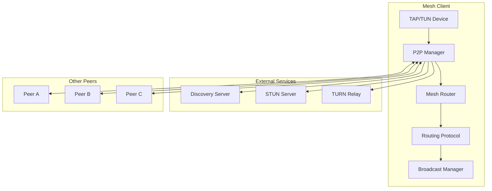

# Mesh Networking

Bifrost supports optional Hamachi-like mesh networking for creating virtual LANs between peers. This feature enables direct peer-to-peer connectivity with automatic NAT traversal, encryption, and routing.

## Overview

The mesh networking feature provides:

- **Virtual LAN**: Create private networks between distributed peers
- **NAT Traversal**: Automatic hole-punching with STUN/TURN support
- **P2P Encryption**: All traffic encrypted with ChaCha20-Poly1305
- **Mesh Routing**: Automatic route discovery and multi-hop relaying
- **TAP Device Support**: Layer 2 networking with Ethernet frame support

## Configuration

Mesh networking is **disabled by default** and must be explicitly enabled:

```yaml
# Mesh networking configuration
mesh:
  enabled: true
  network_id: "my-network"
  network_cidr: "10.100.0.0/16"

  device:
    type: tap           # "tun" (Layer 3) or "tap" (Layer 2)
    name: "mesh0"
    mtu: 1400
    mac_address: ""     # Auto-generated if empty

  discovery:
    server: "bifrost.example.com:7080"
    heartbeat_interval: 30s

  stun:
    servers:
      - "stun:stun.l.google.com:19302"
      - "stun:stun1.l.google.com:19302"

  turn:
    servers:
      - url: "turn:turn.example.com:3478"
        username: "${TURN_USER}"
        password: "${TURN_PASS}"

  connection:
    direct_connect: true
    relay_enabled: true
    relay_via_peers: true
    connect_timeout: 30s
    keepalive_interval: 25s

  routing:
    max_hops: 8
    route_timeout: 5m
    split_horizon: true
```

## Architecture

### Components



### Package Structure

| Package | Description |
|---------|-------------|
| `internal/device/` | Network device abstraction (TUN/TAP) |
| `internal/frame/` | Ethernet frame handling |
| `internal/mesh/` | Mesh networking core |
| `internal/p2p/` | P2P connectivity and NAT traversal |

## Device Types

### TUN Device (Layer 3)

TUN devices operate at Layer 3 (IP packets). Use for:
- Simple IP routing between peers
- Lower overhead
- Compatibility with most use cases

### TAP Device (Layer 2)

TAP devices operate at Layer 2 (Ethernet frames). Use for:
- Full Ethernet networking
- Bridging with local networks
- DHCP, ARP, and broadcast protocols
- VLANs and other Layer 2 features

## NAT Traversal

The mesh network uses ICE-like connectivity checks with:

1. **Host candidates**: Local interface addresses
2. **Server reflexive candidates**: Public addresses via STUN
3. **Relay candidates**: TURN relay addresses

### NAT Types Supported

| NAT Type | Direct Connection | Notes |
|----------|------------------|-------|
| None (public IP) | Yes | Best performance |
| Full Cone | Yes | Works with most peers |
| Restricted Cone | Yes | Hole punching required |
| Port Restricted | Yes | Hole punching required |
| Symmetric | TURN only | Requires relay |

## Routing Protocol

The mesh uses a distance-vector routing protocol with:

- **Split horizon**: Don't announce routes back to source
- **Route announcements**: Periodic route sharing with neighbors
- **Loop prevention**: Path vector and TTL-based
- **Latency-based metrics**: Prefer lower latency paths

### Route Selection

Routes are prioritized by:
1. Direct connections (lowest metric)
2. Single-hop routes through peers
3. Multi-hop routes

```
Metric = Latency(ms) + (HopCount × 100)
```

## Broadcast and Multicast

### Broadcast (Flood)

Sends to all peers in the mesh:

```go
manager.Broadcast(payload, ttl)
```

### Multicast

Sends to members of a specific group:

```go
manager.JoinGroup("group-id", "Group Name")
manager.Multicast("group-id", payload, ttl)
```

### Anycast

Sends to the closest member of a group:

```go
manager.Anycast("group-id", payload)
```

## Security

### Encryption

All P2P traffic is encrypted using:
- **Key Exchange**: Curve25519 ECDH
- **Encryption**: ChaCha20-Poly1305 AEAD
- **Perfect Forward Secrecy**: Ephemeral session keys

### Authentication

Peers authenticate using:
- Public key verification
- Optional network-wide pre-shared keys
- Discovery server authentication

## API Endpoints

### Server-Side API

```
POST   /api/v1/mesh/networks                     # Create network
GET    /api/v1/mesh/networks                     # List networks
GET    /api/v1/mesh/networks/{id}                # Get network
DELETE /api/v1/mesh/networks/{id}                # Delete network

POST   /api/v1/mesh/networks/{id}/peers          # Register peer
GET    /api/v1/mesh/networks/{id}/peers          # List peers
DELETE /api/v1/mesh/networks/{id}/peers/{peer}   # Deregister peer

WS     /api/v1/mesh/networks/{id}/events         # Peer events
```

## Verification

### Check Device Status

```bash
# Linux
ip link show mesh0
ip addr show mesh0

# macOS
ifconfig mesh0

# Windows
netsh interface show interface "mesh0"
```

### Check Peer Connectivity

```bash
# List peers
curl http://localhost:7082/api/v1/mesh/networks/my-network/peers

# Ping virtual IP
ping 10.100.0.2
```

### Check Routes

```bash
# Linux
ip route show dev mesh0

# macOS
netstat -rn | grep mesh0
```

## Troubleshooting

### Connection Issues

1. **Check NAT type**: Symmetric NAT requires TURN
2. **Verify STUN servers**: Ensure they're reachable
3. **Check firewall**: Allow UDP traffic

### Performance Issues

1. **High latency**: Check route metrics
2. **Packet loss**: Verify MTU settings
3. **CPU usage**: Consider TUN instead of TAP

### Device Issues

```bash
# Linux: Check if TUN/TAP is available
ls -la /dev/net/tun

# macOS: Install tuntaposx
brew install tuntap

# Windows: Install TAP-Windows adapter
```

## Platform Support

| Platform | TUN | TAP | Notes |
|----------|-----|-----|-------|
| Linux | ✓ | ✓ | Native support |
| macOS | ✓ | ✓ | Requires tuntaposx |
| Windows | ✓ | ✓ | Requires TAP-Windows |
