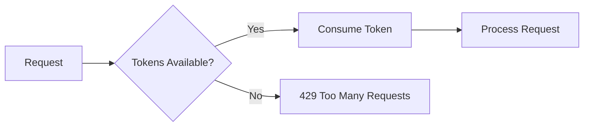

# Rate Limiting

Bifrost provides comprehensive rate limiting to control request rates and bandwidth usage. Rate limiting is configured on the server and applies to all proxy traffic.

## Configuration

Rate limiting is configured in the server config under the `rate_limit` section:

```yaml
rate_limit:
  enabled: true
  requests_per_second: 100    # Sustained rate limit
  burst_size: 200             # Maximum burst size
  per_ip: true                # Rate limit per IP address
  per_user: false             # Rate limit per authenticated user
  bandwidth:
    enabled: true
    upload: "10Mbps"          # Per-connection upload limit
    download: "100Mbps"       # Per-connection download limit
```

## Rate Limiting Options

### Global Settings

| Setting | Type | Default | Description |
|---------|------|---------|-------------|
| `enabled` | bool | `false` | Enable rate limiting |
| `requests_per_second` | float | 100 | Sustained request rate |
| `burst_size` | int | 200 | Maximum burst capacity |
| `per_ip` | bool | `true` | Track limits per client IP |
| `per_user` | bool | `false` | Track limits per authenticated user |

### Bandwidth Throttling

| Setting | Type | Default | Description |
|---------|------|---------|-------------|
| `bandwidth.enabled` | bool | `false` | Enable bandwidth throttling |
| `bandwidth.upload` | string | - | Upload speed limit (e.g., `10Mbps`) |
| `bandwidth.download` | string | - | Download speed limit (e.g., `100Mbps`) |

### Bandwidth Units

Supported units for bandwidth settings:
- `bps` - bits per second
- `Kbps` - kilobits per second
- `Mbps` - megabits per second
- `Gbps` - gigabits per second
- `Bps` - bytes per second
- `KBps` - kilobytes per second
- `MBps` - megabytes per second
- `GBps` - gigabytes per second

## How Rate Limiting Works

### Token Bucket Algorithm

Bifrost uses a token bucket algorithm for rate limiting:

1. Each bucket has a maximum capacity (`burst_size`)
2. Tokens are added at `requests_per_second` rate
3. Each request consumes one token
4. If no tokens are available, the request is rejected



### Per-IP vs Per-User Tracking

**Per-IP (`per_ip: true`):**
- Each unique client IP gets its own rate limit bucket
- Suitable for unauthenticated or mixed traffic
- May need higher limits for NAT'd clients

**Per-User (`per_user: true`):**
- Each authenticated user gets their own rate limit bucket
- Requires authentication to be enabled
- More accurate for multi-tenant environments

**Both enabled:**
- Requests are checked against both limits
- Request is rejected if either limit is exceeded

## Example Configurations

### Basic Rate Limiting

Simple rate limit for general use:

```yaml
rate_limit:
  enabled: true
  requests_per_second: 100
  burst_size: 150
  per_ip: true
```

### High-Traffic API Server

For servers handling many API requests:

```yaml
rate_limit:
  enabled: true
  requests_per_second: 1000
  burst_size: 2000
  per_ip: true
  per_user: true
```

### Bandwidth-Constrained Environment

For limited bandwidth environments:

```yaml
rate_limit:
  enabled: true
  requests_per_second: 50
  burst_size: 100
  per_ip: true
  bandwidth:
    enabled: true
    upload: "5Mbps"
    download: "25Mbps"
```

### LAN Caching Server

For a local game download cache:

```yaml
rate_limit:
  enabled: true
  requests_per_second: 500
  burst_size: 1000
  per_ip: true
  bandwidth:
    enabled: true
    upload: "100Mbps"
    download: "1Gbps"
```

### OpenWrt/Embedded Device

Conservative settings for low-power devices:

```yaml
rate_limit:
  enabled: true
  requests_per_second: 20
  burst_size: 50
  per_ip: true
  bandwidth:
    enabled: true
    upload: "10Mbps"
    download: "50Mbps"
```

## Hot Reload Support

Rate limiting configuration supports hot reload. Changes take effect without restarting the server:

```bash
# Modify rate_limit section in config
# Then reload:
curl -X POST \
     -H "Authorization: Bearer your-token" \
     -H "X-Requested-With: XMLHttpRequest" \
     http://localhost:7082/api/v1/config/reload
```

Or via the Web UI config editor.

## Monitoring Rate Limits

### Request Logs

Rate-limited requests appear in the request log:

```json
{
  "id": 12345,
  "timestamp": "2024-01-15T10:00:00Z",
  "method": "GET",
  "host": "api.example.com",
  "status_code": 429,
  "error": "rate limit exceeded",
  "client_ip": "192.168.1.100"
}
```

### Connection Statistics

Monitor rate limit impact via the stats API:

```bash
curl -H "Authorization: Bearer token" \
     http://localhost:7082/api/v1/stats
```

## Error Responses

When rate limit is exceeded, clients receive:

```http
HTTP/1.1 429 Too Many Requests
Content-Type: text/plain

Rate limit exceeded
```

## Best Practices

### Setting Appropriate Limits

1. **Start conservative** - Begin with lower limits and increase as needed
2. **Monitor actual traffic** - Use request logs to understand patterns
3. **Consider burst traffic** - Set `burst_size` higher than `requests_per_second` for spiky workloads
4. **Account for NAT** - Multiple users behind NAT share an IP; adjust per-IP limits accordingly

### Bandwidth Limits

1. **Match your infrastructure** - Don't set higher than your actual bandwidth
2. **Leave headroom** - Don't allocate 100% of bandwidth
3. **Consider client count** - Per-connection limits × max connections = total bandwidth

### Security Considerations

1. **Rate limiting helps prevent:**
   - Denial of service attacks
   - Brute force attempts
   - Resource exhaustion

2. **Rate limiting doesn't replace:**
   - Authentication
   - Input validation
   - Proper access control

## Troubleshooting

### Requests Being Rejected Unexpectedly

1. Check current rate limit settings:
   ```bash
   curl -H "Authorization: Bearer token" \
        http://localhost:7082/api/v1/config | jq '.rate_limit'
   ```

2. Review request logs for rate limit errors
3. Consider if multiple clients share an IP (NAT)
4. Increase `burst_size` for spiky traffic

### Slow Connections

1. Check bandwidth throttling settings
2. Verify bandwidth units (Mbps vs MBps)
3. Monitor active connections to see bandwidth distribution

### Rate Limits Not Applying

1. Verify `enabled: true` in config
2. Check if config was reloaded after changes
3. Confirm requests are going through the proxy (not bypassing)

## API Reference

### View Current Rate Limit Config

```bash
curl -H "Authorization: Bearer token" \
     http://localhost:7082/api/v1/config | jq '.rate_limit'
```

### Update Rate Limit Config

```bash
curl -X PUT \
     -H "Authorization: Bearer token" \
     -H "Content-Type: application/json" \
     -H "X-Requested-With: XMLHttpRequest" \
     -d '{
       "config": {
         "rate_limit": {
           "enabled": true,
           "requests_per_second": 200,
           "burst_size": 400
         }
       }
     }' \
     http://localhost:7082/api/v1/config
```

The response indicates if the change was applied via hot reload:

```json
{
  "success": true,
  "message": "Configuration saved",
  "requires_restart": false,
  "changed_sections": ["rate_limit"]
}
```
