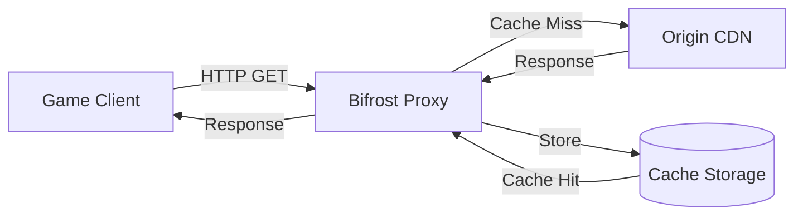

# HTTP Cache

Bifrost includes a built-in HTTP cache inspired by [steamcache/lancache](https://lancache.net/). It can cache HTTP responses for game downloads, software updates, and other large file transfers, significantly reducing bandwidth usage on repeated downloads.

## Overview

The cache system:

- Intercepts plain HTTP GET requests for configured domains
- Stores responses in memory and/or disk storage
- Serves cached content for subsequent requests
- Supports HTTP Range requests for resumable downloads
- Includes built-in presets for popular game CDNs



## Configuration

### Basic Setup

```yaml
cache:
  enabled: true
  default_ttl: "30d"
  max_file_size: "50GB"

  storage:
    type: memory  # memory, disk, or tiered
    memory:
      max_size: "2GB"
      max_entries: 50000
      evict_policy: lru

  presets:
    - steam
    - epic
```

### Storage Types

#### Memory Storage

Fast in-memory storage with LRU eviction:

```yaml
cache:
  storage:
    type: memory
    memory:
      max_size: "2GB"       # Maximum memory usage
      max_entries: 50000    # Maximum number of entries
      evict_policy: lru     # lru, lfu, or fifo
```

#### Disk Storage

File-based storage for large cache sizes:

```yaml
cache:
  storage:
    type: disk
    disk:
      path: "/var/cache/bifrost"
      max_size: "500GB"
      cleanup_interval: "1h"
```

#### Tiered Storage (Recommended)

Combines memory and disk storage. Small files go to memory for fast access, large files go to disk:

```yaml
cache:
  storage:
    type: tiered

    tiered:
      memory_threshold: "10MB"  # Files <= 10MB go to memory

    memory:
      max_size: "2GB"
      max_entries: 50000
      evict_policy: lru

    disk:
      path: "/var/cache/bifrost"
      max_size: "500GB"
      cleanup_interval: "1h"
```

### Configuration Options

| Field | Type | Default | Description |
|-------|------|---------|-------------|
| `cache.enabled` | bool | `false` | Enable/disable caching |
| `cache.default_ttl` | duration | `30d` | Default time-to-live for cached entries |
| `cache.max_file_size` | size | `50GB` | Maximum size of a single cached file |
| `cache.storage.type` | string | `tiered` | Storage type: memory, disk, or tiered |

## Built-in Presets

Bifrost includes pre-configured presets for popular game CDNs and software update services:

| Preset | Description | Domains |
|--------|-------------|---------|
| `steam` | Steam game downloads | `*.steamcontent.com`, `content*.steampowered.com` |
| `origin` | EA Origin/EA App | `origin-a.akamaihd.net`, `*.cdn.ea.com` |
| `epic` | Epic Games Store | `*.epicgames.com`, `epicgames-download1.akamaized.net` |
| `battlenet` | Blizzard Battle.net | `*.blizzard.com`, `*.battle.net` |
| `windows` | Windows Update | `*.windowsupdate.com`, `*.download.microsoft.com` |
| `playstation` | PlayStation Network | `*.playstation.net`, `*.dl.playstation.net` |
| `xbox` | Xbox Live | `*.xboxlive.com`, `assets*.xboxlive.com` |
| `nintendo` | Nintendo eShop | `*.nintendo.net`, `*.cdn.nintendo.net` |
| `ubisoft` | Ubisoft Connect | `*.ubi.com`, `*.ubisoft.com` |
| `riot` | League of Legends, Valorant | `*.riotgames.com`, `lol.dyn.riotcdn.net` |
| `apple` | macOS/iOS updates | `swcdn.apple.com`, `updates.cdn-apple.com` |
| `google` | Google Play, Android | `dl.google.com`, `*.gvt1.com` |
| `linux` | Linux package repos | `archive.ubuntu.com`, `*.debian.org` |

### Enabling Presets

```yaml
cache:
  enabled: true
  presets:
    - steam
    - origin
    - epic
    - battlenet
    - windows
```

## Custom Rules

Create custom caching rules for any domain:

```yaml
cache:
  rules:
    # Cache a custom CDN
    - name: my-cdn
      domains:
        - "cdn.example.com"
        - "*.mycdn.net"
      enabled: true
      ttl: "7d"
      priority: 50
      ignore_query: true
      content_types:
        - "application/octet-stream"
        - "application/zip"

    # General HTTP caching (respects Cache-Control)
    - name: general-http
      domains:
        - "*"
      enabled: false  # Disabled by default
      ttl: "1d"
      priority: 1
      respect_cache_control: true
```

### Rule Options

| Field | Type | Default | Description |
|-------|------|---------|-------------|
| `name` | string | required | Unique rule identifier |
| `domains` | []string | required | Domain patterns to match |
| `enabled` | bool | `true` | Enable/disable this rule |
| `ttl` | duration | `30d` | Time-to-live for cached entries |
| `priority` | int | `0` | Higher priority rules are evaluated first |
| `ignore_query` | bool | `false` | Ignore query string in cache key |
| `content_types` | []string | `[]` | Only cache specific content types (empty = all) |
| `respect_cache_control` | bool | `false` | Honor Cache-Control headers from origin |
| `methods` | []string | `["GET"]` | HTTP methods to cache |
| `max_size` | size | `0` | Maximum file size to cache (0 = unlimited) |

## Domain Patterns

Domain patterns support wildcards:

- `example.com` - Exact match
- `*.example.com` - Matches any subdomain
- `cdn*.example.com` - Matches cdn1.example.com, cdn-west.example.com, etc.
- `*` - Matches all domains

## API Endpoints

The cache provides management endpoints:

### Get Cache Stats

```bash
curl http://localhost:7082/api/v1/cache/stats
```

Response:
```json
{
  "enabled": true,
  "hit_rate": 0.85,
  "total_requests": 12450,
  "cache_hits": 10582,
  "cache_misses": 1868,
  "memory": {
    "entries": 4521,
    "size_bytes": 1073741824,
    "max_size_bytes": 2147483648
  },
  "disk": {
    "entries": 892,
    "size_bytes": 107374182400,
    "max_size_bytes": 536870912000
  }
}
```

### List Cached Entries

```bash
curl "http://localhost:7082/api/v1/cache/entries?domain=*.steamcontent.com&limit=10"
```

### Clear Cache

```bash
curl -X DELETE "http://localhost:7082/api/v1/cache/entries?confirm=true"
```

### Purge Domain

```bash
curl -X DELETE "http://localhost:7082/api/v1/cache/domain/steamcontent.com"
```

### List Rules

```bash
curl http://localhost:7082/api/v1/cache/rules
```

### List Available Presets

```bash
curl http://localhost:7082/api/v1/cache/presets
```

## Prometheus Metrics

The cache exports metrics:

| Metric | Type | Description |
|--------|------|-------------|
| `bifrost_cache_hits_total` | counter | Total cache hits by domain |
| `bifrost_cache_misses_total` | counter | Total cache misses by domain and reason |
| `bifrost_cache_bytes_served_total` | counter | Bytes served from cache vs origin |
| `bifrost_cache_storage_size_bytes` | gauge | Current storage size by tier |
| `bifrost_cache_storage_entries` | gauge | Current entry count by tier |
| `bifrost_cache_evictions_total` | counter | Evictions by tier and reason |
| `bifrost_cache_operation_duration_seconds` | histogram | Cache operation latency |

## Range Request Support

The cache fully supports HTTP Range requests for resumable downloads:

```bash
# Resume download from byte 1000
curl -H "Range: bytes=1000-" http://cdn.example.com/file.bin -x http://localhost:7080
```

The cache will serve partial content (206 Partial Content) from the cached file.

## Best Practices

### Network Setup

For optimal caching of game downloads:

1. **DNS Override**: Configure your router/DNS to redirect CDN domains to your Bifrost server
2. **Or Use as Proxy**: Configure game clients to use Bifrost as their HTTP proxy

### Storage Recommendations

| Use Case | Recommended Storage |
|----------|---------------------|
| Home/Small Office | Memory (2-8GB) + Disk (100-500GB) |
| LAN Party | Tiered with large disk (1-2TB) |
| Gaming Cafe | Tiered with SSD (fast) + HDD (capacity) |

### Performance Tuning

```yaml
cache:
  storage:
    type: tiered
    tiered:
      memory_threshold: "50MB"  # Increase for more memory caching
    memory:
      max_size: "8GB"           # More memory = more cache hits
      evict_policy: lru         # LRU is generally best
    disk:
      path: "/var/cache/bifrost"
      max_size: "1TB"
      cleanup_interval: "6h"    # Less frequent cleanup for stability
```

## Troubleshooting

### Cache Not Working

1. Verify cache is enabled: `curl http://localhost:7082/api/v1/cache/stats`
2. Check if domain matches a preset or rule
3. Verify traffic is HTTP (not HTTPS) - caching only works for plain HTTP
4. Check logs for cache hit/miss messages

### High Miss Rate

- Ensure the correct presets are enabled for your use case
- Check if CDN domains have changed (some CDNs rotate domains)
- Verify disk space is available

### Disk Space Issues

- Configure `max_size` to limit disk usage
- Reduce `cleanup_interval` for more frequent cleanup
- Consider using tiered storage with smaller disk allocation

## Example: LAN Party Setup

Complete configuration for caching game downloads at a LAN party:

```yaml
server:
  http:
    listen: ":7080"

cache:
  enabled: true
  default_ttl: "30d"

  storage:
    type: tiered
    tiered:
      memory_threshold: "100MB"
    memory:
      max_size: "8GB"
      max_entries: 100000
      evict_policy: lru
    disk:
      path: "/mnt/cache/bifrost"
      max_size: "2TB"
      cleanup_interval: "12h"

  presets:
    - steam
    - origin
    - epic
    - battlenet
    - riot

metrics:
  enabled: true
  listen: ":7090"

logging:
  level: info
  format: json
```
