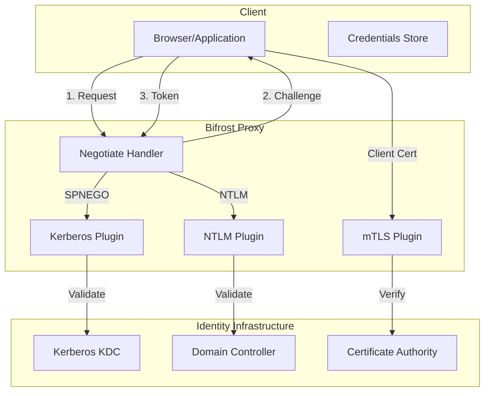
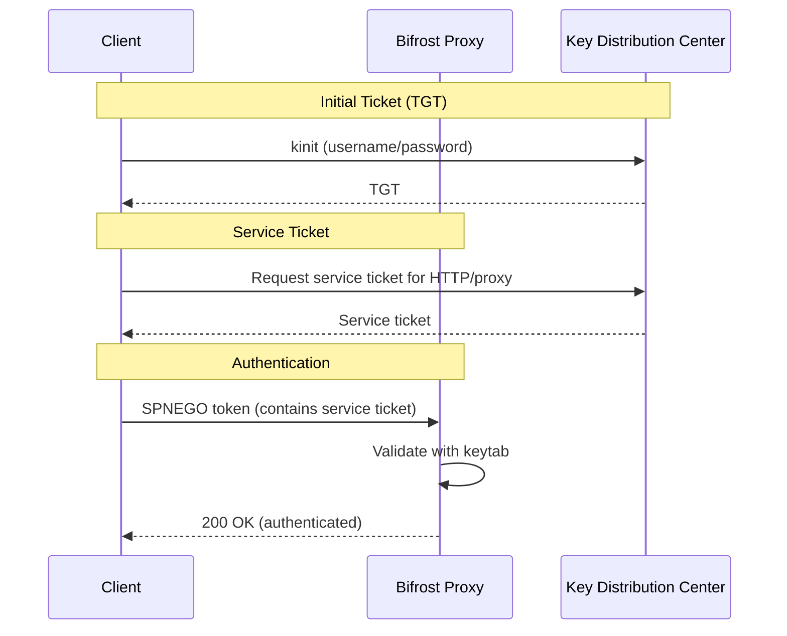
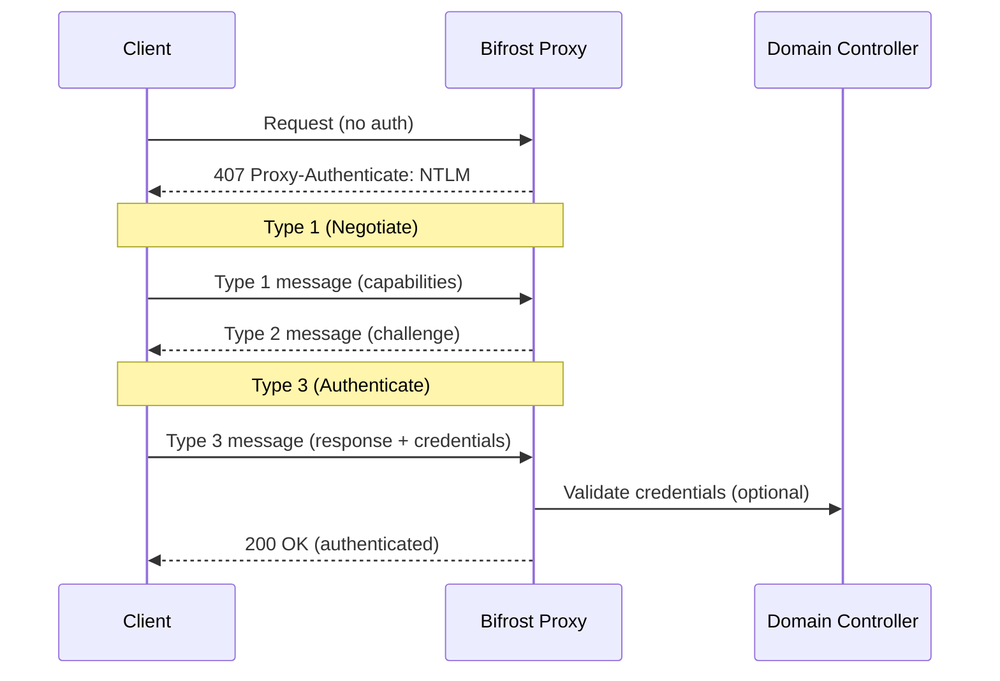
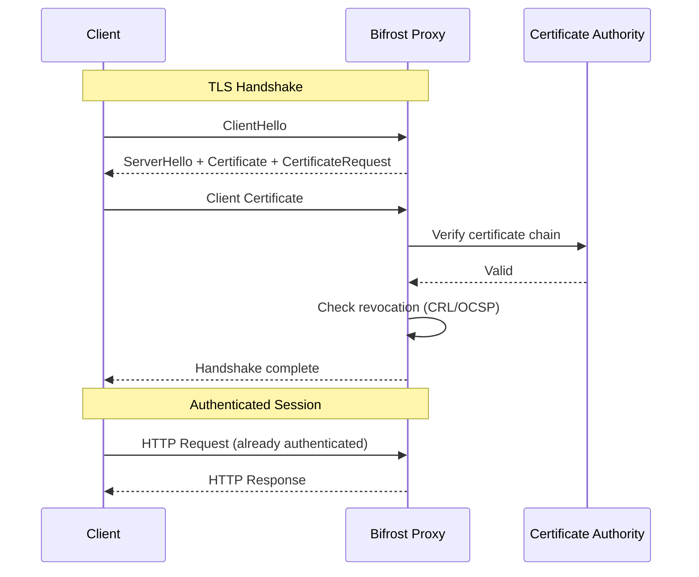
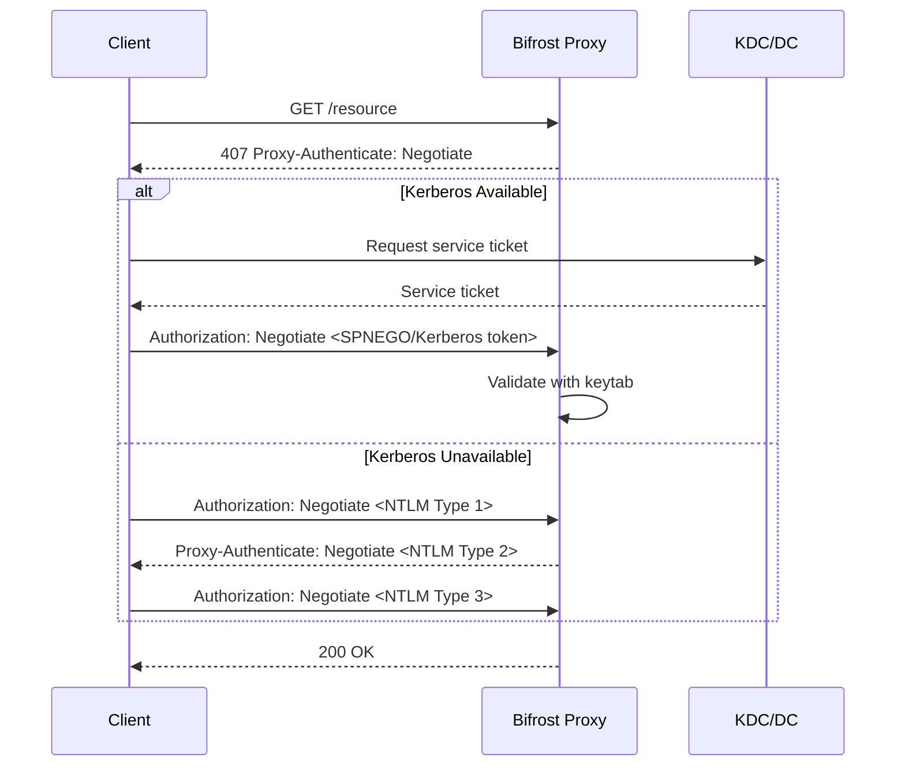

# Advanced Authentication Plugins

Bifrost Proxy supports advanced enterprise authentication methods for seamless integration with corporate identity systems. This guide covers Kerberos, NTLM, mTLS (mutual TLS), and SPNEGO authentication, including setup, configuration, and troubleshooting.

## Overview

Enterprise environments often require integration with existing identity infrastructure. Bifrost supports:

| Method | Use Case | Protocol |
|--------|----------|----------|
| **Kerberos** | Active Directory SSO, Unix realms | GSSAPI/SPNEGO |
| **NTLM** | Legacy Windows authentication | HTTP Negotiate |
| **mTLS** | Certificate-based authentication | TLS 1.2/1.3 |
| **SPNEGO** | HTTP Negotiate wrapper for Kerberos/NTLM | HTTP headers |



## Kerberos Authentication

Kerberos provides secure single sign-on (SSO) authentication using tickets issued by a Key Distribution Center (KDC). This is the preferred method for Active Directory and Unix realm environments.

### How Kerberos Works



### Prerequisites

1. **Kerberos realm** configured (Active Directory or MIT Kerberos)
2. **Service principal** created for the proxy (e.g., `HTTP/proxy.example.com@REALM`)
3. **Keytab file** exported containing the service principal's key
4. **krb5.conf** configuration file on the proxy server

### Server-Side Setup

#### 1. Create Service Principal (Active Directory)

```powershell
# On Domain Controller
# Create service account
New-ADUser -Name "BifrostProxy" -SamAccountName "bifrost-svc" `
    -UserPrincipalName "bifrost-svc@EXAMPLE.COM" `
    -PasswordNeverExpires $true -Enabled $true

# Register SPN
setspn -S HTTP/proxy.example.com bifrost-svc

# Export keytab
ktpass -princ HTTP/proxy.example.com@EXAMPLE.COM `
    -mapuser EXAMPLE\bifrost-svc `
    -pass "ServicePassword123!" `
    -out C:\bifrost.keytab `
    -crypto AES256-SHA1 `
    -ptype KRB5_NT_PRINCIPAL
```

#### 2. Create Service Principal (MIT Kerberos)

```bash
# On KDC server
sudo kadmin.local

# Create principal
addprinc -randkey HTTP/proxy.example.com@EXAMPLE.COM

# Export keytab
ktadd -k /etc/bifrost/server.keytab HTTP/proxy.example.com@EXAMPLE.COM

# Set permissions
sudo chown bifrost:bifrost /etc/bifrost/server.keytab
sudo chmod 600 /etc/bifrost/server.keytab
```

#### 3. Configure krb5.conf

Create or update `/etc/krb5.conf`:

```ini
[libdefaults]
    default_realm = EXAMPLE.COM
    dns_lookup_realm = false
    dns_lookup_kdc = true
    ticket_lifetime = 24h
    renew_lifetime = 7d
    forwardable = true

[realms]
    EXAMPLE.COM = {
        kdc = kdc1.example.com
        kdc = kdc2.example.com
        admin_server = kdc1.example.com
    }

[domain_realm]
    .example.com = EXAMPLE.COM
    example.com = EXAMPLE.COM
```

### Bifrost Configuration

```yaml
auth:
  mode: kerberos
  kerberos:
    # Keytab containing service principal key
    keytab_file: "/etc/bifrost/server.keytab"
    # Or provide base64-encoded keytab inline
    # keytab_base64: "BQIAAABTAAIADEVYQU1QTEUuQ09NAAR..."

    # Service principal name
    service_principal: "HTTP/proxy.example.com"

    # Kerberos realm
    realm: "EXAMPLE.COM"

    # Path to krb5.conf (optional, defaults to /etc/krb5.conf)
    krb5_config_file: "/etc/krb5.conf"

    # Or provide krb5.conf inline
    # krb5_config: |
    #   [libdefaults]
    #   default_realm = EXAMPLE.COM
    #   ...

    # Override KDC servers (optional)
    kdc_servers:
      - "kdc1.example.com:88"
      - "kdc2.example.com:88"

    # Username transformations
    strip_realm: true           # Remove @REALM from username
    username_to_lowercase: true # Convert username to lowercase
```

### Configuration Options

| Option | Type | Default | Description |
|--------|------|---------|-------------|
| `keytab_file` | string | - | Path to keytab file |
| `keytab_base64` | string | - | Base64-encoded keytab (alternative) |
| `service_principal` | string | **required** | SPN (e.g., HTTP/proxy.example.com) |
| `realm` | string | - | Kerberos realm (e.g., EXAMPLE.COM) |
| `krb5_config_file` | string | `/etc/krb5.conf` | Path to Kerberos config |
| `krb5_config` | string | - | Inline Kerberos config |
| `kdc_servers` | []string | - | Override KDC server addresses |
| `strip_realm` | bool | `true` | Remove realm from username |
| `username_to_lowercase` | bool | `true` | Lowercase the username |

### Client Configuration

#### Windows (Internet Explorer/Edge)

1. Add proxy to Intranet zone or Trusted sites
2. Enable "Automatic logon with current user name and password"

#### Firefox

1. Navigate to `about:config`
2. Set `network.negotiate-auth.trusted-uris` to `proxy.example.com`
3. Set `network.negotiate-auth.delegation-uris` to `proxy.example.com` (if delegation needed)

#### Chrome/Chromium

```bash
# Linux
google-chrome --auth-server-whitelist="*.example.com" \
              --auth-negotiate-delegate-whitelist="*.example.com"

# Or use policy
cat > /etc/opt/chrome/policies/managed/kerberos.json << 'EOF'
{
  "AuthServerWhitelist": "*.example.com",
  "AuthNegotiateDelegateWhitelist": "*.example.com"
}
EOF
```

#### curl

```bash
# Acquire ticket first
kinit user@EXAMPLE.COM

# Use with negotiate auth
curl --negotiate -u : http://proxy.example.com:7080/status
```

#### Python

```python
import requests
from requests_kerberos import HTTPKerberosAuth

proxies = {
    "http": "http://proxy.example.com:7080",
    "https": "http://proxy.example.com:7080",
}

response = requests.get(
    "http://example.com",
    proxies=proxies,
    auth=HTTPKerberosAuth()
)
```

### Integration Example: Active Directory SSO

Complete example for a corporate environment:

```yaml
# Server configuration for AD integration
server:
  http:
    listen: ":7080"
  socks5:
    listen: ":7180"

auth:
  mode: kerberos
  kerberos:
    keytab_file: "/etc/bifrost/proxy.keytab"
    service_principal: "HTTP/proxy.corp.example.com"
    realm: "CORP.EXAMPLE.COM"
    kdc_servers:
      - "dc1.corp.example.com:88"
      - "dc2.corp.example.com:88"
    strip_realm: true
    username_to_lowercase: true

# Route authenticated users through VPN
backends:
  - name: corporate-vpn
    type: wireguard
    enabled: true
    config:
      private_key: "${WG_PRIVATE_KEY}"
      address: "10.0.0.2/24"
      peer:
        public_key: "${WG_PEER_PUBLIC_KEY}"
        endpoint: "vpn.corp.example.com:51820"
        allowed_ips: ["10.0.0.0/8", "172.16.0.0/12"]

routes:
  - domains: ["*.corp.example.com", "*.internal"]
    backend: corporate-vpn
    priority: 100
  - domains: ["*"]
    backend: direct
    priority: 1

access_control:
  default: deny
  rules:
    - groups: ["Domain Users"]
      action: allow
```

### Troubleshooting Kerberos

#### Error: "Cannot find KDC for realm"

**Cause**: krb5.conf not configured or KDC unreachable.

**Solutions**:
1. Verify `/etc/krb5.conf` exists and has correct realm configuration
2. Test KDC connectivity: `telnet kdc.example.com 88`
3. Check DNS SRV records: `dig _kerberos._tcp.example.com SRV`

#### Error: "Keytab contains no suitable keys"

**Cause**: Service principal mismatch or keytab encryption type incompatible.

**Solutions**:
1. List keytab contents: `klist -k /etc/bifrost/server.keytab`
2. Verify SPN matches: principal in keytab must match `service_principal` in config
3. Regenerate keytab with compatible encryption (AES256-SHA1 recommended)

```bash
# Check keytab contents
klist -k -t /etc/bifrost/server.keytab

# Should show:
# HTTP/proxy.example.com@EXAMPLE.COM
```

#### Error: "Clock skew too great"

**Cause**: Time difference between client and KDC exceeds 5 minutes.

**Solutions**:
1. Sync time with NTP: `ntpdate -u pool.ntp.org`
2. Check time skew: `kinit -V user@REALM` shows server time
3. Enable NTP: `systemctl enable --now chronyd`

#### Error: "SPNEGO token validation requires HTTP handler integration"

**Cause**: Using Kerberos plugin without the Negotiate handler.

**Solution**: Use SPNEGO mode which wraps Kerberos for HTTP:

```yaml
auth:
  mode: negotiate
  negotiate:
    prefer_kerberos: true
    allow_ntlm: false
    kerberos:
      keytab_file: "/etc/bifrost/server.keytab"
      service_principal: "HTTP/proxy.example.com"
```

---

## NTLM Authentication

NTLM (NT LAN Manager) is a legacy Windows authentication protocol. While Kerberos is preferred, NTLM serves as a fallback when Kerberos is unavailable.

> **Security Note**: NTLM is considered legacy and has known security weaknesses. Use Kerberos when possible. NTLM should only be enabled for compatibility with older systems.

### How NTLM Works



### Configuration

```yaml
auth:
  mode: ntlm
  ntlm:
    # Default Windows domain
    domain: "EXAMPLE"

    # Allowed domains (optional - allows all if empty)
    allowed_domains:
      - "EXAMPLE"
      - "CORP"

    # Username transformations
    strip_domain: true           # Remove DOMAIN\ from username
    username_to_lowercase: true  # Convert username to lowercase

    # Challenge generation secret (auto-generated if not specified)
    # server_challenge_secret: "${NTLM_SECRET}"
```

### Configuration Options

| Option | Type | Default | Description |
|--------|------|---------|-------------|
| `domain` | string | - | Default Windows domain |
| `allowed_domains` | []string | - | Restrict to specific domains |
| `strip_domain` | bool | `true` | Remove DOMAIN\ prefix |
| `username_to_lowercase` | bool | `true` | Lowercase the username |
| `server_challenge_secret` | string | auto | Secret for challenge generation |

### Client Configuration

NTLM authentication typically works automatically with Windows clients when the proxy is in the Intranet zone.

#### Windows Automatic Authentication

The proxy URL must be in the Intranet zone:
1. Open Internet Options > Security > Local Intranet > Sites
2. Add `proxy.example.com`
3. Enable "Automatic logon only in Intranet zone"

#### curl with NTLM

```bash
# Using NTLM explicitly
curl --proxy-ntlm -U "DOMAIN\\user:password" \
    -x http://proxy.example.com:7080 \
    http://example.com

# Using Negotiate (tries Kerberos first, falls back to NTLM)
curl --negotiate -u : \
    -x http://proxy.example.com:7080 \
    http://example.com
```

#### Python with NTLM

```python
import requests
from requests_ntlm import HttpNtlmAuth

proxies = {
    "http": "http://proxy.example.com:7080",
}

response = requests.get(
    "http://example.com",
    proxies=proxies,
    auth=HttpNtlmAuth("DOMAIN\\user", "password")
)
```

### Integration Example: Mixed Kerberos/NTLM Environment

Support both Kerberos (preferred) and NTLM (fallback):

```yaml
auth:
  mode: negotiate
  negotiate:
    # Try Kerberos first
    prefer_kerberos: true
    # Fall back to NTLM if Kerberos fails
    allow_ntlm: true
    # Challenge timeout for NTLM handshake
    challenge_timeout: "5m"
    realm: "Bifrost Proxy"

    # Kerberos configuration
    kerberos:
      keytab_file: "/etc/bifrost/server.keytab"
      service_principal: "HTTP/proxy.example.com"
      realm: "EXAMPLE.COM"

    # NTLM configuration
    ntlm:
      domain: "EXAMPLE"
      allowed_domains:
        - "EXAMPLE"
```

### Troubleshooting NTLM

#### Error: "NTLM requires challenge-response authentication"

**Cause**: Direct username/password authentication attempted instead of NTLM handshake.

**Solution**: Use the Negotiate handler with NTLM support:

```yaml
auth:
  mode: negotiate
  negotiate:
    allow_ntlm: true
    ntlm:
      domain: "EXAMPLE"
```

#### Error: "No challenge found for session"

**Cause**: NTLM Type 3 message received without prior Type 1/Type 2 exchange.

**Solutions**:
1. Ensure client maintains connection during NTLM handshake
2. Check for HTTP keep-alive issues
3. Increase `challenge_timeout` if network is slow

#### Error: "Domain not allowed"

**Cause**: Client is authenticating from an unlisted domain.

**Solution**: Add the domain to `allowed_domains`:

```yaml
ntlm:
  allowed_domains:
    - "EXAMPLE"
    - "TRUSTEDPARTNER"
```

#### NTLM authentication loops (repeated 407s)

**Causes**:
1. Client not in Intranet zone
2. Credential cache issues
3. Proxy address mismatch

**Solutions**:
1. Add proxy to Intranet sites in Internet Options
2. Clear Windows credential cache: `rundll32.exe keymgr.dll KRKeymgr`
3. Verify proxy address matches client configuration exactly

---

## mTLS (Mutual TLS) Authentication

Mutual TLS authentication uses X.509 client certificates for strong, certificate-based authentication. This is ideal for machine-to-machine communication, smart card integration, and high-security environments.

### How mTLS Works



### Prerequisites

1. **Certificate Authority (CA)** to issue client certificates
2. **Client certificates** issued to users or services
3. **CA certificate** available to the proxy for verification
4. **TLS enabled** on the proxy listener

### Certificate Setup

#### 1. Create a Certificate Authority

```bash
# Generate CA private key
openssl genrsa -out ca.key 4096

# Generate CA certificate
openssl req -x509 -new -nodes -key ca.key \
    -sha256 -days 3650 \
    -subj "/C=US/ST=CA/O=Example Corp/CN=Bifrost CA" \
    -out ca.crt
```

#### 2. Generate Client Certificates

```bash
# Generate client private key
openssl genrsa -out client.key 2048

# Generate certificate signing request
openssl req -new -key client.key \
    -subj "/C=US/ST=CA/O=Example Corp/OU=Engineering/CN=alice/emailAddress=alice@example.com" \
    -out client.csr

# Sign with CA
openssl x509 -req -in client.csr \
    -CA ca.crt -CAkey ca.key -CAcreateserial \
    -days 365 -sha256 \
    -extfile <(echo "extendedKeyUsage = clientAuth") \
    -out client.crt

# Create PKCS#12 bundle for import into browsers/applications
openssl pkcs12 -export \
    -in client.crt -inkey client.key \
    -out client.p12 \
    -name "Alice - Bifrost Client Cert"
```

#### 3. Create Certificate Revocation List (Optional)

```bash
# Create empty CRL
openssl ca -gencrl -out crl.pem \
    -config /etc/ssl/openssl.cnf \
    -cert ca.crt -keyfile ca.key

# Revoke a certificate
openssl ca -revoke compromised.crt \
    -config /etc/ssl/openssl.cnf \
    -cert ca.crt -keyfile ca.key

# Regenerate CRL
openssl ca -gencrl -out crl.pem \
    -config /etc/ssl/openssl.cnf \
    -cert ca.crt -keyfile ca.key
```

### Bifrost Configuration

```yaml
server:
  http:
    listen: ":7443"
    tls:
      enabled: true
      cert_file: "/etc/bifrost/server.crt"
      key_file: "/etc/bifrost/server.key"
      # Request client certificate
      client_auth: require
      client_ca_file: "/etc/bifrost/ca.crt"

auth:
  mode: mtls
  mtls:
    # CA certificate for verifying client certs
    ca_cert_file: "/etc/bifrost/ca.crt"
    # Or provide CA cert inline
    # ca_cert_pem: |
    #   -----BEGIN CERTIFICATE-----
    #   ...
    #   -----END CERTIFICATE-----

    # Require a valid client certificate
    require_client_cert: true

    # Verify certificate time validity
    verify_time: true

    # Map certificate fields to user identity
    subject_mapping:
      username_field: "CN"       # Common Name
      groups_field: "OU"         # Organizational Unit
      email_field: "emailAddress"

    # Restrict allowed certificates (regex patterns)
    allowed_subjects:
      - "^CN=.*,OU=Engineering,.*$"
      - "^CN=.*,OU=Operations,.*$"

    allowed_issuers:
      - "^.*CN=Bifrost CA.*$"

    # Certificate revocation list
    crl_file: "/etc/bifrost/crl.pem"
```

### Configuration Options

| Option | Type | Default | Description |
|--------|------|---------|-------------|
| `ca_cert_file` | string | - | Path to CA certificate (PEM) |
| `ca_cert_pem` | string | - | Inline CA certificate |
| `require_client_cert` | bool | `true` | Require client certificate |
| `verify_time` | bool | `true` | Check certificate validity period |
| `subject_mapping.username_field` | string | `CN` | Field for username |
| `subject_mapping.groups_field` | string | `OU` | Field for groups |
| `subject_mapping.email_field` | string | `emailAddress` | Field for email |
| `allowed_subjects` | []string | - | Allowed subject DN patterns |
| `allowed_issuers` | []string | - | Allowed issuer DN patterns |
| `crl_file` | string | - | Path to CRL file |

### Subject Field Options

The following certificate fields can be used for identity mapping:

| Field | Certificate Attribute | Example |
|-------|----------------------|---------|
| `CN` | Common Name | `alice` |
| `O` | Organization | `Example Corp` |
| `OU` | Organizational Unit | `Engineering` |
| `C` | Country | `US` |
| `ST` | State/Province | `California` |
| `L` | Locality | `San Francisco` |
| `emailAddress` | Email (SAN or subject) | `alice@example.com` |
| `UID` | User ID | `alice123` |
| `SAN` | Subject Alt Name | First DNS or email |
| `serialNumber` | Serial Number | `1234567890` |

### Client Configuration

#### curl with Client Certificate

```bash
curl --cert client.crt --key client.key \
    --cacert ca.crt \
    -x https://proxy.example.com:7443 \
    https://example.com
```

#### Python with Client Certificate

```python
import requests

proxies = {
    "https": "https://proxy.example.com:7443",
}

response = requests.get(
    "https://example.com",
    proxies=proxies,
    cert=("client.crt", "client.key"),
    verify="ca.crt"
)
```

#### Browser Configuration

1. Import the PKCS#12 (.p12) file into your browser's certificate store
2. Configure the browser to use the proxy
3. When prompted, select the appropriate certificate

### Integration Example: Smart Card / PIV Authentication

Configure mTLS for PIV (Personal Identity Verification) smart cards:

```yaml
server:
  http:
    listen: ":7443"
    tls:
      enabled: true
      cert_file: "/etc/bifrost/server.crt"
      key_file: "/etc/bifrost/server.key"
      client_auth: require
      client_ca_file: "/etc/bifrost/dod-ca-bundle.crt"

auth:
  mode: mtls
  mtls:
    ca_cert_file: "/etc/bifrost/dod-ca-bundle.crt"
    require_client_cert: true
    verify_time: true

    subject_mapping:
      # PIV certificates typically use UID for identifier
      username_field: "UID"
      groups_field: "OU"
      email_field: "emailAddress"

    # Only allow PIV authentication certificates
    allowed_subjects:
      - ".*OU=People.*"
      - ".*OU=Contractors.*"

    # Require DoD CA chain
    allowed_issuers:
      - ".*CN=DoD Root CA.*"

    # Use DISA CRL
    crl_file: "/etc/bifrost/dod-crl.pem"

access_control:
  default: deny
  rules:
    - groups: ["People"]
      action: allow
      routes: ["*"]
    - groups: ["Contractors"]
      action: allow
      routes: ["*.contractor-apps.mil"]
```

### Troubleshooting mTLS

#### Error: "Certificate verification failed"

**Causes**:
1. Client certificate not signed by trusted CA
2. Certificate chain incomplete
3. CA certificate not loaded

**Solutions**:
1. Verify CA cert is correct: `openssl verify -CAfile ca.crt client.crt`
2. Check certificate chain: `openssl s_client -connect proxy:7443 -cert client.crt -key client.key`
3. Ensure full CA bundle is provided if using intermediate CAs

#### Error: "Certificate has been revoked"

**Cause**: Client certificate serial number is in the CRL.

**Solutions**:
1. Issue a new certificate to the client
2. If revocation was in error, regenerate CRL without the serial

#### Error: "Subject not allowed"

**Cause**: Certificate subject DN doesn't match any `allowed_subjects` pattern.

**Solutions**:
1. Check certificate subject: `openssl x509 -in client.crt -noout -subject`
2. Adjust regex pattern in `allowed_subjects`
3. Remove `allowed_subjects` to allow any valid certificate

#### Error: "Certificate is not valid yet" or "Certificate has expired"

**Cause**: Certificate `notBefore` or `notAfter` date check failed.

**Solutions**:
1. Check certificate dates: `openssl x509 -in client.crt -noout -dates`
2. Sync system time with NTP
3. Reissue certificate with correct validity period
4. Set `verify_time: false` (not recommended for production)

---

## SPNEGO Authentication

SPNEGO (Simple and Protected GSSAPI Negotiation Mechanism) is the HTTP layer that wraps Kerberos and NTLM authentication. It enables transparent authentication using the HTTP `Negotiate` header.

### How SPNEGO Works



### Configuration

SPNEGO is configured through the `negotiate` auth mode, which combines Kerberos and NTLM:

```yaml
auth:
  mode: negotiate
  negotiate:
    # Prefer Kerberos over NTLM
    prefer_kerberos: true

    # Allow NTLM fallback
    allow_ntlm: true

    # How long to wait for NTLM handshake completion
    challenge_timeout: "5m"

    # Realm shown in authentication prompts
    realm: "Bifrost Proxy"

    # Kerberos settings (used when prefer_kerberos is true)
    kerberos:
      keytab_file: "/etc/bifrost/server.keytab"
      service_principal: "HTTP/proxy.example.com"
      realm: "EXAMPLE.COM"

    # NTLM settings (used when allow_ntlm is true)
    ntlm:
      domain: "EXAMPLE"
      allowed_domains:
        - "EXAMPLE"
```

### Configuration Options

| Option | Type | Default | Description |
|--------|------|---------|-------------|
| `prefer_kerberos` | bool | `true` | Try Kerberos before NTLM |
| `allow_ntlm` | bool | `true` | Enable NTLM fallback |
| `challenge_timeout` | duration | `5m` | NTLM challenge state timeout |
| `realm` | string | `"Bifrost Proxy"` | Authentication realm for prompts |
| `kerberos` | object | - | Kerberos configuration (see above) |
| `ntlm` | object | - | NTLM configuration (see above) |

### Token Detection

The Negotiate handler automatically detects the authentication method from the token:

| Token Prefix | Method | Description |
|--------------|--------|-------------|
| `0x60` (ASN.1 APPLICATION) | Kerberos | SPNEGO-wrapped Kerberos token |
| `NTLMSSP\0` | NTLM | NTLM message |

### Integration Example: Full Enterprise Configuration

Complete SPNEGO configuration with Kerberos primary and NTLM fallback:

```yaml
server:
  http:
    listen: ":7080"
    read_timeout: "60s"
    write_timeout: "60s"

auth:
  mode: negotiate
  negotiate:
    prefer_kerberos: true
    allow_ntlm: true
    challenge_timeout: "5m"
    realm: "Corporate Proxy"

    kerberos:
      keytab_file: "/etc/bifrost/proxy.keytab"
      service_principal: "HTTP/proxy.corp.example.com"
      realm: "CORP.EXAMPLE.COM"
      kdc_servers:
        - "dc1.corp.example.com:88"
        - "dc2.corp.example.com:88"
      strip_realm: true
      username_to_lowercase: true

    ntlm:
      domain: "CORP"
      allowed_domains:
        - "CORP"
        - "SUBSIDIARY"
      strip_domain: true
      username_to_lowercase: true

backends:
  - name: direct
    type: direct
    enabled: true

  - name: corporate-vpn
    type: wireguard
    enabled: true
    config:
      private_key: "${WG_PRIVATE_KEY}"
      address: "10.100.0.2/24"
      peer:
        public_key: "${WG_PEER_PUBLIC_KEY}"
        endpoint: "vpn.corp.example.com:51820"
        allowed_ips: ["10.0.0.0/8"]

routes:
  - domains: ["*.corp.example.com", "*.internal.corp"]
    backend: corporate-vpn
    priority: 100
  - domains: ["*"]
    backend: direct
    priority: 1

access_control:
  default: deny
  rules:
    # Allow all authenticated users to internal resources
    - authenticated: true
      action: allow
      routes: ["*.internal.corp"]

    # Allow specific groups full access
    - groups: ["IT-Staff", "Network-Admins"]
      action: allow

    # Allow domain users limited access
    - groups: ["Domain Users"]
      action: allow
      routes: ["*.corp.example.com"]

logging:
  level: info
  format: json

access_log:
  enabled: true
  format: json
  output: "/var/log/bifrost/access.log"
  fields:
    - timestamp
    - username
    - auth_type
    - source_ip
    - method
    - host
    - path
    - status
    - duration
```

### Troubleshooting SPNEGO

#### Browser shows login prompt instead of SSO

**Causes**:
1. Site not in Intranet zone
2. Browser not configured for Negotiate auth
3. No Kerberos ticket available

**Solutions**:
1. Add proxy to trusted sites/Intranet zone
2. Configure browser for Negotiate (see Kerberos client configuration)
3. Run `klist` to verify ticket exists; run `kinit` if not

#### Error: "Kerberos authenticator not configured"

**Cause**: Using SPNEGO with Kerberos but no keytab configured.

**Solution**: Add complete Kerberos configuration:

```yaml
negotiate:
  kerberos:
    keytab_file: "/etc/bifrost/server.keytab"
    service_principal: "HTTP/proxy.example.com"
```

#### Error: "NTLM authenticator not configured"

**Cause**: NTLM fallback enabled but NTLM not configured.

**Solution**: Either disable NTLM or add configuration:

```yaml
negotiate:
  allow_ntlm: false  # Disable NTLM
  # OR configure NTLM:
  ntlm:
    domain: "EXAMPLE"
```

#### Authentication works for Kerberos but not NTLM

**Cause**: NTLM handshake state not persisted across connections.

**Solutions**:
1. Ensure HTTP keep-alive is enabled
2. Check `challenge_timeout` is sufficient
3. Verify load balancer session persistence if applicable

---

## Security Considerations

### Protocol Comparison

| Aspect | Kerberos | NTLM | mTLS |
|--------|----------|------|------|
| Password transmitted | No (ticket-based) | Hashed | N/A (certificate) |
| Replay protection | Yes (ticket timestamps) | Weak (challenge) | Yes (TLS) |
| Mutual auth | Yes | No | Yes |
| Delegation | Yes | No | No |
| Forward secrecy | Depends on config | No | Yes (with ephemeral keys) |

### Recommendations

1. **Use Kerberos when possible** - Most secure option for Windows environments
2. **Disable NTLM if not needed** - NTLM has known security weaknesses
3. **Use mTLS for service accounts** - Certificate-based auth is more secure than passwords
4. **Enable CRL/OCSP for mTLS** - Revocation checking is essential for certificate security
5. **Rotate keytabs regularly** - Kerberos keytabs should be rotated periodically
6. **Use strong certificate algorithms** - RSA 2048+ or ECDSA P-256+ for client certs
7. **Monitor authentication logs** - Watch for failed authentication attempts

### Hardening Checklist

- [ ] Disable NTLM if all clients support Kerberos
- [ ] Use AES encryption for Kerberos (disable DES/RC4)
- [ ] Set appropriate certificate validity periods (1-2 years for user certs)
- [ ] Implement certificate revocation (CRL or OCSP)
- [ ] Use TLS 1.3 for mTLS connections
- [ ] Enable audit logging for all authentication attempts
- [ ] Restrict allowed domains/principals/subjects
- [ ] Rotate service keytabs annually

---

## API Reference

### Authentication User Info

After successful authentication, user information is available via the API:

```go
type UserInfo struct {
    Username string            // Authenticated username
    Groups   []string          // User's group memberships
    Email    string            // User's email (if available)
    FullName string            // User's full name (if available)
    Metadata map[string]string // Additional auth-specific data
}
```

### Metadata Fields by Auth Type

| Auth Type | Metadata Fields |
|-----------|-----------------|
| Kerberos | `auth_type=kerberos`, `realm` |
| NTLM | `auth_type=ntlm`, `domain` |
| mTLS | `auth_type=mtls`, `cert_subject`, `cert_issuer`, `cert_serial` |

### HTTP Headers

The proxy sets headers with authentication information for upstream applications:

| Header | Description |
|--------|-------------|
| `X-Authenticated-User` | Username from authentication |
| `X-Auth-Method` | Authentication method used |
| `X-User-Groups` | Comma-separated list of groups |

```yaml
# Enable authentication headers
server:
  http:
    forward_auth_headers: true
```

---

## See Also

- [Authentication Guide](/authentication) - Basic authentication methods
- [Security Guide](/security) - Security best practices
- [Access Control](/access-control) - Authorization and access rules
- [Configuration Guide](/configuration) - Full configuration reference
