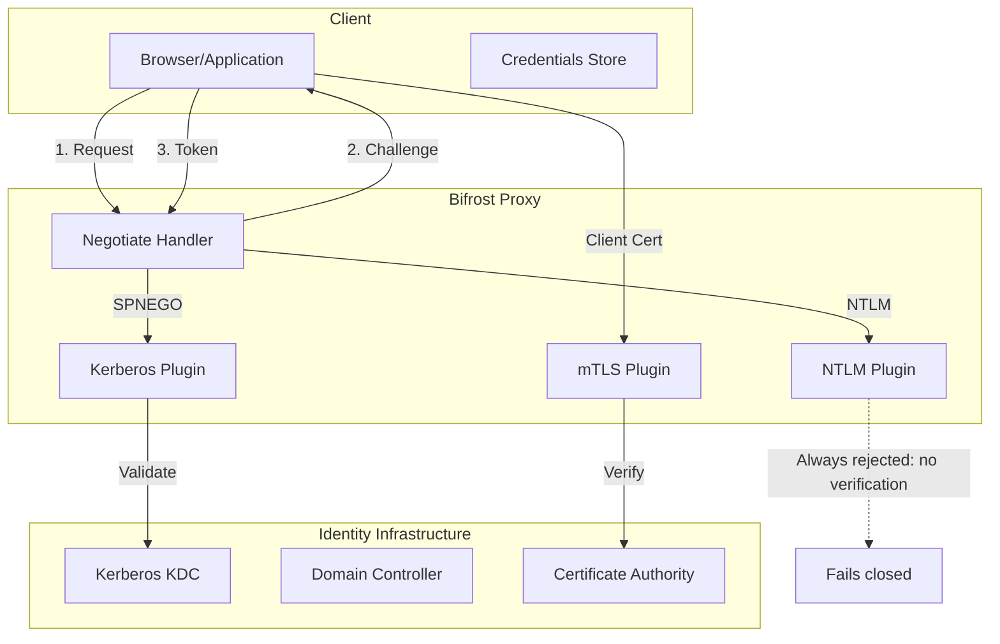
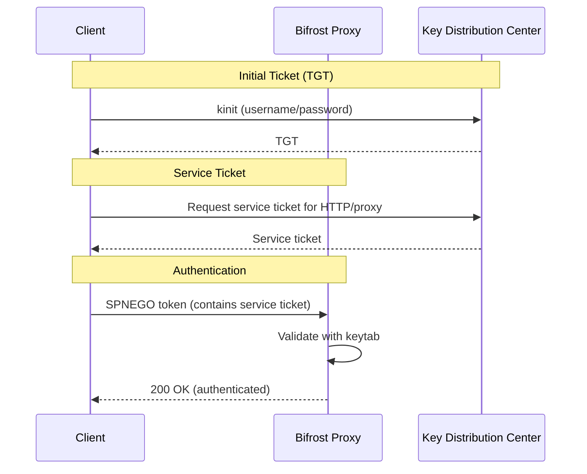
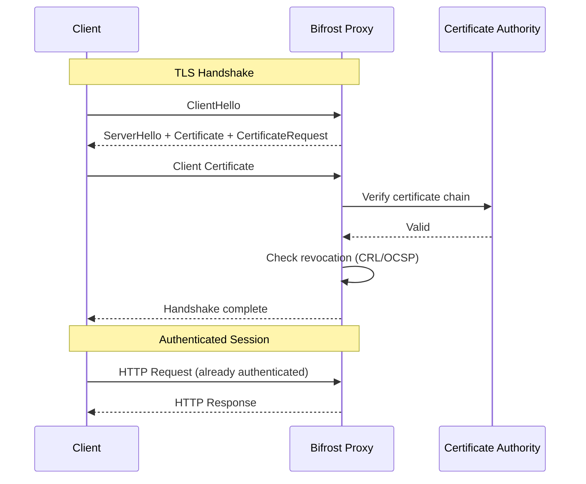
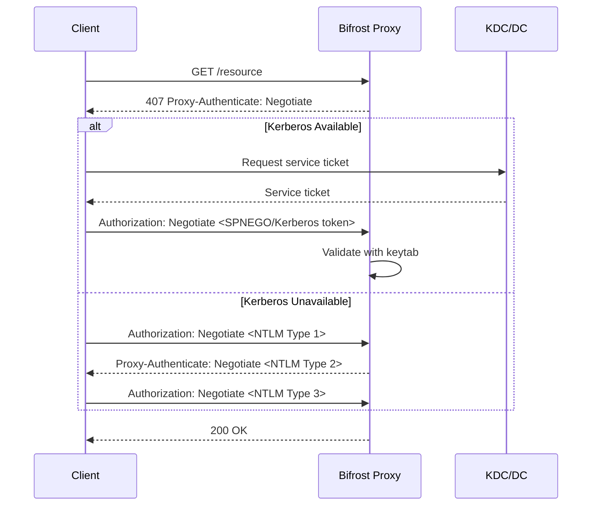

# Advanced Authentication Plugins

Bifrost Proxy supports advanced enterprise authentication methods for seamless integration with corporate identity systems. This guide covers Kerberos, NTLM, mTLS (mutual TLS), and SPNEGO authentication, including setup, configuration, and troubleshooting.

## Overview

Enterprise environments often require integration with existing identity infrastructure. Bifrost supports:

| Method | Use Case | Protocol |
|--------|----------|----------|
| **Kerberos** | Active Directory SSO, Unix realms | GSSAPI/SPNEGO |
| **NTLM** | _Not functional — fails closed (see below)_ | HTTP Negotiate |
| **mTLS** | Certificate-based authentication | TLS 1.2/1.3 |
| **SPNEGO** | HTTP Negotiate wrapper for Kerberos/NTLM | HTTP headers |


```mermaid
graph TB
    subgraph "Client"
        Browser[Browser/Application]
        Creds[Credentials Store]
    end

    subgraph "Bifrost Proxy"
        Negotiate[Negotiate Handler]
        KerbAuth[Kerberos Plugin]
        NTLMAuth[NTLM Plugin]
        MTLSAuth[mTLS Plugin]
    end

    subgraph "Identity Infrastructure"
        KDC[Kerberos KDC]
        DC[Domain Controller]
        CA[Certificate Authority]
    end

    Browser -->|1. Request| Negotiate
    Negotiate -->|2. Challenge| Browser
    Browser -->|3. Token| Negotiate

    Negotiate -->|SPNEGO| KerbAuth
    Negotiate -->|NTLM| NTLMAuth
    Browser -->|Client Cert| MTLSAuth

    KerbAuth -->|Validate| KDC
    NTLMAuth -.->|Always rejected: no verification| Reject[Fails closed]
    MTLSAuth -->|Verify| CA
```

> The NTLM path is shown for completeness only. Bifrost cannot verify NTLM
> responses, so the NTLM plugin rejects every login (it never contacts a Domain
> Controller). See the [NTLM section](#ntlm-authentication).

## Kerberos Authentication

Kerberos provides secure single sign-on (SSO) authentication using tickets issued by a Key Distribution Center (KDC). This is the preferred method for Active Directory and Unix realm environments.

### How Kerberos Works


```mermaid
sequenceDiagram
    participant Client
    participant Proxy as Bifrost Proxy
    participant KDC as Key Distribution Center

    Note over Client,KDC: Initial Ticket (TGT)
    Client->>KDC: kinit (username/password)
    KDC-->>Client: TGT

    Note over Client,Proxy: Service Ticket
    Client->>KDC: Request service ticket for HTTP/proxy
    KDC-->>Client: Service ticket

    Note over Client,Proxy: Authentication
    Client->>Proxy: SPNEGO token (contains service ticket)
    Proxy->>Proxy: Validate with keytab
    Proxy-->>Client: 200 OK (authenticated)
```

### Prerequisites

1. **Kerberos realm** configured (Active Directory or MIT Kerberos)
2. **Service principal** created for the proxy (e.g., `HTTP/proxy.example.com@REALM`)
3. **Keytab file** exported containing the service principal's key
4. **krb5.conf** configuration file on the proxy server

### Server-Side Setup

#### 1. Create Service Principal (Active Directory)

```powershell
# On Domain Controller
# Create service account
New-ADUser -Name "BifrostProxy" -SamAccountName "bifrost-svc" `
    -UserPrincipalName "bifrost-svc@EXAMPLE.COM" `
    -PasswordNeverExpires $true -Enabled $true

# Register SPN
setspn -S HTTP/proxy.example.com bifrost-svc

# Export keytab
ktpass -princ HTTP/proxy.example.com@EXAMPLE.COM `
    -mapuser EXAMPLE\bifrost-svc `
    -pass "ServicePassword123!" `
    -out C:\bifrost.keytab `
    -crypto AES256-SHA1 `
    -ptype KRB5_NT_PRINCIPAL
```

#### 2. Create Service Principal (MIT Kerberos)

```bash
# On KDC server
sudo kadmin.local

# Create principal
addprinc -randkey HTTP/proxy.example.com@EXAMPLE.COM

# Export keytab
ktadd -k /etc/bifrost/server.keytab HTTP/proxy.example.com@EXAMPLE.COM

# Set permissions
sudo chown bifrost:bifrost /etc/bifrost/server.keytab
sudo chmod 600 /etc/bifrost/server.keytab
```

#### 3. Configure krb5.conf

Create or update `/etc/krb5.conf`:

```ini
[libdefaults]
    default_realm = EXAMPLE.COM
    dns_lookup_realm = false
    dns_lookup_kdc = true
    ticket_lifetime = 24h
    renew_lifetime = 7d
    forwardable = true

[realms]
    EXAMPLE.COM = {
        kdc = kdc1.example.com
        kdc = kdc2.example.com
        admin_server = kdc1.example.com
    }

[domain_realm]
    .example.com = EXAMPLE.COM
    example.com = EXAMPLE.COM
```

### Bifrost Configuration

```yaml
auth:
  providers:
    - name: kerberos
      type: kerberos
      enabled: true
      priority: 1
      config:
        # Keytab containing service principal key
        keytab_file: "/etc/bifrost/server.keytab"
        # Or provide base64-encoded keytab inline
        # keytab_base64: "BQIAAABTAAIADEVYQU1QTEUuQ09NAAR..."

        # Service principal name
        service_principal: "HTTP/proxy.example.com"

        # Kerberos realm
        realm: "EXAMPLE.COM"

        # Path to krb5.conf (optional, defaults to /etc/krb5.conf)
        krb5_config_file: "/etc/krb5.conf"

        # Or provide krb5.conf inline
        # krb5_config: |
        #   [libdefaults]
        #   default_realm = EXAMPLE.COM
        #   ...

        # Override KDC servers (optional)
        kdc_servers:
          - "kdc1.example.com:88"
          - "kdc2.example.com:88"

        # Username transformations
        strip_realm: true           # Remove @REALM from username
        username_to_lowercase: true # Convert username to lowercase
```

> **HTTP SSO requires the Negotiate middleware.** A bare `kerberos` provider
> validates username/password credentials. For transparent browser SSO over the
> HTTP proxy (SPNEGO/`Negotiate` handshake), also enable `auth.negotiate` and
> point `kerberos_provider` at this provider — see [SPNEGO Authentication](#spnego-authentication)
> below.

### Configuration Options

| Option | Type | Default | Description |
|--------|------|---------|-------------|
| `keytab_file` | string | - | Path to keytab file |
| `keytab_base64` | string | - | Base64-encoded keytab (alternative) |
| `service_principal` | string | **required** | SPN (e.g., HTTP/proxy.example.com) |
| `realm` | string | - | Kerberos realm (e.g., EXAMPLE.COM) |
| `krb5_config_file` | string | `/etc/krb5.conf` | Path to Kerberos config |
| `krb5_config` | string | - | Inline Kerberos config |
| `kdc_servers` | []string | - | Override KDC server addresses |
| `strip_realm` | bool | `true` | Remove realm from username |
| `username_to_lowercase` | bool | `true` | Lowercase the username |

### Client Configuration

#### Windows (Internet Explorer/Edge)

1. Add proxy to Intranet zone or Trusted sites
2. Enable "Automatic logon with current user name and password"

#### Firefox

1. Navigate to `about:config`
2. Set `network.negotiate-auth.trusted-uris` to `proxy.example.com`
3. Set `network.negotiate-auth.delegation-uris` to `proxy.example.com` (if delegation needed)

#### Chrome/Chromium

```bash
# Linux
google-chrome --auth-server-whitelist="*.example.com" \
              --auth-negotiate-delegate-whitelist="*.example.com"

# Or use policy
cat > /etc/opt/chrome/policies/managed/kerberos.json << 'EOF'
{
  "AuthServerWhitelist": "*.example.com",
  "AuthNegotiateDelegateWhitelist": "*.example.com"
}
EOF
```

#### curl

```bash
# Acquire ticket first
kinit user@EXAMPLE.COM

# Use with negotiate auth
curl --negotiate -u : http://proxy.example.com:7080/status
```

#### Python

```python
import requests
from requests_kerberos import HTTPKerberosAuth

proxies = {
    "http": "http://proxy.example.com:7080",
    "https": "http://proxy.example.com:7080",
}

response = requests.get(
    "http://example.com",
    proxies=proxies,
    auth=HTTPKerberosAuth()
)
```

### Integration Example: Active Directory SSO

Complete example for a corporate environment:

```yaml
# Server configuration for AD integration
server:
  http:
    listen: ":7080"
  socks5:
    listen: ":7180"

auth:
  providers:
    - name: kerberos
      type: kerberos
      enabled: true
      priority: 1
      config:
        keytab_file: "/etc/bifrost/proxy.keytab"
        service_principal: "HTTP/proxy.corp.example.com"
        realm: "CORP.EXAMPLE.COM"
        kdc_servers:
          - "dc1.corp.example.com:88"
          - "dc2.corp.example.com:88"
        strip_realm: true
        username_to_lowercase: true
  # Enable transparent browser SSO (SPNEGO) over the HTTP proxy.
  negotiate:
    enabled: true
    kerberos_provider: kerberos
    prefer_kerberos: true
    allow_ntlm: false

# Route authenticated users through VPN
backends:
  - name: corporate-vpn
    type: wireguard
    enabled: true
    config:
      private_key: "${WG_PRIVATE_KEY}"
      address: "10.0.0.2/24"
      peer:
        public_key: "${WG_PEER_PUBLIC_KEY}"
        endpoint: "vpn.corp.example.com:51820"
        allowed_ips: ["10.0.0.0/8", "172.16.0.0/12"]

routes:
  - domains: ["*.corp.example.com", "*.internal"]
    backend: corporate-vpn
    priority: 100
  - domains: ["*"]
    backend: direct
    priority: 1

# IP-based access control (whitelist/blacklist of CIDRs).
# Note: Bifrost does not support group- or route-scoped authorization
# rules. Authentication is allow-or-deny per request; access_control
# only filters by source IP.
access_control:
  whitelist:
    - "10.0.0.0/8"
```

### Troubleshooting Kerberos

#### Error: "Cannot find KDC for realm"

**Cause**: krb5.conf not configured or KDC unreachable.

**Solutions**:
1. Verify `/etc/krb5.conf` exists and has correct realm configuration
2. Test KDC connectivity: `telnet kdc.example.com 88`
3. Check DNS SRV records: `dig _kerberos._tcp.example.com SRV`

#### Error: "Keytab contains no suitable keys"

**Cause**: Service principal mismatch or keytab encryption type incompatible.

**Solutions**:
1. List keytab contents: `klist -k /etc/bifrost/server.keytab`
2. Verify SPN matches: principal in keytab must match `service_principal` in config
3. Regenerate keytab with compatible encryption (AES256-SHA1 recommended)

```bash
# Check keytab contents
klist -k -t /etc/bifrost/server.keytab

# Should show:
# HTTP/proxy.example.com@EXAMPLE.COM
```

#### Error: "Clock skew too great"

**Cause**: Time difference between client and KDC exceeds 5 minutes.

**Solutions**:
1. Sync time with NTP: `ntpdate -u pool.ntp.org`
2. Check time skew: `kinit -V user@REALM` shows server time
3. Enable NTP: `systemctl enable --now chronyd`

#### Error: "SPNEGO token validation requires HTTP handler integration"

**Cause**: Using Kerberos plugin without the Negotiate handler.

**Solution**: Enable the Negotiate middleware, which wraps a `kerberos`
provider for HTTP SPNEGO:

```yaml
auth:
  providers:
    - name: kerberos
      type: kerberos
      enabled: true
      priority: 1
      config:
        keytab_file: "/etc/bifrost/server.keytab"
        service_principal: "HTTP/proxy.example.com"
  negotiate:
    enabled: true
    kerberos_provider: kerberos
    prefer_kerberos: true
    allow_ntlm: false
```

---

## NTLM Authentication

> **Not functional — unsupported, fails closed by design.**
>
> NTLM (NT LAN Manager) is a legacy Windows authentication protocol. Bifrost
> ships an NTLM message parser but **cannot verify NTLM responses**: it has no
> credential source (NT-hash/password store or domain-controller pass-through)
> against which to recompute and constant-time-compare the client's Type 3
> response. Accepting an unverified, attacker-supplied Type 3 message would be
> an authentication bypass, so the plugin **rejects every login** with an
> "NTLM response verification is not supported" error.
>
> There is **no working NTLM configuration**. The previously documented keys
> (`server_challenge_secret`, `use_domain_controller`, `domain_controller`, and
> the `negotiate` mode with `allow_ntlm`) either never existed or do not enable a
> working flow. Do not rely on NTLM for access.
>
> **Use Kerberos, `native`, `ldap`, or `oauth` instead.** Kerberos is the
> recommended replacement for Windows domain SSO.

---

## mTLS (Mutual TLS) Authentication

Mutual TLS authentication uses X.509 client certificates for strong, certificate-based authentication. This is ideal for machine-to-machine communication, smart card integration, and high-security environments.

### How mTLS Works


```mermaid
sequenceDiagram
    participant Client
    participant Proxy as Bifrost Proxy
    participant CA as Certificate Authority

    Note over Client,Proxy: TLS Handshake
    Client->>Proxy: ClientHello
    Proxy-->>Client: ServerHello + Certificate + CertificateRequest
    Client->>Proxy: Client Certificate
    Proxy->>CA: Verify certificate chain
    CA-->>Proxy: Valid
    Proxy->>Proxy: Check revocation (CRL/OCSP)
    Proxy-->>Client: Handshake complete

    Note over Client,Proxy: Authenticated Session
    Client->>Proxy: HTTP Request (already authenticated)
    Proxy-->>Client: HTTP Response
```

### Prerequisites

1. **Certificate Authority (CA)** to issue client certificates
2. **Client certificates** issued to users or services
3. **CA certificate** available to the proxy for verification
4. **TLS enabled** on the proxy listener

### Certificate Setup

#### 1. Create a Certificate Authority

```bash
# Generate CA private key
openssl genrsa -out ca.key 4096

# Generate CA certificate
openssl req -x509 -new -nodes -key ca.key \
    -sha256 -days 3650 \
    -subj "/C=US/ST=CA/O=Example Corp/CN=Bifrost CA" \
    -out ca.crt
```

#### 2. Generate Client Certificates

```bash
# Generate client private key
openssl genrsa -out client.key 2048

# Generate certificate signing request
openssl req -new -key client.key \
    -subj "/C=US/ST=CA/O=Example Corp/OU=Engineering/CN=alice/emailAddress=alice@example.com" \
    -out client.csr

# Sign with CA
openssl x509 -req -in client.csr \
    -CA ca.crt -CAkey ca.key -CAcreateserial \
    -days 365 -sha256 \
    -extfile <(echo "extendedKeyUsage = clientAuth") \
    -out client.crt

# Create PKCS#12 bundle for import into browsers/applications
openssl pkcs12 -export \
    -in client.crt -inkey client.key \
    -out client.p12 \
    -name "Alice - Bifrost Client Cert"
```

#### 3. Create Certificate Revocation List (Optional)

```bash
# Create empty CRL
openssl ca -gencrl -out crl.pem \
    -config /etc/ssl/openssl.cnf \
    -cert ca.crt -keyfile ca.key

# Revoke a certificate
openssl ca -revoke compromised.crt \
    -config /etc/ssl/openssl.cnf \
    -cert ca.crt -keyfile ca.key

# Regenerate CRL
openssl ca -gencrl -out crl.pem \
    -config /etc/ssl/openssl.cnf \
    -cert ca.crt -keyfile ca.key
```

### Bifrost Configuration

```yaml
server:
  http:
    listen: ":7443"
    tls:
      enabled: true
      cert_file: "/etc/bifrost/server.crt"
      key_file: "/etc/bifrost/server.key"
      # Request client certificate
      client_auth: require
      client_ca_file: "/etc/bifrost/ca.crt"

auth:
  providers:
    - name: mtls
      type: mtls
      enabled: true
      priority: 1
      config:
        # CA certificate for verifying client certs
        ca_cert_file: "/etc/bifrost/ca.crt"
        # Or provide CA cert inline
        # ca_cert_pem: |
        #   -----BEGIN CERTIFICATE-----
        #   ...
        #   -----END CERTIFICATE-----

        # Require a valid client certificate
        require_client_cert: true

        # Verify certificate time validity
        verify_time: true

        # Map certificate fields to user identity
        subject_mapping:
          username_field: "CN"       # Common Name
          groups_field: "OU"         # Organizational Unit
          email_field: "emailAddress"

        # Restrict allowed certificates (regex patterns)
        allowed_subjects:
          - "^CN=.*,OU=Engineering,.*$"
          - "^CN=.*,OU=Operations,.*$"

        allowed_issuers:
          - "^.*CN=Bifrost CA.*$"

        # Certificate revocation list
        crl_file: "/etc/bifrost/crl.pem"
```

### Configuration Options

| Option | Type | Default | Description |
|--------|------|---------|-------------|
| `ca_cert_file` | string | - | Path to CA certificate (PEM) |
| `ca_cert_pem` | string | - | Inline CA certificate |
| `require_client_cert` | bool | `true` | Require client certificate |
| `verify_time` | bool | `true` | Check certificate validity period |
| `subject_mapping.username_field` | string | `CN` | Field for username |
| `subject_mapping.groups_field` | string | `OU` | Field for groups |
| `subject_mapping.email_field` | string | `emailAddress` | Field for email |
| `allowed_subjects` | []string | - | Allowed subject DN patterns |
| `allowed_issuers` | []string | - | Allowed issuer DN patterns |
| `crl_file` | string | - | Path to CRL file |

### Subject Field Options

The following certificate fields can be used for identity mapping:

| Field | Certificate Attribute | Example |
|-------|----------------------|---------|
| `CN` | Common Name | `alice` |
| `O` | Organization | `Example Corp` |
| `OU` | Organizational Unit | `Engineering` |
| `C` | Country | `US` |
| `ST` | State/Province | `California` |
| `L` | Locality | `San Francisco` |
| `emailAddress` | Email (SAN or subject) | `alice@example.com` |
| `UID` | User ID | `alice123` |
| `SAN` | Subject Alt Name | First DNS or email |
| `serialNumber` | Serial Number | `1234567890` |

### Client Configuration

#### curl with Client Certificate

```bash
curl --cert client.crt --key client.key \
    --cacert ca.crt \
    -x https://proxy.example.com:7443 \
    https://example.com
```

#### Python with Client Certificate

```python
import requests

proxies = {
    "https": "https://proxy.example.com:7443",
}

response = requests.get(
    "https://example.com",
    proxies=proxies,
    cert=("client.crt", "client.key"),
    verify="ca.crt"
)
```

#### Browser Configuration

1. Import the PKCS#12 (.p12) file into your browser's certificate store
2. Configure the browser to use the proxy
3. When prompted, select the appropriate certificate

### Integration Example: Smart Card / PIV Authentication

Configure mTLS for PIV (Personal Identity Verification) smart cards:

```yaml
server:
  http:
    listen: ":7443"
    tls:
      enabled: true
      cert_file: "/etc/bifrost/server.crt"
      key_file: "/etc/bifrost/server.key"
      client_auth: require
      client_ca_file: "/etc/bifrost/dod-ca-bundle.crt"

auth:
  providers:
    - name: mtls
      type: mtls
      enabled: true
      priority: 1
      config:
        ca_cert_file: "/etc/bifrost/dod-ca-bundle.crt"
        require_client_cert: true
        verify_time: true

        subject_mapping:
          # PIV certificates typically use UID for identifier
          username_field: "UID"
          groups_field: "OU"
          email_field: "emailAddress"

        # Only allow PIV authentication certificates
        allowed_subjects:
          - ".*OU=People.*"
          - ".*OU=Contractors.*"

        # Require DoD CA chain
        allowed_issuers:
          - ".*CN=DoD Root CA.*"

        # Use DISA CRL
        crl_file: "/etc/bifrost/dod-crl.pem"

# IP-based access control (whitelist/blacklist of CIDRs).
# Note: Bifrost does not support group- or route-scoped authorization
# rules. Authentication is allow-or-deny per request; access_control
# only filters by source IP.
access_control:
  whitelist:
    - "10.0.0.0/8"
    - "172.16.0.0/12"
```

### Troubleshooting mTLS

#### Error: "Certificate verification failed"

**Causes**:
1. Client certificate not signed by trusted CA
2. Certificate chain incomplete
3. CA certificate not loaded

**Solutions**:
1. Verify CA cert is correct: `openssl verify -CAfile ca.crt client.crt`
2. Check certificate chain: `openssl s_client -connect proxy:7443 -cert client.crt -key client.key`
3. Ensure full CA bundle is provided if using intermediate CAs

#### Error: "Certificate has been revoked"

**Cause**: Client certificate serial number is in the CRL.

**Solutions**:
1. Issue a new certificate to the client
2. If revocation was in error, regenerate CRL without the serial

#### Error: "Subject not allowed"

**Cause**: Certificate subject DN doesn't match any `allowed_subjects` pattern.

**Solutions**:
1. Check certificate subject: `openssl x509 -in client.crt -noout -subject`
2. Adjust regex pattern in `allowed_subjects`
3. Remove `allowed_subjects` to allow any valid certificate

#### Error: "Certificate is not valid yet" or "Certificate has expired"

**Cause**: Certificate `notBefore` or `notAfter` date check failed.

**Solutions**:
1. Check certificate dates: `openssl x509 -in client.crt -noout -dates`
2. Sync system time with NTP
3. Reissue certificate with correct validity period
4. Set `verify_time: false` (not recommended for production)

---

## SPNEGO Authentication

SPNEGO (Simple and Protected GSSAPI Negotiation Mechanism) is the HTTP layer that wraps Kerberos and NTLM authentication. It enables transparent authentication using the HTTP `Negotiate` header.

### How SPNEGO Works


```mermaid
sequenceDiagram
    participant Client
    participant Proxy as Bifrost Proxy
    participant KDC as KDC/DC

    Client->>Proxy: GET /resource
    Proxy-->>Client: 407 Proxy-Authenticate: Negotiate

    alt Kerberos Available
        Client->>KDC: Request service ticket
        KDC-->>Client: Service ticket
        Client->>Proxy: Authorization: Negotiate <SPNEGO/Kerberos token>
        Proxy->>Proxy: Validate with keytab
    else Kerberos Unavailable
        Client->>Proxy: Authorization: Negotiate <NTLM Type 1>
        Proxy-->>Client: Proxy-Authenticate: Negotiate <NTLM Type 2>
        Client->>Proxy: Authorization: Negotiate <NTLM Type 3>
    end

    Proxy-->>Client: 200 OK
```

### Configuration

SPNEGO is enabled through the `auth.negotiate` middleware block. Unlike the
plugin providers, `negotiate` is HTTP middleware that drives the multi-step
`Negotiate` challenge/response handshake. It does **not** embed credential
config directly — instead it references auth providers by name via
`kerberos_provider` (and, optionally, `ntlm_provider`) that must be declared in
`auth.providers[]`:

```yaml
auth:
  providers:
    - name: kerberos
      type: kerberos
      enabled: true
      priority: 1
      config:
        keytab_file: "/etc/bifrost/server.keytab"
        service_principal: "HTTP/proxy.example.com"
        realm: "EXAMPLE.COM"

  negotiate:
    # Turn on the Negotiate handshake on the HTTP proxy listener
    enabled: true

    # Provider (type: kerberos) that validates SPNEGO tokens
    kerberos_provider: kerberos

    # Prefer Kerberos over NTLM
    prefer_kerberos: true

    # NTLM fallback is non-functional (see the NTLM section) — leave disabled
    allow_ntlm: false

    # Realm shown in authentication prompts
    realm: "Bifrost Proxy"
```

### Configuration Options

The following keys live under `auth.negotiate`:

| Option | Type | Default | Description |
|--------|------|---------|-------------|
| `enabled` | bool | `false` | Enable the Negotiate handshake on the HTTP proxy listener |
| `kerberos_provider` | string | - | Name of a `type: kerberos` provider that validates SPNEGO tokens |
| `ntlm_provider` | string | - | Name of a `type: ntlm` provider (NTLM is non-functional; see below) |
| `prefer_kerberos` | bool | `false` | Try Kerberos before NTLM |
| `allow_ntlm` | bool | `false` | Enable NTLM fallback (requires `ntlm_provider`; NTLM always fails closed) |
| `realm` | string | - | Authentication realm advertised in the challenge |

> **NTLM does not work.** `allow_ntlm: true` requires an `ntlm_provider`, and the
> NTLM plugin rejects every login (see the [NTLM section](#ntlm-authentication)).
> Keep `allow_ntlm: false` and use Kerberos for Windows domain SSO.

### Token Detection

The Negotiate handler automatically detects the authentication method from the token:

| Token Prefix | Method | Description |
|--------------|--------|-------------|
| `0x60` (ASN.1 APPLICATION) | Kerberos | SPNEGO-wrapped Kerberos token |
| `NTLMSSP\0` | NTLM | NTLM message |

### Integration Example: Full Enterprise Configuration

Complete SPNEGO configuration with Kerberos primary and NTLM fallback:

```yaml
server:
  http:
    listen: ":7080"
    read_timeout: "60s"
    write_timeout: "60s"

auth:
  providers:
    - name: kerberos
      type: kerberos
      enabled: true
      priority: 1
      config:
        keytab_file: "/etc/bifrost/proxy.keytab"
        service_principal: "HTTP/proxy.corp.example.com"
        realm: "CORP.EXAMPLE.COM"
        kdc_servers:
          - "dc1.corp.example.com:88"
          - "dc2.corp.example.com:88"
        strip_realm: true
        username_to_lowercase: true

  negotiate:
    enabled: true
    kerberos_provider: kerberos
    prefer_kerberos: true
    # NTLM is non-functional; keep it disabled and rely on Kerberos.
    allow_ntlm: false
    realm: "Corporate Proxy"

backends:
  - name: direct
    type: direct
    enabled: true

  - name: corporate-vpn
    type: wireguard
    enabled: true
    config:
      private_key: "${WG_PRIVATE_KEY}"
      address: "10.100.0.2/24"
      peer:
        public_key: "${WG_PEER_PUBLIC_KEY}"
        endpoint: "vpn.corp.example.com:51820"
        allowed_ips: ["10.0.0.0/8"]

routes:
  - domains: ["*.corp.example.com", "*.internal.corp"]
    backend: corporate-vpn
    priority: 100
  - domains: ["*"]
    backend: direct
    priority: 1

# IP-based access control (whitelist/blacklist of CIDRs).
# Note: Bifrost does not support group-, user-, or route-scoped
# authorization rules. Authentication is allow-or-deny per request;
# access_control only filters by source IP.
access_control:
  whitelist:
    - "10.0.0.0/8"
    - "192.168.0.0/16"
  blacklist:
    - "10.6.6.0/24"

logging:
  level: info
  format: json

access_log:
  enabled: true
  format: json
  output: "/var/log/bifrost/access.log"
  fields:
    - timestamp
    - username
    - auth_type
    - source_ip
    - method
    - host
    - path
    - status
    - duration
```

### Troubleshooting SPNEGO

#### Browser shows login prompt instead of SSO

**Causes**:
1. Site not in Intranet zone
2. Browser not configured for Negotiate auth
3. No Kerberos ticket available

**Solutions**:
1. Add proxy to trusted sites/Intranet zone
2. Configure browser for Negotiate (see Kerberos client configuration)
3. Run `klist` to verify ticket exists; run `kinit` if not

#### Error: "Kerberos authenticator not configured"

**Cause**: Using SPNEGO with Kerberos but no keytab configured.

**Solution**: Declare a `kerberos` provider and reference it from `negotiate`:

```yaml
auth:
  providers:
    - name: kerberos
      type: kerberos
      enabled: true
      priority: 1
      config:
        keytab_file: "/etc/bifrost/server.keytab"
        service_principal: "HTTP/proxy.example.com"
  negotiate:
    enabled: true
    kerberos_provider: kerberos
```

#### Error: "NTLM authenticator not configured"

**Cause**: `allow_ntlm: true` was set without an `ntlm_provider`.

**Solution**: Disable NTLM. NTLM is non-functional (it rejects every login), so
Kerberos is the only working Negotiate mechanism:

```yaml
auth:
  negotiate:
    enabled: true
    kerberos_provider: kerberos
    allow_ntlm: false  # NTLM is non-functional — keep disabled
```

#### Authentication works for Kerberos but not NTLM

**Cause**: NTLM is non-functional by design — the NTLM plugin cannot verify
responses and rejects every login (see the [NTLM section](#ntlm-authentication)).
NTLM will never succeed regardless of client or handshake state.

**Solution**: Use Kerberos for Windows domain SSO. Ensure clients can obtain a
Kerberos ticket (`klist`/`kinit`) and that the proxy is in the browser's trusted
Negotiate URIs.

---

## Security Considerations

### Protocol Comparison

| Aspect | Kerberos | NTLM | mTLS |
|--------|----------|------|------|
| Password transmitted | No (ticket-based) | Hashed | N/A (certificate) |
| Replay protection | Yes (ticket timestamps) | Weak (challenge) | Yes (TLS) |
| Mutual auth | Yes | No | Yes |
| Delegation | Yes | No | No |
| Forward secrecy | Depends on config | No | Yes (with ephemeral keys) |

### Recommendations

1. **Use Kerberos when possible** - Most secure option for Windows environments
2. **Disable NTLM if not needed** - NTLM has known security weaknesses
3. **Use mTLS for service accounts** - Certificate-based auth is more secure than passwords
4. **Enable CRL/OCSP for mTLS** - Revocation checking is essential for certificate security
5. **Rotate keytabs regularly** - Kerberos keytabs should be rotated periodically
6. **Use strong certificate algorithms** - RSA 2048+ or ECDSA P-256+ for client certs
7. **Monitor authentication logs** - Watch for failed authentication attempts

### Hardening Checklist

- [ ] Disable NTLM if all clients support Kerberos
- [ ] Use AES encryption for Kerberos (disable DES/RC4)
- [ ] Set appropriate certificate validity periods (1-2 years for user certs)
- [ ] Implement certificate revocation (CRL or OCSP)
- [ ] Use TLS 1.3 for mTLS connections
- [ ] Enable audit logging for all authentication attempts
- [ ] Restrict allowed domains/principals/subjects
- [ ] Rotate service keytabs annually

---

## API Reference

### Authentication User Info

After successful authentication, user information is available via the API:

```go
type UserInfo struct {
    Username string            // Authenticated username
    Groups   []string          // User's group memberships
    Email    string            // User's email (if available)
    FullName string            // User's full name (if available)
    Metadata map[string]string // Additional auth-specific data
}
```

### Metadata Fields by Auth Type

| Auth Type | Metadata Fields |
|-----------|-----------------|
| Kerberos | `auth_type=kerberos`, `realm` |
| NTLM | `auth_type=ntlm`, `domain` |
| mTLS | `auth_type=mtls`, `cert_subject`, `cert_issuer`, `cert_serial` |

### HTTP Headers

The proxy sets headers with authentication information for upstream applications:

| Header | Description |
|--------|-------------|
| `X-Authenticated-User` | Username from authentication |
| `X-Auth-Method` | Authentication method used |
| `X-User-Groups` | Comma-separated list of groups |

```yaml
# Enable authentication headers
server:
  http:
    forward_auth_headers: true
```

---

## See Also

- [Authentication Guide](/authentication) - Basic authentication methods
- [Security Guide](/security) - Security best practices
- [Access Control](/access-control) - Authorization and access rules
- [Configuration Guide](/configuration) - Full configuration reference
