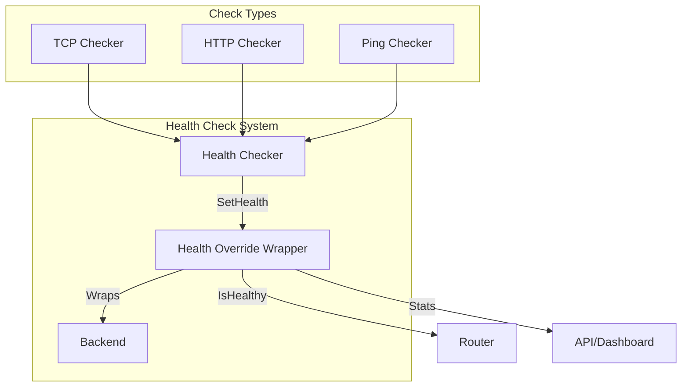
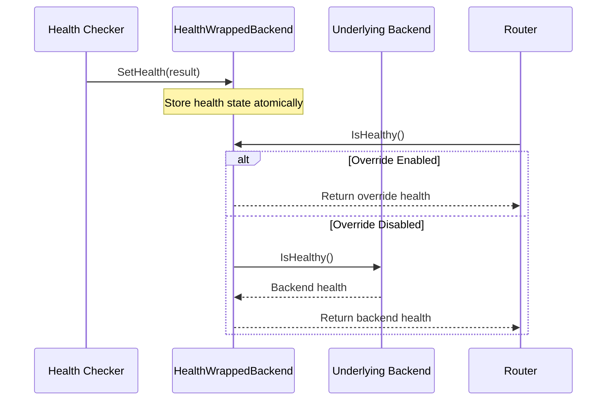

# Backend Health Check Overrides

Bifrost Proxy provides a flexible health checking system that monitors backend availability and automatically routes traffic to healthy backends. Health check overrides allow you to customize how backend health is monitored and reported.

## Overview

The health check system in Bifrost consists of three main components:

1. **Health Checkers** - Perform periodic health checks (TCP, HTTP, Ping)
2. **Health Override Wrapper** - Wraps backends to allow external health updates
3. **Backend Statistics** - Reports health status, latency, and error information



## Health Check Configuration

Each backend can have its own health check configuration that overrides the global settings.

### Basic Configuration

```yaml
backends:
  - name: my-backend
    type: direct
    enabled: true
    health_check:
      type: tcp           # Check type: tcp, http, or ping
      interval: "30s"     # How often to check
      timeout: "5s"       # Timeout for each check
      target: "example.com:443"  # Target to check
```

### Configuration Options

| Option | Type | Default | Description |
|--------|------|---------|-------------|
| `type` | string | `tcp` | Health check type: `tcp`, `http`, or `ping` |
| `interval` | duration | `30s` | Time between health checks |
| `timeout` | duration | `5s` | Timeout for each health check |
| `target` | string | - | Target address to check (host:port) |
| `path` | string | `/health` | HTTP path for HTTP health checks |

## Health Check Types

### TCP Health Check

The TCP health checker verifies that a TCP connection can be established to the target.

```yaml
backends:
  - name: database-proxy
    type: direct
    health_check:
      type: tcp
      interval: "15s"
      timeout: "3s"
      target: "db.internal:5432"
```

**How it works:**
1. Opens a TCP connection to the target
2. If connection succeeds, backend is marked healthy
3. If connection fails or times out, backend is marked unhealthy

**Best for:**
- Database connections
- Generic TCP services
- When HTTP endpoint is unavailable

### HTTP Health Check

The HTTP health checker performs an HTTP GET request and validates the response status code.

```yaml
backends:
  - name: api-backend
    type: http_proxy
    config:
      address: "api.internal:8080"
    health_check:
      type: http
      interval: "10s"
      timeout: "5s"
      target: "api.internal:8080"
      path: "/health"
```

**How it works:**
1. Sends HTTP GET request to `http://{target}{path}`
2. Status codes 200-399 are considered healthy
3. Status codes 400+ are considered unhealthy
4. Connection failures are considered unhealthy

**Response validation:**
- `2xx` → Healthy
- `3xx` → Healthy (redirects are acceptable)
- `4xx` → Unhealthy
- `5xx` → Unhealthy

**Best for:**
- HTTP/REST API backends
- Services with dedicated health endpoints
- Load balancer targets

### Ping (ICMP) Health Check

The Ping health checker sends ICMP echo requests to verify network reachability.

```yaml
backends:
  - name: vpn-gateway
    type: wireguard
    config:
      # ... WireGuard config
    health_check:
      type: ping
      interval: "30s"
      timeout: "5s"
      target: "10.0.0.1"
```

**How it works:**
1. Executes system `ping` command (platform-specific)
2. Parses output to determine success/failure
3. Works on Windows, macOS, and Linux

**Platform behavior:**
- **Windows**: `ping -n 1 -w 5000 {target}`
- **macOS**: `ping -c 1 -W 5000 {target}`
- **Linux**: `ping -c 1 -W 5 {target}`

**Best for:**
- VPN tunnel endpoints
- Network gateway monitoring
- When TCP/HTTP endpoints are unavailable

## Health Override Mechanism

The `HealthWrappedBackend` in `internal/backend/health_override.go` provides the core override functionality.

### How Overrides Work



### Override Interface

Backends that support external health updates implement the `HealthOverride` interface:

```go
type HealthOverride interface {
    SetHealth(result health.Result)
    ClearHealthOverride()
}
```

- **SetHealth**: Updates the health state based on the latest check result
- **ClearHealthOverride**: Clears any external health override, reverting to the backend's native health reporting

### Health Result Structure

Health check results contain detailed information:

```go
type Result struct {
    Healthy   bool          // Whether the backend is healthy
    Message   string        // Human-readable status message
    Latency   time.Duration // Time taken for the health check
    Timestamp time.Time     // When the check was performed
    Error     string        // Error message if unhealthy
}
```

## Configuration Examples

### Multi-Backend with Different Health Checks

```yaml
backends:
  # Direct connection with TCP health check
  - name: direct
    type: direct
    enabled: true
    health_check:
      type: tcp
      interval: "30s"
      timeout: "5s"
      target: "1.1.1.1:443"

  # WireGuard VPN with ping health check
  - name: wireguard-vpn
    type: wireguard
    enabled: true
    config:
      private_key: "${WG_PRIVATE_KEY}"
      address: "10.0.0.2/24"
      peer:
        public_key: "${WG_PEER_PUBLIC_KEY}"
        endpoint: "vpn.example.com:51820"
        allowed_ips: ["10.0.0.0/8"]
    health_check:
      type: ping
      interval: "15s"
      timeout: "5s"
      target: "10.0.0.1"

  # HTTP proxy with HTTP health check
  - name: upstream-proxy
    type: http_proxy
    enabled: true
    config:
      address: "proxy.internal:8080"
    health_check:
      type: http
      interval: "10s"
      timeout: "3s"
      target: "proxy.internal:8080"
      path: "/status"
```

### High-Availability Configuration

For critical services, use shorter intervals and timeouts:

```yaml
backends:
  - name: critical-backend
    type: http_proxy
    enabled: true
    config:
      address: "lb.internal:80"
    health_check:
      type: http
      interval: "5s"      # Check every 5 seconds
      timeout: "2s"       # Fail fast
      target: "lb.internal:80"
      path: "/healthz"
```

### VPN Provider Health Monitoring

```yaml
backends:
  - name: nordvpn-us
    type: nordvpn
    enabled: true
    config:
      country: "US"
      protocol: "wireguard"
      auto_select: true
    health_check:
      type: ping
      interval: "30s"
      timeout: "10s"
      target: "10.5.0.1"    # NordVPN gateway IP

  - name: mullvad-de
    type: mullvad
    enabled: true
    config:
      country: "DE"
    health_check:
      type: tcp
      interval: "30s"
      timeout: "5s"
      target: "10.64.0.1:53"  # Mullvad DNS
```

## Global vs Per-Backend Health Checks

### Global Health Check (Server Level)

The global health check configuration applies to all backends that don't have their own settings:

```yaml
# Server-level default health check
health_check:
  type: tcp
  interval: "30s"
  timeout: "5s"

backends:
  # Uses global settings
  - name: backend-a
    type: direct
    enabled: true

  # Overrides with custom settings
  - name: backend-b
    type: direct
    enabled: true
    health_check:
      type: http
      interval: "10s"
      timeout: "3s"
      target: "backend-b.internal:8080"
      path: "/health"
```

## Health Statistics

The health override wrapper tracks and reports:

| Statistic | Description |
|-----------|-------------|
| `Healthy` | Current health status (true/false) |
| `Latency` | Last measured latency to the backend |
| `LastError` | Most recent error message |
| `LastErrorTime` | Timestamp of the last error |

Access health statistics via the API:

```bash
# Get all backend stats
curl http://localhost:7082/api/backends

# Response includes health information
{
  "backends": [
    {
      "name": "direct",
      "type": "direct",
      "healthy": true,
      "latency": "12ms",
      "last_error": "",
      "last_error_time": null
    }
  ]
}
```

## Implementing Custom Health Endpoints

For HTTP health checks, implement a health endpoint in your services:

### Basic Health Endpoint

```go
// Simple health endpoint
http.HandleFunc("/health", func(w http.ResponseWriter, r *http.Request) {
    w.WriteHeader(http.StatusOK)
    w.Write([]byte("OK"))
})
```

### Detailed Health Endpoint

```go
// Detailed health endpoint with dependency checks
http.HandleFunc("/health", func(w http.ResponseWriter, r *http.Request) {
    health := map[string]interface{}{
        "status": "healthy",
        "timestamp": time.Now().UTC(),
        "checks": map[string]string{
            "database": "ok",
            "cache": "ok",
        },
    }

    w.Header().Set("Content-Type", "application/json")
    json.NewEncoder(w).Encode(health)
})
```

## Troubleshooting

### Backend Marked Unhealthy

**Symptoms**: Backend shows as unhealthy in dashboard/API despite being operational.

**Solutions**:
1. Verify `target` is reachable from the Bifrost server
2. Check if firewall rules allow health check traffic
3. For HTTP checks, ensure the `path` endpoint exists and returns 2xx/3xx
4. Increase `timeout` if network latency is high

```bash
# Test TCP connectivity
nc -zv target-host 443

# Test HTTP endpoint
curl -v http://target-host:8080/health

# Test ping
ping -c 1 target-host
```

### Flapping Health Status

**Symptoms**: Backend health status changes frequently between healthy/unhealthy.

**Solutions**:
1. Increase `timeout` to account for network variability
2. Increase `interval` to reduce check frequency
3. Review backend service stability
4. Check for network congestion or packet loss

### Health Checks Not Running

**Symptoms**: Health status never updates, always shows default state.

**Solutions**:
1. Verify `health_check` section is properly indented under the backend
2. Check server logs for health check errors
3. Ensure `enabled: true` is set on the backend

### HTTP Health Check Returns Unhealthy

**Symptoms**: HTTP health check fails even though the service is running.

**Solutions**:
1. Verify the endpoint path is correct (default is `/health`)
2. Check if the endpoint requires authentication
3. Ensure the endpoint returns status code 200-399
4. Check if TLS certificate validation is failing (self-signed certs are accepted)

## Best Practices

1. **Match check type to service**: Use HTTP for web services, TCP for databases, Ping for VPN gateways

2. **Tune intervals appropriately**:
   - Critical services: 5-10 seconds
   - Standard services: 30 seconds
   - Low-priority: 60+ seconds

3. **Set reasonable timeouts**: Timeout should be less than interval, typically 1/6 to 1/3 of interval

4. **Use dedicated health endpoints**: Don't health-check production endpoints; use dedicated `/health` or `/healthz` paths

5. **Monitor health check metrics**: Watch for patterns in failures to identify network or service issues

## See Also

- [Backend Configuration Guide](/backends) - General backend setup
- [Monitoring](/monitoring) - Metrics and observability
- [VPN Providers](/vpn-providers) - VPN-specific configurations
- [Troubleshooting](/troubleshooting) - Common issues and solutions
