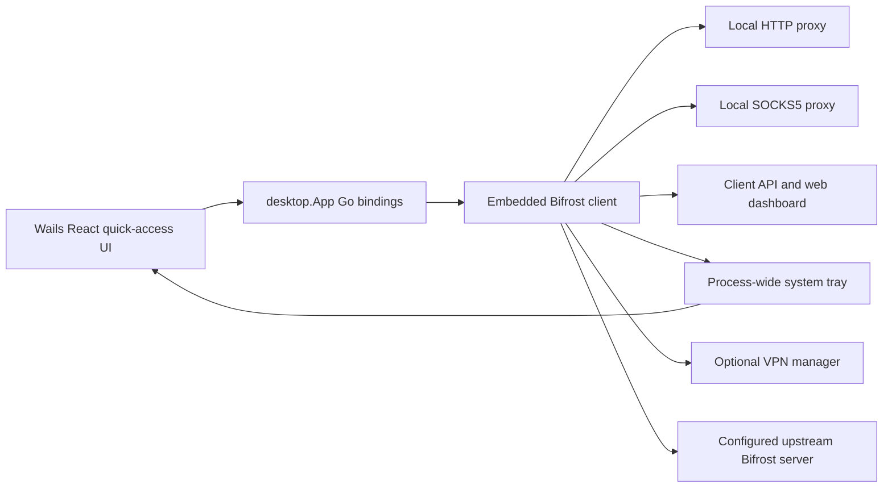

# Desktop Client

The Bifrost Desktop Client is a small [Wails](https://wails.io/) window around the same Go proxy client used by `bifrost-client`. It is a quick-access controller, not a second full dashboard: it starts and stops the local client, manages upstream servers, shows live counters, edits the most common listener settings, and can open the complete web dashboard.

## What it provides

- Start and stop the embedded local proxy client
- Show upstream reachability, active connections, bytes sent/received, local proxy addresses, VPN state, uptime, and the last error
- Add, edit, delete, select, and mark named upstream servers as the default
- Edit the upstream address/protocol and local HTTP/SOCKS5 ports, then restart the client to apply listener changes
- Enable or disable configured VPN mode
- Persist **Auto-connect** and **Start minimized** preferences
- Run a process-wide system tray with status, system-proxy connect/disconnect, Quick Access, web-dashboard, and Quit actions

The desktop window does **not** contain a split-tunneling editor, traffic-log viewer, recent-connections table, bandwidth graph, or updater UI. Use the web dashboard for the broader client feature set. VPN mode must already be valid in the client YAML before its toggle can connect a tunnel.

## Installation

Download the artifacts attached to a tagged [GitHub release](https://github.com/rennerdo30/bifrost-proxy/releases):

| Platform | Artifact |
|----------|----------|
| Windows (amd64) | `bifrost-desktop-windows-amd64.exe` |
| macOS (Intel + Apple Silicon) | `bifrost-desktop-darwin-universal.zip` |
| Linux (amd64) | `bifrost-desktop-linux-amd64.tar.gz` |

The macOS archive contains an application bundle. Release builds are currently unsigned, so the operating system may ask you to confirm that you trust the downloaded application. Linux requires GTK3 and WebKitGTK 4.1 at runtime.

## Building from source

Wails desktop builds use native GUI libraries. Build on the target operating system; the release workflow uses separate Linux, Windows, and macOS runners rather than attempting all three from one Linux host.

Prerequisites:

- Go 1.25 or newer
- Node.js 22 or newer
- Wails CLI v2.15.0
- Platform dependencies reported by `wails doctor`
- On Ubuntu 24.04: `libgtk-3-dev` and `libwebkit2gtk-4.1-dev` (build with the `webkit2_41` tag)

From the repository root:

```bash
# Install the pinned Wails CLI and frontend dependencies, then build
make desktop-build

# Development mode with frontend hot reload
make desktop-dev
```

Equivalent manual commands:

```bash
go install github.com/wailsapp/wails/v2/cmd/wails@v2.15.0
cd desktop/frontend
npm ci
cd ..
wails doctor
wails build
```

On Ubuntu 24.04:

```bash
wails build -tags webkit2_41
```

The Wails output is written below `desktop/build/bin/`.

## Main window

The application intentionally uses a narrow quick-access layout:

```text
┌──────────────────────────────────┐
│ Bifrost             [Web] [Quit] │
├──────────────────────────────────┤
│             Connect              │
│                                  │
│ Server: Primary              ▾   │
│                                  │
│ Status                           │
│ Upstream     Connected           │
│ Active       3 connections       │
│ Sent         5.0 MB              │
│ Received     25.0 MB             │
│ HTTP         127.0.0.1:7380      │
│ SOCKS5       127.0.0.1:7381      │
│                                  │
│ Servers                          │
│ Primary   proxy.example:7080     │
│                     [Edit] […]   │
│                                  │
│ Quick Settings                   │
│ VPN mode                   [off] │
│ Auto-connect                [on] │
│ Start minimized            [off] │
│ Bifrost Server                  ▾│
│ Local Proxy Ports              ▾│
└──────────────────────────────────┘
```

**Connect** starts the local proxy listeners and background client. **Disconnect** stops them. Upstream reachability is displayed separately: a running client whose configured server cannot be reached is shown as **Unreachable**, and its available action remains Disconnect.

Listener, server-address, and protocol changes are saved to the client YAML and require a client restart. The UI marks those controls accordingly.

## System tray

When `tray.enabled` is true, the core client creates one tray for the process and keeps it alive across local client Start/Stop cycles. The menu contains:

- **Status** — current tray/system-proxy state
- **Connect / Disconnect** — enable or disable the operating system's proxy settings
- **Quick Access** — restore and show the Wails desktop window (when `tray.show_quick_gui` is true)
- **Open Dashboard** — open the client web dashboard in the default browser
- **Quit** — stop the client and exit the process

Canceling the application context terminates the tray and its click worker. The tray icons are generated status dots (green connected, gray disconnected, amber warning, red error); the removed SVG files were never used by the binary.

:::note
The tray's Connect/Disconnect action controls system-proxy integration. It is not the VPN-mode toggle and is separate from the Wails window's local-client Connect/Disconnect button.
:::

## Configuration and preferences

The desktop app uses the normal client YAML. It searches, in order:

1. `client-config.yaml` and `bifrost-client.yaml` in the current directory
2. `bifrost/client-config.yaml` and `bifrost/config.yaml` below the operating system's user-config directory
3. `~/.bifrost/client-config.yaml` and `~/.config/bifrost/client-config.yaml`

If no file exists, it writes the default config to `<user-config-dir>/bifrost/client-config.yaml`.

Common user-config roots are:

| Platform | User config root |
|----------|------------------|
| Windows | `%AppData%` |
| macOS | `~/Library/Application Support` |
| Linux | `$XDG_CONFIG_HOME` or `~/.config` |

A minimal desktop-capable client config is:

```yaml
proxy:
  http:
    listen: "127.0.0.1:7380"
  socks5:
    listen: "127.0.0.1:7381"

server:
  address: "proxy.example.com:7080"
  protocol: "http"

routes:
  - domains: ["*"]
    action: server

api:
  enabled: true
  listen: "127.0.0.1:7383"

tray:
  enabled: true
  show_quick_gui: true

vpn:
  enabled: false

logging:
  level: info
  format: text
```

The app forces the local API on because the embedded web dashboard depends on it. Named servers are stored in the YAML's `servers` list. The GUI-specific Auto-connect, Start minimized, and selected-server preferences are stored separately in `<user-config-dir>/bifrost/quick-preferences.json`.

- **Auto-connect on** (the default) starts the embedded client at launch.
- **Auto-connect off** constructs it stopped; the Connect button performs the first start.
- **Start minimized** hides the Wails window at launch. Quick Access in the tray restores it.

The desktop app does not register itself with Windows Startup, macOS Login Items, systemd, launchd, or XDG autostart. If you need launch-on-login, configure it with your operating system and pass the same working directory/config environment you use for a manual launch.

## Architecture



The frontend calls the Go bindings exposed on `window.go.main.App`. The checked-in generated `wailsjs` directory was removed because the frontend never imported it and it had drifted four methods behind the actual binding surface. Wails regenerates bindings for development/builds as needed.

## Troubleshooting

### The window is hidden on launch

Use the tray's **Quick Access** item. If the tray is also unavailable, remove or edit `quick-preferences.json` and set `start_minimized` to `false`.

### The tray is absent

- Verify `tray.enabled: true` in the client YAML.
- On Linux, ensure your desktop supports StatusNotifier/AppIndicator icons and that WebKitGTK/GTK dependencies are installed.
- On Windows, check the hidden-icons overflow area.

### The local client is running but the server says Unreachable

The Connect button controls the local lifecycle, not whether the upstream accepted a connection. Verify `server.address`, protocol, credentials, DNS, and firewall reachability. The status card keeps the last error and upstream reachability separate from the running/stopped state.

### Listener changes did not apply

Server address/protocol and local port changes require **Restart Client**. The save action updates the YAML; the restart action tears down and recreates listeners.

### VPN mode fails to enable

VPN mode is not configured by the desktop form. Configure and validate the `vpn` section in the client YAML first, run with the platform privileges required for a TUN device, and then use the desktop toggle.
