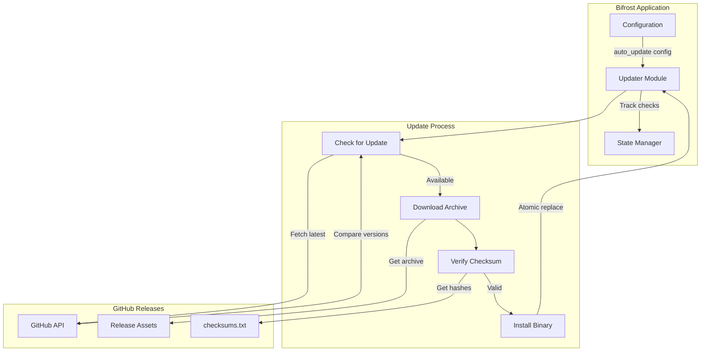
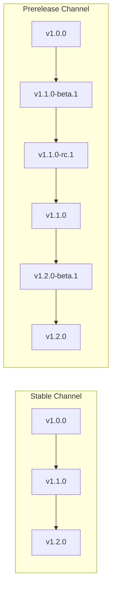
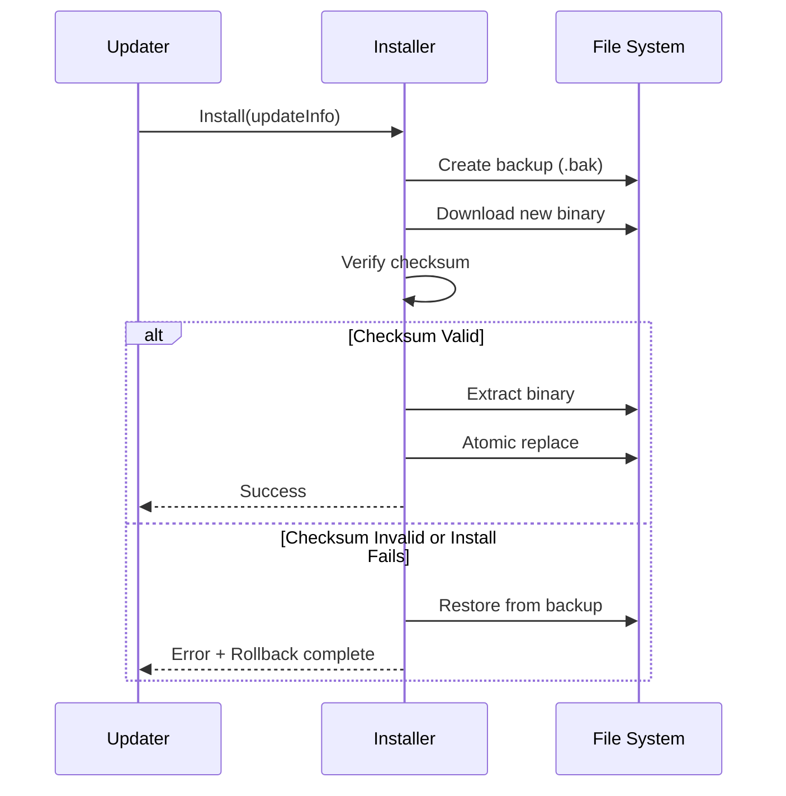
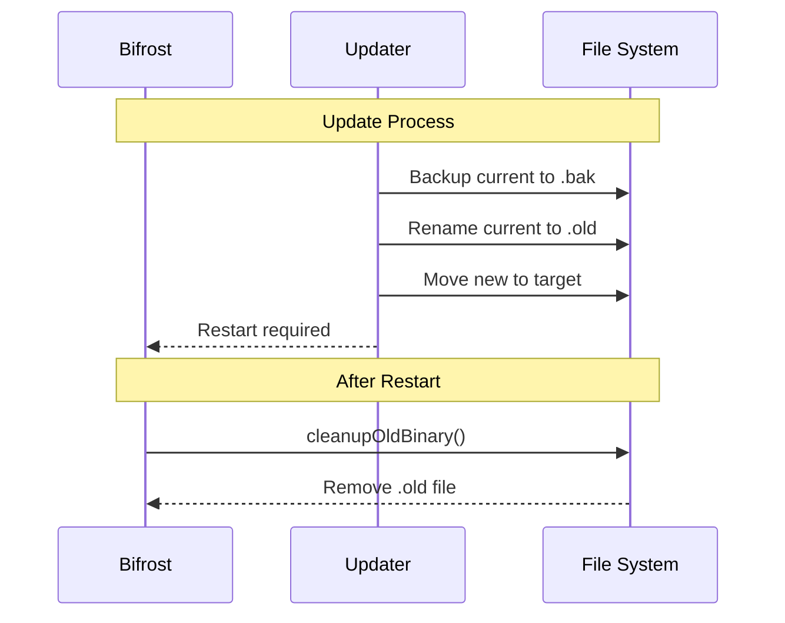

# Auto-Update System

The Bifrost Proxy includes a built-in auto-update system that keeps both the server and client components up to date. This guide covers the updater module architecture, update channels, verification mechanisms, and platform-specific behavior.

## Overview

The auto-update system provides:

- **Automatic update checking** - Periodic background checks for new releases
- **Multiple channels** - Choose between stable and prerelease versions
- **Secure verification** - SHA256 checksum validation before installation
- **Automatic rollback** - Restore previous version if installation fails
- **Cross-platform support** - Native self-update for Windows, macOS, and Linux



## Architecture

The updater module (`internal/updater/`) provides a complete self-update mechanism with robust error handling and rollback capabilities.

### Module Structure

| File | Purpose |
|------|---------|
| `updater.go` | Main orchestrator and public API |
| `config.go` | Configuration structs and defaults |
| `version.go` | Semantic version parsing and comparison |
| `github.go` | GitHub Releases API integration |
| `download.go` | File download with progress tracking |
| `checksum.go` | SHA256 verification |
| `installer.go` | Binary extraction and installation |
| `installer_unix.go` | Unix-specific atomic replacement |
| `installer_windows.go` | Windows-specific atomic replacement |
| `state.go` | Persistent state management |
| `errors.go` | Error definitions |

### Core Types

```go
// Updater manages the update lifecycle
type Updater struct {
    config     Config
    github     *GitHubClient
    installer  *Installer
    state      *State
    binaryType BinaryType
}

// UpdateInfo contains details about an available update
type UpdateInfo struct {
    CurrentVersion string
    NewVersion     string
    ReleaseURL     string
    ReleaseNotes   string
    PublishedAt    time.Time
    AssetURL       string
    AssetName      string
    AssetSize      int64
    Checksum       string
}

// BinaryType indicates which component is being updated
type BinaryType string

const (
    BinaryTypeServer BinaryType = "server"
    BinaryTypeClient BinaryType = "client"
)
```

## Configuration

Enable auto-updates in your configuration file:

```yaml
# Server or Client configuration
auto_update:
  enabled: true
  check_interval: "24h"
  channel: "stable"
```

### Configuration Options

| Option | Type | Default | Description |
|--------|------|---------|-------------|
| `enabled` | bool | `false` | Enable automatic update checking |
| `check_interval` | duration | `24h` | How often to check for updates |
| `channel` | string | `"stable"` | Update channel: `stable` or `prerelease` |

### Configuration Struct

```go
type AutoUpdateConfig struct {
    Enabled       bool          `yaml:"enabled"`
    CheckInterval Duration      `yaml:"check_interval"`
    Channel       string        `yaml:"channel"`
}
```

## Update Channels

The updater supports two release channels:

### Stable Channel

The default channel for production use. Only includes official releases marked as non-prerelease on GitHub.

```yaml
auto_update:
  channel: "stable"
```

- Uses GitHub's `/releases/latest` API endpoint
- Excludes draft and prerelease versions
- Recommended for production deployments

### Prerelease Channel

Includes beta versions, release candidates, and nightly builds in addition to stable releases.

```yaml
auto_update:
  channel: "prerelease"
```

- Fetches up to 30 recent releases
- Includes versions marked as prerelease (beta, rc, alpha)
- Useful for testing new features before general availability



## Update Verification

All updates are verified before installation to ensure integrity and authenticity.

### SHA256 Checksum Verification

Every release includes a `checksums.txt` file containing SHA256 hashes for all assets:

```
a1b2c3d4e5f6...  bifrost_1.2.0_linux_amd64.tar.gz
b2c3d4e5f6a1...  bifrost_1.2.0_darwin_amd64.tar.gz
c3d4e5f6a1b2...  bifrost_1.2.0_windows_amd64.zip
```

The verification process:

1. Download the release archive
2. Fetch `checksums.txt` from the release
3. Calculate SHA256 hash of downloaded file
4. Compare with expected hash (case-insensitive)
5. Reject update if hashes don't match

```go
// Verification happens automatically during install
func VerifyChecksum(filePath, expectedHash string) error {
    file, _ := os.Open(filePath)
    defer file.Close()

    hash := sha256.New()
    io.Copy(hash, file)
    actual := hex.EncodeToString(hash.Sum(nil))

    if !strings.EqualFold(actual, expectedHash) {
        return ErrChecksumMismatch
    }
    return nil
}
```

### Error Handling

If verification fails, the update is rejected with a clear error:

```
Error: checksum mismatch: expected a1b2c3d4..., got x9y8z7w6...
```

## Rollback Mechanism

The updater includes automatic rollback to protect against failed updates.

### Backup Strategy

Before installing an update:

1. The current binary is backed up to `<binary-path>.bak`
2. If a backup already exists, it's removed first
3. Original file permissions are preserved

### Automatic Rollback

If installation fails at any step:

1. The failed new binary is removed
2. The backup is restored to the original location
3. An error is returned with details



### Manual Rollback

If you need to manually rollback after a successful update:

```bash
# The backup is stored alongside the binary
ls -la /path/to/bifrost-server*
# bifrost-server
# bifrost-server.bak

# Restore manually if needed
mv /path/to/bifrost-server /path/to/bifrost-server.new
mv /path/to/bifrost-server.bak /path/to/bifrost-server
```

## Platform-Specific Self-Update

Each platform has specific requirements for replacing a running executable.

### Linux and macOS (Unix)

Unix systems support atomic file replacement using `os.Rename()`:

```go
func atomicReplace(src, dst string) error {
    return os.Rename(src, dst)
}
```

**Process:**

1. Download archive (`.tar.gz`)
2. Extract binary to temporary location
3. Create backup of current binary
4. Atomically rename new binary to target location
5. Set permissions (`0755`)

**Archive format:** `bifrost_<version>_<os>_<arch>.tar.gz`

Examples:
- `bifrost_1.2.0_linux_amd64.tar.gz`
- `bifrost_1.2.0_darwin_arm64.tar.gz`

### Windows

Windows cannot replace a running executable directly. The updater uses a three-step process:

```go
func atomicReplace(src, dst string) error {
    // 1. Rename current binary to .old
    oldPath := dst + ".old"
    os.Rename(dst, oldPath)

    // 2. Move new binary to target location
    os.Rename(src, dst)

    // 3. .old file cleaned up on next startup
    return nil
}
```

**Process:**

1. Download archive (`.zip`)
2. Extract binary to temporary location
3. Create backup of current binary (`.bak`)
4. Rename current binary to `.old`
5. Move new binary to target location
6. On next startup, `cleanupOldBinary()` removes `.old` file

**Archive format:** `bifrost_<version>_windows_<arch>.zip`

Examples:
- `bifrost_1.2.0_windows_amd64.zip`
- `bifrost_1.2.0_windows_arm64.zip`



## CLI Commands

Both server and client support update commands via the command line.

### Check for Updates

```bash
# Check if an update is available
bifrost-server update check
bifrost-client update check
```

Output:
```
Current version: 1.1.0
Latest version:  1.2.0
Channel:         stable
Release URL:     https://github.com/rennerdo30/bifrost-proxy/releases/tag/v1.2.0

Update available! Run 'bifrost-server update install' to install.
```

### Install Update

```bash
# Install an available update
bifrost-server update install
bifrost-client update install
```

Output:
```
Downloading bifrost_1.2.0_linux_amd64.tar.gz...
Progress: 45% (2.3 MB / 5.1 MB)
Progress: 100% (5.1 MB / 5.1 MB)
Verifying checksum...
Installing update...
Update installed successfully!

Please restart the application to use the new version.
```

### Interactive Update

```bash
# Check and optionally install
bifrost-server update
bifrost-client update
```

This command checks for updates and prompts for confirmation before installing.

### Command Flags

| Flag | Description |
|------|-------------|
| `--channel` | Override the configured update channel |
| `--force` | Install even if already on latest version |

```bash
# Check prerelease channel
bifrost-server update check --channel prerelease

# Force reinstall current version
bifrost-server update install --force
```

## Background Update Checking

When auto-update is enabled, the application checks for updates in the background.

### Background Checker Behavior

1. **Initial delay**: 1 minute after startup
2. **Periodic checks**: Every `check_interval` (default 24 hours)
3. **Timeout**: 30 seconds per check
4. **State tracking**: Respects previous checks to avoid redundant API calls

```go
// Background checker lifecycle
func (u *Updater) StartBackgroundChecker(notifier Notifier) {
    // Wait 1 minute before first check
    time.Sleep(1 * time.Minute)

    // Check periodically
    ticker := time.NewTicker(u.config.CheckInterval)
    for {
        select {
        case <-ticker.C:
            if u.state.ShouldCheck(u.config.CheckInterval) {
                info, err := u.CheckForUpdate(ctx)
                if err == nil && u.state.ShouldNotify(info.NewVersion) {
                    notifier.NotifyUpdateAvailable(info)
                }
            }
        case <-u.stopCh:
            return
        }
    }
}
```

### Notification Integration

The background checker uses a `Notifier` interface for alerting users:

```go
type Notifier interface {
    NotifyUpdateAvailable(info UpdateInfo)
}
```

This can be integrated with:
- System tray notifications
- Web UI alerts
- Log messages

## State Management

The updater maintains persistent state to track checks and user preferences.

### State File Location

| Platform | Path |
|----------|------|
| Windows | `%APPDATA%\bifrost\update-state.json` |
| macOS | `~/Library/Application Support/bifrost/update-state.json` |
| Linux | `~/.config/bifrost/update-state.json` |

### State Contents

```json
{
  "last_check": "2025-02-05T10:30:00Z",
  "last_notified_version": "1.2.0",
  "skipped_version": "1.1.5"
}
```

### State Operations

| Method | Purpose |
|--------|---------|
| `ShouldCheck(interval)` | Check if enough time has passed |
| `MarkChecked()` | Record that a check occurred |
| `ShouldNotify(version)` | Check if user should be notified |
| `MarkNotified(version)` | Record notification was shown |
| `SkipVersion(version)` | Mark version as skipped by user |
| `IsSkipped(version)` | Check if version was skipped |

## Version Comparison

The updater uses semantic versioning (SemVer) for version comparison.

### Version Format

```
v1.2.3-beta.1+build.123
│ │ │ │       │
│ │ │ │       └── Build metadata (ignored in comparison)
│ │ │ └────────── Prerelease identifier
│ │ └──────────── Patch version
│ └────────────── Minor version
└──────────────── Major version
```

### Comparison Rules

1. Compare major, minor, patch numerically
2. Release versions are newer than prereleases (1.0.0 > 1.0.0-rc1)
3. Prerelease identifiers compared lexicographically
4. Fallback to publish timestamp for non-SemVer versions

```go
// Version comparison examples
v1 := ParseVersion("1.2.0")
v2 := ParseVersion("1.2.1")
v1.Compare(v2)  // Returns -1 (v1 < v2)

v3 := ParseVersion("1.3.0-rc.1")
v4 := ParseVersion("1.3.0")
v3.Compare(v4)  // Returns -1 (prerelease < release)
```

## Error Handling

The updater defines specific error types for different failure scenarios:

| Error | Description |
|-------|-------------|
| `ErrNoUpdateAvailable` | Already on the latest version |
| `ErrChecksumMismatch` | Downloaded file failed verification |
| `ErrAssetNotFound` | No binary available for this platform |
| `ErrDownloadFailed` | Network error during download |
| `ErrInstallFailed` | Failed to install new binary |
| `ErrBackupFailed` | Could not create backup |
| `ErrInvalidVersion` | Malformed version string |
| `ErrNetworkError` | General network failure |
| `ErrRateLimited` | GitHub API rate limit exceeded |
| `ErrRestoreFailed` | Could not restore from backup |

### Rate Limiting

The updater detects GitHub API rate limiting:

```go
// Rate limit detection
if resp.StatusCode == 403 {
    remaining := resp.Header.Get("X-RateLimit-Remaining")
    if remaining == "0" {
        return ErrRateLimited
    }
}
```

**Mitigation:**
- Background checks respect state to avoid redundant calls
- Rate limit errors are logged but don't crash the application
- Manual retry after waiting is recommended

## Troubleshooting

### Update Check Fails

**Symptoms**: "Network error" or "Rate limited" errors.

**Solutions**:
1. Check internet connectivity
2. Verify GitHub is accessible: `curl https://api.github.com`
3. Wait for rate limit reset (shown in error message)
4. Check firewall/proxy settings

### Checksum Mismatch

**Symptoms**: "Checksum mismatch" error after download.

**Causes**:
- Corrupted download
- Man-in-the-middle attack
- Release asset changed after checksums generated

**Solutions**:
1. Retry the update (re-downloads the file)
2. Verify the release on GitHub manually
3. Report to maintainers if persists

### Installation Fails

**Symptoms**: "Install failed" error, binary not updated.

**Solutions**:
1. Check write permissions to binary location
2. Ensure disk has sufficient space
3. On Windows, close all instances of the application
4. Check for antivirus interference

### Rollback Failed

**Symptoms**: "Restore failed" error, application may be broken.

**Solutions**:
1. Manually restore from `.bak` file
2. Re-download and install manually
3. Check disk permissions and space

### Windows: Binary Still Running

**Symptoms**: Update fails with "access denied" on Windows.

**Cause**: Windows cannot modify running executables.

**Solutions**:
1. Stop the application completely before updating
2. Use a service manager that supports restarts
3. Run update from a different process

### Permission Denied

**Symptoms**: "Permission denied" when installing.

**Solutions**:
1. **Linux/macOS**: Check binary ownership and permissions
2. **Windows**: Run as Administrator if installed in Program Files
3. Consider installing to user-writable location

## Best Practices

1. **Use stable channel for production**: Prerelease versions may have bugs
2. **Enable auto-update for security patches**: Keep up with security fixes
3. **Test updates in staging first**: Verify compatibility before production
4. **Monitor after updates**: Check logs for unexpected behavior
5. **Keep backups**: The `.bak` file is your safety net
6. **Review release notes**: Understand what changes with each update

## API Integration

The updater can be integrated into your own tooling:

```go
import "github.com/rennerdo30/bifrost-proxy/internal/updater"

// Create updater for server component
cfg := updater.DefaultConfig()
cfg.Channel = updater.ChannelStable

u, err := updater.New(cfg, updater.BinaryTypeServer)
if err != nil {
    log.Fatal(err)
}

// Check for updates
ctx := context.Background()
info, err := u.CheckForUpdate(ctx)
if err == updater.ErrNoUpdateAvailable {
    fmt.Println("Already up to date")
    return
}
if err != nil {
    log.Fatal(err)
}

// Install with progress callback
err = u.Install(ctx, info, func(downloaded, total int64) {
    pct := float64(downloaded) / float64(total) * 100
    fmt.Printf("\rProgress: %.1f%%", pct)
})
if err != nil {
    log.Fatal(err)
}

fmt.Println("\nUpdate installed successfully!")
```

## Future Enhancements

The following features are planned for future releases:

- **Delta updates**: Download only changed bytes for faster updates
- **Signed releases**: GPG signature verification in addition to checksums
- **Nightly channel**: Automated builds from main branch
- **Update scheduling**: Configure specific times for updates
- **Staged rollouts**: Gradual release to percentage of users
- **In-app notifications**: Web UI alerts for available updates
