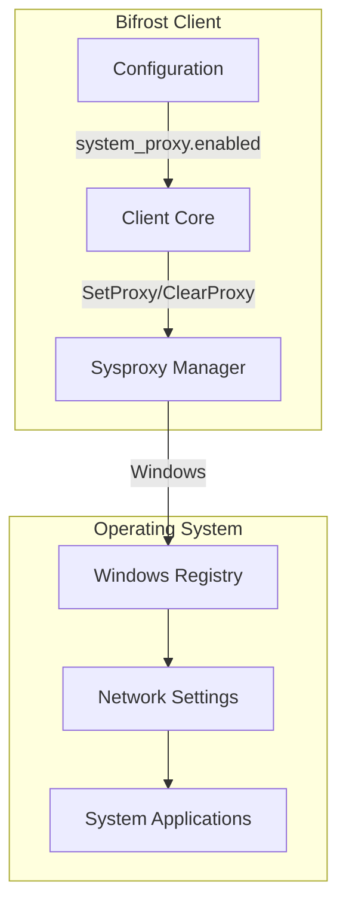
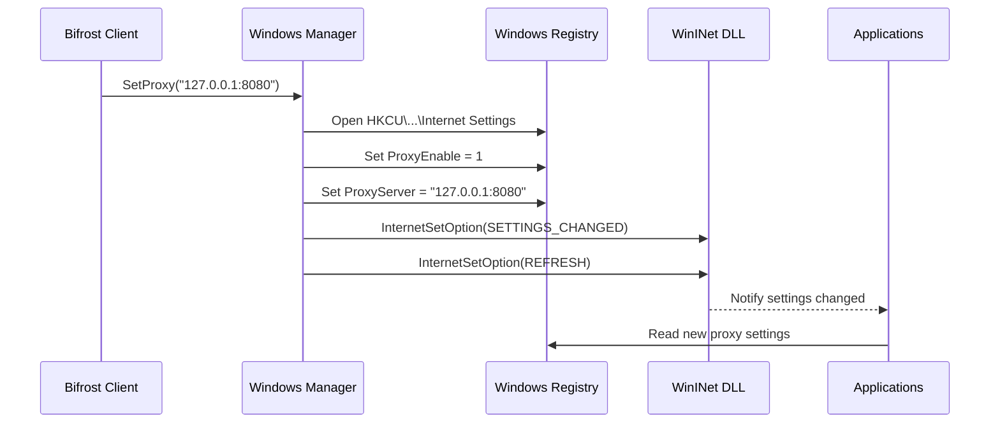
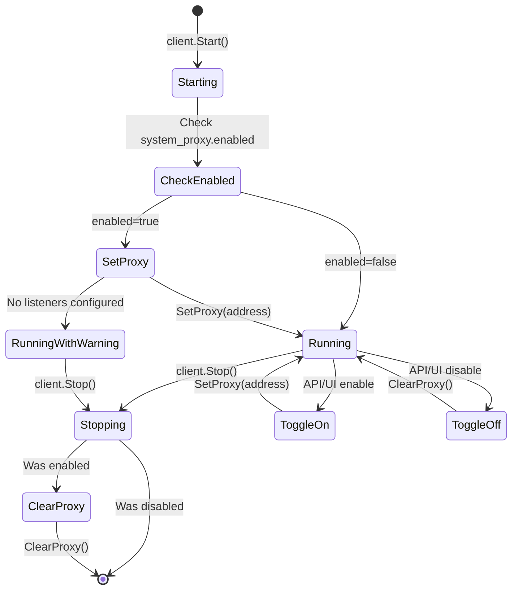

# System Proxy Integration

The Bifrost client can automatically configure your operating system's proxy settings, allowing all system applications to route traffic through the proxy without manual configuration. This guide covers the sysproxy module architecture, platform-specific behavior, and troubleshooting common issues.

## Overview

System proxy integration provides:

- **Automatic OS configuration** - Set system-wide proxy settings on startup
- **Automatic cleanup** - Restore original settings on shutdown
- **Runtime toggle** - Enable/disable via Web UI or API without restart
- **Platform abstraction** - Consistent interface across operating systems



## Architecture

The system proxy module (`internal/sysproxy/`) provides a clean abstraction for platform-specific proxy configuration.

### Module Structure

| File | Purpose |
|------|---------|
| `sysproxy.go` | Core interface and types |
| `sysproxy_windows.go` | Windows registry implementation |
| `sysproxy_other.go` | Stub for non-Windows platforms |

### Core Interface

```go
// Manager allows managing system proxy settings
type Manager interface {
    // SetProxy sets the system proxy to the specified address
    SetProxy(address string) error
    // ClearProxy clears (unsets) the system proxy
    ClearProxy() error
}

// Config holds configuration for system proxy settings
type Config struct {
    Address string  // Proxy address (host:port)
    Enabled bool    // Whether system proxy should be set
}
```

### Platform Support

| Platform | Status | Implementation |
|----------|--------|----------------|
| Windows | Fully supported | Registry + WinINet API |
| macOS | Stub (no-op) | Planned: networksetup |
| Linux | Stub (no-op) | Planned: GNOME/KDE settings |

## Configuration

Enable system proxy in your client configuration:

```yaml
# Client proxy listeners
proxy:
  http:
    address: "127.0.0.1:8080"
    enabled: true
  socks5:
    address: "127.0.0.1:1080"
    enabled: true

# System proxy configuration
system_proxy:
  enabled: true  # Automatically set OS proxy settings
```

### Configuration Options

| Option | Type | Default | Description |
|--------|------|---------|-------------|
| `enabled` | bool | `false` | Enable automatic OS proxy configuration |

When enabled, the client will:

1. **On startup**: Set the system proxy to the HTTP listener address (preferred) or SOCKS5 address
2. **On shutdown**: Clear the system proxy settings
3. **On toggle**: Immediately update system settings without restart

### Listener Priority

When both HTTP and SOCKS5 listeners are configured, the system proxy uses this priority:

1. **HTTP listener** (if enabled) - Most compatible with system applications
2. **SOCKS5 listener** (if HTTP disabled) - Fallback option

:::note[HTTP Preferred]
Most operating systems and applications have better support for HTTP proxies. If both protocols are available, the HTTP listener is used for system proxy configuration.
:::

## Platform-Specific Details

### Windows

The Windows implementation modifies system-wide Internet settings through the Windows Registry.

#### How It Works



#### Registry Keys Modified

| Key | Value | Type | Description |
|-----|-------|------|-------------|
| `ProxyEnable` | `1` or `0` | DWORD | Enable/disable proxy |
| `ProxyServer` | `host:port` | String | Proxy server address |

**Registry Path**: `HKEY_CURRENT_USER\Software\Microsoft\Windows\CurrentVersion\Internet Settings`

#### System Notification

After modifying registry values, the client calls `InternetSetOption` from `wininet.dll` to notify applications:

- `INTERNET_OPTION_SETTINGS_CHANGED` (39) - Signal that settings have changed
- `INTERNET_OPTION_REFRESH` (37) - Request applications to refresh settings

Most Windows applications (browsers, system services) will pick up the new proxy settings immediately.

#### Manual Verification

To verify the proxy settings on Windows:

**Using Settings App:**
1. Open **Settings** > **Network & Internet** > **Proxy**
2. Check "Manual proxy setup" section
3. Verify the proxy address matches your configuration

**Using Registry Editor:**
```powershell
# View current proxy settings
reg query "HKCU\Software\Microsoft\Windows\CurrentVersion\Internet Settings" /v ProxyEnable
reg query "HKCU\Software\Microsoft\Windows\CurrentVersion\Internet Settings" /v ProxyServer
```

**Using PowerShell:**
```powershell
# Check proxy settings
Get-ItemProperty -Path 'HKCU:\Software\Microsoft\Windows\CurrentVersion\Internet Settings' |
    Select-Object ProxyEnable, ProxyServer
```

### macOS

:::caution[Not Yet Implemented]
System proxy configuration on macOS is not yet implemented. The client will start without errors, but system proxy settings will not be modified.
:::

#### Planned Implementation

The macOS implementation will use the `networksetup` command to configure proxy settings:

```bash
# Set HTTP proxy (planned)
networksetup -setwebproxy "Wi-Fi" 127.0.0.1 8080

# Set HTTPS proxy (planned)
networksetup -setsecurewebproxy "Wi-Fi" 127.0.0.1 8080

# Enable proxy (planned)
networksetup -setwebproxystate "Wi-Fi" on
networksetup -setsecurewebproxystate "Wi-Fi" on
```

#### Manual Configuration (Workaround)

Until native support is available, configure the proxy manually:

**Using System Preferences:**
1. Open **System Preferences** > **Network**
2. Select your active network connection (Wi-Fi, Ethernet)
3. Click **Advanced** > **Proxies**
4. Enable **Web Proxy (HTTP)** and **Secure Web Proxy (HTTPS)**
5. Set server to `127.0.0.1` and port to `8080`
6. Click **OK** > **Apply**

**Using Terminal:**
```bash
# Set HTTP proxy
networksetup -setwebproxy "Wi-Fi" 127.0.0.1 8080
networksetup -setsecurewebproxy "Wi-Fi" 127.0.0.1 8080

# Enable proxies
networksetup -setwebproxystate "Wi-Fi" on
networksetup -setsecurewebproxystate "Wi-Fi" on

# To disable later
networksetup -setwebproxystate "Wi-Fi" off
networksetup -setsecurewebproxystate "Wi-Fi" off
```

### Linux

:::caution[Not Yet Implemented]
System proxy configuration on Linux is not yet implemented. The client will start without errors, but system proxy settings will not be modified.
:::

#### Planned Implementation

Linux support will target multiple desktop environments:

**GNOME (gsettings):**
```bash
# Set HTTP proxy
gsettings set org.gnome.system.proxy.http host '127.0.0.1'
gsettings set org.gnome.system.proxy.http port 8080

# Enable manual proxy mode
gsettings set org.gnome.system.proxy mode 'manual'
```

**KDE (kwriteconfig5):**
```bash
# Configure KDE proxy settings
kwriteconfig5 --file kioslaverc --group "Proxy Settings" --key ProxyType 1
kwriteconfig5 --file kioslaverc --group "Proxy Settings" --key httpProxy "http://127.0.0.1:8080"
```

#### Manual Configuration (Workaround)

**GNOME:**
1. Open **Settings** > **Network** > **Network Proxy**
2. Select **Manual**
3. Set HTTP Proxy to `127.0.0.1` port `8080`
4. Set HTTPS Proxy to `127.0.0.1` port `8080`

**KDE:**
1. Open **System Settings** > **Network Settings** > **Proxy**
2. Select **Use manually specified proxy configuration**
3. Set HTTP Proxy to `http://127.0.0.1:8080`
4. Apply settings

**Environment Variables (Terminal applications):**
```bash
# Add to ~/.bashrc or ~/.zshrc
export http_proxy="http://127.0.0.1:8080"
export https_proxy="http://127.0.0.1:8080"
export HTTP_PROXY="http://127.0.0.1:8080"
export HTTPS_PROXY="http://127.0.0.1:8080"

# To bypass proxy for local addresses
export no_proxy="localhost,127.0.0.1,::1"
```

## Runtime Control

### Web UI Toggle

The system proxy can be toggled via the client Web UI:

1. Open the client dashboard (default: `http://localhost:7383`)
2. Navigate to **Quick Settings**
3. Toggle the **System Proxy** switch

### API Control

Toggle system proxy via the REST API:

```bash
# Get current settings
curl http://localhost:7383/api/v1/settings

# Enable system proxy
curl -X PUT http://localhost:7383/api/v1/settings \
  -H "Content-Type: application/json" \
  -d '{"system_proxy_enabled": true}'

# Disable system proxy
curl -X PUT http://localhost:7383/api/v1/settings \
  -H "Content-Type: application/json" \
  -d '{"system_proxy_enabled": false}'
```

### System Tray Integration

When the system tray is enabled, you can toggle system proxy from the tray menu:

1. Right-click the Bifrost tray icon
2. Select **Enable System Proxy** or **Disable System Proxy**

The tray icon status reflects the current state:
- **Connected** - Proxy running, system proxy active
- **Disconnected** - Proxy running, system proxy inactive
- **Warning** - System proxy enabled but no listeners configured

## Client Lifecycle



### Startup Behavior

1. Client initializes the platform-specific sysproxy manager
2. If `system_proxy.enabled` is true:
   - Determines the proxy address (HTTP listener preferred)
   - Calls `SetProxy(address)` to configure OS settings
   - Logs success or warning
3. If no listeners are configured, logs a warning but continues

### Shutdown Behavior

1. Client receives shutdown signal
2. If system proxy was enabled:
   - Calls `ClearProxy()` to restore original settings
   - Logs any errors but doesn't fail shutdown
3. Proceeds with graceful shutdown

## Troubleshooting

### Windows Issues

#### Proxy Settings Not Taking Effect

**Symptoms**: Applications still connect directly despite proxy being set.

**Solutions**:
1. **Check registry values**:
   ```powershell
   reg query "HKCU\Software\Microsoft\Windows\CurrentVersion\Internet Settings"
   ```
2. **Restart applications**: Some applications cache proxy settings on startup
3. **Check for group policy**: Enterprise environments may override user proxy settings
4. **Verify wininet.dll notification**: Some applications ignore system notifications

#### Browser Ignoring System Proxy

**Symptoms**: Browsers use direct connection despite system proxy.

**Solutions**:
1. **Chrome**: Check `chrome://settings/system` > "Use your computer's proxy settings"
2. **Firefox**: In `about:preferences#general` > Network Settings, select "Use system proxy settings"
3. **Edge**: Uses system settings by default, check for extensions overriding

#### Error: "open registry key: Access is denied"

**Cause**: Insufficient permissions to modify registry.

**Solutions**:
1. Run the Bifrost client as the current user (not Administrator)
2. Check that the registry key isn't locked by group policy
3. Verify no other software is locking the key

### macOS Issues

#### System Proxy Not Working

**Cause**: macOS implementation is not yet available.

**Workaround**: Use manual configuration as described in the macOS section above, or use environment variables for terminal applications.

### Linux Issues

#### System Proxy Not Working

**Cause**: Linux implementation is not yet available.

**Workaround**: Use manual configuration for your desktop environment, or set environment variables as described in the Linux section above.

#### Applications Ignoring Proxy

**Cause**: Not all Linux applications respect system proxy settings.

**Solutions**:
1. Set environment variables (`http_proxy`, `https_proxy`)
2. Use application-specific proxy settings
3. Consider using the [VPN mode](/features/vpn-mode) for transparent proxying

### General Issues

#### No Listeners Configured Warning

**Log message**: `system proxy enabled but no listeners configured`

**Cause**: System proxy is enabled but neither HTTP nor SOCKS5 listener is running.

**Solution**: Enable at least one proxy listener:
```yaml
proxy:
  http:
    address: "127.0.0.1:8080"
    enabled: true
```

#### Proxy Not Cleared on Crash

**Symptoms**: System proxy still configured after client crash.

**Solutions**:
1. Restart the client normally (will clear on next clean shutdown)
2. Manually clear the proxy:
   - **Windows**: Settings > Network & Internet > Proxy > Turn off "Use a proxy server"
   - **macOS**: System Preferences > Network > Advanced > Proxies > Uncheck proxies
   - **Linux**: Use your desktop environment's network settings

#### Applications Bypassing Proxy

**Cause**: Some applications hardcode direct connections or use their own proxy settings.

**Solutions**:
1. Check application-specific proxy settings
2. Use [VPN mode](/features/vpn-mode) for transparent traffic capture
3. For development, ensure test tools respect system proxy

## Best Practices

1. **Use HTTP listener for system proxy**: Better compatibility than SOCKS5
2. **Test after enabling**: Verify proxy is working with a browser before relying on it
3. **Monitor traffic**: Use the [traffic debugging](/features/traffic-debugging) feature to verify traffic flows through the proxy
4. **Clean shutdown**: Always stop the client gracefully to clear proxy settings
5. **Have a backup plan**: Know how to manually disable system proxy if needed

## Future Enhancements

The following features are planned for future releases:

- **macOS support**: Using `networksetup` for automatic configuration
- **Linux support**: GNOME, KDE, and environment variable configuration
- **PAC file support**: Automatic proxy configuration via PAC/WPAD
- **Proxy bypass list**: Configure exceptions for local addresses
- **Per-application proxy**: Set proxy only for specific applications
