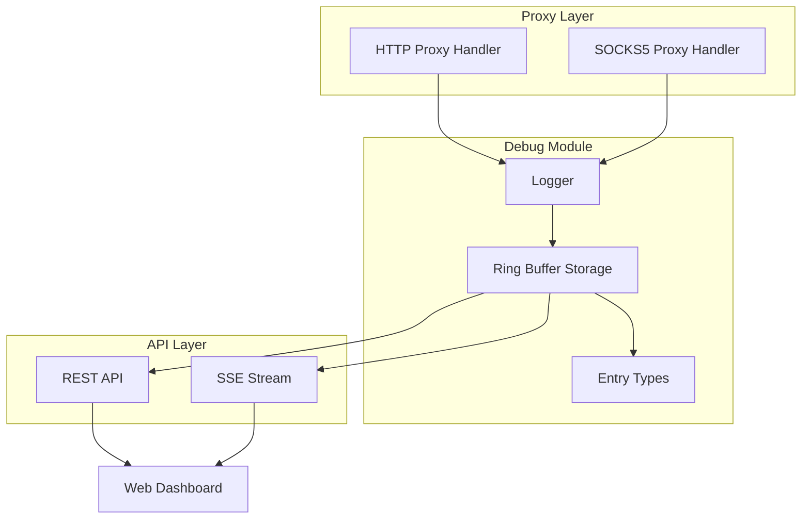
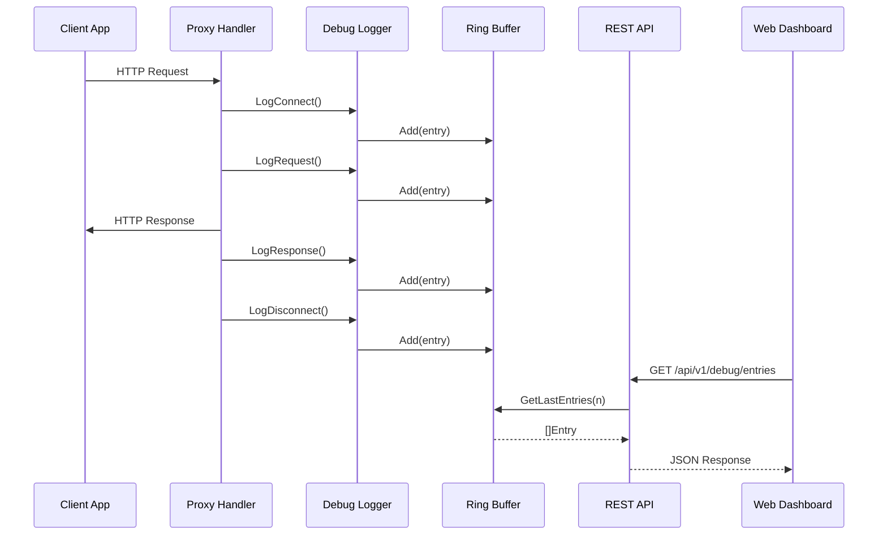
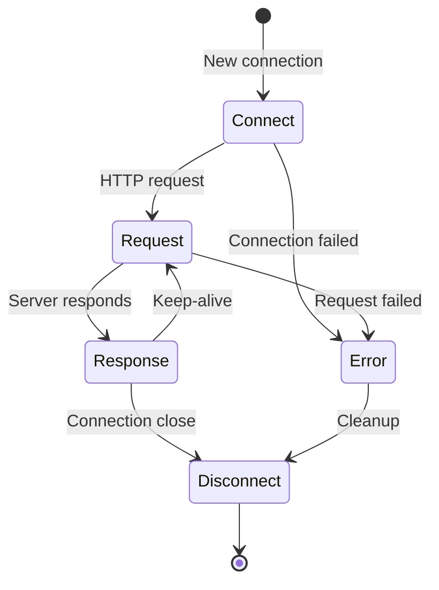
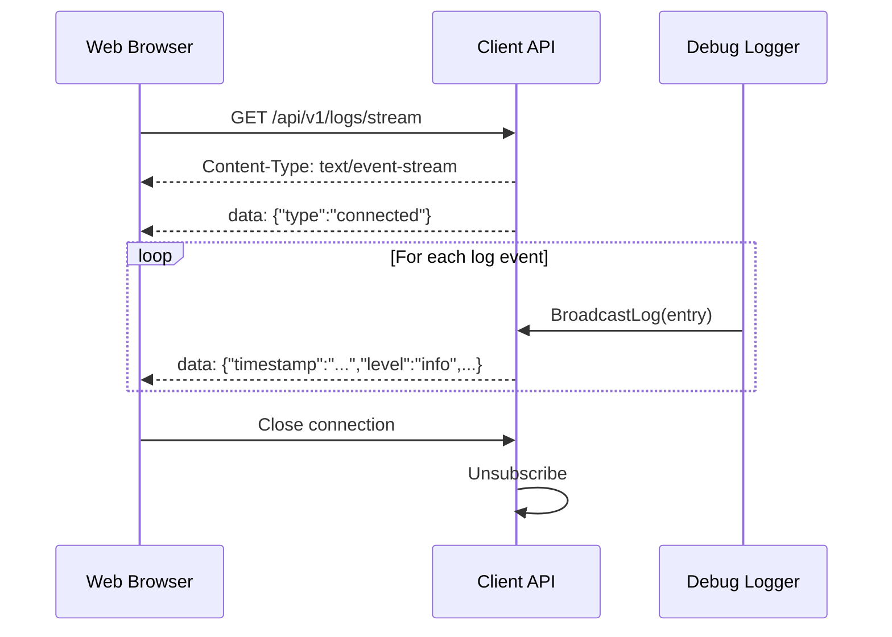
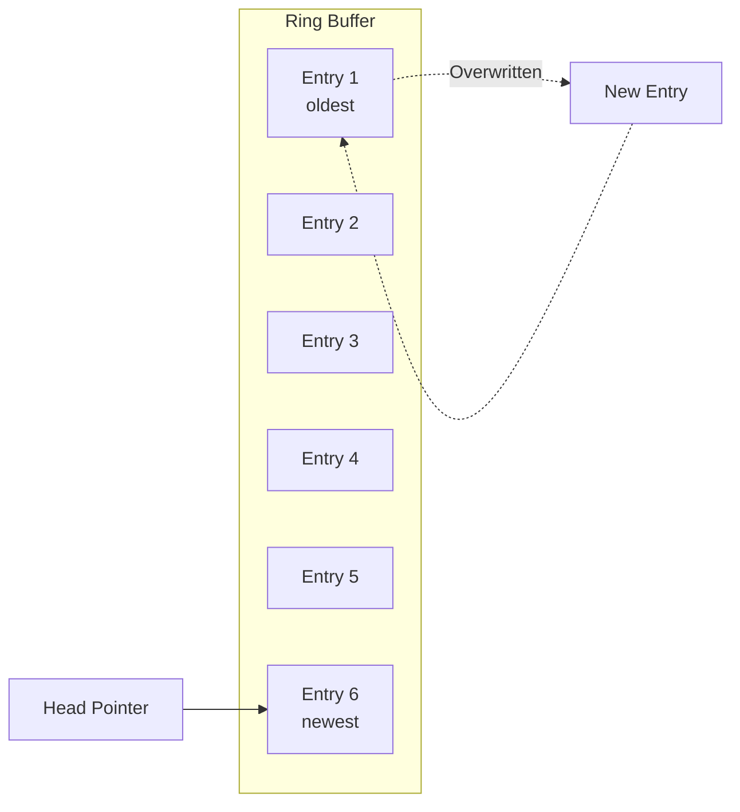

# Traffic Debugging

The Bifrost client includes a comprehensive traffic debugging system that allows you to inspect, analyze, and troubleshoot proxy traffic in real-time. This guide covers the debug module architecture, configuration, and common debugging scenarios.

## Overview

The traffic debugging system captures detailed information about all connections and requests passing through the client proxy. It provides:

- **Connection lifecycle tracking** - Monitor connect, request, response, and disconnect events
- **Request/response inspection** - View headers and optionally capture body content
- **Error tracking** - Quickly identify and diagnose connection failures
- **Real-time streaming** - Watch traffic as it happens via SSE (Server-Sent Events)
- **Memory-efficient storage** - Ring buffer design prevents unbounded memory growth

## Architecture

The debug module (`internal/debug/`) consists of three main components:



### Module Components

| Component | File | Purpose |
|-----------|------|---------|
| `Entry` | `entry.go` | Data structures for debug entries and entry types |
| `Logger` | `logger.go` | Main debug logging interface with capture controls |
| `Storage` | `storage.go` | Thread-safe ring buffer for entry storage |

### Entry Types

The debug system captures five types of events:

| Type | Description | Key Fields |
|------|-------------|------------|
| `connect` | Connection established | `host`, `client_addr`, `action` |
| `request` | HTTP request sent | `method`, `path`, `headers`, `body` |
| `response` | HTTP response received | `status_code`, `headers`, `body`, `duration` |
| `error` | Error occurred | `error`, `host` |
| `disconnect` | Connection closed | `duration`, `bytes_sent`, `bytes_received` |

### Data Flow



## Configuration

Enable and configure traffic debugging in your client configuration file:

```yaml
debug:
  # Enable traffic debugging (default: true)
  enabled: true

  # Maximum entries to keep in memory (default: 1000)
  max_entries: 1000

  # Capture request/response bodies (default: false)
  # Warning: May impact performance and memory usage
  capture_body: false

  # Maximum body size to capture in bytes (default: 65536 / 64KB)
  max_body_size: 65536

  # Filter to specific domains (optional, not yet implemented)
  filter_domains:
    - "*.example.com"
    - "api.myservice.com"
```

### Configuration Options

| Option | Type | Default | Description |
|--------|------|---------|-------------|
| `enabled` | bool | `true` | Enable/disable debug logging |
| `max_entries` | int | `1000` | Maximum entries in ring buffer |
| `capture_body` | bool | `false` | Capture request/response bodies |
| `max_body_size` | int | `65536` | Max body size to capture (bytes) |
| `filter_domains` | []string | `[]` | Domain filter patterns (reserved) |

:::caution[Performance Impact]
Enabling `capture_body` will increase memory usage and may impact performance for high-traffic scenarios. Only enable when actively debugging specific issues.
:::

## Capture Modes

### Connection-Level Monitoring

Basic connection monitoring is always active when debugging is enabled:



Each state transition generates a debug entry with:
- **Connect**: Host, client IP, timestamp, routing action (server/direct)
- **Disconnect**: Duration, total bytes sent/received

### Request-Level Monitoring

For HTTP traffic, detailed request information is captured:

```go
// Entry fields for request/response
type Entry struct {
    ID              string            // Unique identifier
    Timestamp       time.Time         // Event timestamp
    Type            EntryType         // connect, request, response, error, disconnect
    Host            string            // Target hostname
    Method          string            // HTTP method (GET, POST, etc.)
    Path            string            // Request path
    Protocol        string            // Network protocol
    StatusCode      int               // HTTP status code
    Duration        time.Duration     // Round-trip time
    BytesSent       int64             // Bytes transmitted
    BytesReceived   int64             // Bytes received
    Error           string            // Error message if applicable
    Action          string            // Routing action (server, direct)
    ClientAddr      string            // Client IP address
    RequestHeaders  map[string]string // HTTP request headers
    ResponseHeaders map[string]string // HTTP response headers
    RequestBody     []byte            // Request payload (if capture enabled)
    ResponseBody    []byte            // Response payload (if capture enabled)
}
```

### Body Capture

When `capture_body: true` is set:

1. Request and response bodies are captured
2. Bodies exceeding `max_body_size` are truncated
3. Binary content is stored as raw bytes
4. Headers are always captured regardless of body settings

## Filtering

### Built-in Filters

The debug system provides several filtering methods:

| Method | Description | Use Case |
|--------|-------------|----------|
| `GetLastEntries(n)` | Get newest N entries | Recent activity view |
| `FindByHost(host)` | Filter by hostname | Domain-specific debugging |
| `FindErrors()` | Get error entries only | Error analysis |
| `Find(predicate)` | Custom filter function | Advanced filtering |

### API Filtering

Filter debug entries via the REST API:

```bash
# Get last 50 entries
curl http://localhost:7383/api/v1/debug/entries/last/50

# Get only errors
curl http://localhost:7383/api/v1/debug/errors
```

## Real-Time Streaming

The client API provides Server-Sent Events (SSE) for real-time log streaming.

### SSE Endpoint

```http
GET /api/v1/logs/stream
```

### Connection Flow



### JavaScript Example

```javascript
const eventSource = new EventSource('http://localhost:7383/api/v1/logs/stream');

eventSource.onmessage = (event) => {
  const log = JSON.parse(event.data);

  if (log.type === 'connected') {
    console.log('Connected to log stream');
    return;
  }

  console.log(`[${log.level}] ${log.timestamp}: ${log.message}`);
  console.log('Details:', log.fields);
};

eventSource.onerror = (error) => {
  console.error('Stream error:', error);
  eventSource.close();
};
```

### Stream Message Format

```json
{
  "timestamp": "2024-01-15T10:30:00Z",
  "level": "info",
  "message": "GET https://api.example.com/data",
  "fields": {
    "method": "GET",
    "url": "https://api.example.com/data",
    "status_code": 200,
    "duration_ms": 150,
    "action": "server",
    "error": ""
  }
}
```

### Subscriber Limits

- Maximum 100 concurrent SSE subscribers
- Per-subscriber buffer of 100 entries
- Entries dropped (not queued) if subscriber buffer is full

## REST API Reference

### Debug Endpoints

| Method | Endpoint | Description |
|--------|----------|-------------|
| `GET` | `/api/v1/debug/entries` | Get all debug entries |
| `GET` | `/api/v1/debug/entries/last/{count}` | Get last N entries (newest first) |
| `DELETE` | `/api/v1/debug/entries` | Clear all entries |
| `GET` | `/api/v1/debug/errors` | Get error entries only |
| `GET` | `/api/v1/debug/memory` | Get memory statistics |

### Example Responses

**GET /api/v1/debug/entries/last/2**

```json
[
  {
    "id": "1705312200-42",
    "timestamp": "2024-01-15T10:30:00Z",
    "type": "response",
    "host": "api.example.com",
    "method": "GET",
    "path": "/users/123",
    "status_code": 200,
    "duration_ms": 150000000,
    "bytes_sent": 256,
    "bytes_received": 1024,
    "action": "server",
    "client_addr": "127.0.0.1:54321",
    "request_headers": {
      "Accept": "application/json",
      "User-Agent": "MyApp/1.0"
    },
    "response_headers": {
      "Content-Type": "application/json",
      "Cache-Control": "no-cache"
    }
  },
  {
    "id": "1705312199-41",
    "timestamp": "2024-01-15T10:29:59Z",
    "type": "connect",
    "host": "api.example.com:443",
    "action": "server",
    "client_addr": "127.0.0.1:54321"
  }
]
```

**GET /api/v1/debug/memory**

```json
{
  "heap_alloc": 5242880,
  "heap_sys": 8388608,
  "heap_idle": 2097152,
  "heap_inuse": 6291456,
  "heap_released": 1048576,
  "heap_objects": 12500,
  "stack_inuse": 524288,
  "stack_sys": 524288,
  "num_gc": 15,
  "last_gc_pause_ns": 500000,
  "total_gc_pause_ns": 7500000,
  "gc_cpu_fraction": 0.001,
  "num_goroutines": 25,
  "log_subscribers": 2
}
```

## Common Debugging Scenarios

### Scenario 1: Debugging Connection Failures

When connections are failing to a specific service:

```bash
# 1. Enable debugging (if not already)
# Edit config: debug.enabled: true

# 2. Get recent errors
curl http://localhost:7383/api/v1/debug/errors | jq

# 3. Look for patterns
# - Check the 'host' field for failing domains
# - Check the 'error' field for error messages
# - Check the 'action' field to see routing (server vs direct)
```

### Scenario 2: Analyzing Slow Requests

To identify performance bottlenecks:

```bash
# Get recent entries and filter by duration
curl http://localhost:7383/api/v1/debug/entries/last/100 | \
  jq '[.[] | select(.type == "response") | {host, path, duration_ms: .duration_ms / 1000000}] | sort_by(.duration_ms) | reverse | .[0:10]'
```

### Scenario 3: Inspecting Request/Response Bodies

For debugging API issues:

```yaml
# 1. Enable body capture in config
debug:
  enabled: true
  capture_body: true
  max_body_size: 131072  # 128KB
```

```bash
# 2. Make the problematic request through the proxy

# 3. Retrieve entries with bodies
curl http://localhost:7383/api/v1/debug/entries/last/10 | \
  jq '.[] | select(.request_body != null or .response_body != null)'
```

### Scenario 4: Real-Time Traffic Monitoring

For live debugging sessions:

```javascript
// In browser console or Node.js
const es = new EventSource('http://localhost:7383/api/v1/logs/stream');

es.onmessage = (e) => {
  const log = JSON.parse(e.data);
  if (log.fields?.error) {
    console.error(`ERROR: ${log.message}`, log.fields.error);
  } else {
    console.log(`${log.fields?.status_code || '---'} ${log.message} (${log.fields?.duration_ms}ms)`);
  }
};
```

### Scenario 5: Verifying Routing Rules

To confirm traffic is being routed correctly:

```bash
# Get entries and check the 'action' field
curl http://localhost:7383/api/v1/debug/entries/last/50 | \
  jq 'group_by(.action) | map({action: .[0].action, count: length, hosts: [.[].host] | unique})'
```

## Storage Architecture

The debug system uses a ring buffer for memory-efficient storage:



### Ring Buffer Characteristics

- **Fixed capacity**: Pre-allocated based on `max_entries`
- **O(1) insertion**: No resizing or reallocation
- **Automatic eviction**: Oldest entries overwritten when full
- **Thread-safe**: RWMutex protection for concurrent access
- **No GC pressure**: Reuses allocated memory

### Memory Estimation

Approximate memory usage per entry (without body capture):

| Component | Size |
|-----------|------|
| Base fields | ~200 bytes |
| Headers (avg) | ~500 bytes |
| String allocations | ~300 bytes |
| **Total per entry** | **~1 KB** |

For 1000 entries (default): ~1 MB base memory usage

With body capture enabled, add up to `max_body_size * 2` per entry.

## Extending the Debug Module

### Adding Custom Entry Types

To add new event types, modify `internal/debug/entry.go`:

```go
const (
    EntryTypeConnect    EntryType = "connect"
    EntryTypeRequest    EntryType = "request"
    EntryTypeResponse   EntryType = "response"
    EntryTypeError      EntryType = "error"
    EntryTypeDisconnect EntryType = "disconnect"
    // Add custom types
    EntryTypeCache      EntryType = "cache"
    EntryTypeDNS        EntryType = "dns"
)
```

### Custom Filtering

Implement custom filters using the `Find` method:

```go
// Find entries with status code >= 500
serverErrors := logger.storage.Find(func(e Entry) bool {
    return e.StatusCode >= 500
})

// Find entries with high latency (> 5 seconds)
slowRequests := logger.storage.Find(func(e Entry) bool {
    return e.Duration > 5*time.Second
})

// Find entries by domain pattern
domainEntries := logger.storage.Find(func(e Entry) bool {
    return strings.HasSuffix(e.Host, ".example.com")
})
```

## Best Practices

1. **Production environments**: Keep `capture_body: false` unless actively debugging
2. **High-traffic scenarios**: Increase `max_entries` to maintain sufficient history
3. **Memory constraints**: Reduce `max_entries` on memory-limited systems
4. **Sensitive data**: Be aware that headers may contain auth tokens; clear debug logs after debugging sessions
5. **Long-running sessions**: Periodically clear entries via API to free string allocations
