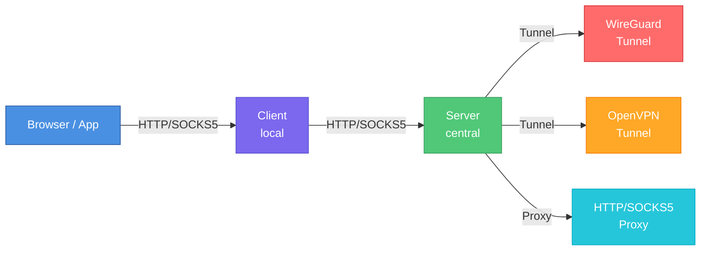

# Bifrost Proxy

A production-ready, MIT-licensed proxy server with support for WireGuard and OpenVPN tunnels, domain-based routing, multiple authentication modes, and comprehensive traffic management.

## Features

- **Multiple Proxy Protocols**: HTTP, HTTPS (CONNECT), SOCKS5
- **VPN Tunnel Support**: WireGuard (userspace), OpenVPN
- **TUN-based VPN Mode**: Full system traffic capture with split tunneling
- **Upstream Proxy Support**: Chain through HTTP or SOCKS5 proxies
- **Domain-Based Routing**: Route traffic through different backends based on domain patterns
- **HTTP Cache**: LAN cache for game downloads, software updates (steamcache/lancache-inspired)
- **Authentication Modes**: None, Native, System (PAM/macOS), LDAP, OAuth/OIDC, API Key, JWT, TOTP, HOTP, mTLS, Kerberos, NTLM
- **MFA Support**: Combine primary authentication with OTP for two-factor auth
- **Traffic Management**: Rate limiting, bandwidth throttling, health checks, load balancing
- **Observability**: Prometheus metrics, structured logging, access logs
- **Cross-Platform**: Windows, macOS, Linux
- **Web Dashboard**: Real-time monitoring, config generator, setup guides
- **Desktop Client**: Native GUI application with system tray integration
- **Mobile Client**: iOS and Android app for remote management

## Architecture



## Quick Start

### Server

```bash
# Build
make build-server

# Run with config
./bin/bifrost-server -c server-config.yaml
```

### Client

```bash
# Build
make build-client

# Generate a config file
./bin/bifrost-client config init -s your-server:7080

# Run with config
./bin/bifrost-client -c client-config.yaml
```

## Minimal Configuration

### Server

```yaml
server:
  http:
    listen: ":7080"
  socks5:
    listen: ":7180"

backends:
  - name: direct
    type: direct

routes:
  - domains: ["*"]
    backend: direct
```

### Client

```yaml
proxy:
  http:
    listen: "127.0.0.1:7380"

server:
  address: "proxy.example.com:7080"

routes:
  - domains: ["*"]
    action: server
```

## Web Dashboard

The server includes a built-in web dashboard accessible at the configured web UI port (default: `:7081`).

Features:

- **Dashboard**: Real-time connection stats and backend health
- **Backends**: View all configured backends and their status
- **Statistics**: Traffic metrics and request counts
- **Config Generator**: Generate client configurations with a visual form
- **Setup Guide**: Instructions for configuring browsers, system settings, and CLI tools

## Building

### Prerequisites

- Go 1.25+
- Make

### Build Commands

```bash
# Build everything
make build

# Build with specific targets
make build-server
make build-client

# Cross-platform builds
make build-all

# Run tests
make test

# Run linter
make lint
```

## License

MIT License - see [LICENSE](https://github.com/rennerdo30/bifrost-proxy/blob/main/LICENSE) for details.
