# Architecture

This document provides a comprehensive overview of Bifrost Proxy's architecture, including system design, component interactions, data flows, and extension points.

## Overview

Bifrost is a **dual-architecture proxy system** with distinct client and server components:

- **Server (`bifrost-server`)**: Central proxy hub with sophisticated routing, multiple backend types (WireGuard, OpenVPN, HTTP/SOCKS5 proxies), authentication, caching, and rate limiting
- **Client (`bifrost-client`)**: Local proxy with traffic debugging, split tunneling, VPN mode, mesh networking, and system proxy integration

Both components share common libraries for proxy handling, routing, and configuration, while implementing role-specific functionality.

## High-Level System Architecture

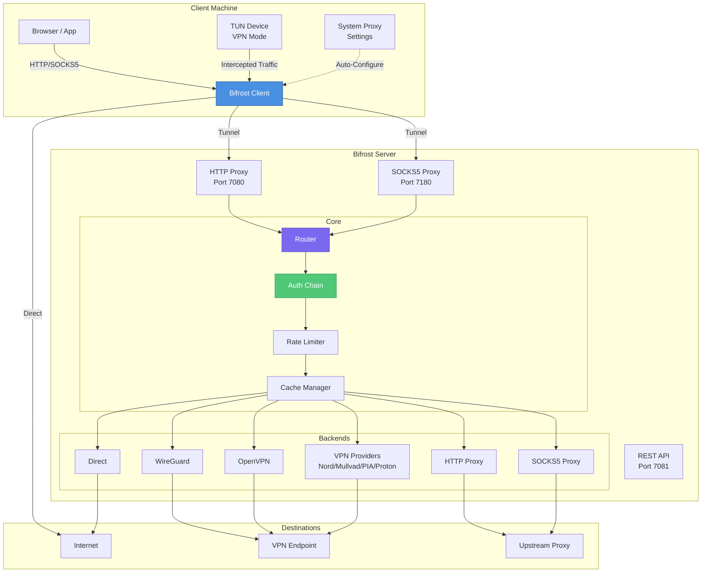

## Server Architecture

The server is the central proxy hub that handles incoming connections and routes them through various backends.

### Server Component Diagram

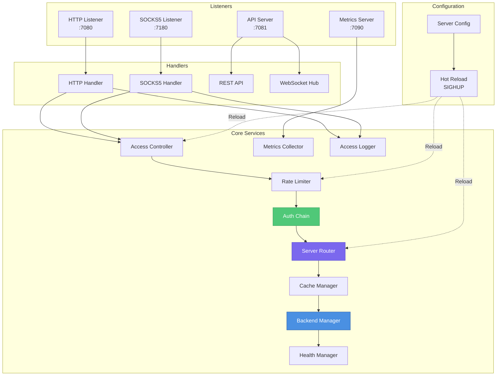

### Server Core Structure

The server's main structure in `internal/server/server.go`:

```go
Server {
    config           *config.ServerConfig
    backends         *backend.Manager           // Connection backends
    router           *router.ServerRouter       // Domain routing
    authenticator    auth.Authenticator         // Auth chain
    rateLimiterIP    *ratelimit.KeyedLimiter    // Per-IP rate limiting
    rateLimiterUser  *ratelimit.KeyedLimiter    // Per-user rate limiting
    accessController *accesscontrol.Controller  // Whitelist/blacklist
    bandwidthConfig  *ratelimit.BandwidthConfig // Throttling
    healthManager    *health.Manager            // Health checks
    metrics          *metrics.Metrics           // Prometheus metrics
    metricsCollector *metrics.Collector         // Stats collection
    accessLogger     accesslog.Logger           // Access logging
    cacheManager     *cache.Manager             // HTTP caching
    cacheInterceptor *cache.Interceptor         // Cache interception

    httpListener     net.Listener               // HTTP proxy socket
    socks5Listener   net.Listener               // SOCKS5 proxy socket
    metricsServer    *http.Server               // Prometheus /metrics
    apiServer        *http.Server               // REST API + WebSocket
    wsHub            *apiserver.WebSocketHub    // WebSocket events
}
```

## Client Architecture

The client acts as a local proxy that decides what traffic goes to the server versus direct connections.

### Client Component Diagram

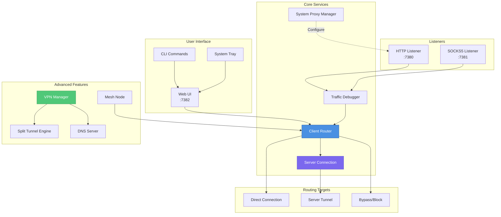

### Client Core Structure

The client's main structure in `internal/client/client.go`:

```go
Client {
    config          *config.ClientConfig
    router          *router.ClientRouter       // Domain-based routing
    serverConn      *ServerConnection          // Connection to proxy server
    debugger        *debug.Logger              // Traffic debugging
    vpnManager      *vpn.Manager               // TUN-based VPN mode
    sysProxyManager sysproxy.Manager           // System proxy settings
    tray            *tray.Tray                 // System tray UI

    httpListener    net.Listener               // HTTP proxy socket
    socks5Listener  net.Listener               // SOCKS5 proxy socket
    apiServer       *http.Server               // Web UI API server
}
```

## Data Flow Diagrams

### HTTP Proxy Request Flow (Server)

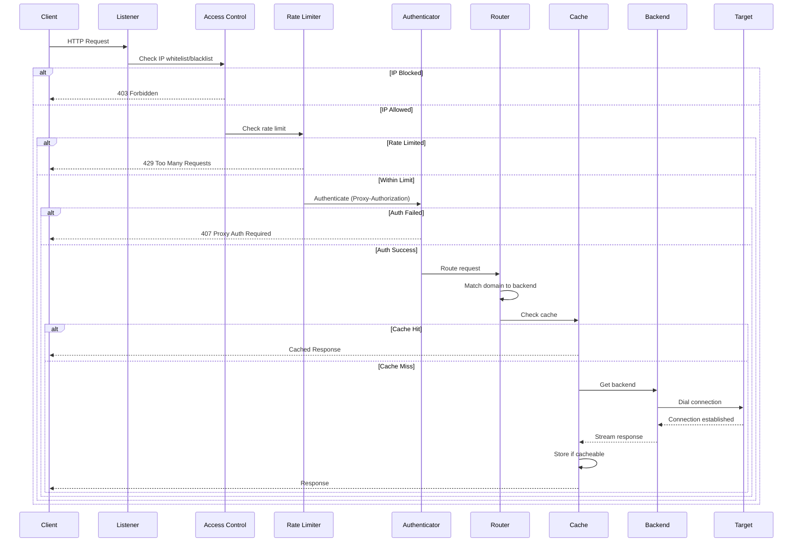

### Client Routing Decision Flow

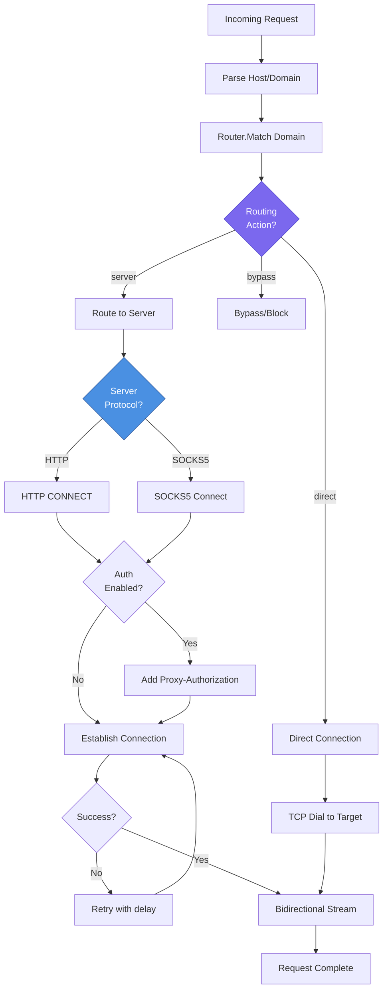

### VPN Mode Traffic Flow

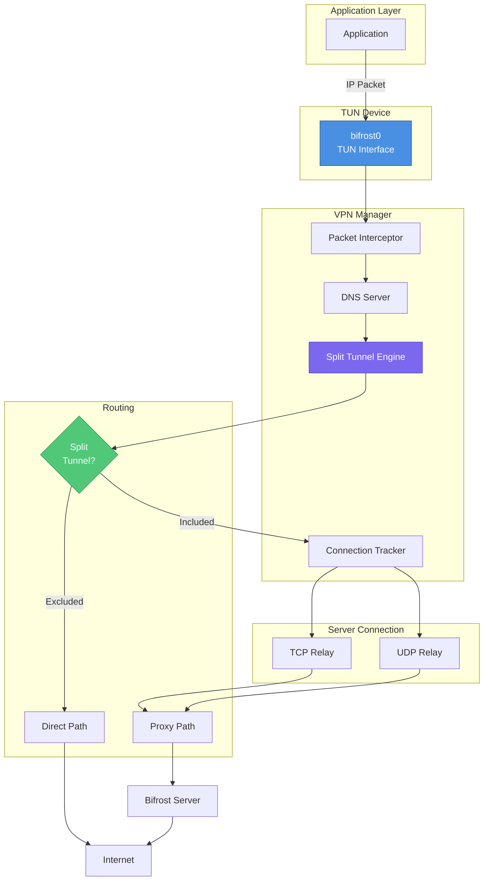

## Threading and Concurrency Model

### Goroutine Architecture

Bifrost uses Go's concurrency primitives extensively for high-performance proxy handling.

```mermaid
graph TB
    subgraph "Main Goroutine"
        Main[main]
        Signals[Signal Handler]
    end

    subgraph "Listener Goroutines"
        HTTPServe[serveHTTP]
        SOCKSServe[serveSOCKS5]
        APIServe[serveAPI]
    end

    subgraph "Per-Connection Goroutines"
        Conn1[Connection Handler 1]
        Conn2[Connection Handler 2]
        ConnN[Connection Handler N]
    end

    subgraph "Bidirectional Copy"
        CopyUp[Copy Client→Server]
        CopyDown[Copy Server→Client]
    end

    subgraph "Background Workers"
        HealthCheck[Health Check Worker]
        MetricsCollect[Metrics Collector]
        CacheExpiry[Cache Expiry Worker]
        MACExpiry[MAC Table Expiry]
    end

    subgraph "Synchronization"
        WG[sync.WaitGroup]
        Mutex[sync.RWMutex]
        Atomic[atomic.Int64]
        Channels[Channels]
    end

    Main --> Signals
    Main --> HTTPServe
    Main --> SOCKSServe
    Main --> APIServe

    HTTPServe --> Conn1
    HTTPServe --> Conn2
    SOCKSServe --> ConnN

    Conn1 --> CopyUp
    Conn1 --> CopyDown

    Main --> HealthCheck
    Main --> MetricsCollect
    Main --> CacheExpiry
    Main --> MACExpiry

    WG -.->|Track| HTTPServe
    WG -.->|Track| SOCKSServe
    Mutex -.->|Protect| Backend Manager
    Mutex -.->|Protect| Router
    Atomic -.->|Count| Active Connections

    style Main fill:#4a90e2,stroke:#2c5aa0,color:#fff
    style WG fill:#7b68ee,stroke:#5a4fcf,color:#fff
```

### Concurrency Patterns

| Pattern | Usage | Implementation |
|---------|-------|----------------|
| **Goroutine per Connection** | Handle concurrent clients | `go handleHTTPConn(conn)` |
| **WaitGroup** | Graceful shutdown | Track all connection handlers |
| **RWMutex** | Shared state access | Backend Manager, Router, Cache |
| **Atomic Operations** | Connection counters | Active connection tracking |
| **Channels** | Event broadcasting | WebSocket hub, shutdown signals |
| **Context** | Request lifecycle | Timeout, cancellation, tracing |

### Graceful Shutdown Sequence

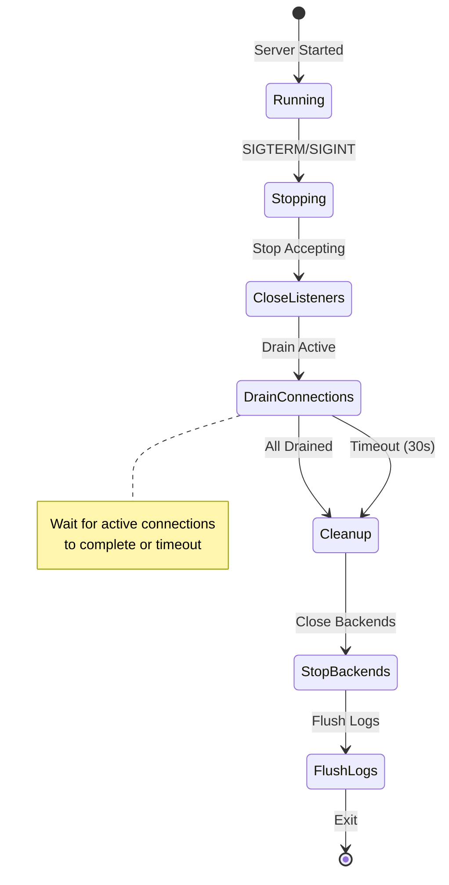

### Thread Safety Guarantees

| Component | Protection | Notes |
|-----------|------------|-------|
| Backend Manager | `sync.RWMutex` | Safe add/remove during operation |
| Route Table | `sync.RWMutex` | Hot-reload safe |
| Rate Limiters | `atomic` operations | Lock-free for performance |
| Cache Manager | `sync.RWMutex` | Concurrent reads, exclusive writes |
| MAC Table | `sync.RWMutex` | High-read, low-write workload |
| Metrics | `atomic` counters | No locking overhead |
| WebSocket Hub | Channel-based | Broadcast to all clients |

## Module Dependencies

### Package Dependency Graph

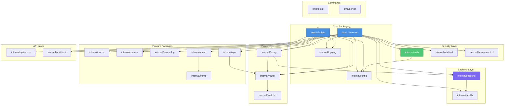

### Import Hierarchy

The codebase follows a strict import hierarchy to prevent circular dependencies:

1. **Utilities** (`internal/util/`, `internal/logging/`) - No internal dependencies
2. **Configuration** (`internal/config/`) - Only utilities
3. **Core Abstractions** (`internal/backend/`, `internal/auth/`, `internal/matcher/`) - Config + utilities
4. **Features** (`internal/cache/`, `internal/ratelimit/`, etc.) - Abstractions + config
5. **Handlers** (`internal/proxy/`, `internal/router/`) - Features + abstractions
6. **Applications** (`internal/server/`, `internal/client/`) - All internal packages
7. **Commands** (`cmd/`) - Applications only

## Extension Points and Plugin Architecture

### Authentication Plugin System

The authentication system uses a plugin architecture allowing multiple providers to be combined in a chain.

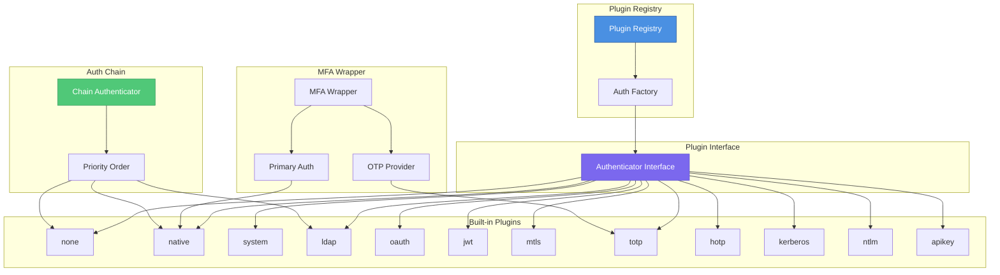

#### Authenticator Interface

```go
type Authenticator interface {
    // Authenticate validates credentials and returns user info
    Authenticate(ctx context.Context, username, password string) (*UserInfo, error)

    // Name returns the unique identifier for this plugin
    Name() string

    // Type returns the plugin type (e.g., "native", "ldap")
    Type() string
}

type UserInfo struct {
    Username string
    Groups   []string
    Email    string
    FullName string
    Metadata map[string]string
}
```

#### Registering a New Auth Plugin

Plugins are registered via Go's `init()` function:

```go
// internal/auth/plugin/myplugin/myplugin.go
func init() {
    auth.RegisterPlugin("myplugin", func(cfg map[string]interface{}) (auth.Authenticator, error) {
        return NewMyPlugin(cfg)
    })
}
```

Import the plugin in `cmd/server/main.go`:

```go
import (
    _ "github.com/rennerdo30/bifrost-proxy/internal/auth/plugin/myplugin"
)
```

### Backend Plugin System

Backends are created via a factory pattern, making it easy to add new backend types.

```mermaid
graph LR
    subgraph "Backend Interface"
        Interface[Backend Interface]
    end

    subgraph "Factory"
        Factory[Backend Factory]
        Create[Create Method]
    end

    subgraph "Backend Types"
        Direct[direct]
        HTTP[http_proxy]
        SOCKS5[socks5_proxy]
        WG[wireguard]
        OVPN[openvpn]
        Nord[nordvpn]
        Mullvad[mullvad]
        PIA[pia]
        Proton[protonvpn]
    end

    Factory --> Create
    Create --> Interface

    Interface --> Direct
    Interface --> HTTP
    Interface --> SOCKS5
    Interface --> WG
    Interface --> OVPN
    Interface --> Nord
    Interface --> Mullvad
    Interface --> PIA
    Interface --> Proton

    style Factory fill:#4a90e2,stroke:#2c5aa0,color:#fff
    style Interface fill:#7b68ee,stroke:#5a4fcf,color:#fff
```

#### Backend Interface

```go
type Backend interface {
    // Core operations
    Name() string
    Type() string
    Dial(ctx context.Context, network, address string) (net.Conn, error)
    DialTimeout(ctx context.Context, network, address string, timeout time.Duration) (net.Conn, error)

    // Lifecycle
    Start(ctx context.Context) error
    Stop(ctx context.Context) error

    // Health
    IsHealthy() bool
    Stats() Stats
}

type Stats struct {
    ActiveConnections int64
    TotalConnections  int64
    BytesSent         int64
    BytesReceived     int64
    ErrorCount        int64
    LastError         error
    Latency           time.Duration
    Uptime            time.Duration
}
```

#### Adding a New Backend Type

1. Create the backend implementation:

```go
// internal/backend/mybackend.go
type MyBackend struct {
    name   string
    config MyBackendConfig
    // ...
}

func NewMyBackend(name string, cfg MyBackendConfig) (*MyBackend, error) {
    return &MyBackend{name: name, config: cfg}, nil
}

func (b *MyBackend) Dial(ctx context.Context, network, address string) (net.Conn, error) {
    // Implementation
}

// Implement remaining Backend interface methods...
```

2. Register in the factory (`internal/backend/factory.go`):

```go
case "mybackend":
    return NewMyBackend(name, cfg.MyBackend)
```

3. Add configuration struct (`internal/config/server.go`):

```go
type BackendConfig struct {
    // ...existing fields...
    MyBackend MyBackendConfig `yaml:"mybackend"`
}
```

### Cache Storage Backends

The cache system supports pluggable storage backends.

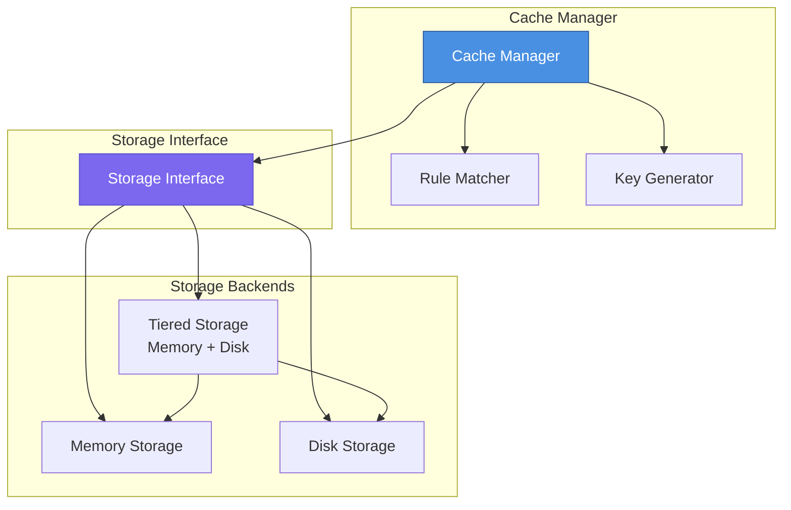

#### Storage Interface

```go
type Storage interface {
    Get(key string) (*CacheEntry, bool)
    Set(key string, entry *CacheEntry) error
    Delete(key string) error
    Clear() error
    Stats() StorageStats
}
```

### Hot-Reloadable Components

Certain components support hot-reload without dropping connections:

| Component | Hot-Reload | Signal |
|-----------|------------|--------|
| Routes | ✅ Yes | `SIGHUP` |
| Rate Limits | ✅ Yes | `SIGHUP` |
| Access Control | ✅ Yes | `SIGHUP` |
| Backends | ✅ Yes | `SIGHUP` |
| Cache Rules | ✅ Yes | `SIGHUP` |
| Log Levels | ✅ Yes | `SIGHUP` |
| Port Bindings | ❌ No | Restart |
| TLS Certificates | ❌ No | Restart |
| Auth Mode | ❌ No | Restart |

## Design Patterns

### Patterns Used

| Pattern | Usage | Example |
|---------|-------|---------|
| **Factory** | Object creation | Backend Factory, Auth Factory |
| **Chain of Responsibility** | Auth chain | Try providers in priority order |
| **Strategy** | Algorithm selection | Load balancer strategies |
| **Observer** | Event notification | WebSocket broadcasting |
| **Decorator** | Wrapping behavior | Health-wrapped backends |
| **Template Method** | Common flow | Proxy handler base |

### Factory Pattern Example

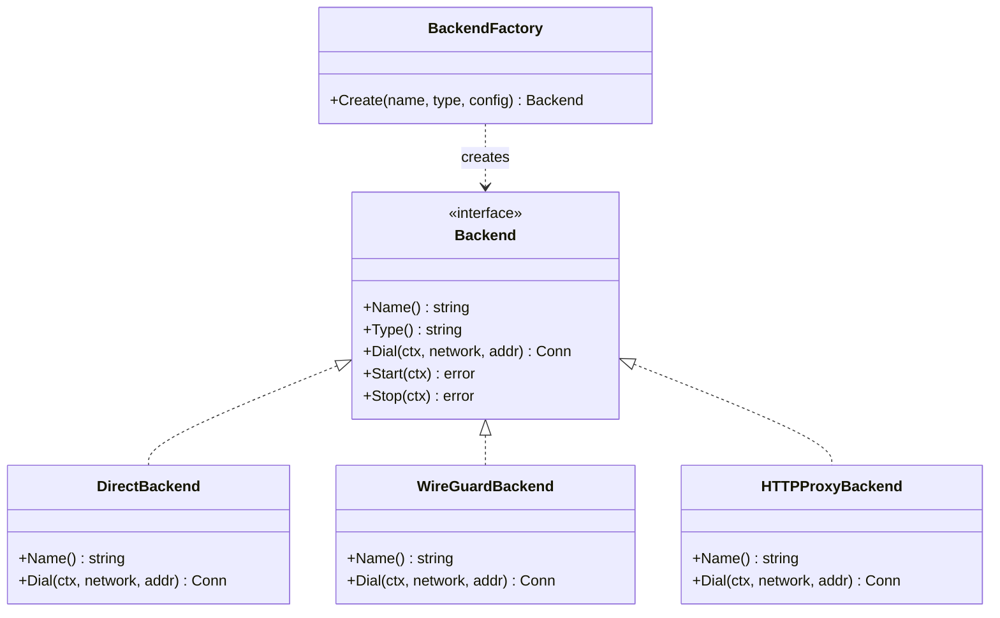

### Chain of Responsibility (Auth)

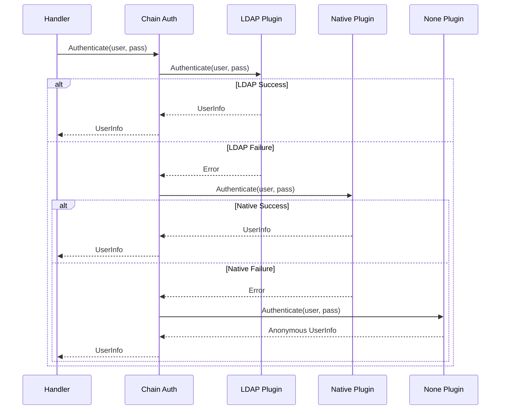

## Performance Optimizations

### Connection Handling

- **Connection Pooling**: Keep-alive connections to backends
- **Bidirectional Copy**: Concurrent goroutines for each direction
- **Zero-Copy**: Where possible, avoid buffer copies
- **Buffer Pooling**: Reuse buffers via `sync.Pool`

### Memory Management

- **Pre-allocated Maps**: Sized based on expected load
- **Entry Expiration**: Prevent unbounded growth in caches/tables
- **Lazy Initialization**: Defer expensive operations

### Network Optimizations

- **TCP Fast Open**: Supported on compatible platforms
- **TCP_NODELAY**: Disable Nagle's algorithm for latency
- **SO_REUSEPORT**: Multiple listeners for load distribution

### Configuration Tuning

```yaml
# Low-power device optimizations
metrics:
  collection_interval: "60s"  # Reduce from 15s default

websocket:
  max_clients: 10  # Reduce from 100 default

connection_limits:
  max_connections: 1000  # Reduce from 10000
```

## Context and Request Tracing

### Request Context Fields

Each request carries context with tracing information:

| Field | Type | Description |
|-------|------|-------------|
| `request_id` | string | Unique ID (nanosecond timestamp) |
| `client_ip` | string | Remote client address |
| `start_time` | time.Time | Request start timestamp |
| `domain` | string | Target domain/host |
| `username` | string | Authenticated user (if any) |
| `backend` | string | Selected backend name |

### Tracing Flow

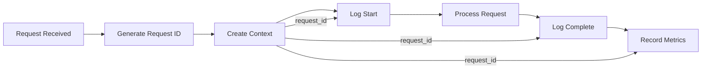

## Related Documentation

- [Frame Processing](/internals/frame-processing/) - Ethernet frame handling for mesh networking
- [Authentication](/configuration/authentication/) - Auth plugin configuration
- [Backends](/configuration/backends/) - Backend types and configuration
- [VPN Mode](/vpn-mode/) - TUN-based VPN configuration
- [Mesh Networking](/mesh-networking/) - P2P mesh setup
