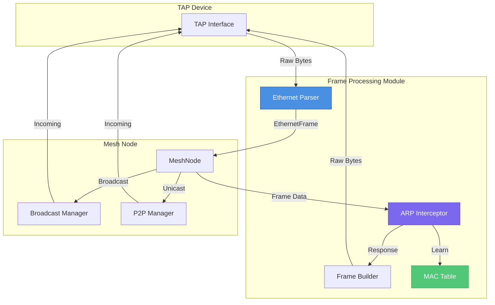
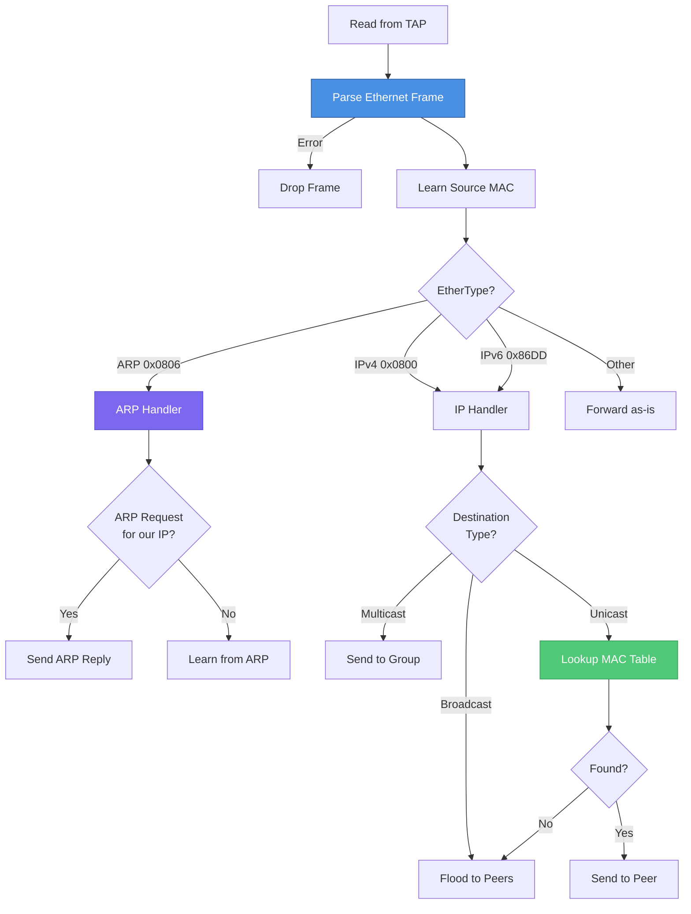
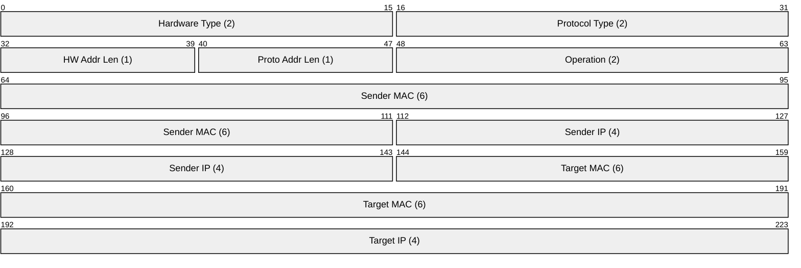
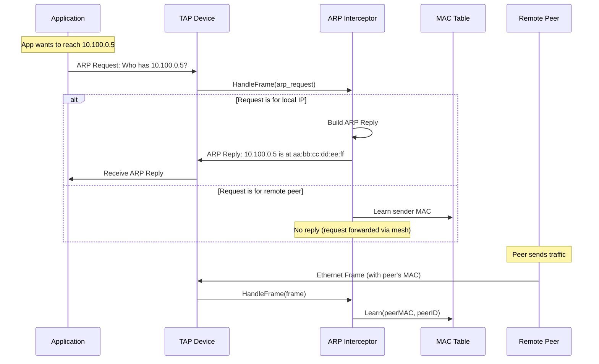
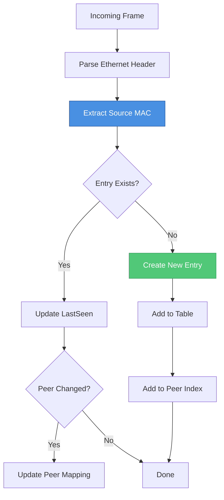
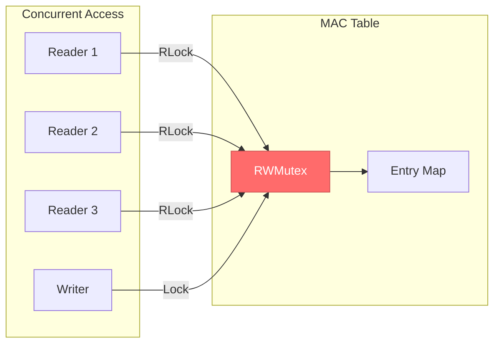
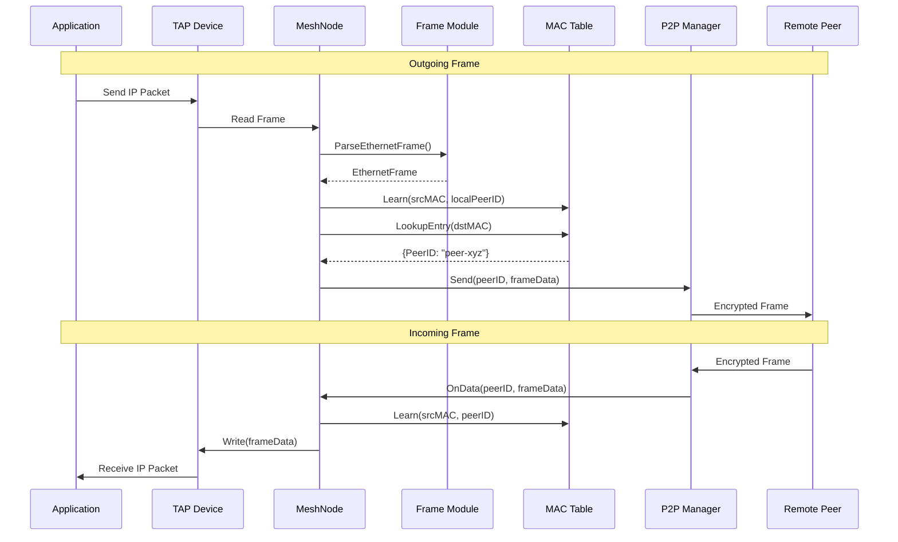

# Frame Processing

The `internal/frame/` module provides low-level Ethernet frame processing for TAP device networking. This module is essential for Layer 2 mesh networking, enabling virtual LAN functionality between peers.

## Overview

The frame processing system provides:

- **Ethernet Frame Parsing** - Parse raw Ethernet frames from TAP devices
- **Frame Building** - Construct Ethernet frames for transmission
- **ARP Handling** - Process ARP requests/replies for address resolution
- **MAC Table Management** - Learn and lookup MAC addresses for forwarding decisions

## Architecture



## Module Components

| Component | File | Purpose |
|-----------|------|---------|
| `EthernetFrame` | `ethernet.go` | Ethernet frame parsing and building |
| `ARPPacket` | `arp.go` | ARP packet handling and ARP interceptor |
| `MACTable` | `mac_table.go` | Thread-safe MAC address learning and lookup |

## Ethernet Frame Processing

### Frame Structure

The Ethernet frame follows the IEEE 802.3 standard:


**Implementation details** (`internal/frame/ethernet.go`):

```go
// EthernetHeader represents an Ethernet frame header
type EthernetHeader struct {
    DstMAC    net.HardwareAddr // Destination MAC address (6 bytes)
    SrcMAC    net.HardwareAddr // Source MAC address (6 bytes)
    EtherType EtherType        // EtherType field (2 bytes)
}

// EthernetFrame represents a complete Ethernet frame
type EthernetFrame struct {
    Header  EthernetHeader
    Payload []byte
    Raw     []byte // Original raw frame (for forwarding)
}
```

### Size Constants

| Constant | Value | Description |
|----------|-------|-------------|
| `EthernetHeaderSize` | 14 bytes | Header size without payload |
| `MinEthernetFrame` | 60 bytes | Minimum frame size (padded if smaller) |
| `MaxEthernetFrame` | 1522 bytes | Maximum with VLAN tag |
| `MaxPayload` | 1500 bytes | Standard MTU |

### Supported EtherTypes

| EtherType | Value | Description |
|-----------|-------|-------------|
| `EtherTypeIPv4` | `0x0800` | IPv4 packets |
| `EtherTypeARP` | `0x0806` | ARP packets |
| `EtherTypeIPv6` | `0x86DD` | IPv6 packets |
| `EtherTypeVLAN` | `0x8100` | 802.1Q VLAN-tagged frames |

### Parsing Frames

```go
// Parse a raw Ethernet frame from TAP device
frame, err := frame.ParseEthernetFrame(rawBytes)
if err != nil {
    // Handle: ErrFrameTooShort, etc.
}

// Access frame fields
destMAC := frame.Header.DstMAC
srcMAC := frame.Header.SrcMAC
etherType := frame.Header.EtherType
payload := frame.Payload

// Check frame type
if frame.IsIPv4() {
    // Process IPv4 packet
} else if frame.IsARP() {
    // Process ARP packet
}

// Check destination type
if frame.IsBroadcast() {
    // Flood to all peers
} else if frame.IsMulticast() {
    // Send to multicast group
} else {
    // Unicast - lookup MAC table
}
```

### Building Frames

```go
// Build an Ethernet frame
frameBytes, err := frame.BuildEthernetFrame(
    dstMAC,        // Destination MAC
    srcMAC,        // Source MAC
    frame.EtherTypeIPv4,  // EtherType
    ipPayload,     // IP packet payload
)
if err != nil {
    // Handle: ErrInvalidMAC, ErrPayloadTooLarge
}

// Write to TAP device
_, err = tapDevice.Write(frameBytes)
```

### Frame Processing Flow



## ARP Processing

### ARP Packet Structure



**Implementation details** (`internal/frame/arp.go`):

```go
// ARPPacket represents an ARP packet
type ARPPacket struct {
    HardwareType       uint16           // Ethernet = 1
    ProtocolType       uint16           // IPv4 = 0x0800
    HardwareAddrLen    uint8            // 6 for Ethernet
    ProtocolAddrLen    uint8            // 4 for IPv4
    Operation          uint16           // 1 = request, 2 = reply
    SenderHardwareAddr net.HardwareAddr
    SenderProtocolAddr netip.Addr
    TargetHardwareAddr net.HardwareAddr
    TargetProtocolAddr netip.Addr
}
```

### ARP Operations

| Operation | Value | Description |
|-----------|-------|-------------|
| `ARPRequest` | 1 | Who has IP X? Tell IP Y |
| `ARPReply` | 2 | IP X is at MAC Z |

### ARP Interceptor

The `ARPInterceptor` handles ARP traffic for virtual network interfaces:

```go
// Create ARP interceptor for a virtual interface
interceptor := frame.NewARPInterceptor(
    localMAC,   // Our virtual MAC address
    localIP,    // Our virtual IP address
    macTable,   // MAC table for learning
)

// Process incoming frame
response := interceptor.HandleFrame(frameData)
if response != nil {
    // Write ARP reply to TAP device
    tapDevice.Write(response)
}
```

### ARP Request/Reply Flow



### Building ARP Packets

```go
// Build ARP request
arpRequest, _ := frame.BuildARPRequest(
    senderMAC,    // Our MAC
    senderIP,     // Our IP
    targetIP,     // IP we're looking for
)

// Build ARP reply
arpReply, _ := frame.BuildARPReply(
    senderMAC,    // Our MAC
    senderIP,     // Our IP
    targetMAC,    // Requester's MAC
    targetIP,     // Requester's IP
)

// Build complete Ethernet frame with ARP packet
ethFrame, _ := frame.BuildARPRequestFrame(senderMAC, senderIP, targetIP)
// Automatically uses broadcast destination for requests
```

## MAC Address Table

### Purpose

The MAC table maintains a mapping between:
- MAC addresses seen on the virtual network
- Peer IDs that own those MAC addresses
- Optional virtual IP addresses

This enables the mesh node to forward unicast frames directly to the correct peer.

### MAC Entry Structure

```go
type MACEntry struct {
    MAC       net.HardwareAddr // MAC address
    PeerID    string           // Peer that owns this MAC
    VirtualIP netip.Addr       // Associated IP (if known)
    LastSeen  time.Time        // Last traffic timestamp
    LearnedAt time.Time        // When first learned
    Static    bool             // Static entries don't expire
}
```

### MAC Table Operations

**Implementation details** (`internal/frame/mac_table.go`):

| Operation | Description |
|-----------|-------------|
| `Learn(mac, peerID)` | Add or update a MAC entry |
| `LearnWithIP(mac, peerID, ip)` | Learn with associated IP |
| `LearnStatic(mac, peerID, ip)` | Add non-expiring entry |
| `Lookup(mac)` | Get peer ID for MAC |
| `LookupEntry(mac)` | Get full entry for MAC |
| `LookupByIP(ip)` | Find MAC by IP address |
| `GetPeerMACs(peerID)` | Get all MACs for a peer |
| `Remove(mac)` | Remove specific entry |
| `RemovePeer(peerID)` | Remove all entries for peer |
| `Expire()` | Remove stale entries |

### Learning Process



### Entry Expiration

Entries automatically expire after the configured `MaxAge` (default: 5 minutes):

```go
// Configure MAC table
cfg := frame.MACTableConfig{
    MaxAge: 5 * time.Minute,
}
table := frame.NewMACTable(cfg)

// Start background expiry worker
stopCh := make(chan struct{})
table.StartExpiryWorker(time.Minute, stopCh)

// Manual expiration
expired := table.Expire() // Returns count of expired entries
```

### Thread Safety

The MAC table is fully thread-safe:
- Uses `sync.RWMutex` for concurrent access
- Read operations use `RLock()` for parallelism
- Write operations use `Lock()` for exclusivity



## Integration with Mesh Node

### Frame Processing in MeshNode

The `MeshNode` (`internal/mesh/node.go`) integrates the frame module:

```go
// MeshNode uses frame processing for TAP networking
type MeshNode struct {
    // ...
    macTable   *frame.MACTable
    arpHandler *frame.ARPInterceptor
    // ...
}

// Initialization
func (n *MeshNode) initializeDevice() error {
    // Create MAC table
    n.macTable = frame.NewMACTable(frame.MACTableConfig{
        MaxAge: 5 * time.Minute,
    })

    // Create ARP handler for TAP mode
    if n.config.Device.Type == "tap" && n.localMAC != nil {
        n.arpHandler = frame.NewARPInterceptor(
            n.localMAC,
            n.localIP,
            n.macTable,
        )
    }
    // ...
}
```

### TAP Frame Handling

```go
// handleTAPFrame processes frames from TAP device
func (n *MeshNode) handleTAPFrame(frameData []byte) {
    // Parse Ethernet frame
    ethFrame, err := frame.ParseEthernetFrame(frameData)
    if err != nil {
        return
    }

    // Learn source MAC
    n.macTable.Learn(ethFrame.Header.SrcMAC, n.localPeerID)

    // Handle ARP
    if ethFrame.Header.EtherType == frame.EtherTypeARP {
        response := n.arpHandler.HandleFrame(frameData)
        if response != nil {
            n.device.Write(response)
        }
        return
    }

    // Route based on destination
    if frame.IsBroadcast(ethFrame.Header.DstMAC) {
        n.broadcast.Broadcast(frameData, 8)
    } else if frame.IsMulticast(ethFrame.Header.DstMAC) {
        n.broadcast.Multicast(groupID, frameData, 8)
    } else {
        // Unicast - lookup and send
        entry, found := n.macTable.LookupEntry(ethFrame.Header.DstMAC)
        if found {
            n.sendToP2P(entry.PeerID, frameData)
        } else {
            n.broadcast.Broadcast(frameData, 8) // Unknown - flood
        }
    }
}
```

### Complete Frame Flow



## Extension Points

### Custom Frame Handlers

You can extend the frame processing by implementing custom handlers:

```go
// Custom frame handler interface (conceptual)
type FrameHandler interface {
    HandleFrame(frame *frame.EthernetFrame) (response []byte, handled bool)
}

// Example: Custom protocol handler
type MyProtocolHandler struct {
    etherType frame.EtherType
}

func (h *MyProtocolHandler) HandleFrame(f *frame.EthernetFrame) ([]byte, bool) {
    if f.Header.EtherType != h.etherType {
        return nil, false
    }
    // Process custom protocol
    return response, true
}
```

### Custom MAC Table Filters

Implement custom lookups using the `Find` method:

```go
// Find all MACs for a specific IP subnet
subnetMACs := macTable.Find(func(e *frame.MACEntry) bool {
    if !e.VirtualIP.IsValid() {
        return false
    }
    prefix := netip.MustParsePrefix("10.100.0.0/24")
    return prefix.Contains(e.VirtualIP)
})

// Find recently active MACs
recentMACs := macTable.Find(func(e *frame.MACEntry) bool {
    return time.Since(e.LastSeen) < time.Minute
})
```

### Adding New EtherTypes

To handle additional protocols:

```go
// Add new EtherType constant
const (
    EtherTypeMyProtocol frame.EtherType = 0x88B5 // Example
)

// Check for custom protocol in handler
if ethFrame.Header.EtherType == EtherTypeMyProtocol {
    handleMyProtocol(ethFrame.Payload)
}
```

## Error Handling

### Common Errors

| Error | Cause | Solution |
|-------|-------|----------|
| `ErrFrameTooShort` | Frame < 14 bytes | Check TAP device reads |
| `ErrFrameTooLong` | Frame > 1522 bytes | Check MTU settings |
| `ErrInvalidMAC` | MAC not 6 bytes | Validate input addresses |
| `ErrPayloadTooLarge` | Payload > 1500 bytes | Fragment or reduce MTU |
| `ErrARPTooShort` | ARP packet < 28 bytes | Check frame parsing |
| `ErrARPInvalidType` | Non-Ethernet/IPv4 ARP | Only Ethernet/IPv4 supported |

### Error Handling Pattern

```go
frame, err := frame.ParseEthernetFrame(data)
if err != nil {
    switch {
    case errors.Is(err, frame.ErrFrameTooShort):
        // Log and skip malformed frame
        slog.Debug("frame too short", "len", len(data))
    case errors.Is(err, frame.ErrFrameTooLong):
        // Possible MTU issue
        slog.Warn("frame too long", "len", len(data))
    default:
        slog.Error("frame parse error", "error", err)
    }
    return
}
```

## Performance Considerations

### Memory Efficiency

- Frames use `Raw` field to preserve original bytes for forwarding
- MAC table uses pre-allocated maps
- Entry expiration prevents unbounded growth

### Throughput Optimization

1. **Minimize copying**: Use `frame.Raw` for forwarding instead of rebuilding
2. **Batch operations**: Process multiple frames before flushing
3. **Tune MAC table expiry**: Balance memory vs. lookup misses

### Benchmarks

Typical performance characteristics:

| Operation | Approximate Time |
|-----------|-----------------|
| Parse Ethernet frame | ~50 ns |
| Build Ethernet frame | ~100 ns |
| MAC table lookup | ~20 ns |
| MAC table learn | ~50 ns |
| ARP packet parse | ~80 ns |

## Debugging

### Logging Frame Processing

Enable debug logging to trace frame handling:

```go
slog.Debug("processing frame",
    "src_mac", ethFrame.Header.SrcMAC,
    "dst_mac", ethFrame.Header.DstMAC,
    "ether_type", ethFrame.Header.EtherType,
    "payload_len", len(ethFrame.Payload),
)
```

### MAC Table Inspection

```go
// Get all entries for debugging
entries := macTable.All()
for _, e := range entries {
    slog.Info("mac entry",
        "mac", e.MAC,
        "peer_id", e.PeerID,
        "ip", e.VirtualIP,
        "age", time.Since(e.LearnedAt),
    )
}
```

### Common Issues

| Symptom | Possible Cause | Debug Steps |
|---------|---------------|-------------|
| Frames not reaching peers | MAC not learned | Check `macTable.Lookup()` |
| ARP not resolving | ARP interceptor not handling | Verify `localIP` matches |
| High broadcast traffic | MAC table missing entries | Check expiry settings |
| Duplicate frames | Loop in forwarding | Verify source MAC learning |

## API Reference

### EthernetFrame Methods

| Method | Returns | Description |
|--------|---------|-------------|
| `IsBroadcast()` | bool | Check if destination is broadcast |
| `IsMulticast()` | bool | Check if destination is multicast |
| `IsUnicast()` | bool | Check if destination is unicast |
| `IsIPv4()` | bool | Check if payload is IPv4 |
| `IsIPv6()` | bool | Check if payload is IPv6 |
| `IsARP()` | bool | Check if payload is ARP |
| `IsIP()` | bool | Check if payload is IP (v4 or v6) |
| `Clone()` | *EthernetFrame | Deep copy the frame |
| `MarshalBinary()` | ([]byte, error) | Serialize to bytes |
| `ExtractIPAddresses()` | (src, dst IP, error) | Get IP addresses from payload |
| `String()` | string | Human-readable representation |

### MACTable Methods

| Method | Returns | Description |
|--------|---------|-------------|
| `Learn(mac, peerID)` | void | Learn/update MAC entry |
| `LearnWithIP(mac, peerID, ip)` | void | Learn with IP association |
| `LearnStatic(mac, peerID, ip)` | void | Add non-expiring entry |
| `Lookup(mac)` | (peerID, bool) | Get peer ID for MAC |
| `LookupEntry(mac)` | (*MACEntry, bool) | Get full entry |
| `LookupByIP(ip)` | (MAC, bool) | Reverse lookup by IP |
| `GetPeerMACs(peerID)` | []MAC | Get all MACs for peer |
| `Remove(mac)` | void | Remove specific entry |
| `RemovePeer(peerID)` | void | Remove all peer entries |
| `Expire()` | int | Remove stale entries |
| `Clear()` | void | Remove all entries |
| `Count()` | int | Number of entries |
| `All()` | []*MACEntry | All current entries |

### ARPInterceptor Methods

| Method | Returns | Description |
|--------|---------|-------------|
| `HandleFrame(data)` | []byte | Process frame, return response |
| `HandlePacket(data)` | ([]byte, error) | Process ARP packet only |
| `LocalMAC()` | HardwareAddr | Get local MAC address |
| `LocalIP()` | netip.Addr | Get local IP address |
