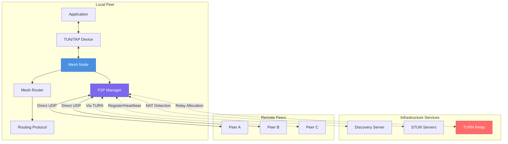
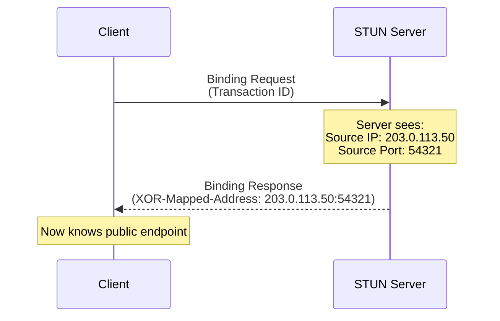
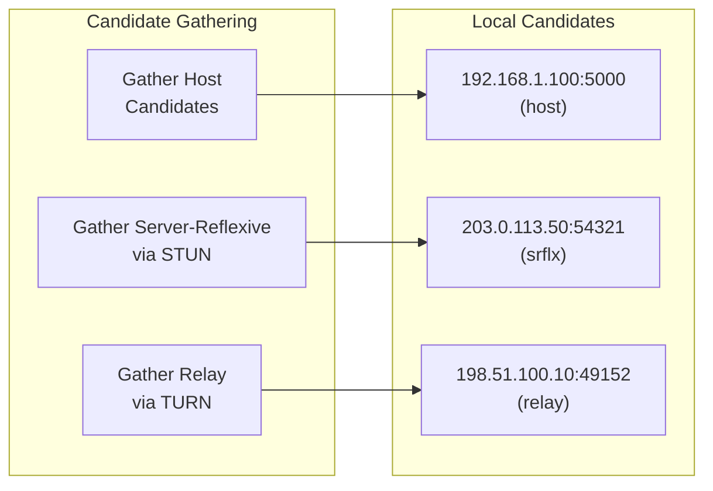
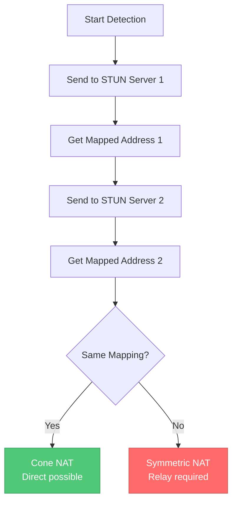
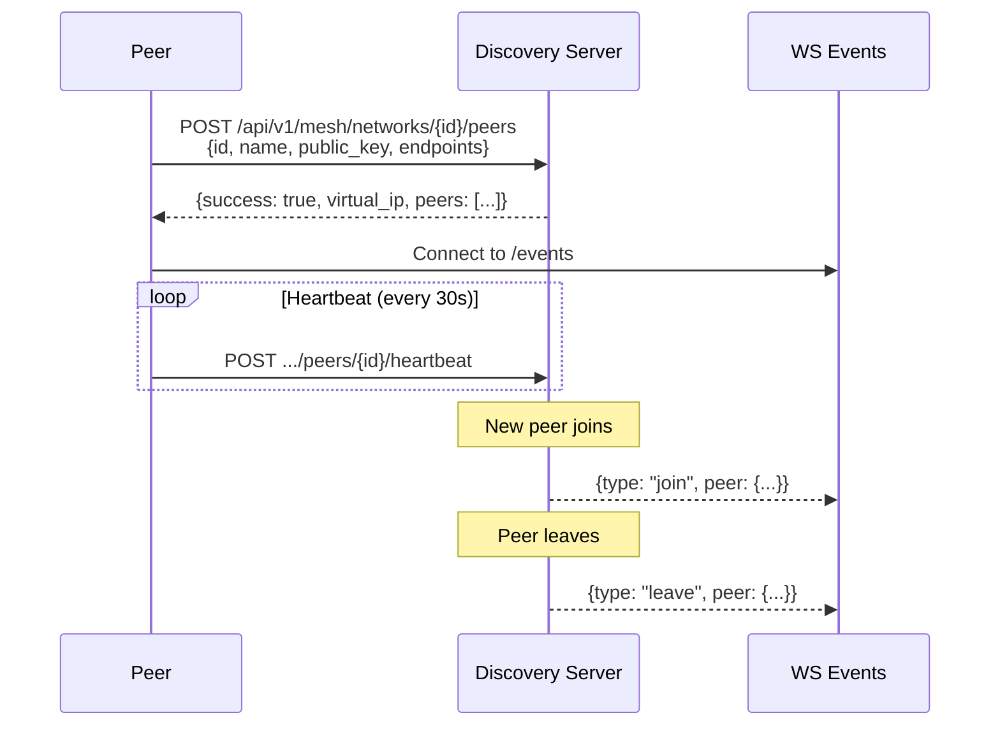
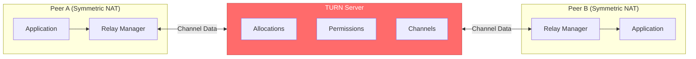
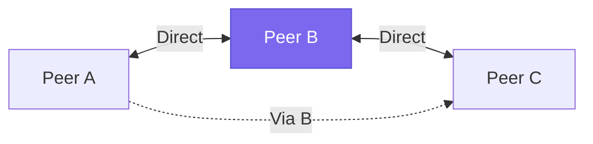
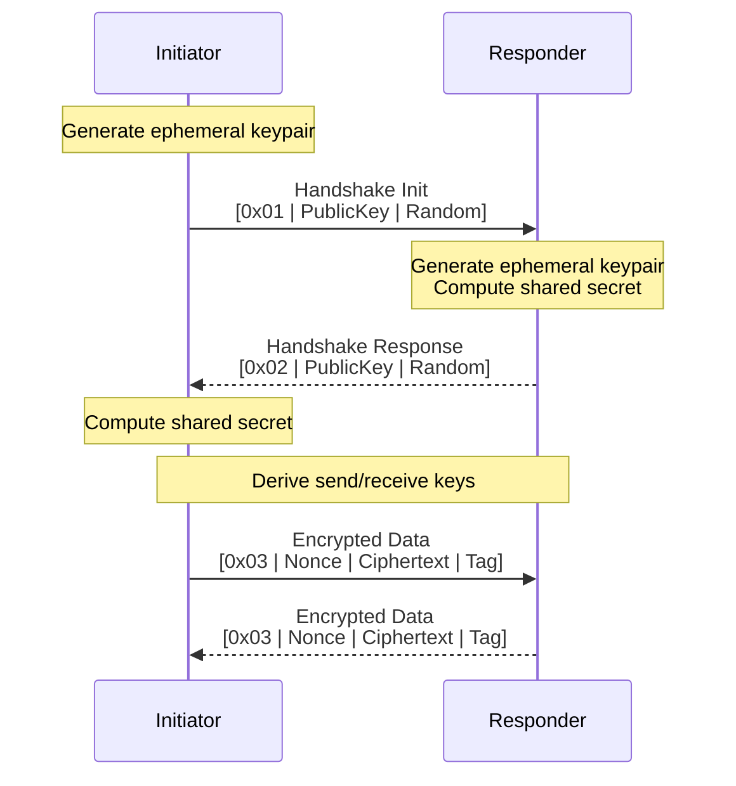
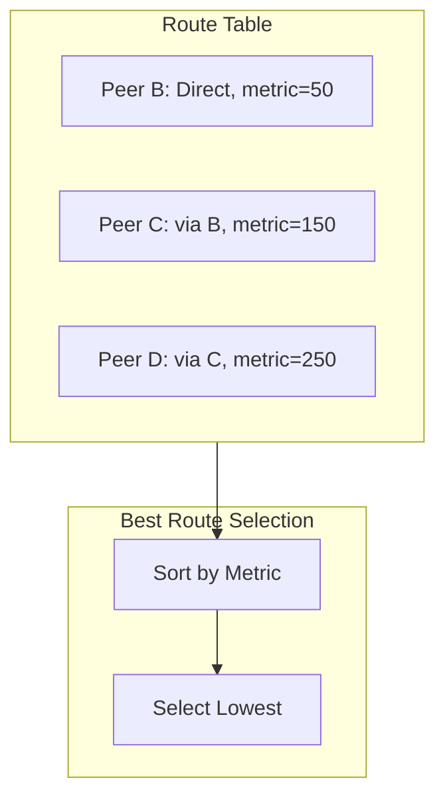

# Mesh Networking

Bifrost supports optional Hamachi-like mesh networking for creating virtual LANs between peers. This feature enables direct peer-to-peer connectivity with automatic NAT traversal, encryption, and routing.

## Overview

The mesh networking feature provides:

- **Virtual LAN**: Create private networks between distributed peers
- **NAT Traversal**: Automatic hole-punching with STUN/TURN/ICE support
- **P2P Encryption**: All traffic encrypted with ChaCha20-Poly1305
- **Mesh Routing**: Automatic route discovery and multi-hop relaying
- **TAP/TUN Device Support**: Layer 2 (Ethernet) and Layer 3 (IP) networking

## High-Level Architecture



## P2P Connectivity

### Connection Types

Bifrost supports three types of peer connections:

| Type | Description | Latency | Use Case |
|------|-------------|---------|----------|
| **Direct** | UDP hole-punching through NAT | Lowest | Most connections |
| **Relayed** | Traffic via TURN server | Medium | Symmetric NAT |
| **Multi-Hop** | Traffic via other peers | Highest | Fallback when TURN unavailable |

### Connection Flow

```mermaid
sequenceDiagram
    participant A as Peer A
    participant D as Discovery Server
    participant S as STUN Server
    participant T as TURN Server
    participant B as Peer B

    Note over A,B: 1. Discovery & NAT Detection
    A->>D: Register with public key & endpoints
    A->>S: STUN Binding Request
    S-->>A: Mapped Address (public IP:port)
    B->>D: Register with public key & endpoints
    B->>S: STUN Binding Request
    S-->>B: Mapped Address (public IP:port)

    Note over A,B: 2. Peer Discovery
    D-->>A: Peer B joined (endpoints, public key)
    D-->>B: Peer A joined (endpoints, public key)

    Note over A,B: 3. Connection Attempt
    A->>B: Try Direct (host candidates)
    A->>B: Try Direct (server-reflexive candidates)

    alt Direct Connection Succeeds
        A<-->B: Encrypted P2P Connection
    else Direct Fails (Symmetric NAT)
        A->>T: TURN Allocate
        T-->>A: Relay Address
        A->>T: Create Permission for B
        A->>B: Exchange relay candidates
        A<-->T: Data via TURN
        T<-->B: Data via TURN
    end

    Note over A,B: 4. Handshake & Encryption
    A->>B: Handshake Init (public key + random)
    B-->>A: Handshake Response (public key + random)
    Note over A,B: Derive shared secret via Curve25519
    A<-->B: Encrypted data (ChaCha20-Poly1305)
```

## STUN/TURN/ICE Implementation

### STUN (Session Traversal Utilities for NAT)

STUN is used to discover your public IP address and port as seen from the internet.

**Implementation details** (`internal/p2p/stun.go`):

- Supports RFC 5389 STUN Binding Requests
- Parses both `MAPPED-ADDRESS` and `XOR-MAPPED-ADDRESS` attributes
- Default servers: Google's public STUN servers
- Configurable timeout (default: 5 seconds)

**How it works:**



**Default STUN Servers:**

```yaml
stun:
  servers:
    - "stun:stun.l.google.com:19302"
    - "stun:stun1.l.google.com:19302"
    - "stun:stun2.l.google.com:19302"
    - "stun:stun3.l.google.com:19302"
    - "stun:stun4.l.google.com:19302"
```

### TURN (Traversal Using Relays around NAT)

TURN provides relay services when direct connections are impossible (e.g., symmetric NAT).

**Implementation details** (`internal/p2p/turn.go`):

- Supports RFC 5766 TURN protocol
- Long-term credentials with HMAC-SHA1 authentication
- Channel binding for efficient data transfer
- Automatic allocation refresh

**TURN Operations:**

| Operation | Description |
|-----------|-------------|
| `Allocate` | Request a relay address from the server |
| `CreatePermission` | Allow a peer IP to send data through relay |
| `ChannelBind` | Bind a channel number to a peer for efficiency |
| `Refresh` | Keep allocation alive (default: 10 minutes) |
| `Send/Data` | Send and receive relayed data |

**Configuration:**

```yaml
turn:
  enabled: true
  servers:
    - url: "turn:turn.example.com:3478"
      username: "user"
      password: "secret"
```

### ICE (Interactive Connectivity Establishment)

ICE coordinates STUN and TURN to find the best connection path.

**Implementation details** (`internal/p2p/ice.go`):

**Candidate Types:**

| Type | Priority | Description |
|------|----------|-------------|
| `host` | 126 | Local interface addresses |
| `srflx` | 100 | Server-reflexive (via STUN) |
| `prflx` | 110 | Peer-reflexive (discovered during checks) |
| `relay` | 0 | TURN relay addresses |

**ICE Candidate Gathering:**



**Connectivity Checks:**

ICE pairs local and remote candidates, then tests connectivity in priority order:

```go
// Priority calculation (RFC 8445)
priority = (typePref << 24) | (localPref << 8) | (256 - componentID)

// Pair priority
pairPriority = (1 << 32) * min(localPri, remotePri) + 2 * max(localPri, remotePri)
```

## NAT Traversal

### NAT Types

**Implementation details** (`internal/p2p/nat.go`):

| NAT Type | Mapping | Filtering | Direct Connection |
|----------|---------|-----------|-------------------|
| **None** | N/A | N/A | Always works |
| **Full Cone** | Endpoint-independent | Endpoint-independent | Always works |
| **Restricted Cone** | Endpoint-independent | Address-dependent | Works with hole-punching |
| **Port Restricted** | Endpoint-independent | Address+port-dependent | Works with hole-punching |
| **Symmetric** | Endpoint-dependent | Address+port-dependent | Requires TURN relay |

### NAT Detection



### Traversal Strategy Selection

```go
// Recommended strategy based on NAT types
func RecommendedTraversalStrategy(nat1, nat2 NATType) string {
    if nat1 == NATTypeNone || nat2 == NATTypeNone {
        return "direct"
    }
    if nat1 == NATTypeSymmetric || nat2 == NATTypeSymmetric {
        if nat1 == NATTypeFullCone || nat2 == NATTypeFullCone {
            return "direct_to_full_cone"
        }
        return "relay"  // Both need TURN
    }
    return "hole_punch"  // Standard NAT traversal
}
```

## Peer Discovery

### Discovery Server

The discovery server coordinates peer registration and endpoint exchange.

**Implementation details** (`internal/mesh/discovery.go`):

**Registration Flow:**



**API Endpoints:**

| Method | Endpoint | Description |
|--------|----------|-------------|
| `POST` | `/api/v1/mesh/networks/{id}/peers` | Register peer |
| `GET` | `/api/v1/mesh/networks/{id}/peers` | List all peers |
| `PATCH` | `/api/v1/mesh/networks/{id}/peers/{peer}` | Update endpoints |
| `DELETE` | `/api/v1/mesh/networks/{id}/peers/{peer}` | Deregister |
| `POST` | `.../peers/{peer}/heartbeat` | Keep alive |
| `WS` | `/api/v1/mesh/networks/{id}/events` | Real-time events |

### Peer Information

Each peer advertises:

```json
{
  "id": "peer-abc123",
  "name": "laptop-home",
  "public_key": "base64-encoded-ed25519-pubkey",
  "virtual_ip": "10.100.0.5",
  "endpoints": [
    {"address": "192.168.1.100", "port": 51820, "type": "local", "priority": 100},
    {"address": "203.0.113.50", "port": 54321, "type": "reflexive", "priority": 50},
    {"address": "198.51.100.10", "port": 49152, "type": "relay", "priority": 10}
  ]
}
```

## Relay Networking

### TURN Relay

When direct connections fail, traffic is relayed through a TURN server.

**Implementation details** (`internal/p2p/relay.go`):



**Channel Data Format:**

```
+------+------+-------------------+
| Chan | Len  |    Data Payload   |
| (2)  | (2)  |    (variable)     |
+------+------+-------------------+
```

### Peer Relay (Multi-Hop)

When TURN is unavailable, traffic can be relayed through other connected peers.

**Implementation details** (`internal/p2p/relay.go`):



**Relay Message Format:**

```
+------+----------+-----------+
| Type | Dest Len | Dest ID   | Payload
| (1)  |   (1)    | (var)     | (var)
+------+----------+-----------+
```

**Configuration:**

```yaml
connection:
  direct_connect: true      # Try direct first
  relay_enabled: true       # Enable TURN relay
  relay_via_peers: true     # Enable peer relaying
  connect_timeout: 30s
  keep_alive_interval: 25s
```

## Encryption

### Key Exchange

**Implementation details** (`internal/p2p/crypto.go`):

All P2P connections use:

- **Key Generation**: Curve25519 key pairs
- **Key Exchange**: ECDH (Elliptic Curve Diffie-Hellman)
- **Encryption**: ChaCha20-Poly1305 AEAD
- **Key Derivation**: Separate send/receive keys

**Handshake Protocol:**



**Key Derivation:**

```go
// Simplified - production uses HKDF
sendKey = H(sharedSecret || "send")
recvKey = H(sharedSecret || "recv")

// Direction determined by public key comparison
if localPubKey > remotePubKey {
    sendKey, recvKey = recvKey, sendKey
}
```

## Routing Protocol

### Distance-Vector Routing

**Implementation details** (`internal/mesh/protocol.go`, `internal/mesh/router.go`):

The mesh uses a distance-vector routing protocol similar to RIP.

**Message Types:**

| Type | Purpose |
|------|---------|
| `RouteAnnounce` | Share known routes with neighbors |
| `RouteRequest` | Request routes from neighbors |
| `RouteWithdraw` | Notify route is no longer available |
| `Hello` | Periodic keepalive |
| `HelloAck` | RTT measurement |
| `LinkState` | Link state updates |

**Route Metric Calculation:**

```go
Metric = Latency(ms) + (HopCount * 100)
```

**Split Horizon:**

Routes are not announced back to the peer they were learned from, preventing routing loops:

```go
if config.SplitHorizon && route.NextHop == peerID {
    continue  // Don't announce back
}
```

### Route Table



## Configuration Examples

### Minimal Configuration

```yaml
mesh:
  enabled: true
  network_id: "my-network"
  network_cidr: "10.100.0.0/16"
  discovery:
    server: "bifrost.example.com:7080"
```

### Full Configuration

```yaml
mesh:
  enabled: true
  network_id: "corporate-vpn"
  network_cidr: "10.100.0.0/16"
  peer_name: "laptop-john"

  device:
    type: tap           # Layer 2 networking
    name: "mesh0"
    mtu: 1400
    mac_address: ""     # Auto-generated

  discovery:
    server: "bifrost.example.com:7080"
    heartbeat_interval: 30s
    peer_timeout: 90s
    token: "${MESH_TOKEN}"

  stun:
    servers:
      - "stun:stun.l.google.com:19302"
      - "stun:stun1.l.google.com:19302"
      - "stun:stun.cloudflare.com:3478"
    timeout: 5s

  turn:
    enabled: true
    servers:
      - url: "turn:turn.example.com:3478"
        username: "${TURN_USER}"
        password: "${TURN_PASS}"
      - url: "turns:turn.example.com:5349"  # TLS
        username: "${TURN_USER}"
        password: "${TURN_PASS}"

  connection:
    direct_connect: true
    relay_enabled: true
    relay_via_peers: true
    connect_timeout: 30s
    keep_alive_interval: 25s

  security:
    private_key: ""           # Auto-generated if empty
    require_encryption: true
    allowed_peers: []         # Empty = allow all
```

### Self-Hosted TURN Server

Using coturn:

```bash
# /etc/turnserver.conf
listening-port=3478
tls-listening-port=5349
realm=turn.example.com
server-name=turn.example.com

# Authentication
lt-cred-mech
user=meshuser:meshpass

# Certificates for TURNS
cert=/etc/letsencrypt/live/turn.example.com/fullchain.pem
pkey=/etc/letsencrypt/live/turn.example.com/privkey.pem
```

## Troubleshooting

### Connection Issues

#### Problem: Peers discovered but not connecting

**Diagnosis:**

```bash
# Check NAT type detection
curl http://localhost:7082/api/v1/p2p/nat
# Response: {"type": "symmetric", "mapped_address": "..."}

# Check discovered endpoints
curl http://localhost:7082/api/v1/mesh/networks/my-network/peers
```

**Solutions:**

1. **Symmetric NAT detected**: Ensure TURN is configured
2. **No reflexive candidates**: Check STUN server connectivity
3. **Firewall blocking**: Allow UDP on ephemeral ports (32768-65535)

#### Problem: Connection times out

**Diagnosis:**

```bash
# Test STUN connectivity
nc -u stun.l.google.com 19302

# Check local firewall
sudo iptables -L -n | grep -i drop
```

**Solutions:**

1. Increase `connect_timeout`
2. Add more STUN servers
3. Check corporate firewall/proxy

### TURN Relay Issues

#### Problem: TURN allocation fails

**Diagnosis:**

```bash
# Test TURN server
turnutils_stunclient -p 3478 turn.example.com
```

**Solutions:**

1. Verify credentials are correct
2. Check server is reachable on port 3478/5349
3. Ensure realm matches configuration

#### Problem: High latency via relay

**Expected behavior**: Relay adds latency due to extra hop.

**Mitigation:**

1. Use geographically close TURN servers
2. Enable peer relaying for shorter paths
3. Consider multiple TURN servers

### Routing Issues

#### Problem: Packets not reaching destination

**Diagnosis:**

```bash
# Check route table
curl http://localhost:7082/api/v1/mesh/routes

# Check peer connections
curl http://localhost:7082/api/v1/p2p/connections
```

**Solutions:**

1. Verify peer is actually connected
2. Check MTU settings (reduce if fragmentation)
3. Ensure routing protocol is running

#### Problem: Routing loops

**Symptoms**: Packets bounce between peers, high CPU usage.

**Solutions:**

1. Enable split horizon (default)
2. Check TTL is being decremented
3. Verify sequence numbers prevent duplicate processing

### Device Issues

#### Problem: TUN/TAP device not created

**Linux:**

```bash
# Check if tun module is loaded
lsmod | grep tun

# Load if missing
sudo modprobe tun

# Check permissions
ls -la /dev/net/tun
# Should be: crw-rw-rw- 1 root root 10, 200
```

**macOS:**

```bash
# Install tuntaposx
brew install --cask tuntap

# Or use system extension (macOS 10.15+)
```

**Windows:**

```powershell
# Install TAP-Windows adapter
# Download from OpenVPN or WireGuard
```

#### Problem: Interface has no IP

```bash
# Linux
ip addr add 10.100.0.5/16 dev mesh0
ip link set mesh0 up

# macOS
sudo ifconfig mesh0 10.100.0.5 10.100.0.1 up
```

### Performance Tuning

#### High CPU Usage

1. Use TUN instead of TAP (less overhead)
2. Reduce keepalive frequency
3. Limit broadcast TTL

#### Packet Loss

1. Check MTU (try 1280 for maximum compatibility)
2. Verify UDP buffer sizes
3. Check for network congestion

```bash
# Linux: Increase UDP buffers
sudo sysctl -w net.core.rmem_max=26214400
sudo sysctl -w net.core.wmem_max=26214400
```

## Verification Commands

### Check Mesh Status

```bash
# Node status
curl http://localhost:7082/api/v1/mesh/status

# Peer list
curl http://localhost:7082/api/v1/mesh/networks/my-network/peers

# P2P statistics
curl http://localhost:7082/api/v1/p2p/stats
```

### Network Diagnostics

```bash
# Linux
ip link show mesh0
ip addr show mesh0
ip route show dev mesh0

# macOS
ifconfig mesh0
netstat -rn | grep mesh0

# Windows
netsh interface show interface "mesh0"
route print
```

### Ping Test

```bash
# Ping another peer's virtual IP
ping 10.100.0.2

# With verbose output
ping -c 5 10.100.0.2
```

## Platform Support

| Platform | TUN | TAP | Notes |
|----------|-----|-----|-------|
| Linux | Full | Full | Native kernel support |
| macOS | Full | Full | Requires tuntaposx or Network Extension |
| Windows | Full | Full | Requires wintun or TAP-Windows driver |
| FreeBSD | Full | Full | Native support |
| OpenWrt | Full | Partial | May need additional packages |

## API Reference

### Mesh Node Stats

```go
type NodeStats struct {
    Status            NodeStatus    `json:"status"`
    PeerCount         int           `json:"peer_count"`
    ConnectedPeers    int           `json:"connected_peers"`
    DirectConnections int           `json:"direct_connections"`
    RelayedConnections int          `json:"relayed_connections"`
    BytesSent         int64         `json:"bytes_sent"`
    BytesReceived     int64         `json:"bytes_received"`
    PacketsSent       int64         `json:"packets_sent"`
    PacketsReceived   int64         `json:"packets_received"`
    Uptime            time.Duration `json:"uptime"`
}
```

### P2P Manager Stats

```go
type Stats struct {
    ActiveConnections  int
    DirectConnections  int
    RelayedConnections int
    NATType            NATType
    LocalEndpoints     []netip.AddrPort
}
```

### NAT Info

```go
type NATInfo struct {
    Type          NATType        `json:"type"`
    MappedAddress netip.AddrPort `json:"mapped_address"`
    LocalAddress  netip.AddrPort `json:"local_address"`
    IsBehindNAT   bool           `json:"is_behind_nat"`
    Hairpin       bool           `json:"hairpin"`
    DetectedAt    time.Time      `json:"detected_at"`
}
```
