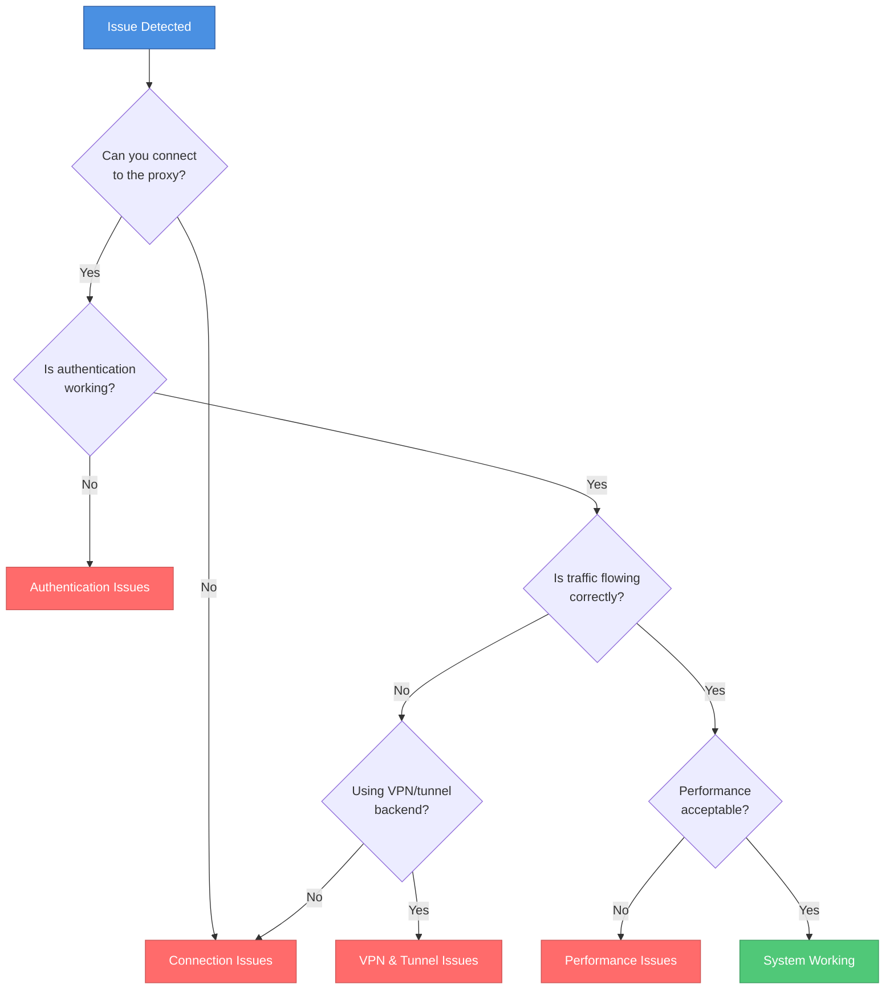

# Troubleshooting Guide

This comprehensive guide helps you diagnose and resolve issues with Bifrost Proxy. Use the quick diagnostics below to identify your issue, then navigate to the relevant section for detailed solutions.

## Quick Diagnostics

Before diving into specific issues, run these diagnostic commands to assess the health of your Bifrost deployment.

### Check Service Health

```bash
# Server health status
curl http://localhost:7082/api/v1/health

# Server detailed status
curl http://localhost:7082/api/v1/status

# Backend health
curl http://localhost:7082/api/v1/backends

# Active connections
curl http://localhost:7082/api/v1/stats
```

### Enable Debug Logging

For detailed diagnostic information, enable debug logging:

```yaml
logging:
  level: debug
  format: text  # Human-readable output
```

Or via CLI flag:

```bash
bifrost-server -c config.yaml --log-level debug
```

## Issue Categories

Select the category that best matches your issue:

| Category | Common Symptoms |
|----------|-----------------|
| [Connection Issues](./connections) | Connection refused, timeouts, proxy errors |
| [Performance](./performance) | High latency, slow responses, resource usage |
| [Authentication](./authentication) | Login failures, 407 errors, token issues |
| [VPN & Tunnels](./vpn-tunnels) | Tunnel failures, routing problems, DNS issues |
| [Diagnostics & Logs](./diagnostics) | Log analysis, debugging commands, metrics |
| [FAQ](./faq) | Frequently asked questions and quick answers |

## Decision Tree



## Emergency Recovery

If your Bifrost deployment is completely unresponsive:

### 1. Check Process Status

```bash
# Check if process is running
ps aux | grep bifrost

# Check systemd service status
systemctl status bifrost-server

# Check Docker container status
docker ps -a | grep bifrost
```

### 2. Verify Configuration

```bash
# Validate configuration file
bifrost-server validate -c config.yaml

# Check for YAML syntax errors
yamllint config.yaml
```

### 3. Review Recent Logs

```bash
# Systemd logs
journalctl -u bifrost-server -n 100 --no-pager

# Docker logs
docker logs bifrost-server --tail 100

# File-based logs
tail -100 /var/log/bifrost/server.log
```

### 4. Restart Services

```bash
# Systemd
sudo systemctl restart bifrost-server

# Docker
docker restart bifrost-server

# Manual
pkill bifrost-server && bifrost-server -c config.yaml
```

## Getting Help

If you cannot resolve your issue using this guide:

1. **Search existing issues** - [GitHub Issues](https://github.com/rennerdo30/bifrost-proxy/issues)
2. **Gather diagnostic information**:
   - Bifrost version: `bifrost-server version`
   - Operating system and version
   - Configuration file (remove sensitive data)
   - Relevant log output
   - Steps to reproduce
3. **Open a new issue** with the information above

## Related Documentation

- [Monitoring Guide](../monitoring) - Set up Prometheus metrics and Grafana dashboards
- [Security Guide](../security) - Security configuration and best practices
- [CLI Reference](../cli-reference) - Command-line options and usage
