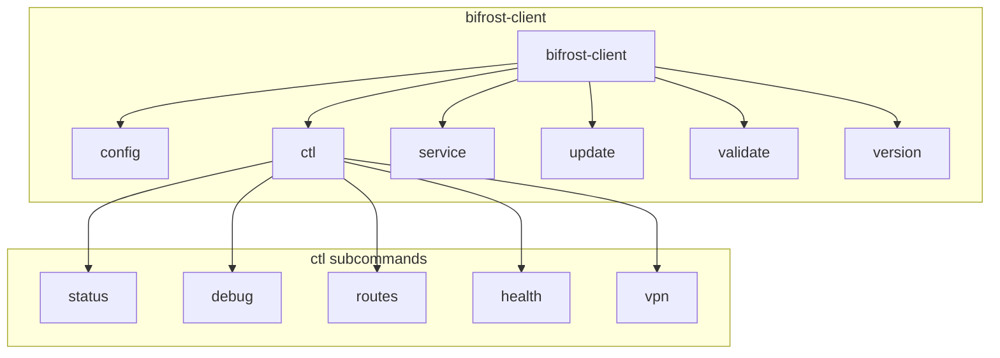

# Client CLI Reference

Complete command-line reference for `bifrost-client`. This guide covers all available commands, flags, environment variables, and shell completion setup.

## Overview

The Bifrost client provides a local proxy that routes traffic through the Bifrost server or directly to destinations. It supports multiple protocols, traffic debugging, VPN mode with split tunneling, and can be managed via CLI or REST API.



## Quick Reference

| Command | Description |
|---------|-------------|
| `bifrost-client` | Start the client with configuration |
| `bifrost-client config init` | Generate sample configuration |
| `bifrost-client validate` | Validate configuration file |
| `bifrost-client ctl status` | Show client status |
| `bifrost-client ctl debug tail` | View recent traffic |
| `bifrost-client ctl routes list` | List routing rules |
| `bifrost-client ctl vpn enable` | Enable VPN mode |
| `bifrost-client service install` | Install as system service |
| `bifrost-client update` | Check for and install updates |
| `bifrost-client version` | Print version information |

---

## Global Flags

These flags apply to all commands:

| Flag | Short | Default | Description |
|------|-------|---------|-------------|
| `--config` | `-c` | `client-config.yaml` | Configuration file path |
| `--help` | `-h` | | Show help for any command |

**Examples:**

```bash
# Start with custom config file
bifrost-client -c /etc/bifrost/client.yaml

# Get help for any command
bifrost-client --help
bifrost-client ctl --help
bifrost-client ctl vpn --help
```

---

## Starting the Client

### bifrost-client

Start the Bifrost client proxy.

```bash
bifrost-client [flags]
```

**Description:**

Starts the local proxy listeners (HTTP and SOCKS5) and connects to the configured Bifrost server. The client runs in the foreground until interrupted.

**Examples:**

```bash
# Start with default config
bifrost-client

# Start with specific config file
bifrost-client -c /etc/bifrost/client.yaml

# Start with config in current directory
bifrost-client -c ./my-config.yaml
```

**What happens on startup:**

1. Loads and validates configuration
2. Starts HTTP proxy listener (default: `127.0.0.1:7380`)
3. Starts SOCKS5 proxy listener (default: `127.0.0.1:7381`)
4. Starts Web UI dashboard (default: `127.0.0.1:7382`)
5. Starts REST API server (default: `127.0.0.1:7383`)
6. Connects to Bifrost server
7. Begins routing traffic according to configured rules

**Stopping the client:**

- Press `Ctrl+C` to gracefully shutdown
- Send `SIGTERM` signal for graceful shutdown
- Send `SIGINT` signal for graceful shutdown

---

## Configuration Commands

### bifrost-client config

Configuration management commands.

```bash
bifrost-client config [command]
```

### bifrost-client config init

Generate a sample client configuration file with sensible defaults.

```bash
bifrost-client config init [flags]
```

**Flags:**

| Flag | Short | Default | Description |
|------|-------|---------|-------------|
| `--server` | `-s` | | Server address (host:port) - **required** |
| `--output` | `-o` | `client-config.yaml` | Output file path |
| `--protocol` | `-p` | `http` | Server protocol (`http` or `socks5`) |
| `--http-listen` | | `127.0.0.1:7380` | HTTP proxy listen address |
| `--socks5-listen` | | `127.0.0.1:7381` | SOCKS5 proxy listen address |
| `--force` | `-f` | `false` | Overwrite existing file |

**Examples:**

```bash
# Generate basic config pointing to your server
bifrost-client config init -s proxy.example.com:7080

# Specify custom output file
bifrost-client config init -s proxy.example.com:7080 -o ~/my-config.yaml

# Use SOCKS5 protocol to connect to server
bifrost-client config init -s proxy.example.com:7180 -p socks5

# Use custom local listener addresses
bifrost-client config init -s proxy.example.com:7080 \
  --http-listen 0.0.0.0:8080 \
  --socks5-listen 0.0.0.0:1080

# Overwrite existing configuration
bifrost-client config init -s proxy.example.com:7080 --force
```

**Generated configuration includes:**

- Local HTTP and SOCKS5 proxy listeners
- Connection to the specified Bifrost server
- Default routing rules (localhost direct, everything else through server)
- Debug, logging, and Web UI settings

---

## Validation Commands

### bifrost-client validate

Validate a configuration file without starting the client.

```bash
bifrost-client validate [flags]
```

**Description:**

Checks the configuration file for syntax errors, missing required fields, and invalid values. Useful for CI/CD pipelines and pre-deployment verification.

**Examples:**

```bash
# Validate default config
bifrost-client validate

# Validate specific config file
bifrost-client validate -c /etc/bifrost/client.yaml

# Use in scripts (exit code 0 = valid, 1 = invalid)
bifrost-client validate -c config.yaml && echo "Config OK"
```

**Exit codes:**

| Code | Meaning |
|------|---------|
| 0 | Configuration is valid |
| 1 | Configuration has errors |

---

## Control Commands (ctl)

Control a running Bifrost client via its REST API.

### bifrost-client ctl

```bash
bifrost-client ctl [command] [flags]
```

**Global ctl Flags:**

| Flag | Default | Description |
|------|---------|-------------|
| `--api` | `http://localhost:7383` | API server URL |
| `--token` | | API authentication token |

**Examples:**

```bash
# Use custom API URL
bifrost-client ctl status --api http://192.168.1.100:7383

# Use with authentication
bifrost-client ctl status --token my-secret-token
```

---

### Status Commands

#### bifrost-client ctl status

Show client status including server connection state.

```bash
bifrost-client ctl status
```

**Output:**

```
Status: running
Server: connected
Version: v1.2.0
Time: 2025-02-05T10:30:00Z
Debug Entries: 1523
```

#### bifrost-client ctl health

Check client health.

```bash
bifrost-client ctl health
```

**Output:**

```
Health: healthy
```

---

### Debug Commands

Traffic debugging commands for inspecting proxy activity.

#### bifrost-client ctl debug tail

Show recent traffic entries.

```bash
bifrost-client ctl debug tail [flags]
```

**Flags:**

| Flag | Short | Default | Description |
|------|-------|---------|-------------|
| `--count` | `-n` | `20` | Number of entries to show |

**Examples:**

```bash
# Show last 20 entries
bifrost-client ctl debug tail

# Show last 100 entries
bifrost-client ctl debug tail -n 100
```

**Output:**

```
TIME      METHOD  HOST                STATUS  DURATION  ROUTE
10:30:01  GET     api.github.com      200     45ms      server
10:30:02  GET     google.com          200     32ms      server
10:30:03  GET     localhost:8080      200     2ms       direct
```

#### bifrost-client ctl debug clear

Clear all debug entries.

```bash
bifrost-client ctl debug clear
```

**Output:**

```
Debug entries cleared
```

#### bifrost-client ctl debug errors

Show error entries only.

```bash
bifrost-client ctl debug errors
```

**Output:**

```
TIME      HOST              ERROR
10:25:01  broken-site.com   connection refused
10:26:15  timeout.example   context deadline exceeded
```

#### bifrost-client ctl debug export

Export debug entries to a file.

```bash
bifrost-client ctl debug export [flags]
```

**Flags:**

| Flag | Short | Default | Description |
|------|-------|---------|-------------|
| `--output` | `-o` | `traffic.har` | Output file path |
| `--format` | `-f` | `har` | Export format: `har` or `json` |

**Examples:**

```bash
# Export as HAR (HTTP Archive) format
bifrost-client ctl debug export

# Export to specific file
bifrost-client ctl debug export -o ~/traffic-capture.har

# Export as raw JSON
bifrost-client ctl debug export -o traffic.json --format json
```

**HAR format** can be imported into browser developer tools and tools like Charles Proxy for analysis.

---

### Route Commands

Manage traffic routing rules dynamically.

#### bifrost-client ctl routes list

List all configured routes.

```bash
bifrost-client ctl routes list
```

**Output:**

```
NAME        PATTERNS                    ACTION   PRIORITY
local       localhost,127.0.0.1,*.local direct   100
streaming   *.netflix.com,*.hulu.com    server   50
default     *                           server   1
```

#### bifrost-client ctl routes test

Test which route matches a specific domain.

```bash
bifrost-client ctl routes test [domain]
```

**Examples:**

```bash
# Test route matching
bifrost-client ctl routes test google.com
```

**Output:**

```
Domain: google.com
Action: server
```

#### bifrost-client ctl routes add

Add a new routing rule.

```bash
bifrost-client ctl routes add [name] [flags]
```

**Flags:**

| Flag | Short | Default | Description |
|------|-------|---------|-------------|
| `--domain` | `-d` | | Domain pattern(s), comma-separated - **required** |
| `--action` | `-a` | `server` | Action: `server` (use proxy) or `direct` (bypass) |
| `--priority` | `-p` | `0` | Rule priority (higher = matched first) |

**Examples:**

```bash
# Route work domains through proxy
bifrost-client ctl routes add work --domain "*.company.com" --action server

# Bypass local development servers
bifrost-client ctl routes add devservers \
  --domain "*.local,*.localhost,*.test" \
  --action direct \
  --priority 100

# Route streaming services with high priority
bifrost-client ctl routes add streaming \
  --domain "*.netflix.com,*.hulu.com,*.disneyplus.com" \
  --action server \
  --priority 50
```

**Domain pattern syntax:**

- `*` - Matches any subdomain level (e.g., `*.example.com` matches `api.example.com`)
- `**` - Matches any number of subdomain levels
- Exact match - `example.com` matches only `example.com`

#### bifrost-client ctl routes remove

Remove a routing rule.

```bash
bifrost-client ctl routes remove [name]
```

**Example:**

```bash
bifrost-client ctl routes remove streaming
```

**Output:**

```
Route 'streaming' removed successfully
```

---

### VPN Commands

Manage VPN mode and split tunneling.

#### bifrost-client ctl vpn status

Show VPN status and statistics.

```bash
bifrost-client ctl vpn status
```

**Output:**

```
Status: enabled
Uptime: 2h30m15s
Bytes Sent: 1.2 GB
Bytes Received: 3.4 GB
Active Connections: 42
Tunneled Connections: 38
Bypassed Connections: 4
DNS Queries: 1523
DNS Cache Hits: 1102
```

#### bifrost-client ctl vpn enable

Enable VPN mode (creates TUN device and routes all traffic).

```bash
bifrost-client ctl vpn enable
```

**Output:**

```
VPN enabled
```

**Note:** VPN mode requires elevated privileges (root/Administrator).

#### bifrost-client ctl vpn disable

Disable VPN mode.

```bash
bifrost-client ctl vpn disable
```

**Output:**

```
VPN disabled
```

#### bifrost-client ctl vpn connections

Show active VPN connections.

```bash
bifrost-client ctl vpn connections
```

**Output:**

```
PROTO  LOCAL             REMOTE              ACTION   DURATION  BYTES
TCP    192.168.1.10:52341 142.250.80.46:443  tunnel   5m32s     ↑1.2MB ↓3.4MB
TCP    192.168.1.10:52342 151.101.1.69:443   tunnel   2m15s     ↑256KB ↓1.1MB
UDP    192.168.1.10:53    8.8.8.8:53         bypass   12m05s    ↑4KB ↓12KB
```

#### bifrost-client ctl vpn dns-cache

Show VPN DNS cache entries.

```bash
bifrost-client ctl vpn dns-cache
```

**Output:**

```
DOMAIN              ADDRESSES            TTL
google.com          142.250.80.46        4m32s
github.com          140.82.112.3         2m15s
api.example.com     expired              expired
```

---

### Split Tunnel Commands

Configure which applications and destinations bypass the VPN.

#### bifrost-client ctl vpn split list

List current split tunnel rules.

```bash
bifrost-client ctl vpn split list
```

**Output:**

```
Mode: exclude

Apps:
  - Slack
  - Zoom

Domains:
  - *.local
  - *.internal.company.com

IPs:
  - 192.168.0.0/16
  - 10.0.0.0/8

Always Bypass:
  - localhost
  - 127.0.0.1
```

#### bifrost-client ctl vpn split add-app

Add an application to split tunnel (bypasses VPN).

```bash
bifrost-client ctl vpn split add-app [name]
```

**Examples:**

```bash
# Exclude Slack from VPN
bifrost-client ctl vpn split add-app Slack

# Exclude video conferencing
bifrost-client ctl vpn split add-app Zoom
bifrost-client ctl vpn split add-app "Microsoft Teams"
```

#### bifrost-client ctl vpn split remove-app

Remove an application from split tunnel.

```bash
bifrost-client ctl vpn split remove-app [name]
```

**Example:**

```bash
bifrost-client ctl vpn split remove-app Zoom
```

#### bifrost-client ctl vpn split add-domain

Add a domain pattern to split tunnel.

```bash
bifrost-client ctl vpn split add-domain [pattern]
```

**Examples:**

```bash
# Bypass internal company sites
bifrost-client ctl vpn split add-domain "*.internal.company.com"

# Bypass local development
bifrost-client ctl vpn split add-domain "*.local"
```

#### bifrost-client ctl vpn split add-ip

Add an IP or CIDR range to split tunnel.

```bash
bifrost-client ctl vpn split add-ip [cidr]
```

**Examples:**

```bash
# Bypass private networks
bifrost-client ctl vpn split add-ip 192.168.0.0/16
bifrost-client ctl vpn split add-ip 10.0.0.0/8

# Bypass specific server
bifrost-client ctl vpn split add-ip 203.0.113.50/32
```

---

## Service Commands

Manage system service installation.

### bifrost-client service install

Install bifrost-client as a system service.

```bash
bifrost-client service install [flags]
```

**Flags:**

| Flag | Short | Default | Description |
|------|-------|---------|-------------|
| `--config` | `-c` | | Path to config file - **required** |
| `--name` | | `bifrost-client` | Service name |

**Platform-specific behavior:**

| Platform | Service Type | Location |
|----------|--------------|----------|
| Linux | systemd unit | `/etc/systemd/system/bifrost-client.service` |
| macOS | launchd plist | `~/Library/LaunchAgents/bifrost-client.plist` |
| Windows | Windows Service | Service Control Manager |

**Examples:**

```bash
# Install with absolute config path (recommended)
bifrost-client service install -c /etc/bifrost/client.yaml

# Install with custom service name
bifrost-client service install -c /etc/bifrost/client.yaml --name my-proxy
```

**Linux systemd:**

After installation:
```bash
# Start the service
sudo systemctl start bifrost-client

# Enable on boot
sudo systemctl enable bifrost-client

# Check status
sudo systemctl status bifrost-client
```

**macOS launchd:**

After installation:
```bash
# Load the service
launchctl load ~/Library/LaunchAgents/bifrost-client.plist

# Check if running
launchctl list | grep bifrost
```

### bifrost-client service uninstall

Remove the system service.

```bash
bifrost-client service uninstall [flags]
```

**Flags:**

| Flag | Default | Description |
|------|---------|-------------|
| `--name` | `bifrost-client` | Service name |

**Example:**

```bash
bifrost-client service uninstall
```

### bifrost-client service status

Show service installation status.

```bash
bifrost-client service status [flags]
```

**Flags:**

| Flag | Default | Description |
|------|---------|-------------|
| `--name` | `bifrost-client` | Service name |

**Output:**

```
Service: bifrost-client
Platform: linux (systemd)
Status: installed
```

---

## Update Commands

Check for and install updates.

### bifrost-client update

Check for updates and optionally install (interactive).

```bash
bifrost-client update [flags]
```

**Flags:**

| Flag | Short | Default | Description |
|------|-------|---------|-------------|
| `--channel` | | `stable` | Release channel (`stable` or `prerelease`) |
| `--force` | `-f` | `false` | Force update even if on same version |

**Example:**

```bash
bifrost-client update
```

**Output:**

```
Update available!
  Channel:         stable
  Current version: v1.1.0
  New version:     v1.2.0
  Published:       Mon, 05 Feb 2025 10:00:00 UTC

Would you like to install this update? [y/N]:
```

### bifrost-client update check

Check if updates are available without installing.

```bash
bifrost-client update check [flags]
```

**Examples:**

```bash
# Check stable channel
bifrost-client update check

# Check prerelease channel
bifrost-client update check --channel prerelease
```

**Output (update available):**

```
Update available!
  Channel:         stable
  Current version: v1.1.0
  New version:     v1.2.0
  Published:       Mon, 05 Feb 2025 10:00:00 UTC
  Release URL:     https://github.com/rennerdo30/bifrost-proxy/releases/tag/v1.2.0

Run 'bifrost-client update install' to install.
```

**Output (up to date):**

```
Current version v1.2.0 is up to date (Channel: stable).
```

### bifrost-client update install

Download and install the latest update.

```bash
bifrost-client update install [flags]
```

**Examples:**

```bash
# Install latest stable update
bifrost-client update install

# Install prerelease update
bifrost-client update install --channel prerelease

# Force reinstall current version
bifrost-client update install --force
```

**Output:**

```
Downloading v1.2.0 (5 MB)...
Downloading: 100% (5/5 MB)

Update installed successfully!
Please restart bifrost-client to use version v1.2.0.
```

---

## Version Command

### bifrost-client version

Print version information.

```bash
bifrost-client version
```

**Output:**

```
Bifrost Client v1.2.0
  Commit: abc1234
  Built: 2025-02-05T10:00:00Z
  Go: go1.24.0
  OS/Arch: darwin/arm64
```

---

## Environment Variables

Configuration values can be set via environment variables using the `${VAR_NAME}` syntax in YAML config files.

### Common Variables

| Variable | Description | Example |
|----------|-------------|---------|
| `BIFROST_CONFIG` | Default config file path | `/etc/bifrost/client.yaml` |
| `BIFROST_LOG_LEVEL` | Logging level | `debug`, `info`, `warn`, `error` |
| `BIFROST_API_TOKEN` | API authentication token | `your-secret-token` |

### Server Connection Variables

| Variable | Description |
|----------|-------------|
| `BIFROST_SERVER_ADDRESS` | Server address |
| `BIFROST_SERVER_USERNAME` | Authentication username |
| `BIFROST_SERVER_PASSWORD` | Authentication password |

### Example Usage

```yaml
# client-config.yaml
server:
  address: "${BIFROST_SERVER_ADDRESS}"
  username: "${BIFROST_SERVER_USERNAME}"
  password: "${BIFROST_SERVER_PASSWORD}"

api:
  token: "${BIFROST_API_TOKEN}"

logging:
  level: "${BIFROST_LOG_LEVEL:-info}"
```

```bash
# Set variables and start
export BIFROST_SERVER_ADDRESS="proxy.example.com:7080"
export BIFROST_SERVER_USERNAME="myuser"
export BIFROST_SERVER_PASSWORD="mypassword"
export BIFROST_API_TOKEN="api-secret"
bifrost-client -c client-config.yaml
```

---

## Shell Completion

Generate shell autocompletion scripts using Cobra's built-in completion support.

### Bash

```bash
# Generate completion script
bifrost-client completion bash > /etc/bash_completion.d/bifrost-client

# Or add to your .bashrc
echo 'source <(bifrost-client completion bash)' >> ~/.bashrc
source ~/.bashrc
```

### Zsh

```bash
# Generate completion script
bifrost-client completion zsh > "${fpath[1]}/_bifrost-client"

# Or add to your .zshrc
echo 'source <(bifrost-client completion zsh)' >> ~/.zshrc
compinit
```

### Fish

```bash
# Generate completion script
bifrost-client completion fish > ~/.config/fish/completions/bifrost-client.fish
```

### PowerShell

```powershell
# Generate completion script
bifrost-client completion powershell > bifrost-client.ps1

# Add to your profile
Add-Content $PROFILE ". bifrost-client.ps1"
```

### Features

Once completion is set up, you can:

- Tab-complete command names
- Tab-complete flag names
- Tab-complete flag values where applicable
- Get inline help for commands

---

## Exit Codes

| Code | Meaning |
|------|---------|
| 0 | Success |
| 1 | General error |
| 2 | Configuration error |
| 3 | Connection error |

---

## Common Workflows

### Initial Setup

```bash
# 1. Generate configuration
bifrost-client config init -s proxy.company.com:7080 -o ~/bifrost-client.yaml

# 2. Edit configuration as needed
nano ~/bifrost-client.yaml

# 3. Validate configuration
bifrost-client validate -c ~/bifrost-client.yaml

# 4. Start the client
bifrost-client -c ~/bifrost-client.yaml

# 5. Test connectivity
bifrost-client ctl health
bifrost-client ctl status
```

### Setting Up as a Service

```bash
# 1. Install as service (requires sudo on Linux)
sudo bifrost-client service install -c /etc/bifrost/client.yaml

# 2. Linux: Start and enable
sudo systemctl start bifrost-client
sudo systemctl enable bifrost-client

# 3. Verify
bifrost-client service status
bifrost-client ctl health
```

### Configuring Split Tunneling

```bash
# 1. Enable VPN mode
bifrost-client ctl vpn enable

# 2. Bypass internal company network
bifrost-client ctl vpn split add-ip 10.0.0.0/8
bifrost-client ctl vpn split add-domain "*.internal.company.com"

# 3. Bypass video conferencing (bandwidth-sensitive)
bifrost-client ctl vpn split add-app Zoom
bifrost-client ctl vpn split add-app "Microsoft Teams"

# 4. Verify configuration
bifrost-client ctl vpn split list
bifrost-client ctl vpn status
```

### Debugging Traffic Issues

```bash
# 1. Check client health
bifrost-client ctl health

# 2. Check server connection
bifrost-client ctl status

# 3. View recent traffic
bifrost-client ctl debug tail -n 50

# 4. View only errors
bifrost-client ctl debug errors

# 5. Test specific route
bifrost-client ctl routes test problematic-domain.com

# 6. Export for analysis
bifrost-client ctl debug export -o traffic.har
# Open traffic.har in Chrome DevTools or Charles Proxy
```

### Updating the Client

```bash
# 1. Check for updates
bifrost-client update check

# 2. Install update
bifrost-client update install

# 3. Restart the client (or service)
# If running as service:
sudo systemctl restart bifrost-client

# If running manually:
# Ctrl+C the current process, then restart
bifrost-client -c ~/bifrost-client.yaml
```

---

## Default Ports

| Service | Default Address | Description |
|---------|-----------------|-------------|
| HTTP Proxy | `127.0.0.1:7380` | HTTP/HTTPS proxy endpoint |
| SOCKS5 Proxy | `127.0.0.1:7381` | SOCKS5 proxy endpoint |
| Web UI | `127.0.0.1:7382` | Web dashboard |
| REST API | `127.0.0.1:7383` | Control API (`ctl` commands) |

Configure your applications to use `127.0.0.1:7380` for HTTP proxy or `127.0.0.1:7381` for SOCKS5 proxy.

---

## See Also

- [Configuration Reference](/configuration) - Full configuration file documentation
- [VPN Mode](/vpn-mode) - Detailed VPN mode documentation
- [Traffic Debugging](/features/traffic-debugging) - Traffic inspection features
- [Desktop Client](/desktop-client) - GUI application documentation
- [API Reference](/api) - REST API documentation
