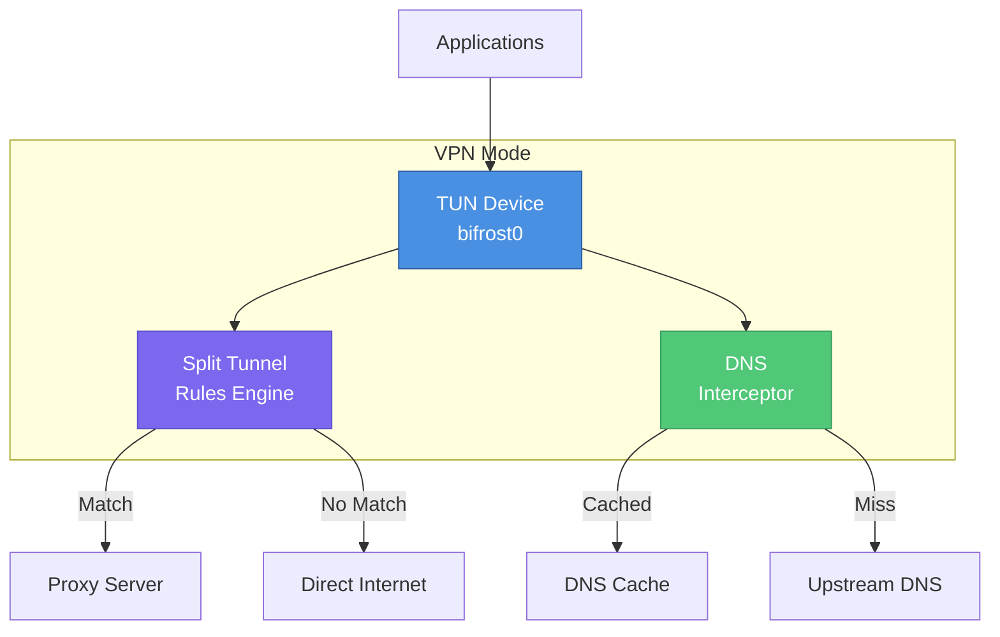

# VPN Mode

Bifrost supports a TUN-based VPN mode that captures all system traffic and routes it through the proxy with intelligent split tunneling.

## Overview

VPN mode creates a virtual network interface (TUN device) that intercepts all network traffic at the system level, providing:

- **Full Traffic Capture**: All TCP/UDP traffic, not just browser traffic
- **Split Tunneling**: Route only specific traffic through VPN
- **DNS Interception**: Handle DNS queries through the tunnel
- **App-Based Rules**: Include/exclude specific applications



## Configuration

### Basic VPN Configuration

```yaml
vpn:
  enabled: true
  tun:
    # Interface name (Linux: "bifrost0", macOS: "utun", Windows: "Bifrost")
    name: bifrost0
    # IP address and prefix for the TUN interface
    address: "10.255.0.1/24"
    # MTU (default 1400, valid range 576-65535)
    mtu: 1400
```

### DNS Configuration

The built-in DNS server listens on a full `host:port` address — there is no separate port
setting, so change the port in `listen` if 53 is already taken.

```yaml
vpn:
  enabled: true
  dns:
    enabled: true
    # Listen address (should match the TUN address)
    listen: "10.255.0.1:53"
    # Upstream resolvers queries are forwarded to
    upstream:
      - "1.1.1.1"
      - "8.8.8.8"
    cache_ttl: 5m
    # "all" intercepts every query, "tunnel_only" only tunneled destinations
    intercept_mode: all
```

### Split Tunneling

Split tunneling allows you to control which traffic goes through the VPN and which bypasses it.

#### Exclude Mode (Default)

All traffic goes through VPN except matching rules:

```yaml
vpn:
  split_tunnel:
    mode: exclude

    # These will bypass VPN
    apps:
      - name: "Slack"
      - name: "Zoom"

    domains:
      - "*.local"
      - "localhost"

    ips:
      - "192.168.0.0/16"
      - "10.0.0.0/8"

    # Always bypass, regardless of mode (checked before every other rule)
    always_bypass:
      - "127.0.0.0/8"
      - "169.254.0.0/16"
```

#### Include Mode

Only matching traffic goes through VPN:

```yaml
vpn:
  split_tunnel:
    mode: include

    # Only these will use VPN
    domains:
      - "*.company.com"
      - "*.internal.corp"

    ips:
      - "10.100.0.0/16"
```

## Split Tunnel Rules

### App-Based Rules

Route traffic based on the application generating it. A rule has two fields: `name` (process
name, matched case-insensitively) and the optional `path` (full executable path, more specific).

```yaml
vpn:
  split_tunnel:
    apps:
      # By process name
      - name: "Slack"

      # By full path (more specific — checked before the name)
      - name: "Microsoft Teams"
        path: "/Applications/Microsoft Teams.app/Contents/MacOS/Teams"
```

Rule names must be unique: a second rule with the same `name` is rejected as a duplicate.

**Platform Support:**

Matching is always by process name or executable path. What differs per platform is how the
owning process of a connection is identified.

| Platform | Process lookup |
|----------|----------------|
| macOS | `lsof` on the socket, executable path via the PID |
| Linux | `/proc/net/{tcp,udp}` plus `/proc/*/fd` |
| Windows | TCP/UDP owner-PID tables (IP Helper API) |
| Other | Not supported — app rules never match |

### Domain-Based Rules

Route traffic based on destination domain.

```yaml
vpn:
  split_tunnel:
    domains:
      # Exact match
      - "example.com"

      # Wildcard subdomain
      - "*.example.com"

      # Multiple wildcards
      - "*.cdn.*.example.com"
```

### IP-Based Rules

Route traffic based on destination IP or CIDR range.

```yaml
vpn:
  split_tunnel:
    ips:
      # Single IP
      - "192.168.1.1"

      # CIDR range
      - "10.0.0.0/8"
      - "172.16.0.0/12"
      - "192.168.0.0/16"

      # IPv6
      - "fd00::/8"
```

## API Endpoints

### VPN Status

```http
GET /api/v1/vpn/status
```

Response:
```json
{
  "status": "connected",
  "uptime": 9240000000000,
  "bytes_sent": 1048576,
  "bytes_received": 2097152,
  "packets_sent": 4096,
  "packets_received": 8192,
  "active_connections": 12,
  "tunneled_connections": 10,
  "bypassed_connections": 2,
  "dns_queries": 340,
  "dns_cache_hits": 275
}
```

`status` is one of `disabled`, `connecting`, `connected`, `disconnected` or `error`, and `uptime`
is a duration in nanoseconds. When the VPN stopped because of an error, `last_error` and
`last_error_time` are also present.

### Enable/Disable VPN

```http
POST /api/v1/vpn/enable
POST /api/v1/vpn/disable
```

### Get VPN Connections

```http
GET /api/v1/vpn/connections
```

Response:
```json
[
  {
    "id": "conn-123",
    "protocol": "tcp",
    "local_addr": "10.255.0.2:54321",
    "remote_addr": "93.184.216.34:443",
    "remote_host": "example.com",
    "action": "tunnel",
    "matched_by": "default",
    "process_info": {
      "pid": 4242,
      "name": "curl",
      "path": "/usr/bin/curl"
    },
    "start_time": "2024-01-15T10:00:00Z",
    "bytes_sent": 1024,
    "bytes_received": 2048
  }
]
```

### Split Tunnel Rules

```http
GET /api/v1/vpn/split/rules
```

Response:
```json
{
  "mode": "exclude",
  "apps": [
    {"name": "Slack", "path": "/Applications/Slack.app"}
  ],
  "domains": ["*.local", "localhost"],
  "ips": ["192.168.0.0/16", "10.0.0.0/8"],
  "always_bypass": ["127.0.0.0/8", "169.254.0.0/16"]
}
```

### Add Split Tunnel App

```http
POST /api/v1/vpn/split/apps
Content-Type: application/json

{
  "name": "Discord",
  "path": "/Applications/Discord.app"
}
```

### Remove Split Tunnel App

```http
DELETE /api/v1/vpn/split/apps/{name}
```

### Add Split Tunnel Domain

```http
POST /api/v1/vpn/split/domains
Content-Type: application/json

{
  "pattern": "*.internal.company.com"
}
```

### Add Split Tunnel IP

```http
POST /api/v1/vpn/split/ips
Content-Type: application/json

{
  "cidr": "172.16.0.0/12"
}
```

## Platform-Specific Notes

### macOS

- Uses `utun` interface (e.g., `utun0`); set `tun.name` to `utun` and the system assigns the number
- Requires TUN/TAP kernel extension or Network Extension
- App rules resolve the owning process with `lsof`, then match its name or executable path
- DNS changes may require flushing: `sudo dscacheutil -flushcache`

### Linux

- Uses standard TUN device (default name `bifrost0`)
- Requires `CAP_NET_ADMIN` capability or root
- iptables/nftables rules for routing
- App rules resolve the owning process from `/proc`, then match its name or executable path

```bash
# Grant capability to binary
sudo setcap cap_net_admin+ep ./bifrost-client
```

### Windows

- Uses wintun driver (bundled or install separately)
- Requires Administrator privileges
- Process matching by executable path
- May need Windows Filtering Platform (WFP) for advanced rules

## Troubleshooting

### VPN Not Starting

1. Check permissions:
   ```bash
   # Linux
   sudo setcap cap_net_admin+ep ./bifrost-client

   # macOS/Windows: Run as administrator
   ```

2. Verify TUN device creation:
   ```bash
   # Linux/macOS
   ip link show bifrost0

   # Windows
   netsh interface show interface
   ```

### DNS Issues

1. Check DNS interception is enabled (`vpn.dns.enabled`)
2. Verify the `vpn.dns.upstream` resolvers are reachable
3. Flush system DNS cache

```bash
# macOS
sudo dscacheutil -flushcache; sudo killall -HUP mDNSResponder

# Linux (systemd-resolved)
sudo systemd-resolve --flush-caches

# Windows
ipconfig /flushdns
```

### Traffic Not Routing

1. Verify split tunnel rules
2. Check routing table
3. Ensure firewall allows TUN interface

```bash
# Check routing
ip route show  # Linux
netstat -rn    # macOS
route print    # Windows
```

### Performance Issues

1. Reduce `vpn.tun.mtu` if fragmentation occurs (minimum 576)
2. Shorten `vpn.dns.cache_ttl` if answers go stale — leaving it at `0` keeps the 5m default
3. Check for conflicting VPN software
