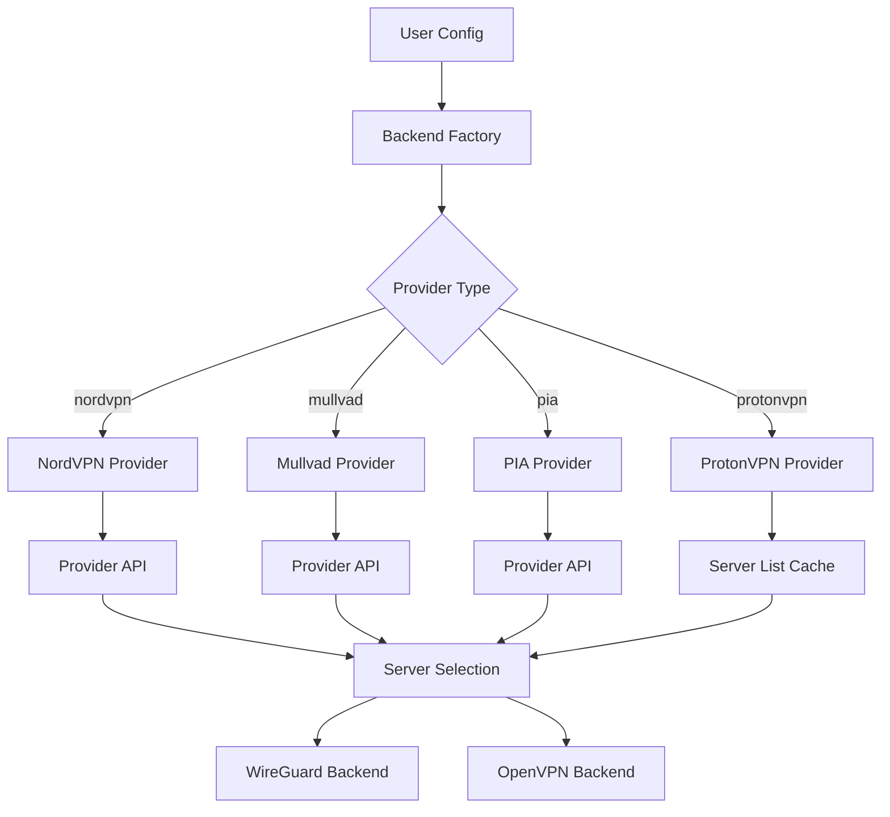

# VPN Provider Integration

Bifrost supports native integration with major VPN providers, enabling automatic server selection, credential management, and seamless VPN connections without manual configuration.

## Supported Providers

| Provider | Auth Method | WireGuard | OpenVPN | Auto-Select | OpenVPN CA |
|----------|-------------|-----------|---------|-------------|------------|
| **NordVPN** | None (public API) | Yes (NordLynx) | Yes | Yes | `ca_cert` required |
| **Mullvad** | Account number | Yes | Yes | Yes | `ca_cert` required |
| **PIA** | Username/Password | Yes | Yes | Yes | Built in |
| **ProtonVPN** | OpenVPN credentials, or Proton account (`auth_mode: api`) | Yes (API mode only) | Yes | Yes | `ca_cert` required |

## OpenVPN CA certificates (`ca_cert`)

Bifrost embeds no CA certificate for NordVPN, Mullvad or ProtonVPN. Shipping a
provider's CA in the binary means it silently goes stale, and a wrong or
placeholder certificate is worse than none: it either aborts the tunnel with an
opaque error or, if verification were skipped, would leave the connection open to
impersonation. For those providers you supply the CA yourself and Bifrost fails
closed without it. PIA is the exception: it publishes one long-lived root
(`ca.rsa.4096.crt`, valid until April 2034) that ships with Bifrost and is
verified by the test suite.

Where to get the certificate:

| Provider | Source |
|----------|--------|
| **NordVPN** | The `ca` block of any `.ovpn` file from [nordvpn.com/ovpn](https://nordvpn.com/ovpn/) |
| **Mullvad** | `mullvad_ca.crt` from the OpenVPN config generator at [mullvad.net](https://mullvad.net/en/account/openvpn-config) |
| **ProtonVPN** | The `<ca>` block of a config downloaded from [account.protonvpn.com](https://account.protonvpn.com) → **Downloads** → **OpenVPN configuration files** |

```yaml
backends:
  - name: proton-ch
    type: protonvpn
    enabled: true
    config:
      username: "username+pmp"
      password: "${PROTON_PASSWORD}"
      country: "CH"
      protocol: "openvpn"
      # PEM CA certificate; required for protocol: openvpn.
      # Paste the provider's certificate here, in full, including the
      # BEGIN/END CERTIFICATE lines.
      ca_cert: |
        -----BEGIN CERTIFICATE-----
        <the provider's CA certificate, base64, unmodified>
        -----END CERTIFICATE-----
      # Optional: OpenVPN tls-auth static key, emitted with key-direction 1.
      tls_auth_key: |
        -----BEGIN OpenVPN Static key V1-----
        <16 lines of 32 hex characters>
        -----END OpenVPN Static key V1-----
```

### What is validated, and when

`ca_cert` and `tls_auth_key` are checked twice: when the backend is constructed
(so a bad value fails at startup, next to the rest of your config errors) and
again when a profile is generated. A value is rejected unless:

- every PEM block is a `CERTIFICATE` that parses as X.509;
- every self-issued certificate carries a signature that verifies under its own
  public key (this catches a truncated or partially pasted certificate, which
  otherwise parses fine and only fails inside the TLS handshake);
- the first certificate is a CA (`basicConstraints: CA:TRUE`);
- the certificate is currently within its validity window;
- `tls_auth_key`, if set, is an OpenVPN static key block carrying 2048 bits of
  hex key material (canonically 16 lines of 32 hex characters; comments and
  line breaks are tolerated) and is not placeholder material.

Typical errors and what they mean:

| Error | Cause |
|-------|-------|
| `needs a valid 'ca_cert' (PEM CA certificate): CA certificate is empty` | No `ca_cert` for an OpenVPN backend |
| `CA certificate is not a parseable X.509 certificate` | Truncated paste, or a non-certificate blob inside the PEM armor |
| `self-issued CA certificate has an invalid signature` | Partially pasted or altered certificate |
| `certificate is not a CA certificate` | A server/leaf certificate was supplied instead of the CA |
| `CA certificate has expired` | Provider rotated its CA — download the current one |
| `CA certificate bundle contains a non-certificate PEM block` | A private key or CSR was pasted into `ca_cert` |
| `tls-auth key looks like placeholder material` | The static key is all zeros or one repeated line |

## NordVPN

NordVPN integration uses the public NordVPN API. No credentials are required for server list access.

### Configuration

```yaml
backends:
  - name: nordvpn-us
    type: nordvpn
    enabled: true
    config:
      country: "US"           # ISO country code (required)
      city: "New York"        # Optional: specific city
      protocol: "wireguard"   # wireguard or openvpn
      auto_select: true       # Auto-select best server by load
      max_load: 50            # Skip servers above this load percentage
```

### Available Options

| Option | Type | Default | Description |
|--------|------|---------|-------------|
| `country` | string | required | ISO 3166-1 alpha-2 country code |
| `city` | string | "" | City name (optional) |
| `protocol` | string | "wireguard" | Protocol: "wireguard" or "openvpn" |
| `auto_select` | bool | true | Auto-select server with lowest load |
| `max_load` | int | 0 | Skip servers above this load (0 = no limit) |
| `server_id` | string | "" | Connect to specific server by ID |
| `ca_cert` | string | "" | PEM CA certificate; **required** for `protocol: openvpn` |
| `tls_auth_key` | string | "" | Optional OpenVPN `tls-auth` static key |

### Server Selection

NordVPN selects servers based on:

1. Country and city filters
2. Protocol support (WireGuard/NordLynx or OpenVPN)
3. Server load (lowest load preferred)
4. Feature requirements (P2P, streaming, etc.)

### Features

NordVPN servers support various features:

- `standard` - Standard VPN servers
- `p2p` - Optimized for P2P/torrenting
- `double_vpn` - Double VPN for extra privacy
- `onion_over_vpn` - Onion routing
- `dedicated_ip` - Dedicated IP servers

```yaml
config:
  country: "NL"
  features:
    - "p2p"
```

---

## Mullvad

Mullvad uses a 16-digit account number for authentication. No email or password required.

### Getting Your Account Number

1. Visit [mullvad.net](https://mullvad.net)
2. Create an account or use existing
3. Your 16-digit account number is shown on the dashboard

### Configuration

```yaml
backends:
  - name: mullvad-de
    type: mullvad
    enabled: true
    config:
      account_id: "1234567890123456"  # 16-digit account number
      country: "DE"
      city: ""                        # Optional
      protocol: "wireguard"
      auto_select: true
```

### Available Options

| Option | Type | Default | Description |
|--------|------|---------|-------------|
| `account_id` | string | required | 16-digit Mullvad account number |
| `country` | string | required | ISO country code |
| `city` | string | "" | City name (optional) |
| `protocol` | string | "wireguard" | Protocol: "wireguard" or "openvpn" |
| `auto_select` | bool | true | Auto-select best server |
| `ca_cert` | string | "" | PEM CA certificate; **required** for `protocol: openvpn` |
| `tls_auth_key` | string | "" | Optional OpenVPN `tls-auth` static key |

### WireGuard Key Management

When using WireGuard, Bifrost automatically:

1. Generates a WireGuard key pair
2. Registers the public key with Mullvad
3. Receives the assigned IP address
4. Configures the tunnel

Keys are cached and reused across restarts.

### Security Notes

- Keep your account number secure
- The account number is the only authentication
- Consider using environment variables:

```yaml
config:
  account_id: "${MULLVAD_ACCOUNT}"
```

---

## PIA (Private Internet Access)

PIA uses username/password authentication with token-based sessions.

### Getting Your Credentials

1. Log in to [privateinternetaccess.com](https://privateinternetaccess.com)
2. Find your PIA username (looks like `p1234567`)
3. Your password is set during signup

### Configuration

```yaml
backends:
  - name: pia-uk
    type: pia
    enabled: true
    config:
      username: "p1234567"
      password: "${PIA_PASSWORD}"  # Use env var for security
      country: "UK"
      protocol: "wireguard"
      port_forwarding: true
```

### Available Options

| Option | Type | Default | Description |
|--------|------|---------|-------------|
| `username` | string | required | PIA username |
| `password` | string | required | PIA password |
| `country` | string | required | ISO country code |
| `city` | string | "" | City name (optional) |
| `protocol` | string | "wireguard" | Protocol: "wireguard" or "openvpn" |
| `port_forwarding` | bool | false | Enable PIA port forwarding |

### Port Forwarding

PIA supports port forwarding on select servers. When enabled:

1. Bifrost requests a forwarded port after connection
2. The assigned port is logged
3. Port forwarding auto-renews while connected

```yaml
config:
  country: "NL"       # Port forwarding supported
  port_forwarding: true
```

**Note**: Port forwarding is not available in all regions.

### Token Refresh

PIA uses token-based authentication:

1. Initial login with username/password
2. Receives access token
3. Token used for subsequent API calls
4. Auto-refresh when token expires

### Certificate handling

PIA is the one provider whose CA ships with Bifrost: `ca.rsa.4096.crt`, PIA's
published OpenVPN root, valid until 12 April 2034. It is the `<ca>` block of
generated OpenVPN profiles and the TLS trust root for PIA's WireGuard key
registration (`/addKey`) and port-forwarding endpoints — those calls never fall
back to skipping verification. The certificate is fingerprint-pinned in the test
suite, and profile generation refuses to emit it once it is past its validity
window, so an expired root produces a clear error rather than a failing
handshake. No `ca_cert` setting is needed (or used) for PIA.

---

## ProtonVPN

ProtonVPN has two authentication modes:

- `auth_mode: manual` (default) — you supply the OpenVPN/IKEv2 credentials from
  your account portal. Only `protocol: openvpn` is available, and `ca_cert` is
  required.
- `auth_mode: api` — you supply your Proton *account* credentials and Bifrost
  authenticates with Proton's SRP-6a protocol, which is what unlocks
  `protocol: wireguard` (WireGuard needs an API-registered key). No `ca_cert` is
  involved, because WireGuard does not use X.509.

### Getting Your OpenVPN Credentials

1. Log in to [account.protonvpn.com](https://account.protonvpn.com)
2. Navigate to **Downloads** → **OpenVPN / IKEv2 username**
3. Copy your OpenVPN username (looks like `username+pmp`)
4. Generate or view your OpenVPN password

**Important**: These are NOT your Proton account credentials!

### Configuration

```yaml
backends:
  - name: proton-ch
    type: protonvpn
    enabled: true
    config:
      auth_mode: "manual"           # "manual" (default) or "api"
      username: "username+pmp"
      password: "${PROTON_PASSWORD}"
      country: "CH"
      tier: 2                       # 0 = free, 1 = basic, 2 = plus
      secure_core: false
      protocol: "openvpn"
      ca_cert: "${PROTON_CA_PEM}"   # required for protocol: openvpn
```

WireGuard, which requires API authentication:

```yaml
backends:
  - name: proton-ch-wg
    type: protonvpn
    enabled: true
    config:
      auth_mode: "api"              # Proton *account* credentials, not OpenVPN ones
      username: "${PROTON_ACCOUNT_USER}"
      password: "${PROTON_ACCOUNT_PASSWORD}"
      country: "CH"
      protocol: "wireguard"
```

### Available Options

| Option | Type | Default | Description |
|--------|------|---------|-------------|
| `auth_mode` | string | "manual" | "manual" (OpenVPN credentials) or "api" (Proton account, SRP) |
| `username` | string | required | OpenVPN/IKEv2 username, or Proton account name in API mode |
| `password` | string | required | OpenVPN password, or Proton account password in API mode |
| `country` | string | required | ISO country code |
| `city` | string | "" | City name (optional) |
| `tier` | int | 2 | Account tier: 0 = free, 1 = basic, 2 = plus |
| `secure_core` | bool | false | Use Secure Core servers |
| `protocol` | string | "openvpn" | "openvpn" (manual mode) or "wireguard" (API mode) |
| `ca_cert` | string | "" | PEM CA certificate; **required** for `protocol: openvpn` |
| `tls_auth_key` | string | "" | Optional OpenVPN `tls-auth` static key |

### Account Tiers

ProtonVPN has different tiers with different server access:

| Tier | Description |
|------|-------------|
| `free` | Free servers (limited locations) |
| `basic` | Basic paid tier |
| `plus` | Plus tier (full server access) |
| `visionary` | Visionary tier |

### Secure Core

Secure Core routes traffic through privacy-friendly countries before exiting:

```yaml
config:
  country: "US"
  secure_core: true   # Routes via CH/IS/SE first
```

Secure Core servers provide extra privacy but may reduce speed.

### API authentication (SRP)

In `auth_mode: api`, Bifrost performs Proton's SRP-6a exchange: it fetches the
SRP parameters from `/auth/info`, **verifies the PGP signature of the returned
modulus against Proton's modulus-signing key**, derives the verifier for the
account's auth version, and checks the server proof before accepting a session.
A modulus that is unsigned, tampered with, or not clear-signed is rejected, so a
manipulated response cannot downgrade the exchange to an attacker-chosen group.
The password is never sent to the API and is never logged.

The implementation wraps Proton's own SRP library and is pinned to Proton's
published test vectors. It has not, however, been exercised against the live
Proton API from this repository — that needs a real Proton account — so treat
API mode as verified against Proton's specification and test data rather than
field-tested.

### Limitations

- **WireGuard requires `auth_mode: api`**: keys must be registered through
  Proton's API, which needs an authenticated session
- **API mode is WireGuard-only**: combining `auth_mode: api` with
  `protocol: openvpn` is rejected at startup
- **`ca_cert` is required for OpenVPN**: no ProtonVPN CA is embedded (see
  [OpenVPN CA certificates](#openvpn-ca-certificates-ca_cert))
- **DNS is left to the tunnel**: generated profiles do not run host
  `resolv.conf` scripts (no `script-security 2`), so they neither rewrite the
  host's global DNS nor fail on systems without those helper scripts

---

## Server Selection Architecture



## Caching

Server lists are cached to reduce API calls:

- **Default TTL**: 6 hours
- **Cache location**: In-memory
- **Refresh**: Automatic on expiration or manual via API

### Manual Cache Refresh

```bash
# Refresh all provider caches
curl -X POST http://localhost:7080/api/v1/providers/refresh

# Refresh specific provider
curl -X POST http://localhost:7080/api/v1/providers/nordvpn/refresh
```

## Troubleshooting

### Connection Failures

1. **Check credentials**: Verify username/password or account ID
2. **Check server availability**: Some servers may be overloaded
3. **Try different server**: Use `server_id` to test specific servers
4. **Check protocol support**: Ensure selected protocol is available

### Authentication Errors

| Provider | Error | Solution |
|----------|-------|----------|
| NordVPN | N/A | No auth required for the server list |
| Mullvad | Invalid account | Verify 16-digit number |
| PIA | Auth failed | Check username (p-number) and password |
| ProtonVPN | Auth failed (`auth_mode: manual`) | Use the OpenVPN/IKEv2 credentials, not the account login |
| ProtonVPN | Auth failed (`auth_mode: api`) | Use the Proton **account** credentials; OpenVPN credentials will not authenticate |
| ProtonVPN | `SRP modulus is not signed by ProtonVPN's modulus key` | The `/auth/info` response was not authentic — check for a TLS-intercepting proxy in front of `api.protonvpn.ch` |

### OpenVPN tunnel fails to start

If the `openvpn` subprocess exits immediately, check the backend error first:
CA and `tls-auth` problems are now reported at startup and name the offending
field. See [OpenVPN CA certificates](#openvpn-ca-certificates-ca_cert) for the
full list of validation errors.

### Server List Empty

- Check internet connectivity
- Verify country code is valid
- Check provider API status
- Try clearing cache and refreshing

### Performance Issues

1. **Select closer servers**: Use country/city filters
2. **Avoid overloaded servers**: Set `max_load` limit
3. **Use WireGuard**: Generally faster than OpenVPN
4. **Check MTU settings**: May need adjustment for your network

## Security Best Practices

1. **Use environment variables** for passwords:
   ```yaml
   config:
     password: "${VPN_PASSWORD}"
   ```

2. **Secure your config file**:
   ```bash
   chmod 600 config.yaml
   ```

3. **Don't commit credentials** to version control

4. **Rotate credentials** periodically

5. **Monitor connections** for unexpected behavior
