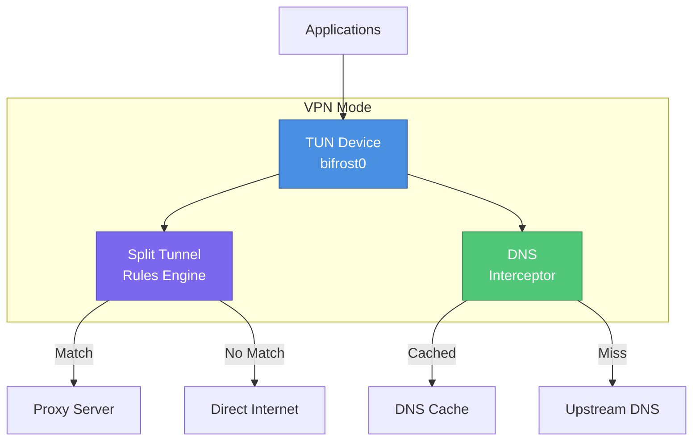

# VPN Mode

Bifrost supports a TUN-based VPN mode that captures all system traffic and routes it through the proxy with intelligent split tunneling.

## Overview

VPN mode creates a virtual network interface (TUN device) that intercepts all network traffic at the system level, providing:

- **Full Traffic Capture**: All TCP/UDP traffic, not just browser traffic
- **Split Tunneling**: Route only specific traffic through VPN
- **DNS Interception**: Handle DNS queries through the tunnel
- **App-Based Rules**: Include/exclude specific applications



## Configuration

### Basic VPN Configuration

```yaml
vpn:
  enabled: true
  mode: tun
  interface_name: bifrost0
  mtu: 1420
```

### DNS Configuration

```yaml
vpn:
  enabled: true
  dns:
    enabled: true
    servers:
      - "1.1.1.1"
      - "8.8.8.8"
    cache_ttl: "5m"
    intercept_port: 53
```

### Split Tunneling

Split tunneling allows you to control which traffic goes through the VPN and which bypasses it.

#### Exclude Mode (Default)

All traffic goes through VPN except matching rules:

```yaml
vpn:
  split:
    mode: exclude

    # These will bypass VPN
    apps:
      - name: "Slack"
      - name: "Zoom"

    domains:
      - "*.local"
      - "localhost"

    ips:
      - "192.168.0.0/16"
      - "10.0.0.0/8"
```

#### Include Mode

Only matching traffic goes through VPN:

```yaml
vpn:
  split:
    mode: include

    # Only these will use VPN
    domains:
      - "*.company.com"
      - "*.internal.corp"

    ips:
      - "10.100.0.0/16"
```

## Split Tunnel Rules

### App-Based Rules

Route traffic based on the application generating it.

```yaml
vpn:
  split:
    apps:
      # By process name
      - name: "Slack"

      # By full path (more specific)
      - name: "Microsoft Teams"
        path: "/Applications/Microsoft Teams.app"

      # By bundle ID (macOS)
      - name: "Zoom"
        bundle_id: "us.zoom.xos"
```

**Platform Support:**

| Platform | Match Method |
|----------|-------------|
| macOS | Bundle ID, process name, path |
| Linux | Process name, path, cgroup |
| Windows | Process name, executable path |

### Domain-Based Rules

Route traffic based on destination domain.

```yaml
vpn:
  split:
    domains:
      # Exact match
      - "example.com"

      # Wildcard subdomain
      - "*.example.com"

      # Multiple wildcards
      - "*.cdn.*.example.com"
```

### IP-Based Rules

Route traffic based on destination IP or CIDR range.

```yaml
vpn:
  split:
    ips:
      # Single IP
      - "192.168.1.1"

      # CIDR range
      - "10.0.0.0/8"
      - "172.16.0.0/12"
      - "192.168.0.0/16"

      # IPv6
      - "fd00::/8"
```

## API Endpoints

### VPN Status

```http
GET /api/v1/vpn/status
```

Response:
```json
{
  "status": "connected",
  "enabled": true,
  "tunnel_type": "WireGuard",
  "interface_name": "bifrost0",
  "local_ip": "10.0.0.2",
  "gateway": "10.0.0.1",
  "dns_servers": ["1.1.1.1", "8.8.8.8"],
  "mtu": 1420,
  "port": 51820,
  "encryption": "ChaCha20-Poly1305",
  "bytes_sent": 1048576,
  "bytes_received": 2097152,
  "connected_since": "2024-01-15T10:00:00Z"
}
```

### Enable/Disable VPN

```http
POST /api/v1/vpn/enable
POST /api/v1/vpn/disable
```

### Get VPN Connections

```http
GET /api/v1/vpn/connections
```

Response:
```json
[
  {
    "id": "conn-123",
    "remote_addr": "example.com:443",
    "local_addr": "10.0.0.2:54321",
    "protocol": "tcp",
    "started_at": "2024-01-15T10:00:00Z",
    "bytes_sent": 1024,
    "bytes_received": 2048
  }
]
```

### Split Tunnel Rules

```http
GET /api/v1/vpn/split/rules
```

Response:
```json
{
  "mode": "exclude",
  "apps": [
    {"name": "Slack", "path": "/Applications/Slack.app"}
  ],
  "domains": ["*.local", "localhost"],
  "ips": ["192.168.0.0/16", "10.0.0.0/8"]
}
```

### Add Split Tunnel App

```http
POST /api/v1/vpn/split/apps
Content-Type: application/json

{
  "name": "Discord",
  "path": "/Applications/Discord.app"
}
```

### Remove Split Tunnel App

```http
DELETE /api/v1/vpn/split/apps/{name}
```

### Add Split Tunnel Domain

```http
POST /api/v1/vpn/split/domains
Content-Type: application/json

{
  "pattern": "*.internal.company.com"
}
```

### Add Split Tunnel IP

```http
POST /api/v1/vpn/split/ips
Content-Type: application/json

{
  "cidr": "172.16.0.0/12"
}
```

## Platform-Specific Notes

### macOS

- Uses `utun` interface (e.g., `utun0`)
- Requires TUN/TAP kernel extension or Network Extension
- App rules use Bundle ID for accurate matching
- DNS changes may require flushing: `sudo dscacheutil -flushcache`

### Linux

- Uses standard TUN device
- Requires `CAP_NET_ADMIN` capability or root
- iptables/nftables rules for routing
- cgroup-based app matching available

```bash
# Grant capability to binary
sudo setcap cap_net_admin+ep ./bifrost-client
```

### Windows

- Uses wintun driver (bundled or install separately)
- Requires Administrator privileges
- Process matching by executable path
- May need Windows Filtering Platform (WFP) for advanced rules

## Troubleshooting

### VPN Not Starting

1. Check permissions:
   ```bash
   # Linux
   sudo setcap cap_net_admin+ep ./bifrost-client

   # macOS/Windows: Run as administrator
   ```

2. Verify TUN device creation:
   ```bash
   # Linux/macOS
   ip link show bifrost0

   # Windows
   netsh interface show interface
   ```

### DNS Issues

1. Check DNS interception is enabled
2. Verify upstream DNS servers are reachable
3. Flush system DNS cache

```bash
# macOS
sudo dscacheutil -flushcache; sudo killall -HUP mDNSResponder

# Linux (systemd-resolved)
sudo systemd-resolve --flush-caches

# Windows
ipconfig /flushdns
```

### Traffic Not Routing

1. Verify split tunnel rules
2. Check routing table
3. Ensure firewall allows TUN interface

```bash
# Check routing
ip route show  # Linux
netstat -rn    # macOS
route print    # Windows
```

### Performance Issues

1. Reduce MTU if fragmentation occurs
2. Disable DNS caching if stale
3. Check for conflicting VPN software
