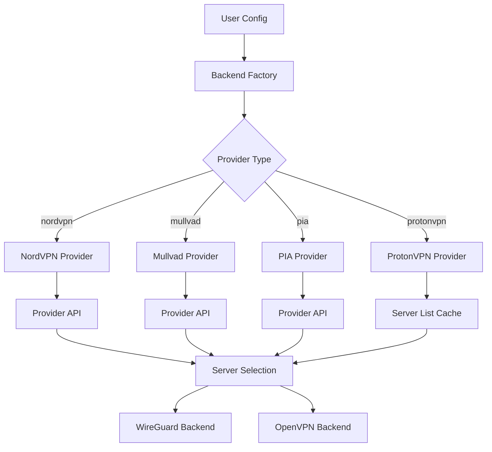

# VPN Provider Integration

Bifrost supports native integration with major VPN providers, enabling automatic server selection, credential management, and seamless VPN connections without manual configuration.

## Supported Providers

| Provider | Auth Method | WireGuard | OpenVPN | Auto-Select |
|----------|-------------|-----------|---------|-------------|
| **NordVPN** | None (public API) | Yes (NordLynx) | Yes | Yes |
| **Mullvad** | Account number | Yes | Yes | Yes |
| **PIA** | Username/Password | Yes | Yes | Yes |
| **ProtonVPN** | OpenVPN credentials | No | Yes | Yes |

## NordVPN

NordVPN integration uses the public NordVPN API. No credentials are required for server list access.

### Configuration

```yaml
backends:
  - name: nordvpn-us
    type: nordvpn
    enabled: true
    config:
      country: "US"           # ISO country code (required)
      city: "New York"        # Optional: specific city
      protocol: "wireguard"   # wireguard or openvpn
      auto_select: true       # Auto-select best server by load
      max_load: 50            # Skip servers above this load percentage
```

### Available Options

| Option | Type | Default | Description |
|--------|------|---------|-------------|
| `country` | string | required | ISO 3166-1 alpha-2 country code |
| `city` | string | "" | City name (optional) |
| `protocol` | string | "wireguard" | Protocol: "wireguard" or "openvpn" |
| `auto_select` | bool | true | Auto-select server with lowest load |
| `max_load` | int | 0 | Skip servers above this load (0 = no limit) |
| `server_id` | string | "" | Connect to specific server by ID |

### Server Selection

NordVPN selects servers based on:

1. Country and city filters
2. Protocol support (WireGuard/NordLynx or OpenVPN)
3. Server load (lowest load preferred)
4. Feature requirements (P2P, streaming, etc.)

### Features

NordVPN servers support various features:

- `standard` - Standard VPN servers
- `p2p` - Optimized for P2P/torrenting
- `double_vpn` - Double VPN for extra privacy
- `onion_over_vpn` - Onion routing
- `dedicated_ip` - Dedicated IP servers

```yaml
config:
  country: "NL"
  features:
    - "p2p"
```

---

## Mullvad

Mullvad uses a 16-digit account number for authentication. No email or password required.

### Getting Your Account Number

1. Visit [mullvad.net](https://mullvad.net)
2. Create an account or use existing
3. Your 16-digit account number is shown on the dashboard

### Configuration

```yaml
backends:
  - name: mullvad-de
    type: mullvad
    enabled: true
    config:
      account_id: "1234567890123456"  # 16-digit account number
      country: "DE"
      city: ""                        # Optional
      protocol: "wireguard"
      auto_select: true
```

### Available Options

| Option | Type | Default | Description |
|--------|------|---------|-------------|
| `account_id` | string | required | 16-digit Mullvad account number |
| `country` | string | required | ISO country code |
| `city` | string | "" | City name (optional) |
| `protocol` | string | "wireguard" | Protocol: "wireguard" or "openvpn" |
| `auto_select` | bool | true | Auto-select best server |

### WireGuard Key Management

When using WireGuard, Bifrost automatically:

1. Generates a WireGuard key pair
2. Registers the public key with Mullvad
3. Receives the assigned IP address
4. Configures the tunnel

Keys are cached and reused across restarts.

### Security Notes

- Keep your account number secure
- The account number is the only authentication
- Consider using environment variables:

```yaml
config:
  account_id: "${MULLVAD_ACCOUNT}"
```

---

## PIA (Private Internet Access)

PIA uses username/password authentication with token-based sessions.

### Getting Your Credentials

1. Log in to [privateinternetaccess.com](https://privateinternetaccess.com)
2. Find your PIA username (looks like `p1234567`)
3. Your password is set during signup

### Configuration

```yaml
backends:
  - name: pia-uk
    type: pia
    enabled: true
    config:
      username: "p1234567"
      password: "${PIA_PASSWORD}"  # Use env var for security
      country: "UK"
      protocol: "wireguard"
      port_forwarding: true
```

### Available Options

| Option | Type | Default | Description |
|--------|------|---------|-------------|
| `username` | string | required | PIA username |
| `password` | string | required | PIA password |
| `country` | string | required | ISO country code |
| `city` | string | "" | City name (optional) |
| `protocol` | string | "wireguard" | Protocol: "wireguard" or "openvpn" |
| `port_forwarding` | bool | false | Enable PIA port forwarding |

### Port Forwarding

PIA supports port forwarding on select servers. When enabled:

1. Bifrost requests a forwarded port after connection
2. The assigned port is logged
3. Port forwarding auto-renews while connected

```yaml
config:
  country: "NL"       # Port forwarding supported
  port_forwarding: true
```

**Note**: Port forwarding is not available in all regions.

### Token Refresh

PIA uses token-based authentication:

1. Initial login with username/password
2. Receives access token
3. Token used for subsequent API calls
4. Auto-refresh when token expires

---

## ProtonVPN

ProtonVPN integration uses manual OpenVPN credentials mode due to API limitations.

### Getting Your OpenVPN Credentials

1. Log in to [account.protonvpn.com](https://account.protonvpn.com)
2. Navigate to **Downloads** → **OpenVPN / IKEv2 username**
3. Copy your OpenVPN username (looks like `username+pmp`)
4. Generate or view your OpenVPN password

**Important**: These are NOT your Proton account credentials!

### Configuration

```yaml
backends:
  - name: proton-ch
    type: protonvpn
    enabled: true
    config:
      username: "username+pmp"
      password: "${PROTON_PASSWORD}"
      country: "CH"
      tier: "plus"
      secure_core: false
      protocol: "openvpn"
```

### Available Options

| Option | Type | Default | Description |
|--------|------|---------|-------------|
| `username` | string | required | OpenVPN/IKEv2 username |
| `password` | string | required | OpenVPN password |
| `country` | string | required | ISO country code |
| `city` | string | "" | City name (optional) |
| `tier` | string | "free" | Account tier: free, basic, plus, visionary |
| `secure_core` | bool | false | Use Secure Core servers |
| `protocol` | string | "openvpn" | Only "openvpn" supported |

### Account Tiers

ProtonVPN has different tiers with different server access:

| Tier | Description |
|------|-------------|
| `free` | Free servers (limited locations) |
| `basic` | Basic paid tier |
| `plus` | Plus tier (full server access) |
| `visionary` | Visionary tier |

### Secure Core

Secure Core routes traffic through privacy-friendly countries before exiting:

```yaml
config:
  country: "US"
  secure_core: true   # Routes via CH/IS/SE first
```

Secure Core servers provide extra privacy but may reduce speed.

### Limitations

- **WireGuard not supported**: ProtonVPN's WireGuard (NetShield) requires their app
- **OpenVPN only**: Uses standard OpenVPN protocol
- **Manual credentials**: Requires obtaining credentials from account portal

---

## Server Selection Architecture



## Caching

Server lists are cached to reduce API calls:

- **Default TTL**: 6 hours
- **Cache location**: In-memory
- **Refresh**: Automatic on expiration or manual via API

### Manual Cache Refresh

```bash
# Refresh all provider caches
curl -X POST http://localhost:7080/api/v1/providers/refresh

# Refresh specific provider
curl -X POST http://localhost:7080/api/v1/providers/nordvpn/refresh
```

## Troubleshooting

### Connection Failures

1. **Check credentials**: Verify username/password or account ID
2. **Check server availability**: Some servers may be overloaded
3. **Try different server**: Use `server_id` to test specific servers
4. **Check protocol support**: Ensure selected protocol is available

### Authentication Errors

| Provider | Error | Solution |
|----------|-------|----------|
| NordVPN | N/A | No auth required |
| Mullvad | Invalid account | Verify 16-digit number |
| PIA | Auth failed | Check username (p-number) and password |
| ProtonVPN | Auth failed | Use OpenVPN credentials, not account login |

### Server List Empty

- Check internet connectivity
- Verify country code is valid
- Check provider API status
- Try clearing cache and refreshing

### Performance Issues

1. **Select closer servers**: Use country/city filters
2. **Avoid overloaded servers**: Set `max_load` limit
3. **Use WireGuard**: Generally faster than OpenVPN
4. **Check MTU settings**: May need adjustment for your network

## Security Best Practices

1. **Use environment variables** for passwords:
   ```yaml
   config:
     password: "${VPN_PASSWORD}"
   ```

2. **Secure your config file**:
   ```bash
   chmod 600 config.yaml
   ```

3. **Don't commit credentials** to version control

4. **Rotate credentials** periodically

5. **Monitor connections** for unexpected behavior
